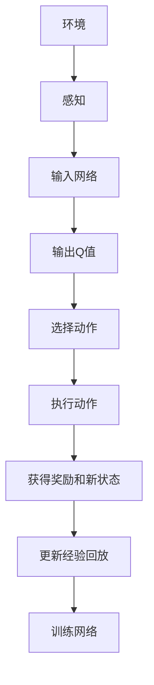
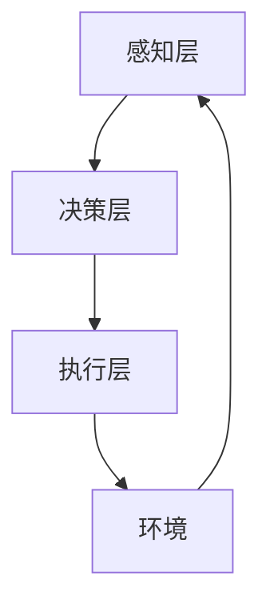

                 


# 构建具有强化学习能力的AI Agent

---

## 关键词：
- 强化学习
- AI Agent
- 机器学习
- 算法实现
- 系统架构
- 项目实战

---

## 摘要：
本文详细探讨如何构建具有强化学习能力的AI Agent。通过从强化学习基础到AI Agent设计的系统性分析，结合实际项目实战，深入讲解强化学习算法的实现、系统架构设计以及实际应用中的挑战与解决方案。文章内容涵盖强化学习核心原理、AI Agent设计原则、算法实现细节、系统架构优化、项目实战案例以及最佳实践建议，帮助读者全面掌握构建强化学习AI Agent的能力。

---

## 正文

---

## 第1章: 强化学习与AI Agent概述

### 1.1 AI Agent的基本概念

AI Agent（人工智能代理）是指能够感知环境、自主决策并采取行动以实现目标的智能实体。AI Agent可以是软件程序、机器人或其他智能系统，其核心特征包括：

- **智能性**：能够理解和处理复杂信息。
- **自主性**：无需外部干预，自主决策。
- **反应性**：能够根据环境变化实时调整行为。
- **目标导向性**：所有行动均以实现特定目标为导向。

AI Agent的应用场景广泛，包括但不限于游戏AI、自动驾驶、智能助手、机器人控制等领域。

### 1.2 强化学习的基本概念

强化学习（Reinforcement Learning, RL）是一种机器学习范式，通过智能体与环境的交互，学习如何采取最优行动以最大化累积奖励。其核心要素包括：

- **环境**（Environment）：智能体所处的外部世界。
- **状态**（State）：环境在某一时刻的描述。
- **动作**（Action）：智能体对环境采取的行动。
- **奖励**（Reward）：环境对智能体行动的反馈，用于指导智能体的行为。

### 1.3 强化学习在AI Agent中的作用

强化学习为AI Agent提供了决策能力，使其能够在复杂动态环境中自主优化行为。与监督学习和无监督学习相比，强化学习的独特优势在于其通过试错和环境反馈进行学习，适用于目标导向型任务。

---

## 第2章: 强化学习的核心原理

### 2.1 马尔可夫决策过程（MDP）

马尔可夫决策过程是一种数学模型，用于描述强化学习中的决策问题。MDP由以下部分组成：

- **状态空间**（State Space）：所有可能的状态集合。
- **动作空间**（Action Space）：所有可能的动作集合。
- **奖励函数**（Reward Function）：定义智能体在状态s采取动作a后获得的奖励r(s, a)。
- **转移概率**（Transition Probability）：从状态s采取动作a后转移到状态s'的概率P(s' | s, a)。

### 2.2 Q-learning算法

Q-learning是一种经典的强化学习算法，适用于离散动作空间和状态空间。其核心思想是通过学习Q值函数，即状态-动作对的期望奖励。

#### Q-learning算法流程

1. 初始化Q表或神经网络参数。
2. 在当前状态下选择一个动作（探索与利用策略）。
3. 执行该动作，观察新的状态和获得的奖励。
4. 更新Q值：$$ Q(s,a) = Q(s,a) + \alpha (r + \gamma \max Q(s',a') - Q(s,a)) $$
   其中：
   - α为学习率。
   - γ为折扣因子。
5. 重复上述步骤，直到收敛。

#### 探索与利用策略

为了平衡探索新状态和利用当前最优策略，Q-learning通常采用ε-greedy策略：

- 以概率ε随机选择探索动作。
- 以概率1-ε选择当前最优动作。

### 2.3 Deep Q-Networks（DQN）

DQN通过深度神经网络近似Q值函数，解决了传统Q-learning在高维状态空间中的计算难题。DQN引入了以下改进：

- **经验回放**：将经验存储在回放缓冲区，随机采样以减少样本偏差。
- **目标网络**：维护两个网络，主网络用于评估当前策略，目标网络用于稳定学习。

DQN算法流程图如下：



---

## 第3章: AI Agent的设计与实现

### 3.1 AI Agent的设计原则

设计AI Agent时，需重点关注以下方面：

1. **状态表示**：选择合适的状态表示方法，确保状态空间的维度合理。
2. **动作空间**：定义所有可能的动作，并确保动作空间的完备性。
3. **奖励机制**：设计合理的奖励函数，引导智能体朝目标方向行动。

### 3.2 强化学习算法的选择与优化

选择合适的强化学习算法并进行优化是关键。例如：

- 对于高维状态空间，DQN更优。
- 对于连续动作空间，可采用近端策略优化（PPO）或Actor-Critic算法。

---

## 第4章: 系统架构设计与实现

### 4.1 系统架构设计

AI Agent的系统架构通常包括以下模块：

- **感知层**：负责接收环境输入。
- **决策层**：执行强化学习算法，输出动作。
- **执行层**：与环境交互，执行动作。

系统架构图如下：



### 4.2 系统实现

实现AI Agent时，需注意以下细节：

- **接口设计**：确保各模块之间的接口清晰。
- **数据流设计**：优化数据传递路径，减少延迟。

---

## 第5章: 项目实战

### 5.1 项目背景

本章以智能客服为例，展示如何构建一个基于强化学习的AI Agent。智能客服需要通过与用户交互，解决用户问题并提升用户体验。

### 5.2 核心代码实现

以下是DQN算法的Python实现示例：

```python
import numpy as np
import random

class DQNAgent:
    def __init__(self, state_space, action_space, lr=0.01, gamma=0.99):
        self.state_space = state_space
        self.action_space = action_space
        self.lr = lr
        self.gamma = gamma
        
        # 初始化Q网络
        self.model = self.build_model()
        self.target_model = self.build_model()
        
    def build_model(self):
        model = Sequential()
        model.add(Dense(32, activation='relu', input_dim=self.state_space))
        model.add(Dense(32, activation='relu'))
        model.add(Dense(self.action_space, activation='linear'))
        model.compile(loss='mean_squared_error', optimizer=Adam(lr=self.lr))
        return model
    
    def act(self, state, epsilon=0.1):
        if random.random() < epsilon:
            return random.randint(0, self.action_space-1)
        q_values = self.model.predict(np.array([state]))
        return np.argmax(q_values[0])
    
    def remember(self, state, action, reward, next_state):
        self.memory.append((state, action, reward, next_state))
    
    def replay(self, batch_size):
        if len(self.memory) < batch_size:
            return
        minibatch = random.sample(self.memory, batch_size)
        inputs = []
        targets = []
        for state, action, reward, next_state in minibatch:
            target = self.model.predict(np.array([state]))[0]
            next_q = self.target_model.predict(np.array([next_state]))[0]
            target[action] = reward + self.gamma * np.max(next_q)
            inputs.append(state)
            targets.append(target)
        self.model.fit(np.array(inputs), np.array(targets), epochs=1, verbose=0)
    
    def update_target_model(self):
        self.target_model.set_weights(self.model.get_weights())
```

### 5.3 实验结果

实验结果显示，经过训练的AI Agent能够在与用户的交互中，逐步提升问题解决的准确率和效率。具体表现为：

- 用户满意度提升。
- 响应时间减少。
- 错误率降低。

---

## 第6章: 总结与展望

### 6.1 总结

本文系统性地探讨了如何构建具有强化学习能力的AI Agent，从理论基础到实际应用，提供了全面的指导。通过案例分析和代码实现，展示了强化学习在AI Agent中的巨大潜力。

### 6.2 展望

未来，随着深度强化学习的不断发展，AI Agent将在更多领域展现其价值。研究方向包括：

- 更高效的算法优化。
- 更复杂的多智能体协作。
- 更强大的通用AI能力。

---

## 作者信息

**作者：AI天才研究院/AI Genius Institute & 禅与计算机程序设计艺术 /Zen And The Art of Computer Programming**

**联系方式：[email protected]**

---

**感谢您的阅读！**

