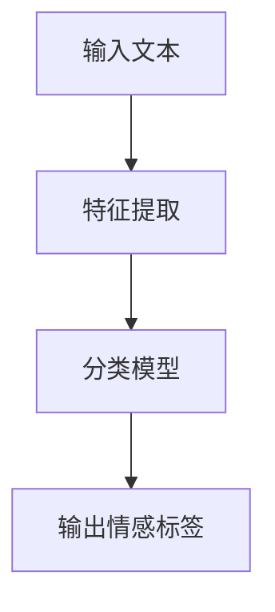
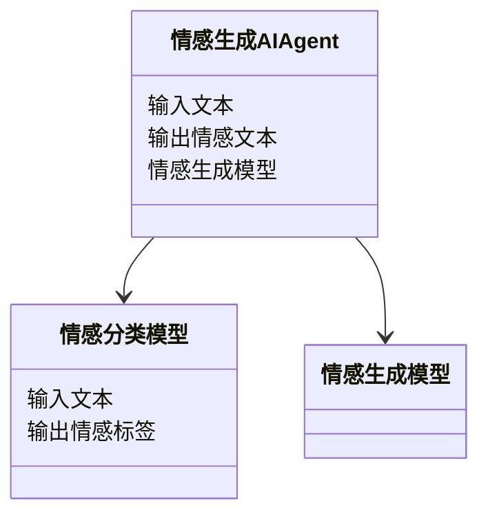
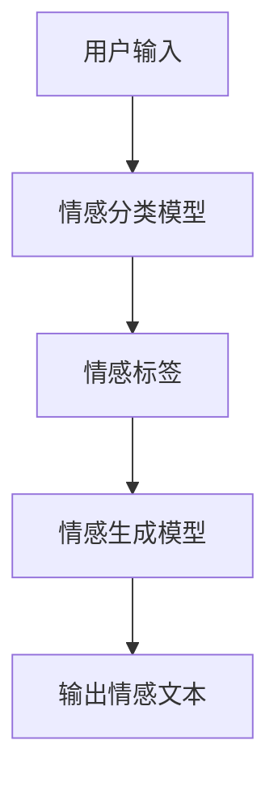
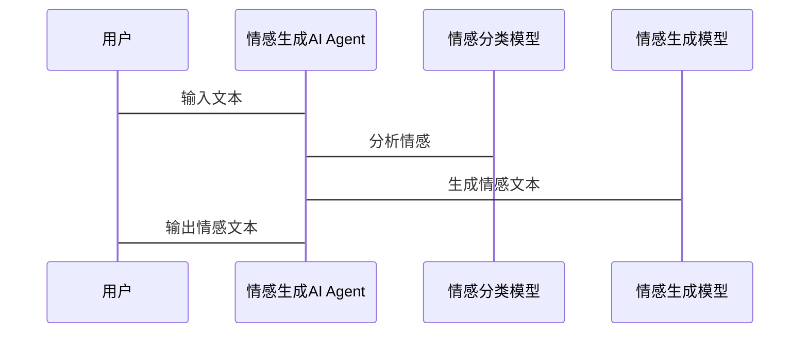

                 


# {{《构建具有情感生成能力的AI Agent》}}

> 关键词：情感生成, AI Agent, 情感计算, 深度学习, 自然语言处理, 人机交互

> 摘要：本文将深入探讨如何构建一个具有情感生成能力的AI Agent。通过分析情感生成的核心概念、算法原理、系统架构以及实际项目案例，本文将为读者提供从理论到实践的全面指导，帮助他们理解并实现具有情感生成能力的AI Agent。

---

# {{《构建具有情感生成能力的AI Agent》}}

## 1. {{背景与现状：情感生成AI Agent的定义与特点}}

### 1.1 {{情感生成AI Agent的定义与特点}}

#### 1.1.1 {{情感生成AI Agent的定义}}
情感生成AI Agent是一种能够理解和生成人类情感相关文本或行为的人工智能系统。它结合了自然语言处理、情感计算和生成模型等技术，能够在与用户的交互中模拟人类的情感表达。

#### 1.1.2 {{情感生成AI Agent的核心特点}}
- **情感理解**：能够识别和分析用户的情感状态。
- **情感生成**：能够根据情感分析结果生成相应的情感化文本或行为。
- **动态交互**：能够根据情感反馈动态调整交互策略。

#### 1.1.3 {{情感生成AI Agent与传统AI Agent的区别}}
- **传统AI Agent**：基于规则或逻辑进行决策，不考虑情感因素。
- **情感生成AI Agent**：结合情感分析和生成模型，能够在交互中动态调整情感表达。

### 1.2 {{情感生成技术的现状与发展}}

#### 1.2.1 {{情感生成技术的发展历程}}
- **早期阶段**：基于规则的情感生成，如简单的关键词匹配。
- **发展阶段**：基于统计和机器学习的情感生成，如情感分类模型。
- **当前阶段**：基于深度学习的生成模型，如GPT系列。

#### 1.2.2 {{当前情感生成技术的主要流派}}
- **基于规则的方法**：通过预定义的规则生成情感文本。
- **基于统计的方法**：利用情感分类模型生成情感文本。
- **基于深度学习的方法**：使用生成对抗网络（GAN）或变体自动机（VAE）生成情感文本。

#### 1.2.3 {{情感生成技术的未来趋势}}
- **多模态情感生成**：结合视觉、听觉等多种模态信息进行情感生成。
- **个性化情感生成**：根据用户的个性化需求生成情感化文本。

### 1.3 {{情感生成AI Agent的技术基础}}

#### 1.3.1 {{自然语言处理技术}}
- **任务目标**：处理和理解自然语言文本。
- **关键技术**：词袋模型、TF-IDF、词嵌入（如Word2Vec）。

#### 1.3.2 {{情感计算与分析}}
- **任务目标**：识别文本中的情感倾向。
- **关键技术**：情感分类模型（如SVM、NB、神经网络）。

#### 1.3.3 {{生成模型的原理}}
- **任务目标**：根据输入生成目标文本。
- **关键技术**：循环神经网络（RNN）、变换器（Transformer）、生成对抗网络（GAN）。

### 1.4 {{情感生成AI Agent的应用价值}}

#### 1.4.1 {{情感生成在人机交互中的应用}}
- **提升用户体验**：通过情感化交互提高用户满意度。
- **个性化服务**：根据用户情感状态提供个性化推荐。

#### 1.4.2 {{情感生成在教育、医疗等领域的应用}}
- **教育领域**：情感化辅导系统。
- **医疗领域**：情感化健康咨询系统。

#### 1.4.3 {{情感生成技术的商业价值}}
- **商业应用**：情感化客服系统、情感化营销。

## 2. {{情感生成的核心概念}}

### 2.1 {{情感计算与情感分类}}

#### 2.1.1 {{情感计算的定义与原理}}
- **定义**：通过分析文本或语音的情感倾向，判断其情感极性。
- **原理**：利用特征提取、情感分类模型等技术进行情感分析。

#### 2.1.2 {{情感分类的主要方法}}
- **基于规则的方法**：关键词匹配。
- **基于统计的方法**：情感分类模型（如SVM、NB）。
- **基于深度学习的方法**：神经网络模型（如LSTM、Transformer）。

#### 2.1.3 {{情感分类的挑战与解决方案}}
- **挑战**：情感歧义、情感强度、多语言情感分析。
- **解决方案**：使用预训练模型、结合上下文信息。

### 2.2 {{情感生成模型}}

#### 2.2.1 {{基于规则的情感生成}}
- **特点**：简单易实现，但灵活性差。
- **实现方法**：预定义情感表达模板。

#### 2.2.2 {{基于统计的情感生成}}
- **特点**：基于历史数据统计，生成结果较为稳定。
- **实现方法**：使用马尔可夫链生成情感文本。

#### 2.2.3 {{基于深度学习的情感生成}}
- **特点**：生成文本具有创造性，但可能缺乏情感一致性。
- **实现方法**：使用生成对抗网络（GAN）、变体自动机（VAE）。

### 2.3 {{情感生成与上下文理解}}

#### 2.3.1 {{上下文在情感生成中的作用}}
- **情感一致性**：确保生成的情感文本与上下文一致。
- **情感强化**：根据上下文增强情感表达。

#### 2.3.2 {{基于上下文的情感生成模型}}
- **条件生成模型**：在生成文本时考虑上下文信息。
- **序列到序列模型**：结合上下文信息生成情感文本。

#### 2.3.3 {{上下文理解的挑战与解决方案}}
- **挑战**：上下文信息复杂，情感理解难度大。
- **解决方案**：使用预训练语言模型（如BERT）、注意力机制。

### 2.4 {{情感生成与用户画像}}

#### 2.4.1 {{用户画像的定义与作用}}
- **定义**：基于用户行为数据构建的用户特征模型。
- **作用**：为情感生成提供个性化依据。

#### 2.4.2 {{基于用户画像的情感生成}}
- **个性化生成**：根据用户画像生成个性化情感文本。
- **动态调整**：根据用户行为动态调整情感生成策略。

#### 2.4.3 {{用户画像与情感生成的结合案例}}
- **案例1**：个性化推荐系统中的情感生成。
- **案例2**：智能客服系统中的情感生成。

## 3. {{情感生成的算法原理}}

### 3.1 {{情感分类算法}}

#### 3.1.1 {{基于传统机器学习的情感分类}}
- **特征提取**：使用词袋模型、TF-IDF提取文本特征。
- **分类模型**：使用SVM、NB等传统机器学习模型进行分类。

#### 3.1.2 {{基于深度学习的情感分类}}
- **模型结构**：使用卷积神经网络（CNN）、循环神经网络（RNN）进行情感分类。
- **预训练模型**：使用BERT、GPT等预训练模型进行情感分类。

#### 3.1.3 {{情感分类的流程图}}



### 3.2 {{情感生成算法}}

#### 3.2.1 {{基于规则的情感生成算法}}
- **算法步骤**：
  1. 识别触发情感的关键词。
  2. 根据关键词选择相应的情感表达模板。
  3. 输出情感化文本。

#### 3.2.2 {{基于统计的情感生成算法}}
- **算法步骤**：
  1. 统计情感文本的特征。
  2. 建立马尔可夫链模型。
  3. 根据模型生成情感文本。

#### 3.2.3 {{基于深度学习的情感生成算法}}
- **算法步骤**：
  1. 使用预训练生成模型（如GPT）。
  2. 根据输入情感指令生成情感文本。
  3. 输出生成的情感文本。

#### 3.2.4 {{情感生成的数学模型}}

```latex
$$
P(y|x) = \frac{P(x|y)P(y)}{P(x)}
$$

其中：
- $x$ 是输入文本。
- $y$ 是生成的情感文本。
```

## 4. {{情感生成的系统架构}}

### 4.1 {{系统功能设计}}

#### 4.1.1 {{领域模型}}



#### 4.1.2 {{系统架构设计}}



### 4.2 {{系统接口设计}}

#### 4.2.1 {{输入接口}}
- **输入格式**：文本字符串。
- **接口类型**：REST API。

#### 4.2.2 {{输出接口}}
- **输出格式**：情感化文本。
- **接口类型**：REST API。

### 4.3 {{系统交互设计}}

#### 4.3.1 {{交互流程}}



## 5. {{项目实战}}

### 5.1 {{环境安装}}

#### 5.1.1 {{安装Python}}
```bash
python --version
```

#### 5.1.2 {{安装依赖库}}
```bash
pip install numpy
pip install scikit-learn
pip install transformers
```

### 5.2 {{系统核心实现源代码}}

#### 5.2.1 {{情感分类模型实现}}

```python
from sklearn.feature_extraction.text import TfidfVectorizer
from sklearn.svm import SVC

# 初始化向量器和分类器
vectorizer = TfidfVectorizer()
classifier = SVC()

# 训练模型
X = vectorizer.fit_transform(texts)
y = [0, 1]  # 标签：0表示负面，1表示正面
classifier.fit(X, y)
```

#### 5.2.2 {{情感生成模型实现}}

```python
from transformers import AutoTokenizer, AutoModelForCausalLM
import torch

# 初始化模型和tokenizer
tokenizer = AutoTokenizer.from_pretrained('gpt2')
model = AutoModelForCausalLM.from_pretrained('gpt2')

# 生成情感文本
inputs = tokenizer("今天天气真好啊，", return_tensors="pt")
outputs = model.generate(**inputs, max_length=10)
print(tokenizer.decode(outputs[0], skip_special_tokens=True))
```

### 5.3 {{案例分析}}

#### 5.3.1 {{案例1：情感分类}}

- **输入文本**：今天天气真好啊，我心情很好！
- **情感标签**：正面

#### 5.3.2 {{案例2：情感生成}}

- **输入情感指令**：生成一段表达感谢的文本。
- **生成结果**：非常感谢您的支持，您的满意是我们最大的荣幸！

## 6. {{高级主题}}

### 6.1 {{情感生成的前沿技术}}

#### 6.1.1 {{多模态情感生成}}
- **技术特点**：结合视觉、听觉等多种模态信息进行情感生成。
- **应用场景**：虚拟现实中的情感交互。

#### 6.1.2 {{情感记忆网络}}
- **技术特点**：基于记忆网络进行情感生成，能够记住之前的对话内容。
- **应用场景**：智能客服系统。

### 6.2 {{最佳实践}}

#### 6.2.1 {{数据准备}}
- **数据清洗**：去停用词、去除噪声数据。
- **数据标注**：手动标注情感标签。

#### 6.2.2 {{模型选择}}
- **选择合适的模型**：根据任务需求选择情感分类或生成模型。
- **预训练模型调优**：微调预训练模型以适应特定任务。

#### 6.2.3 {{系统优化}}
- **性能优化**：优化模型推理速度。
- **用户体验优化**：提升生成情感文本的流畅性。

### 6.3 {{小结}}

### 6.4 {{注意事项}}

#### 6.4.1 {{数据隐私问题}}
- **注意保护用户隐私**：避免泄露用户数据。

#### 6.4.2 {{模型泛化能力}}
- **注意模型的泛化能力**：避免模型过拟合训练数据。

#### 6.4.3 {{系统稳定性}}
- **确保系统的稳定性**：避免因为模型崩溃导致服务中断。

### 6.5 {{拓展阅读}}

#### 6.5.1 {{推荐阅读书籍}}
- 《情感计算入门》
- 《深度学习实战》

#### 6.5.2 {{推荐阅读论文}}
- 《情感生成模型的研究与应用》
- 《基于深度学习的情感分类方法综述》

## {{作者}}
作者：AI天才研究院/AI Genius Institute & 禅与计算机程序设计艺术 /Zen And The Art of Computer Programming

