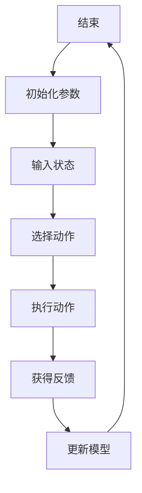
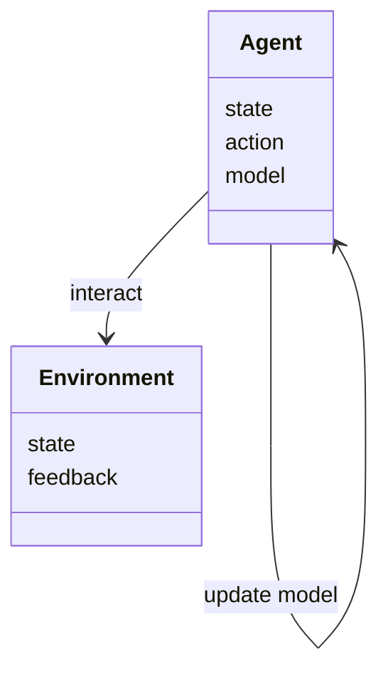
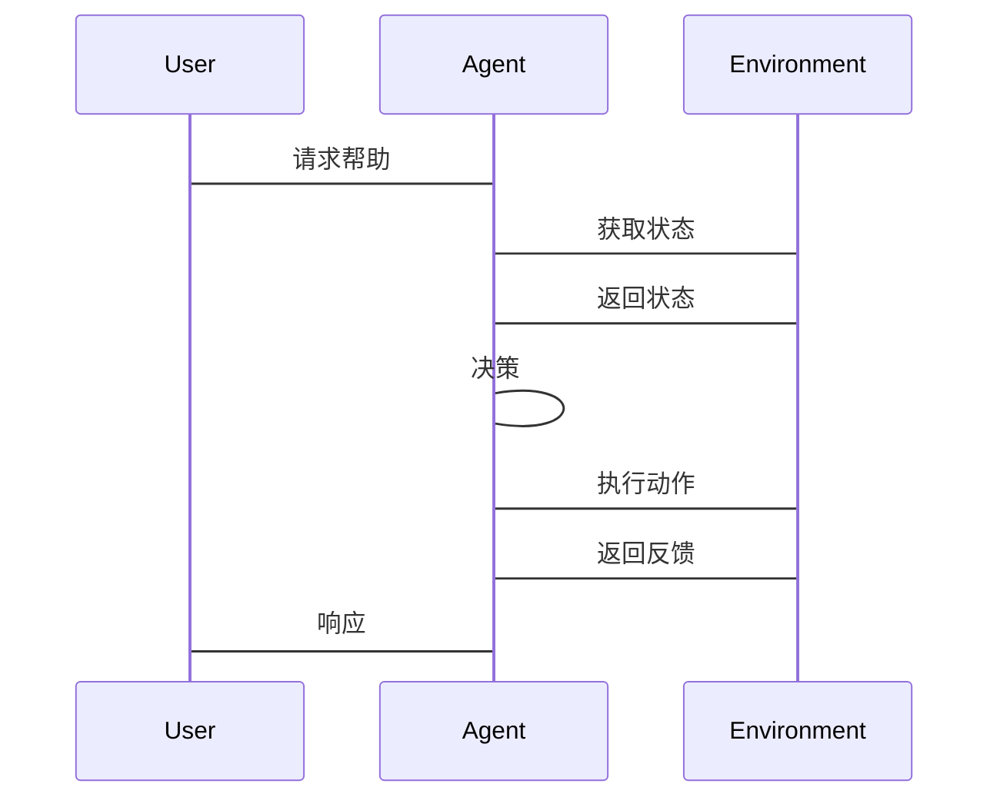

                 


# 构建具有持续优化能力的AI Agent

> 关键词：AI Agent, 持续优化, 强化学习, 监督学习, 系统架构, 项目实战

> 摘要：本文详细探讨了如何构建一个具有持续优化能力的AI Agent。从基本概念到算法原理，再到系统架构和项目实战，系统地介绍了AI Agent的构建过程。通过强化学习和监督学习的结合，结合实际案例分析，为读者提供了全面的技术指导。

---

# 第1章: AI Agent的基本概念与问题背景

## 1.1 AI Agent的定义与特点

### 1.1.1 AI Agent的定义
AI Agent（人工智能代理）是指能够感知环境、自主决策并执行任务的智能实体。它能够根据输入的信息做出决策，并通过执行动作与环境交互，以达到预定目标。

### 1.1.2 AI Agent的核心特点
- **自主性**：能够在没有外部干预的情况下自主运行。
- **反应性**：能够实时感知环境并做出反应。
- **学习能力**：通过经验或数据不断优化自身的决策能力。
- **适应性**：能够适应环境的变化，动态调整策略。

### 1.1.3 AI Agent与传统智能体的区别
| 特性 | AI Agent | 传统智能体 |
|------|----------|------------|
| 感知能力 | 强大，能够处理复杂数据 | 较弱，依赖规则 |
| 决策能力 | 基于数据和模型，动态调整 | 基于固定规则 |
| 学习能力 | 具备学习能力，能够优化策略 | 无学习能力 |
| 适应性 | 高，能够适应环境变化 | 低，依赖固定配置 |

## 1.2 问题背景与问题描述

### 1.2.1 当前AI Agent应用中的问题
- **数据质量**：数据的多样性和准确性对AI Agent的性能有直接影响。
- **模型泛化能力**：AI Agent需要在不同环境下表现出良好的泛化能力。
- **持续优化**：如何在动态环境中不断优化AI Agent的性能是一个挑战。

### 1.2.2 持续优化能力的重要性
- **提升决策效率**：通过持续优化，AI Agent能够更快地做出更优决策。
- **适应环境变化**：在动态环境中，持续优化能力使得AI Agent能够保持高性能。
- **提升用户体验**：优化的AI Agent能够更好地满足用户需求，提升用户体验。

### 1.2.3 问题解决的目标与边界
- **目标**：构建一个能够在动态环境中不断优化的AI Agent。
- **边界**：AI Agent的优化能力仅限于其设计的范围，不会超出预设的目标。

## 1.3 相关概念对比

### 1.3.1 AI Agent与传统软件的对比
| 特性 | AI Agent | 传统软件 |
|------|----------|-----------|
| 智能性 | 高 | 低 |
| 适应性 | 高 | 低 |
| 学习能力 | 高 | 无 |

### 1.3.2 AI Agent与强化学习的联系
- **强化学习**：通过试错学习，AI Agent能够从环境中获得反馈，调整策略。
- **联系**：AI Agent的核心决策机制可以基于强化学习算法。

### 1.3.3 AI Agent与监督学习的差异
- **监督学习**：基于已有数据，学习映射关系。
- **AI Agent**：不仅需要学习，还需要实时感知和执行。

---

# 第2章: AI Agent的核心原理

## 2.1 感知、决策与执行的统一

### 2.1.1 感知模块的作用与实现
- **感知模块**：负责收集环境中的信息，如传感器数据、用户输入等。
- **实现方式**：通过多种传感器或数据接口获取信息。

### 2.1.2 决策模块的逻辑与算法
- **决策逻辑**：基于感知到的信息，结合预设的目标，选择最优动作。
- **算法实现**：结合强化学习和监督学习，优化决策策略。

### 2.1.3 执行模块的实现方式
- **执行动作**：根据决策结果，执行具体动作，如发送指令、调整参数等。
- **反馈机制**：执行结果反馈给感知模块，形成闭环。

## 2.2 AI Agent的核心要素

### 2.2.1 数据输入的多样性
- **输入类型**：可以是结构化数据（如数值、文本）或非结构化数据（如图像、语音）。
- **数据预处理**：需要对数据进行清洗、归一化等处理。

### 2.2.2 状态空间的构建
- **状态空间**：所有可能的状态的集合，用于描述环境的状态。
- **状态表示**：通过向量或特征的方式表示状态。

### 2.2.3 行动空间的设计
- **行动空间**：所有可能的动作的集合。
- **动作选择**：基于当前状态，选择最优动作。

## 2.3 核心概念对比表

### 2.3.1 感知与决策的对比
| 特性 | 感知 | 决策 |
|------|------|------|
| 输入 | 状态 | 状态 |
| 输出 | 状态描述 | 动作 |

### 2.3.2 决策与执行的对比
| 特性 | 决策 | 执行 |
|------|------|------|
| 输入 | 状态 | 决策结果 |
| 输出 | 动作 | 状态反馈 |

### 2.3.3 执行与反馈的对比
| 特性 | 执行 | 反馈 |
|------|------|------|
| 输入 | 动作 | 状态 |
| 输出 | 状态反馈 | 状态更新 |

## 2.4 ER实体关系图

```mermaid
erDiagram
    class State {
        id
        name
    }
    class Action {
        id
        name
    }
    class Feedback {
        id
        value
    }
    State --> Action : 可触发的动作
    Action --> Feedback : 执行后的反馈
```

## 2.5 本章小结

---

# 第3章: AI Agent的算法原理

## 3.1 强化学习与监督学习的结合

### 3.1.1 强化学习的基本原理
- **强化学习**：通过试错学习，AI Agent在与环境的交互中获得奖励，逐步优化策略。
- **Q-learning算法**：一种常用的强化学习算法，适用于离散动作空间。
- **策略梯度方法**：适用于连续动作空间，通过优化策略参数来最大化奖励。

### 3.1.2 监督学习的应用
- **监督学习**：基于标记数据，训练模型预测目标值。
- **数学模型**：$y = f(x) + \epsilon$，其中$x$是输入，$y$是输出，$\epsilon$是噪声。

### 3.1.3 混合算法的实现
- **混合算法**：结合强化学习和监督学习，利用监督学习进行初始训练，强化学习进行持续优化。
- **数学模型**：$$J(\theta) = \alpha J_{\text{supervised}}(\theta) + (1-\alpha) J_{\text{reinforcement}}(\theta)$$，其中$\alpha$是平衡系数。

## 3.2 算法流程图



## 3.3 代码实现

### 3.3.1 强化学习代码示例
```python
import numpy as np

class AI-Agent:
    def __init__(self, state_space, action_space):
        self.state_space = state_space
        self.action_space = action_space
        self.q_table = np.zeros((state_space, action_space))

    def perceive(self, state):
        return state

    def decide(self, state):
        return np.argmax(self.q_table[state])

    def learn(self, state, action, reward):
        self.q_table[state][action] += reward
```

### 3.3.2 监督学习代码示例
```python
from sklearn.linear_model import LinearRegression

class Supervisor:
    def __init__(self):
        self.model = LinearRegression()

    def train(self, X, y):
        self.model.fit(X, y)

    def predict(self, X):
        return self.model.predict(X)
```

---

# 第4章: 系统分析与架构设计

## 4.1 问题场景介绍

### 4.1.1 智能客服优化
- **目标**：提高客户满意度，减少等待时间。
- **问题**：传统智能客服依赖固定规则，无法动态优化。

## 4.2 系统功能设计

### 4.2.1 领域模型类图


### 4.2.2 系统架构图
```mermaid
graph TD
    UI --> Agent : 请求
    Agent --> Environment : 执行
    Environment --> Agent : 反馈
    Agent --> Database : 存储数据
```

## 4.3 系统接口设计

### 4.3.1 API接口
- **输入接口**：`POST /api/agent/action`，接收状态和动作。
- **输出接口**：`GET /api/agent/status`，返回当前状态。

## 4.4 系统交互序列图



---

# 第5章: 项目实战

## 5.1 环境安装

### 5.1.1 安装Python
```bash
python --version
pip install --upgrade pip
```

### 5.1.2 安装依赖库
```bash
pip install numpy scikit-learn matplotlib
```

## 5.2 核心代码实现

### 5.2.1 NLP处理代码
```python
import numpy as np
from sklearn.feature_extraction.text import TfidfVectorizer

vectorizer = TfidfVectorizer()
X = vectorizer.fit_transform(corpus)
```

### 5.2.2 模型训练代码
```python
from sklearn.model_selection import train_test_split
from sklearn.metrics import accuracy_score

X_train, X_test, y_train, y_test = train_test_split(X, labels)
model.fit(X_train, y_train)
print("Accuracy:", accuracy_score(model.predict(X_test), y_test))
```

## 5.3 案例分析

### 5.3.1 智能客服优化案例
- **数据收集**：收集客户咨询记录和对应的问题类型。
- **模型训练**：训练分类模型，识别客户问题类型。
- **持续优化**：根据客户反馈不断优化分类模型。

---

# 第6章: 最佳实践与总结

## 6.1 最佳实践

### 6.1.1 数据质量
- 确保数据的多样性和准确性。

### 6.1.2 模型调优
- 使用交叉验证和网格搜索优化模型参数。

### 6.1.3 持续优化
- 定期更新模型，适应环境变化。

## 6.2 总结与展望

### 6.2.1 本章总结
- 本文详细介绍了构建具有持续优化能力的AI Agent的全过程，从理论到实践，为读者提供了全面的技术指导。

### 6.2.2 未来展望
- 随着AI技术的不断发展，AI Agent将具备更强的自主学习和优化能力，应用场景也将更加广泛。

---

# 作者

作者：AI天才研究院 & 禅与计算机程序设计艺术

---

通过以上结构化和详细的内容，您可以根据需要逐步扩展每个部分，确保每个章节和小节都包含丰富的细节和技术深度，帮助读者全面理解和掌握构建具有持续优化能力的AI Agent的相关知识。

