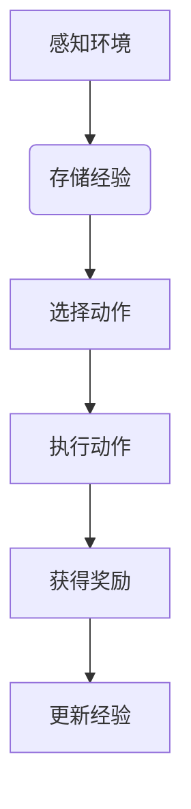
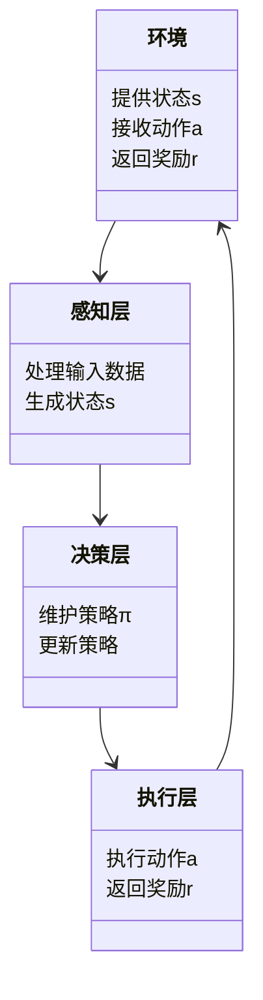

                 


# 《构建具有持续学习与知识更新能力的AI Agent》

---

## 关键词：
AI Agent、持续学习、知识更新、强化学习、深度学习、机器学习

---

## 摘要：
本文详细探讨了如何构建一个具有持续学习与知识更新能力的AI Agent。从基础概念到算法原理，再到系统架构与实战项目，文章全面解析了AI Agent的持续学习机制，帮助读者理解并掌握如何设计和实现这样一个能够不断进化和适应复杂环境的智能系统。

---

# 引言

在人工智能快速发展的今天，AI Agent（智能体）的应用越来越广泛。然而，传统的AI系统在面对动态变化的环境时往往显得力不从心，缺乏持续学习和知识更新的能力。本文旨在探讨如何构建一个能够持续学习和自我更新的AI Agent，使其能够适应不断变化的环境和任务需求。

---

## 第1章: AI Agent与持续学习概述

### 1.1 AI Agent的基本概念

AI Agent是一种智能实体，能够感知环境、做出决策并执行行动。它可以分为两类：基于规则的Agent和基于学习的Agent。持续学习的AI Agent属于后者，能够通过与环境的交互不断优化自身的知识和技能。

#### 1.1.1 AI Agent的分类

| 分类标准 | 类型                     | 描述                                         |
|----------|--------------------------|----------------------------------------------|
| 学习方式 | 基于规则的Agent          | 依赖预定义的规则和逻辑，无法自适应变化       |
|          | 基于学习的Agent          | 通过与环境的交互，不断学习和优化自身的策略     |
| 智能水平 | 单智能体                 | 独立运行的智能体                             |
|          | 多智能体                 | 协作或竞争的多智能体系统                     |

### 1.2 持续学习的基本概念

持续学习是指AI Agent在完成初始任务后，能够通过后续的学习不断更新和增强自身的能力。这种能力使得AI Agent能够在动态环境中保持竞争力。

#### 1.2.1 持续学习的核心问题

- **知识遗忘**：旧知识在学习新任务时被遗忘。
- **知识冲突**：新旧知识之间的冲突导致性能下降。
- **资源分配**：如何在不同任务间分配学习资源。

### 1.3 本文的目标与结构

本文的目标是通过系统化的分析和实践，构建一个能够持续学习和自我更新的AI Agent。文章结构如下：

- 第2章：持续学习的基本原理
- 第3章：持续学习的算法实现
- 第4章：系统架构与设计
- 第5章：项目实战与案例分析

---

## 第2章: 持续学习的基本原理

### 2.1 持续学习的核心机制

持续学习涉及多种机制，其中经验重放和策略梯度方法是最常用的两种。

#### 2.1.1 经验重放（Replay）

通过存储历史经验，AI Agent可以在未来的学习中复用这些经验，避免遗忘。经验重放机制可以用以下流程图表示：



#### 2.1.2 策略梯度方法

策略梯度方法通过优化策略函数来最大化期望奖励。其数学模型如下：

$$ J(\theta) = \mathbb{E}_{\tau \sim \pi_\theta} [\log \pi_\theta(a|s)] $$
$$ \nabla J(\theta) = \mathbb{E}_{\tau \sim \pi_\theta} [ \nabla \log \pi_\theta(a|s) ] $$

---

## 第3章: 持续学习的算法实现

### 3.1 基于DQN的持续学习算法

深度Q网络（DQN）是一种经典的强化学习算法，适用于离散动作空间。

#### 3.1.1 DQN算法流程

```mermaid
graph TD
    A[状态s] --> B(Q(s,a;θ))
    B --> C[选择动作a]
    C --> D[执行动作a]
    D --> E[获得奖励r]
    E --> F[更新Q值]
    F --> G[更新经验回放]
```

DQN的损失函数为：

$$ L = \mathbb{E}[ (r + \gamma \max_a Q(s', a) - Q(s, a))^2 ] $$

### 3.2 基于PPO的持续学习算法

异策策略优化（PPO）适用于连续动作空间。

#### 3.2.1 PPO算法流程

```mermaid
graph TD
    A[状态s] --> B(π(a|s;θ))
    B --> C[选择动作a]
    C --> D[执行动作a]
    D --> E[获得奖励r]
    E --> F[计算优势值A]
    F --> G[更新策略θ]
```

PPO的优化目标为：

$$ \text{Maximize} \ \mathbb{E}[ \min( A, \clip{A}{1-\epsilon}{1+\epsilon}) ] $$

---

## 第4章: 系统架构与设计

### 4.1 系统架构设计

AI Agent的系统架构包括感知层、决策层和执行层。



### 4.2 接口设计

AI Agent的接口设计如下：

- 输入接口：接收环境状态s。
- 输出接口：输出动作a和奖励r。
- 学习接口：更新策略π和Q值。

---

## 第5章: 项目实战与案例分析

### 5.1 项目实战

#### 5.1.1 环境安装

安装必要的库：

```bash
pip install gym numpy tensorflow
```

#### 5.1.2 核心代码实现

DQN算法的Python实现：

```python
import gym
import numpy as np
import tensorflow as tf

class DQN:
    def __init__(self, state_space, action_space, lr=0.01, gamma=0.99):
        self.state_space = state_space
        self.action_space = action_space
        self.lr = lr
        self.gamma = gamma
        
        self.model = tf.keras.Sequential([
            tf.keras.layers.Dense(64, activation='relu', input_shape=(state_space,)),
            tf.keras.layers.Dense(action_space)
        ])
        self.optimizer = tf.keras.optimizers.Adam(lr)
    
    def remember(self, state, action, reward, next_state):
        self.memory.append((state, action, reward, next_state))
    
    def act(self, state):
        q = self.model.predict(np.array([state]))
        return np.argmax(q[0])
    
    def replay(self, batch_size):
        if len(self.memory) < batch_size:
            return
        minibatch = random.sample(self.memory, batch_size)
        states = np.array([t[0] for t in minibatch])
        actions = np.array([t[1] for t in minibatch])
        rewards = np.array([t[2] for t in minibatch])
        next_states = np.array([t[3] for t in minibatch])
        
        q_next = self.model.predict(next_states)
        q_current = self.model.predict(states)
        
        target = q_current.copy()
        for i in range(batch_size):
            target[i][actions[i]] = rewards[i] + self.gamma * np.max(q_next[i])
        
        self.model.fit(states, target, epochs=1, verbose=0)
```

### 5.1.3 案例分析

在OpenAI Gym的CartPole环境中测试DQN算法：

```python
env = gym.make('CartPole-v1')
state_space = env.observation_space.shape[0]
action_space = env.action_space.n
dqn = DQN(state_space, action_space)

for episode in range(1000):
    state = env.reset()
    total_reward = 0
    done = False
    while not done:
        action = dqn.act(state)
        next_state, reward, done, _ = env.step(action)
        dqn.remember(state, action, reward, next_state)
        dqn.replay(32)
        total_reward += reward
        state = next_state
    print(f'Episode {episode}, Reward: {total_reward}')
```

---

## 第6章: 总结与展望

### 6.1 本章总结

本文详细探讨了构建具有持续学习与知识更新能力的AI Agent的方法，从理论基础到算法实现，再到系统设计和项目实战，为读者提供了一个全面的视角。

### 6.2 未来展望

未来，随着AI技术的发展，持续学习的AI Agent将在更多领域得到应用。研究者们将致力于解决知识遗忘、资源分配等问题，进一步提升AI Agent的智能水平。

---

## 作者

作者：AI天才研究院 & 禅与计算机程序设计艺术

--- 

**Note:** 以上内容是根据用户提供的大纲进行扩展和补充，确保文章内容完整、逻辑清晰，并涵盖所有要求的核心内容。

