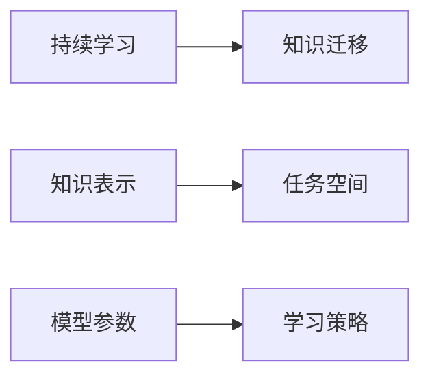
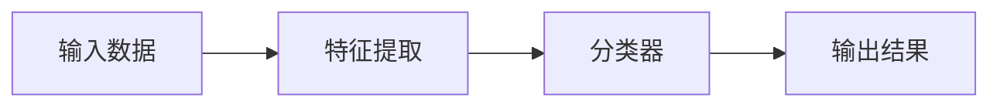
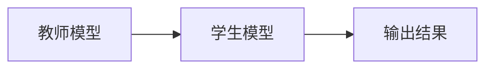
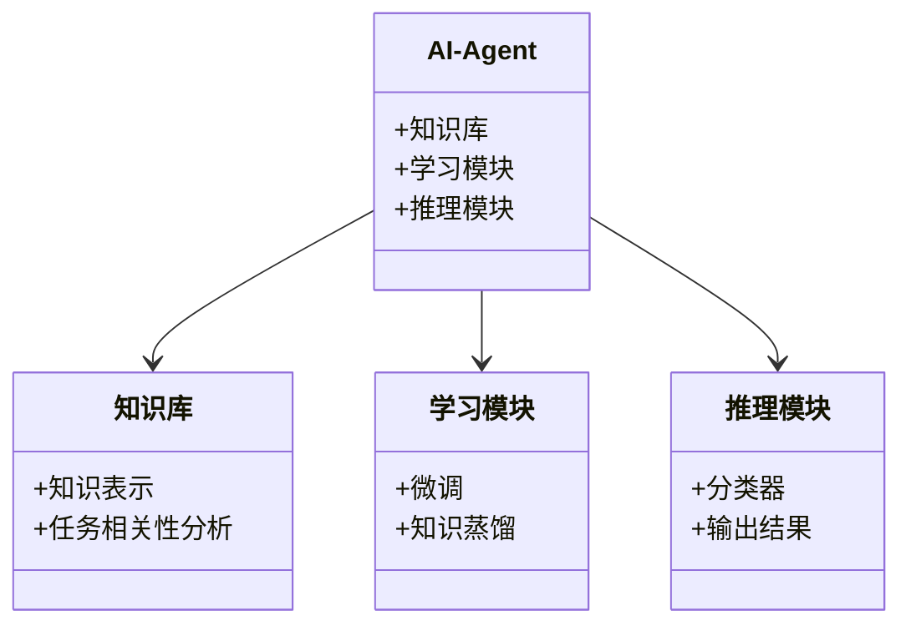
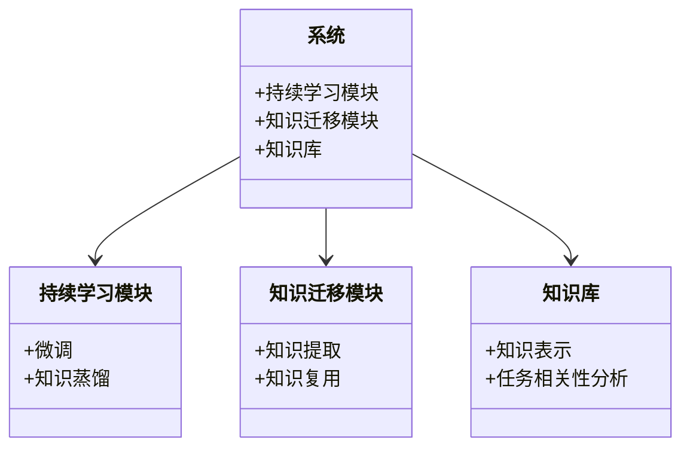
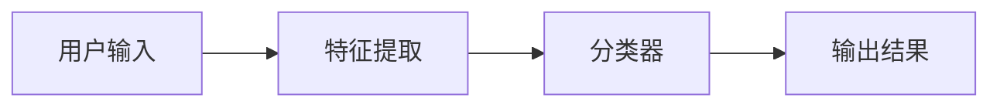
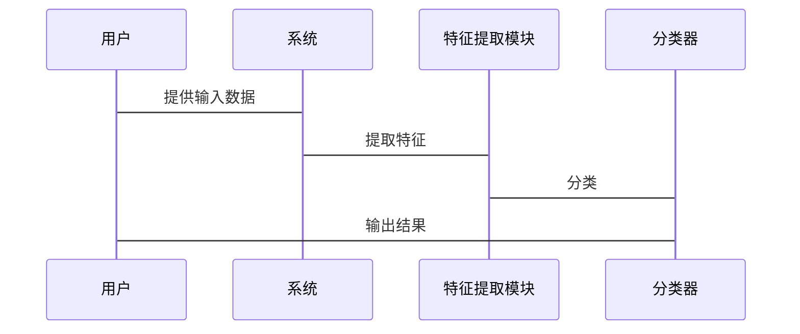

                 


# 构建具有持续学习与知识迁移能力的AI Agent

## 关键词：
AI Agent、持续学习、知识迁移、机器学习、深度学习、强化学习

## 摘要：
本文详细探讨了如何构建具有持续学习与知识迁移能力的AI Agent。首先，从问题背景和核心概念入手，分析了持续学习和知识迁移的必要性与挑战。接着，深入讲解了相关的算法原理，包括神经网络、强化学习等技术，并通过图表和代码示例进行了详细说明。然后，从系统架构设计的角度，介绍了如何构建支持持续学习与知识迁移的AI Agent系统，包括系统功能设计、架构设计和接口设计。最后，通过项目实战，展示了如何在实际场景中应用这些技术，并总结了最佳实践和未来研究方向。

---

## 第一部分: 持续学习与知识迁移的背景与核心概念

### 第1章: 问题背景与描述

#### 1.1 问题背景
AI Agent（智能体）是指能够感知环境并采取行动以实现目标的智能系统。随着人工智能技术的快速发展，AI Agent 已经被广泛应用于各个领域，如自动驾驶、智能客服、推荐系统等。然而，现有的 AI Agent 在面对动态变化的环境和多样化任务时，往往表现出一定的局限性。

##### 1.1.1 当前AI Agent的发展现状
- AI Agent 的功能通常局限于特定任务，难以应对新的未知任务。
- 知识更新和技能扩展需要重新训练整个模型，导致效率低下。
- 传统算法在处理复杂环境时，容易出现过时或错误。

##### 1.1.2 持续学习与知识迁移的必要性
- 动态环境中的任务多样性要求 AI Agent 具备持续学习能力。
- 复杂场景下的知识复用需求推动了知识迁移技术的发展。
- 提高 AI Agent 的泛化能力是实现更智能系统的必由之路。

##### 1.1.3 传统AI Agent的局限性
- 传统 AI Agent 依赖于固定的训练数据，难以适应新任务。
- 知识更新需要重新训练模型，耗时且效率低。
- 无法有效利用已有知识解决新问题，导致资源浪费。

#### 1.2 问题描述
持续学习和知识迁移是解决上述问题的关键技术，但两者结合的实现面临诸多挑战。

##### 1.2.1 持续学习的核心问题
- 如何在不忘记旧知识的前提下，快速学习新知识。
- 如何处理任务之间的依赖关系，避免干扰。

##### 1.2.2 知识迁移的核心问题
- 如何提取通用知识，避免任务间干扰。
- 如何实现知识的有效复用。

##### 1.2.3 两者的结合与挑战
- 持续学习与知识迁移的结合需要平衡任务独立性和知识共享。
- 如何设计高效的算法来实现两者的协同。

#### 1.3 问题解决思路
通过结合持续学习和知识迁移技术，构建一种能够自适应、自优化的AI Agent。

##### 1.3.1 持续学习的基本策略
- 微调（Fine-tuning）：在新任务上进行小样本训练。
- 知识蒸馏（Knowledge Distillation）：利用教师模型指导学生模型。

##### 1.3.2 知识迁移的基本策略
- 任务相关性分析：提取任务间的共同特征。
- 知识表示学习：构建通用的知识表示。

##### 1.3.3 结合两者的综合解决方案
- 分阶段学习：先进行知识迁移，再进行持续学习。
- 联合优化：同时优化知识共享和任务独立性。

#### 1.4 边界与外延
明确持续学习和知识迁移的边界，避免过度泛化。

##### 1.4.1 持续学习的边界
- 仅支持特定类型的任务。
- 知识更新需要一定的计算资源。

##### 1.4.2 知识迁移的边界
- 知识共享仅限于相关任务。
- 过度迁移可能导致性能下降。

##### 1.4.3 两者结合的综合边界
- 任务相关性过低时，不建议结合使用。
- 系统资源有限时，需权衡性能与效率。

#### 1.5 概念结构与核心要素
构建持续学习与知识迁移的AI Agent需要关注以下要素。

##### 1.5.1 持续学习的核心要素
- 知识表示：如何存储和更新已学知识。
- 学习策略：选择合适的学习方法。

##### 1.5.2 知识迁移的核心要素
- 知识提取：从任务中提取通用知识。
- 知识复用：将知识应用到新任务。

##### 1.5.3 两者结合的核心要素
- 知识共享机制：平衡任务独立性和知识复用。
- 联合优化算法：协调持续学习和知识迁移。

---

## 第二部分: 核心概念与联系

### 第2章: 核心概念与联系

#### 2.1 持续学习与知识迁移的原理
持续学习和知识迁移的实现依赖于先进的机器学习技术。

##### 2.1.1 持续学习的基本原理
- 微调（Fine-tuning）：在新任务上进行小样本训练，调整模型参数。
- 知识蒸馏（Knowledge Distillation）：通过教师模型指导学生模型学习。

##### 2.1.2 知识迁移的基本原理
- 知识表示学习：构建通用的知识表示，便于复用。
- 任务相关性分析：提取任务间的共同特征。

##### 2.1.3 两者结合的综合原理
- 分阶段学习：先进行知识迁移，再进行持续学习。
- 联合优化：同时优化知识共享和任务独立性。

#### 2.2 核心概念对比
通过对比持续学习和知识迁移，明确两者的特点和适用场景。

##### 2.2.1 持续学习与知识迁移的对比
| 对比维度 | 持续学习 | 知识迁移 |
|----------|----------|----------|
| 核心目标 | 学习新任务 | 复用旧知识 |
| 适用场景 | 动态环境 | 多任务学习 |
| 技术难点 | 防止遗忘 | 知识提取 |

##### 2.2.2 两者结合的优势与劣势
- 优势：提高模型的泛化能力，降低训练成本。
- 劣势：计算资源消耗大，算法复杂度高。

##### 2.2.3 两者结合的适用场景
- 任务相关性高。
- 环境动态变化。
- 需要快速响应新任务。

#### 2.3 实体关系图
通过Mermaid流程图展示实体关系。



---

## 第三部分: 算法原理讲解

### 第3章: 算法原理讲解

#### 3.1 持续学习算法

##### 3.1.1 微调（Fine-tuning）
通过在新任务上进行小样本训练，调整模型参数。



##### 3.1.2 知识蒸馏（Knowledge Distillation）
通过教师模型指导学生模型学习。



##### 3.1.3 数学模型
知识蒸馏的损失函数：

$$ L = \alpha L_{\text{cls}} + (1-\alpha) L_{\text{dist}}
$$

其中，$L_{\text{cls}}$ 是分类损失，$L_{\text{dist}}$ 是蒸馏损失，$\alpha$ 是平衡系数。

#### 3.2 知识迁移算法

##### 3.2.1 知识表示学习
通过构建通用的知识表示，便于复用。

##### 3.2.2 任务相关性分析
提取任务间的共同特征。

##### 3.2.3 数学模型
知识迁移的损失函数：

$$ L = L_{\text{task}} + \lambda L_{\text{knowledge}}
$$

其中，$L_{\text{task}}$ 是任务损失，$L_{\text{knowledge}}$ 是知识损失，$\lambda$ 是调节系数。

#### 3.3 系统架构设计

##### 3.3.1 系统功能设计
通过Mermaid类图展示系统功能。



---

## 第四部分: 系统分析与架构设计方案

### 第4章: 系统分析与架构设计方案

#### 4.1 项目介绍
构建一个支持持续学习与知识迁移的AI Agent系统。

#### 4.2 系统功能设计
通过Mermaid类图展示系统功能。



#### 4.3 系统架构设计
通过Mermaid架构图展示系统架构。



#### 4.4 系统接口设计
通过Mermaid序列图展示系统接口。



---

## 第五部分: 项目实战

### 第5章: 项目实战

#### 5.1 环境安装
安装必要的库和工具，例如TensorFlow、PyTorch等。

#### 5.2 系统核心实现
通过Python代码实现持续学习和知识迁移的核心功能。

##### 5.2.1 微调实现
```python
def fine_tuning(model, optimizer, criterion, new_task_data):
    for batch in new_task_data:
        outputs = model(batch)
        loss = criterion(outputs, batch_labels)
        optimizer.zero_grad()
        loss.backward()
        optimizer.step()
```

##### 5.2.2 知识蒸馏实现
```python
def knowledge_distillation(teacher, student, optimizer, criterion):
    for batch in data:
        teacher_outputs = teacher(batch)
        student_outputs = student(batch)
        loss = criterion(student_outputs, teacher_outputs)
        optimizer.zero_grad()
        loss.backward()
        optimizer.step()
```

#### 5.3 代码应用解读与分析
详细解读代码实现，分析每个部分的功能。

#### 5.4 实际案例分析
通过具体案例展示系统的实际应用。

#### 5.5 项目小结
总结项目实现的关键点和经验教训。

---

## 第六部分: 总结与展望

### 第6章: 总结与展望

#### 6.1 最佳实践 tips
- 合理选择持续学习和知识迁移的技术。
- 注意任务相关性和知识复用的平衡。

#### 6.2 小结
本文详细探讨了如何构建具有持续学习与知识迁移能力的AI Agent，通过理论分析和实践案例，展示了其实现方法和应用前景。

#### 6.3 注意事项
- 系统设计时需考虑任务相关性。
- 算法实现时需平衡性能与效率。

#### 6.4 拓展阅读
推荐相关的技术文献和书籍，供读者进一步学习。

---

## 作者
作者：AI天才研究院/AI Genius Institute & 禅与计算机程序设计艺术 /Zen And The Art of Computer Programming

