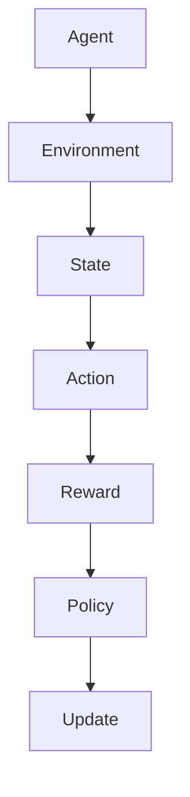
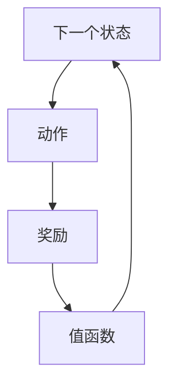
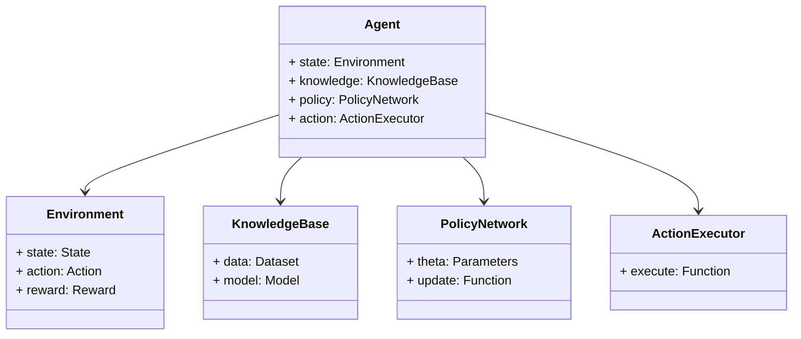
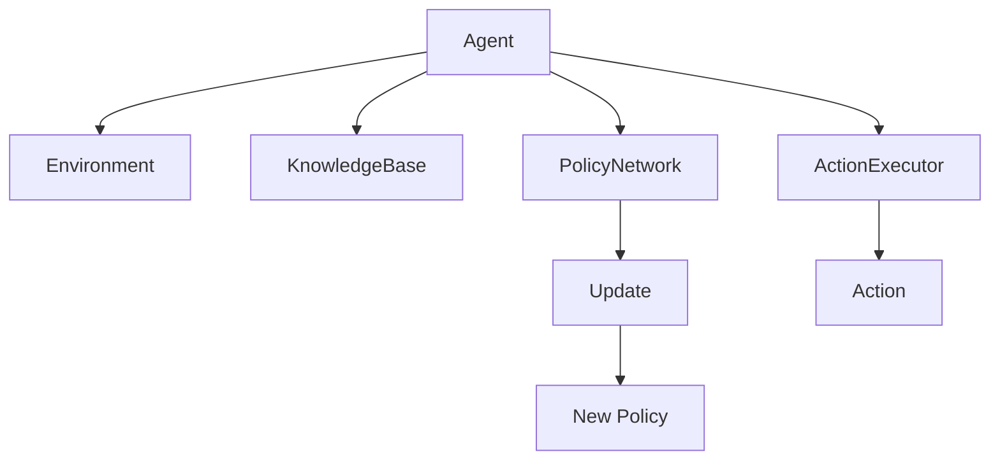
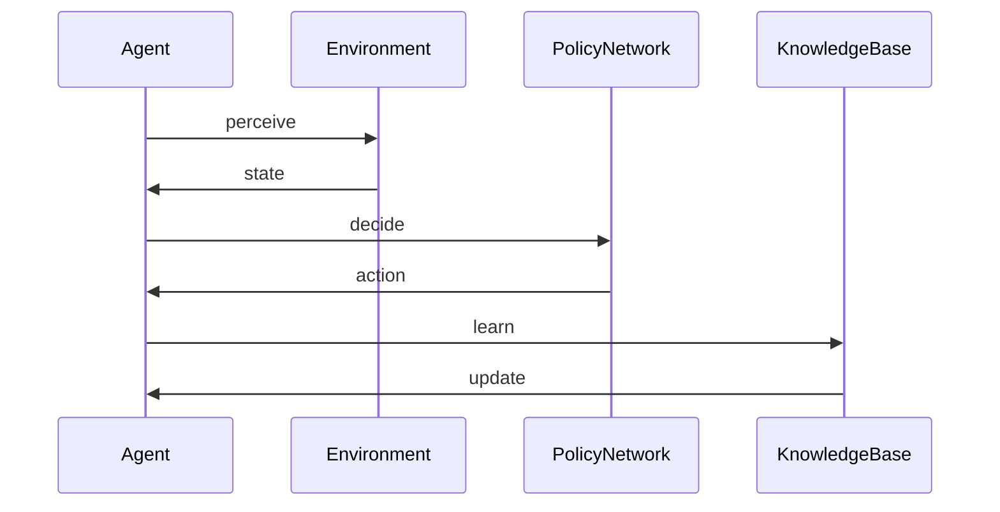

                 


# 构建具有持续学习与适应能力的AI Agent

## 关键词：AI Agent，持续学习，适应能力，强化学习，系统架构，项目实战

## 摘要：
本文将详细介绍如何构建一个具有持续学习和适应能力的AI Agent。通过分析AI Agent的核心概念、算法原理、系统架构以及项目实战，我们将探讨如何使AI Agent能够在动态环境中不断优化自身的学习和适应能力。文章内容涵盖从理论到实践的各个方面，旨在为技术读者提供一个全面且深入的指导。

---

## 第1章: AI Agent的背景与概念

### 1.1 问题背景与描述

#### 1.1.1 AI Agent的定义与核心要素
AI Agent（人工智能代理）是一种能够感知环境、做出决策并执行动作的智能实体。其核心要素包括：
- **感知能力**：通过传感器或数据输入获取环境信息。
- **推理能力**：基于感知信息进行逻辑推理和知识表示。
- **决策能力**：根据推理结果制定行动策略。
- **执行能力**：通过执行机构或接口将决策转化为具体动作。

#### 1.1.2 持续学习与适应能力的必要性
在动态和不确定的环境中，AI Agent需要不断适应新的情况。持续学习能力使其能够：
- 处理新数据，更新知识库。
- 自动调整决策策略以应对变化。
- 提高在复杂任务中的表现。

#### 1.1.3 当前AI Agent面临的挑战与边界
AI Agent的发展面临以下挑战：
- **环境复杂性**：动态变化的环境需要更强的适应能力。
- **数据稀疏性**：在数据不足的情况下，如何有效学习。
- **计算资源限制**：在资源受限的环境中实现高效学习。

边界包括：
- **功能范围**：仅关注特定任务或领域。
- **知识限制**：依赖预定义的规则和知识库。

### 1.2 问题解决与边界外延

#### 1.2.1 持续学习的核心目标
持续学习的核心目标是：
- **在线学习**：在实时环境中逐步学习和更新模型。
- **任务迁移**：将已学到的知识应用到新任务中。
- **自我优化**：通过反馈不断改进模型参数。

#### 1.2.2 适应能力的实现方式
适应能力的实现方式包括：
- **在线更新**：实时更新模型参数以适应新数据。
- **模块化设计**：通过模块化架构实现局部更新。
- **多策略学习**：通过多策略结合提高适应性。

#### 1.2.3 AI Agent与其他智能系统的区别
AI Agent与传统智能系统的区别如下：

| 对比维度 | AI Agent | 其他智能系统 |
|----------|-----------|--------------|
| 学习能力 | 具有持续学习能力 | 通常不具备或能力有限 |
| 适应能力 | 能够实时调整策略 | 适应能力较弱 |
| 知识表示 | 基于知识图谱和符号逻辑 | 基于规则或经验 |
| 交互能力 | 支持实时交互和反馈 | 通常为离线处理 |

### 1.3 本章小结
本章介绍了AI Agent的基本概念、核心要素以及持续学习与适应能力的重要性。同时，分析了AI Agent面临的挑战和边界，并通过对比分析明确了其与其他智能系统的区别。

---

## 第2章: AI Agent的核心概念与原理

### 2.1 核心概念原理

#### 2.1.1 知识表示与推理机制
知识表示是AI Agent理解环境的基础。常见的知识表示方法包括：
- **符号逻辑**：使用符号和规则表示知识。
- **概率图模型**：通过概率分布表示不确定性。
- **神经网络**：通过深度学习模型提取特征。

推理机制包括：
- **逻辑推理**：基于符号逻辑进行演绎推理。
- **概率推理**：基于概率分布进行推断。
- **类比推理**：通过类比和联想进行推理。

#### 2.1.2 状态感知与决策模型
状态感知是AI Agent理解环境的关键。常用的状态感知方法包括：
- **感知器模型**：通过传感器获取实时状态。
- **强化学习**：通过与环境交互学习最优策略。
- **监督学习**：通过标注数据训练感知模型。

决策模型包括：
- **Q-learning**：基于值函数的决策优化。
- **策略网络**：通过深度神经网络直接输出策略。
- **混合模型**：结合多种决策方法的混合策略。

#### 2.1.3 持续学习的算法框架
持续学习的算法框架包括：
- **增量学习**：逐步更新模型参数。
- **任务迁移**：将已有知识迁移到新任务。
- **模型融合**：通过多模型协作提高学习效果。

### 2.2 核心概念对比分析

#### 2.2.1 不同AI Agent架构的对比表格

| 架构类型 | 强化学习 | 监督学习 | 半监督学习 |
|----------|----------|----------|------------|
| 学习方式 | 基于奖励 | 基于标签 | 标签+未标签 |
| 适应性 | 高 | 中 | 高 |
| 应用场景 | 机器人控制 | 图像分类 | 文本分类 |

#### 2.2.2 ER实体关系图的Mermaid流程图



### 2.3 本章小结
本章详细讲解了AI Agent的核心概念，包括知识表示、状态感知和决策模型。通过对比分析，明确了不同架构的特点和适用场景。

---

## 第3章: AI Agent的算法原理与数学模型

### 3.1 算法原理

#### 3.1.1 强化学习算法的Mermaid流程图



#### 3.1.2 持续学习的数学模型

持续学习的更新公式如下：
$$ \theta_{t+1} = \theta_t + \alpha (y_t - \hat{y}_t) $$

其中：
- $\theta$ 表示模型参数。
- $\alpha$ 表示学习率。
- $y_t$ 表示真实值。
- $\hat{y}_t$ 表示预测值。

#### 3.1.3 算法实现的Python代码示例

```python
import numpy as np

def update_model(theta, alpha, y_true, y_pred):
    gradient = 2 * np.mean((y_pred - y_true) * theta)
    theta = theta - alpha * gradient
    return theta

theta = np.random.randn(10, 1)
alpha = 0.01
y_true = np.random.randn(10, 1)
y_pred = np.dot(theta.T, x)  # 假设x是输入数据
theta_updated = update_model(theta, alpha, y_true, y_pred)
print(theta_updated)
```

### 3.2 数学模型与公式

#### 3.2.1 强化学习的数学公式

强化学习的Q-learning算法公式为：
$$ Q(s, a) = r + \gamma \max_{a'} Q(s', a') $$

其中：
- $s$ 表示当前状态。
- $a$ 表示当前动作。
- $r$ 表示奖励。
- $\gamma$ 表示折扣因子。
- $s'$ 表示下一个状态。
- $a'$ 表示下一个动作。

#### 3.2.2 持续学习的更新公式

持续学习的更新公式为：
$$ \theta_{t+1} = \theta_t + \alpha (y_t - \hat{y}_t) $$

### 3.3 本章小结
本章详细讲解了AI Agent的算法原理和数学模型，包括强化学习和持续学习的核心公式和实现方法。

---

## 第4章: AI Agent的系统架构与设计

### 4.1 系统分析与架构设计

#### 4.1.1 问题场景介绍
我们以一个智能助手为例，设计一个能够持续学习和适应用户需求的AI Agent。

#### 4.1.2 系统功能设计的Mermaid类图



#### 4.1.3 系统架构设计的Mermaid架构图



### 4.2 系统接口与交互设计

#### 4.2.1 系统接口设计
系统接口包括：
- `perceive(environment)`：感知环境状态。
- `decide(action)`：做出决策动作。
- `learn(data)`：更新模型参数。

#### 4.2.2 系统交互的Mermaid序列图



### 4.3 本章小结
本章通过系统架构设计和交互流程图，详细展示了AI Agent的系统结构和工作流程。

---

## 第5章: AI Agent的项目实战

### 5.1 环境安装与配置

#### 5.1.1 开发环境搭建
建议使用Python 3.8及以上版本，安装以下库：
```bash
pip install numpy matplotlib tensorflow
```

#### 5.1.2 依赖库安装
```bash
pip install scikit-learn pandas gym
```

### 5.2 核心实现与代码解读

#### 5.2.1 持续学习模块的实现

```python
import numpy as np
import tensorflow as tf

def update_model(theta, alpha, y_true, y_pred):
    gradient = 2 * np.mean((y_pred - y_true) * theta)
    theta = theta - alpha * gradient
    return theta

# 初始化模型参数
theta = tf.Variable(np.random.randn(10, 1), dtype=tf.float32)
alpha = tf.constant(0.01, dtype=tf.float32)
y_true = tf.constant(np.random.randn(10, 1), dtype=tf.float32)
y_pred = tf.matmul(theta, x)  # 假设x是输入数据

# 更新模型
theta_updated = update_model(theta, alpha, y_true, y_pred)
print(theta_updated)
```

#### 5.2.2 适应能力模块的代码分析
适应能力模块的核心代码如下：

```python
def adapt_policy(policy, environment):
    # 获取当前状态
    state = environment.get_state()
    # 选择动作
    action = policy.decide(state)
    # 执行动作并获取反馈
    reward = environment.execute(action)
    # 更新策略
    policy.update(reward)
    return policy
```

### 5.3 案例分析与详细讲解

#### 5.3.1 实际案例分析
以智能助手为例，分析其在用户需求变化时的适应能力。

#### 5.3.2 代码实现的详细解读
通过代码实现，展示如何在实际项目中应用持续学习和适应能力。

### 5.4 项目总结与优化建议

#### 5.4.1 项目小结
总结项目实现的关键点和成功经验。

#### 5.4.2 优化方向与注意事项
提出优化方向和开发中的注意事项。

### 5.5 本章小结
本章通过项目实战，展示了如何将AI Agent的核心概念和技术应用于实际场景，并总结了开发经验。

---

## 第6章: AI Agent的应用与未来展望

### 6.1 应用场景与案例

#### 6.1.1 智能助手的应用
智能助手通过持续学习优化用户体验。

#### 6.1.2 智能推荐系统的实现
通过持续学习，智能推荐系统能够实时更新推荐策略。

### 6.2 未来发展趋势

#### 6.2.1 持续学习的优化方向
- **更高效的学习算法**：如元学习和自适应学习。
- **多任务学习**：提高跨任务的适应能力。

#### 6.2.2 适应能力的创新应用
- **动态环境中的实时调整**。
- **人机协作中的无缝交互**。

### 6.3 本章小结
本章展望了AI Agent的应用前景和未来发展方向，强调了持续学习和适应能力的重要性。

---

## 第7章: 最佳实践与总结

### 7.1 最佳实践Tips

#### 7.1.1 开发中的注意事项
- **数据质量**：确保数据的多样性和代表性。
- **模型选择**：根据任务需求选择合适的模型。
- **持续优化**：定期更新模型和策略。

#### 7.1.2 代码实现中的建议
- **模块化设计**：便于维护和扩展。
- **使用成熟库**：如TensorFlow和Keras。
- **监控与日志**：实时监控模型表现。

### 7.2 项目总结与经验分享

#### 7.2.1 项目小结
总结项目开发的关键经验和技术要点。

#### 7.2.2 经验分享
分享在项目开发中的教训和成功经验。

### 7.3 本章小结
本章总结了开发AI Agent的最佳实践，提供了宝贵的开发经验和建议。

---

## 作者：AI天才研究院/AI Genius Institute & 禅与计算机程序设计艺术 /Zen And The Art of Computer Programming

---

以上是《构建具有持续学习与适应能力的AI Agent》的完整目录和内容概述。每一章都详细展开了相关技术内容，确保读者能够从理论到实践，全面理解如何构建一个具有持续学习和适应能力的AI Agent。

