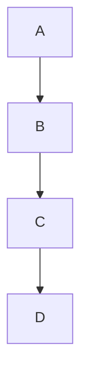
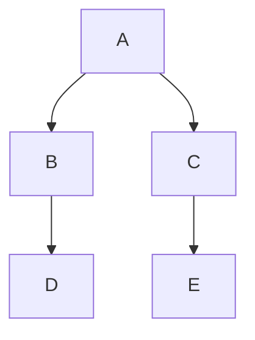
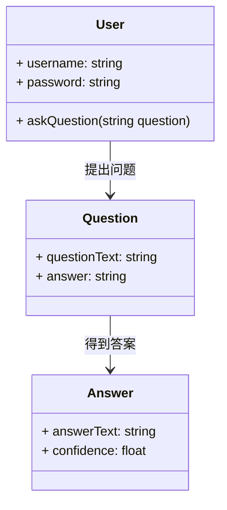
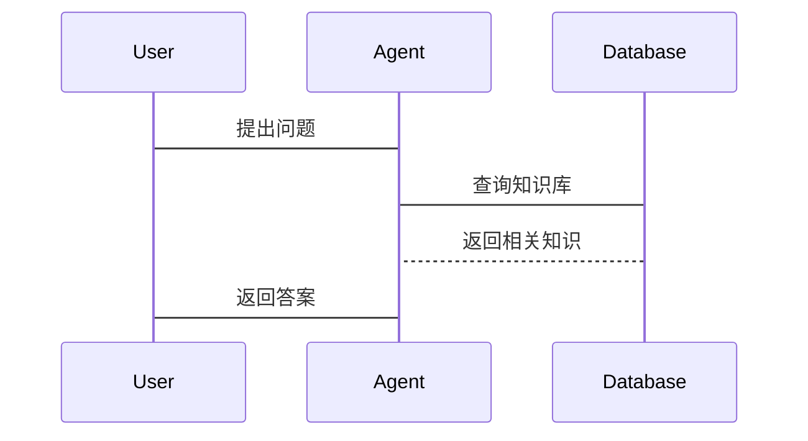

                 


# 构建具有推理能力的AI Agent

> 关键词：AI Agent，推理能力，知识表示，问题求解，算法原理，系统架构，项目实战

> 摘要：本文详细探讨了构建具有推理能力的AI Agent的各个方面，从基本概念到高级算法，再到实际应用。通过逐步分析，我们将了解如何设计和实现一个能够进行推理的AI Agent，涵盖知识表示、问题求解、算法原理、系统架构、项目实战以及未来展望。

---

# 第1章 AI Agent的基本概念与背景

## 1.1 AI Agent的定义与分类

### 1.1.1 什么是AI Agent
AI Agent（人工智能代理）是一种能够感知环境、自主决策并执行任务的智能实体。它可以是一个软件程序，也可以是一个物理设备，其核心目标是通过与环境交互来实现特定目标。

### 1.1.2 AI Agent的分类
AI Agent可以根据不同的标准进行分类：
- **按智能水平**：简单反射型、基于模型的反射型、目标驱动型、效用驱动型。
- **按应用场景**：软件代理（如推荐系统）、物理代理（如自动驾驶汽车）。
- **按决策方式**：基于规则的代理、基于逻辑推理的代理、基于学习的代理。

### 1.1.3 AI Agent与传统程序的区别
AI Agent的核心在于其自主性和智能性，能够根据环境信息动态调整行为，而传统程序通常基于固定的规则执行任务。

---

## 1.2 AI Agent的发展历程

### 1.2.1 AI Agent的历史背景
AI Agent的概念可以追溯到20世纪60年代的知识表示和推理研究。早期的AI Agent主要用于专家系统和自动推理。

### 1.2.2 AI Agent的技术演进
随着计算能力和数据量的增加，AI Agent逐渐从基于规则的推理发展到基于机器学习的推理，再到当前的深度学习和强化学习。

### 1.2.3 当前AI Agent的应用现状
AI Agent目前广泛应用于自动驾驶、智能助手、机器人控制、推荐系统等领域。

---

## 1.3 构建具有推理能力的AI Agent的意义

### 1.3.1 提升AI Agent的智能水平
推理能力是AI Agent的核心，能够使其从环境中获取信息并做出更智能的决策。

### 1.3.2 扩展AI Agent的应用场景
具有推理能力的AI Agent可以处理更复杂的任务，如问题求解、规划和决策。

### 1.3.3 推动AI技术的创新
通过研究AI Agent的推理能力，可以推动人工智能技术的整体发展，尤其是在复杂场景中的应用。

---

# 第2章 AI Agent的核心概念与原理

## 2.1 知识表示

### 2.1.1 知识表示的定义
知识表示是将现实世界中的信息以计算机能够理解的形式表示出来，是AI Agent推理的基础。

### 2.1.2 常见的知识表示方法

| 方法       | 描述                                                                 |
|------------|----------------------------------------------------------------------|
| 语义网络   | 通过节点和边表示概念及其关系。                                         |
| 框架表示   | 使用框架结构表示对象及其属性和关系。                                   |
| 描述逻辑   | 通过逻辑公式描述知识，支持推理和查询。                                |

### 2.1.3 知识图谱的构建与应用
知识图谱是一种大规模的知识表示形式，广泛应用于搜索引擎、推荐系统等领域。

---

## 2.2 问题求解

### 2.2.1 问题求解的定义
问题求解是AI Agent通过推理找到问题解决方案的过程，是推理能力的重要组成部分。

### 2.2.2 常见的问题求解算法

| 算法       | 描述                                                                 |
|------------|----------------------------------------------------------------------|
| DFS        | 深度优先搜索，适用于解决连通性问题。                                   |
| BFS        | 广度优先搜索，适用于最短路径问题。                                    |
| A*算法     | 带有启发式的搜索算法，适用于复杂的路径规划问题。                     |

### 2.2.3 问题求解的复杂度分析
问题求解的复杂度通常用时间复杂度和空间复杂度来衡量，复杂度的分析有助于选择合适的算法。

---

## 2.3 推理方法

### 2.3.1 推理的定义与分类
推理是根据已有知识推导出新结论的过程，可分为基于逻辑的推理和基于概率的推理。

### 2.3.2 基于逻辑的推理方法
基于逻辑的推理方法通常使用逻辑规则进行推理，如命题逻辑和谓词逻辑。

### 2.3.3 基于概率的推理方法
基于概率的推理方法（如贝叶斯网络）能够处理不确定性问题，适用于真实世界的复杂场景。

---

## 2.4 规划技术

### 2.4.1 规划的定义与分类
规划是AI Agent为了实现目标而制定行动序列的过程，可分为简单规划和复杂规划。

### 2.4.2 常见的规划算法
| 算法       | 描述                                                                 |
|------------|----------------------------------------------------------------------|
| 无约束规划  | 适用于简单环境的规划问题。                                             |
| 带约束规划  | 适用于复杂环境的规划问题，需要考虑各种约束条件。                       |

### 2.4.3 规划与推理的关系
规划是推理的一种形式，通过推理得出行动序列以实现目标。

---

# 第3章 AI Agent的算法原理

## 3.1 搜索算法

### 3.1.1 深度优先搜索（DFS）
DFS是一种贪心算法，适用于解决连通性问题。

**DFS流程图（Mermaid）：**


### 3.1.2 广度优先搜索（BFS）
BFS适用于解决最短路径问题。

**BFS流程图（Mermaid）：**


### 3.1.3 启发式搜索（A*算法）
A*算法是一种带有启发式的搜索算法，适用于复杂的路径规划问题。

**A*算法流程图（Mermaid）：**


---

## 3.2 推理算法

### 3.2.1 基于逻辑的推理算法
基于逻辑的推理算法通常使用逻辑规则进行推理。

### 3.2.2 基于概率的推理算法
基于概率的推理算法（如贝叶斯网络）能够处理不确定性问题。

---

## 3.3 规划算法

### 3.3.1 基于逻辑的规划算法
基于逻辑的规划算法通过逻辑推理制定行动序列。

### 3.3.2 基于搜索的规划算法
基于搜索的规划算法（如A*算法）通过搜索找到最优规划路径。

### 3.3.3 基于强化学习的规划算法
基于强化学习的规划算法（如深度强化学习）能够通过试错学习优化规划策略。

---

# 第4章 AI Agent的系统分析与架构设计

## 4.1 问题场景介绍

### 4.1.1 问题背景
我们以一个简单的问答系统为例，介绍AI Agent的构建过程。

### 4.1.2 问题描述
构建一个能够回答用户问题的问答系统，实现从问题理解到答案生成的全过程。

### 4.1.3 问题解决的目标
通过构建问答系统，展示AI Agent的核心能力，包括知识表示、推理和规划。

---

## 4.2 系统功能设计

### 4.2.1 领域模型设计（Mermaid类图）


### 4.2.2 系统架构设计（Mermaid架构图）
```mermaid
C4Context
    User: 用户
    Agent: AI Agent
    Database: 知识库
    Service: 推理服务
    User --> Agent: 发出请求
    Agent --> Database: 查询知识库
    Agent --> Service: 调用推理服务
    Service --> Agent: 返回推理结果
    Agent --> User: 返回答案
```

### 4.2.3 系统接口设计
系统接口包括用户接口和API接口，用户接口用于与用户交互，API接口用于与其他系统集成。

---

## 4.3 系统交互设计

### 4.3.1 系统交互流程（Mermaid序列图）


---

# 第5章 项目实战：构建一个问答系统

## 5.1 环境安装
需要安装Python、TensorFlow和自然语言处理库（如spaCy）。

## 5.2 核心实现

### 5.2.1 知识库构建
使用爬虫工具爬取网页内容，构建问答相关的知识库。

### 5.2.2 推理实现
基于逻辑推理或深度学习模型（如BERT）实现问题理解和答案生成。

## 5.3 代码实现

### 5.3.1 知识库构建代码
```python
import requests
from bs4 import BeautifulSoup

url = 'https://example.com'
response = requests.get(url)
soup = BeautifulSoup(response.text, 'html.parser')
content = soup.get_text()
print(content)
```

### 5.3.2 推理实现代码
```python
import tensorflow as tf
from tensorflow.keras import layers

model = tf.keras.Sequential([
    layers.Dense(64, activation='relu'),
    layers.Dense(1, activation='sigmoid')
])
model.compile(optimizer='adam', loss='binary_crossentropy')
model.fit(X_train, y_train, epochs=10)
```

---

## 5.4 实际案例分析
通过具体案例分析，展示问答系统的实现过程和效果。

---

## 5.5 项目小结
总结项目实现的关键步骤和经验教训，为后续优化提供参考。

---

# 第6章 高级主题与未来展望

## 6.1 强化学习在AI Agent中的应用
强化学习可以提升AI Agent的决策能力和自适应能力。

## 6.2 人机协作与AI Agent
未来，人机协作将更加紧密，AI Agent将在更多领域发挥重要作用。

## 6.3 伦理与安全问题
AI Agent的广泛应用需要考虑伦理和安全问题，确保其应用符合社会规范。

---

## 6.4 未来的研究方向
未来的研究将聚焦于更复杂的推理算法、更高效的计算架构以及更广泛的应用场景。

---

# 附录

## 附录A 术语表
列出本文中涉及的主要术语及其定义。

## 附录B 工具推荐
推荐常用的AI开发工具和库。

## 附录C 参考文献
列出本文参考的文献和资料。

---

# 作者：AI天才研究院 & 禅与计算机程序设计艺术

通过以上结构和内容，我们可以系统地构建一个具有推理能力的AI Agent，涵盖从理论到实践的各个方面。

