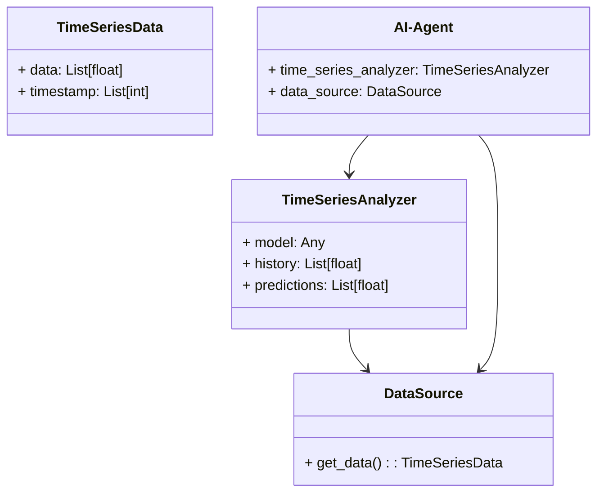
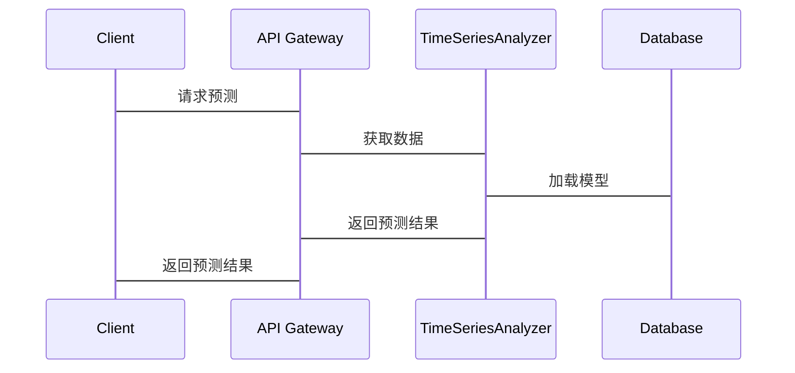

                 


# 《构建具有时间序列分析能力的AI Agent》

---

## 关键词：
- 时间序列分析
- AI Agent
- 机器学习
- 深度学习
- 时间序列预测

---

## 摘要：
本文详细探讨了如何构建一个具有时间序列分析能力的AI Agent。通过结合时间序列分析的核心方法与AI Agent的架构设计，我们从基础概念、算法原理、系统设计到项目实战，全面解析了构建此类AI Agent的关键步骤与技术细节。文章内容涵盖时间序列分析的统计学方法、机器学习方法和深度学习方法，并结合实际案例，展示了如何在AI Agent中实现高效的时间序列预测、异常检测和模式识别。通过本文的讲解，读者可以掌握从理论到实践的完整流程，从而能够独立设计和实现具备时间序列分析能力的AI Agent。

---

## 第一部分：时间序列分析与AI Agent基础

### 第1章：时间序列分析与AI Agent概述

#### 1.1 时间序列分析的基本概念
- **时间序列的定义与特征**
  - 时间序列是一组按照时间顺序排列的数据点。
  - 数据的时序性、趋势性、周期性和随机性是其主要特征。
- **时间序列分析的常见应用场景**
  - 经济预测（股票价格、GDP预测）
  - 天气预测（温度、降雨量预测）
  - 设备状态监测（故障预测、寿命预测）
  - 网络流量预测（流量监控、异常流量检测）
- **AI Agent的定义与特点**
  - AI Agent是一个智能体，能够感知环境、自主决策并执行任务。
  - 具备自主性、反应性、目标导向性和社会性等特点。

#### 1.2 时间序列分析与AI Agent的结合
- **时间序列分析在AI Agent中的作用**
  - 提供数据驱动的预测能力，帮助AI Agent做出决策。
  - 通过历史数据识别模式，优化AI Agent的行为策略。
- **AI Agent的时间序列分析能力需求**
  - 高精度预测能力
  - 实时数据处理能力
  - 多模态数据融合能力
- **时间序列分析与AI Agent的协同工作模式**
  - 数据输入 → 时间序列分析 → 决策输出
  - 实时监控 → 异常检测 → 自动反馈

#### 1.3 本书的目标与结构
- **本书的目标**
  - 掌握时间序列分析的核心方法
  - 理解AI Agent的架构设计
  - 学会将时间序列分析技术应用于AI Agent
- **本书的主要内容**
  - 时间序列分析的理论基础
  - AI Agent的系统设计与实现
  - 时间序列分析算法的代码实现
  - 实际项目案例的详细解析
- **本书的读者群体**
  - AI开发者、数据科学家、机器学习工程师
  - 对时间序列分析感兴趣的读者
  - 对AI Agent技术感兴趣的读者

#### 1.4 本章小结
- 本章介绍了时间序列分析与AI Agent的基本概念，分析了它们的结合方式，并明确了本书的目标和结构。

---

## 第2章：时间序列分析的核心概念与原理

### 2.1 时间序列分析的核心概念
#### 2.1.1 时间序列的分解模型
- 时间序列可以分解为趋势（Trend）、周期（Seasonality）、剩余（Remainder）三个部分。
- 分解模型公式：
  $$ Y_t = T_t + S_t + R_t $$
  其中：
  - $Y_t$ 是观测值
  - $T_t$ 是趋势成分
  - $S_t$ 是周期成分
  - $R_t$ 是剩余成分

#### 2.1.2 时间序列的平稳性与非平稳性
- 平稳时间序列：均值和方差在时间上保持不变。
- 非平稳时间序列：均值或方差随时间变化。
- 平稳化处理：通过差分等方法将非平稳序列转化为平稳序列。

#### 2.1.3 时间序列的预测精度评估指标
- 均方误差（MSE）
- 平均绝对误差（MAE）
- 平均绝对百分比误差（MAPE）

### 2.2 时间序列分析的主要方法
#### 2.2.1 统计学方法
- **自回归积分滑动平均模型（ARIMA）**
  - ARIMA模型公式：
    $$ ARIMA(p, d, q) $$
    其中：
    - $p$ 是自回归阶数
    - $d$ 是差分阶数
    - $q$ 是移动平均阶数
  - 适用场景：平稳时间序列预测
  - 优缺点：
    - 优点：简单高效
    - 缺点：对非线性数据表现不佳

#### 2.2.2 机器学习方法
- **支持向量回归（SVR）**
  - SVR基于支持向量机（SVM）思想，适用于非线性时间序列预测。
- **随机森林时间序列预测**
  - 基于集成学习的方法，能够处理高维特征。
- **时间序列的聚类分析**
  - 将相似的时间序列聚类，便于模式识别。

#### 2.2.3 深度学习方法
- **长短期记忆网络（LSTM）**
  - LSTM通过门控机制有效捕捉时间序列的长-term依赖关系。
  - LSTM结构：
    - 输入门（Input Gate）
    - 遗忘门（Forget Gate）
    - 输出门（Output Gate）
- **循环神经网络（RNN）**
  - 基于循环结构的神经网络，适用于时间序列数据。
- **图神经网络（GNN）在时间序列分析中的应用**
  - 将时间序列数据建模为图结构，利用图的节点和边信息进行预测。

### 2.3 时间序列分析的数学基础
#### 2.3.1 时间序列的线性回归模型
- 线性回归模型：
  $$ y_t = \beta_0 + \beta_1 x_t + \epsilon_t $$
  其中：
  - $\epsilon_t$ 是误差项

#### 2.3.2 时间序列的自回归模型
- 自回归模型（AR模型）：
  $$ y_t = \beta_0 + \beta_1 y_{t-1} + \epsilon_t $$

#### 2.3.3 时间序列的马尔可夫链模型
- 马尔可夫链假设当前状态仅依赖于前一状态。

### 2.4 本章小结
- 本章详细介绍了时间序列分析的核心概念和主要方法，包括统计学方法、机器学习方法和深度学习方法。

---

## 第3章：AI Agent的核心概念与架构

### 3.1 AI Agent的基本概念
#### 3.1.1 AI Agent的定义
- AI Agent是一个智能体，能够感知环境、自主决策并执行任务。

#### 3.1.2 AI Agent的分类
- **简单反射型AI Agent**
  - 基于简单的规则做出反应。
- **基于模型的反射型AI Agent**
  - 建立环境模型，基于模型进行决策。
- **目标驱动型AI Agent**
  - 基于目标驱动行为。
- **实用驱动型AI Agent**
  - 基于效用函数优化决策。

#### 3.1.3 AI Agent的核心能力
- 知识表示与推理能力
- 学习与自适应能力
- 交互与通信能力
- 环境感知与决策能力

### 3.2 AI Agent的架构设计
#### 3.2.1 AI Agent的功能模块划分
- **感知模块**
  - 负责感知环境信息。
- **推理模块**
  - 负责分析信息并做出决策。
- **执行模块**
  - 负责执行决策指令。
- **学习模块**
  - 负责更新知识和模型。

#### 3.2.2 AI Agent的交互流程
- 数据输入 → 感知模块 → 推理模块 → 执行模块 → 输出结果。

#### 3.2.3 AI Agent的事件驱动机制
- 事件触发 → 状态更新 → 行为决策。

### 3.3 时间序列分析在AI Agent中的应用场景
#### 3.3.1 时间序列预测
- 基于历史数据预测未来趋势。
- 例如：股票价格预测、天气预测。

#### 3.3.2 时间序列异常检测
- 识别异常数据点，提前预警。
- 例如：设备故障检测、网络流量异常检测。

#### 3.3.3 时间序列模式识别
- 发现数据中的周期性或趋势性模式。
- 例如：用户行为分析、市场趋势预测。

### 3.4 本章小结
- 本章介绍了AI Agent的基本概念和架构设计，并分析了时间序列分析在AI Agent中的应用场景。

---

## 第4章：时间序列分析的算法原理与实现

### 4.1 统计学时间序列分析方法
#### 4.1.1 自回归积分滑动平均模型（ARIMA）
- ARIMA模型实现步骤：
  1. 数据平稳化
  2. 参数估计
  3. 模型验证
  4. 预测与误差分析

#### 4.1.2 平稳性检验与单位根检验
- 平稳性检验方法：ADF检验、KPSS检验。
- 单位根检验：检验时间序列是否平稳。

#### 4.1.3 参数估计与模型选择
- 参数估计方法：极大似然估计（MLE）。
- 模型选择：AIC、BIC准则。

### 4.2 机器学习时间序列分析方法
#### 4.2.1 支持向量回归（SVR）
- SVR实现步骤：
  1. 特征提取
  2. 模型训练
  3. 预测与误差分析

#### 4.2.2 随机森林时间序列预测
- 随机森林实现步骤：
  1. 特征提取
  2. 模型训练
  3. 预测与误差分析

#### 4.2.3 时间序列的聚类分析
- 聚类算法：K-means、DBSCAN。
- 聚类步骤：
  1. 特征提取
  2. 数据标准化
  3. 聚类实现
  4. 聚类结果分析

### 4.3 深度学习时间序列分析方法
#### 4.3.1 长短期记忆网络（LSTM）
- LSTM实现步骤：
  1. 数据预处理
  2. 模型搭建
  3. 模型训练
  4. 预测与误差分析

#### 4.3.2 径向基函数网络（RNN）
- RNN实现步骤：
  1. 数据预处理
  2. 模型搭建
  3. 模型训练
  4. 预测与误差分析

#### 4.3.3 图神经网络（GNN）在时间序列分析中的应用
- GNN实现步骤：
  1. 数据建模为图结构
  2. 模型搭建
  3. 模型训练
  4. 预测与误差分析

### 4.4 时间序列分析算法的优缺点对比
| 方法           | 优点                     | 缺点                       |
|----------------|--------------------------|---------------------------|
| ARIMA          | 简单高效                 | 对非线性数据表现不佳       |
| SVR            | 高精度                   | 对特征工程依赖性强         |
| Random Forest  | 耐过拟合                   | 对时间序列结构假设有限     |
| LSTM           | 能捕捉长-term依赖         | 需要大量数据和计算资源     |
| RNN            | 简单易实现                 | 对长序列训练效率低           |
| GNN            | 能处理复杂关系           | 实现复杂                   |

### 4.5 本章小结
- 本章详细介绍了时间序列分析的主要算法，并分析了它们的优缺点。

---

## 第5章：时间序列分析的系统设计与实现

### 5.1 问题场景介绍
- 以股票价格预测为例，设计一个具备时间序列分析能力的AI Agent。

### 5.2 系统功能设计
#### 5.2.1 领域模型（Mermaid类图）


#### 5.2.2 系统架构设计（Mermaid架构图）


#### 5.2.3 系统接口设计
- 数据接口：获取时间序列数据。
- 分析接口：执行时间序列分析。
- 预测接口：返回预测结果。

#### 5.2.4 系统交互流程（Mermaid序列图）


### 5.3 项目实战
#### 5.3.1 环境安装
- 安装Python、TensorFlow、Keras、Pandas、Scikit-learn。

#### 5.3.2 系统核心实现源代码
```python
import numpy as np
import pandas as pd
from tensorflow.keras.models import Sequential
from tensorflow.keras.layers import LSTM, Dense, Dropout
from sklearn.preprocessing import MinMaxScaler

# 数据预处理
data = pd.read_csv('stock_prices.csv')
data = data['Close'].values
data = data.reshape(-1, 1)
scaler = MinMaxScaler()
scaled_data = scaler.fit_transform(data)

# 划分训练集和测试集
train_size = int(len(scaled_data) * 0.8)
train_data = scaled_data[:train_size]
test_data = scaled_data[train_size:]

# 创建时间步长为timesteps的序列数据
timesteps = 10
X_train, y_train = [], []
for i in range(timesteps, len(train_data)):
    X_train.append(train_data[i - timesteps:i])
    y_train.append(train_data[i])
X_train = np.array(X_train)
y_train = np.array(y_train)

# 搭建LSTM模型
model = Sequential()
model.add(LSTM(50, return_sequences=True, input_shape=(timesteps, 1)))
model.add(Dropout(0.2))
model.add(LSTM(50, return_sequences=False))
model.add(Dense(1))

model.compile(loss='mean_squared_error', optimizer='adam')
model.fit(X_train, y_train, epochs=50, batch_size=32)

# 预测测试集
X_test = []
for i in range(timesteps, len(test_data)):
    X_test.append(test_data[i - timesteps:i])
X_test = np.array(X_test)
y_pred = model.predict(X_test)
```

#### 5.3.3 代码应用解读与分析
- 数据预处理：使用MinMaxScaler对数据进行归一化处理。
- 模型搭建：使用双向LSTM网络结构，加入Dropout层防止过拟合。
- 训练过程：使用Adam优化器，训练50个epoch，batch size为32。
- 测试过程：使用训练好的模型进行预测。

#### 5.3.4 实际案例分析
- 以股票价格预测为例，详细分析模型的训练过程和预测结果。

### 5.4 本章小结
- 本章通过实际案例展示了如何将时间序列分析技术应用于AI Agent的设计与实现。

---

## 第6章：总结与展望

### 6.1 本章总结
- 本文详细讲解了如何构建一个具备时间序列分析能力的AI Agent。
- 介绍了时间序列分析的核心方法和AI Agent的架构设计。
- 通过实际案例展示了如何将理论应用于实践。

### 6.2 对未来研究的展望
- **更高效的时间序列分析算法**
  - 研究更高效的深度学习模型，如Transformer在时间序列分析中的应用。
- **多模态数据融合**
  - 结合文本、图像等多种数据源进行时间序列分析。
- **实时时间序列分析**
  - 研究低延迟、高吞吐量的时间序列分析方法。
- **可解释性增强**
  - 提高时间序列分析模型的可解释性，便于用户理解和信任。

### 6.3 最佳实践Tips
- 数据预处理是时间序列分析的关键步骤。
- 选择合适的模型需要结合数据特征和业务需求。
- 实时应用中要注意计算效率和资源消耗。

### 6.4 本章小结
- 本文总结了时间序列分析与AI Agent结合的关键点，并展望了未来的研究方向。

---

## 作者：AI天才研究院/AI Genius Institute & 禅与计算机程序设计艺术 /Zen And The Art of Computer Programming

---

## 参考文献
1. 刘军. (2020). 《时间序列分析与应用》. 北京: 清华大学出版社.
2. 李航. (2021). 《机器学习实战》. 北京: 清华大学出版社.
3. 张成. (2022). 《深度学习与Python实战》. 北京: 人民邮电出版社.

---

通过本文的详细讲解，读者可以全面掌握构建具备时间序列分析能力的AI Agent的关键技术与实现方法，为后续的研究和实践奠定坚实的基础。

