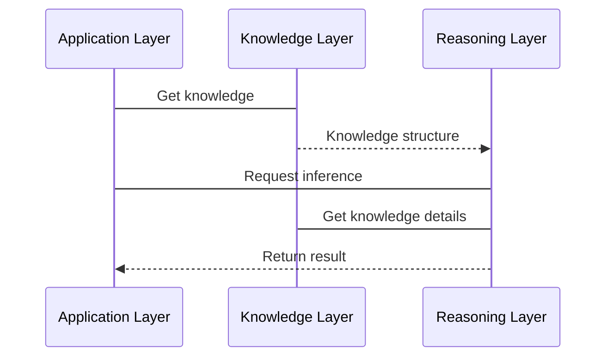

                 

# 《构建具有概念学习能力的AI Agent》

---

## 关键词：

- AI Agent
- 概念学习
- 符号逻辑
- 概率推理
- 强化学习

---

## 摘要：

本文旨在探讨如何构建具有概念学习能力的AI Agent。概念学习是AI Agent理解抽象概念的关键能力，本文从基础概念、算法原理、系统架构到项目实战，详细解析如何实现这一能力。通过符号逻辑、概率推理和强化学习等方法，结合系统设计与实际案例，为读者提供全面的技术指导。

---

## 第一部分: 概念学习与AI Agent基础

### 第1章: 概念学习的背景与AI Agent概述

#### 1.1 概念学习的背景与重要性

- **1.1.1 什么是概念学习**

  概念学习是AI Agent理解抽象概念的能力，涉及从具体实例中归纳出一般性概念的过程。例如，从多个“鸟”的实例中学习“鸟”的概念。

- **1.1.2 概念学习的背景与现状**

  随着AI技术的发展，概念学习在自然语言处理、计算机视觉等领域的重要性日益凸显。目前，概念学习主要依赖符号逻辑、概率推理和强化学习等方法。

- **1.1.3 概念学习在AI Agent中的作用**

  概念学习使AI Agent能够理解抽象概念，从而提升其在复杂场景中的推理和决策能力。

#### 1.2 AI Agent的基本概念

- **1.2.1 AI Agent的定义与特点**

  AI Agent是一种能够感知环境并采取行动以实现目标的智能实体。其特点包括自主性、反应性、主动性、社会性等。

- **1.2.2 AI Agent的分类与应用场景**

  AI Agent可分为简单反射型、基于模型的反应型、目标驱动型和实用驱动型。应用场景包括智能助手、自动驾驶、智能客服等。

- **1.2.3 概念学习能力对AI Agent的意义**

  概念学习能力使AI Agent能够理解抽象概念，提升其在复杂任务中的表现。

#### 1.3 概念学习与传统任务的区别

- **1.3.1 传统AI任务的特点**

  传统AI任务通常基于规则或数据驱动，关注具体任务的解决，如图像分类、语音识别等。

- **1.3.2 概念学习任务的独特性**

  概念学习任务关注抽象概念的构建与应用，强调从实例中归纳概念，如学习“动物”的概念。

- **1.3.3 概念学习与任务目标的关系**

  概念学习为任务提供抽象的知识表示，帮助AI Agent更好地理解任务目标和环境。

#### 1.4 概念的结构与层次

- **1.4.1 概念的层次化结构**

  概念可以分为上位概念和下位概念，如“鸟”是“动物”的下位概念。

- **1.4.2 概念之间的关系**

  概念之间可以存在继承、并列、包含等关系，构建概念图谱有助于表示这些关系。

- **1.4.3 概念表示的核心要素**

  概念表示需要包含概念名称、属性、实例以及与其他概念的关系。

#### 1.5 本章小结

  本章介绍了概念学习的背景、AI Agent的基本概念以及概念学习的重要性和结构。

---

## 第二部分: 概念学习的算法原理

### 第2章: 符号逻辑推理与概念学习

#### 2.1 符号逻辑推理的基本原理

- **2.1.1 命题逻辑与谓词逻辑**

  命题逻辑处理简单命题，谓词逻辑处理复杂命题，涉及对象、谓词和量词。

- **2.1.2 逻辑推理的基本规则**

  包括命题推理、谓词推理、自然演绎推理等方法。

#### 2.2 概念学习中的符号表示

- **2.2.1 概念的符号化表示方法**

  使用谓词逻辑表示概念，如` Bird(x) → Animal(x)`表示“鸟”是“动物”的子概念。

- **2.2.2 概念之间的逻辑关系**

  包括蕴含、等价、矛盾等关系，构建概念图谱表示这些关系。

#### 2.3 基于符号逻辑的概念学习算法

- **2.3.1 知识表示的框架**

  使用一阶逻辑表示知识，构建概念层次结构。

- **2.3.2 逻辑推理的实现步骤**

  1. 知识表示：将概念及其属性表示为逻辑公式。
  2. 推理规则：应用自然演绎推理等规则进行推理。
  3. 推论结果：得到新的概念关系或实例分类。

- **2.3.3 算法的优缺点分析**

  优点：逻辑清晰，推理准确；缺点：处理复杂概念时计算量大，难以处理不确定性。

#### 2.4 本章小结

  本章介绍了符号逻辑在概念学习中的应用，详细讲解了知识表示、逻辑推理和算法实现。

---

### 第3章: 概率推理与概念学习

#### 3.1 概率推理的基本原理

- **3.1.1 贝叶斯定理与概率推理**

  贝叶斯定理用于计算条件概率，是概率推理的核心工具。

- **3.1.2 马尔可夫链与马尔可夫过程**

  马尔可夫过程用于建模状态转移，常用于处理序列数据。

#### 3.2 概率图模型在概念学习中的应用

- **3.2.1 贝叶斯网络的构建**

  贝叶斯网络通过节点表示概念，边表示概率关系，构建概念层次结构。

- **3.2.2 隐马尔可夫模型的使用**

  隐马尔可夫模型用于处理序列数据，适用于概念层次结构中的层次化推理。

#### 3.3 基于概率推理的概念学习算法

- **3.3.1 算法的数学模型**

  使用贝叶斯网络或马尔可夫模型，构建概念层次结构的概率模型。

- **3.3.2 算法的实现步骤**

  1. 数据预处理：收集和整理数据。
  2. 模型训练：估计概率参数。
  3. 推理与学习：应用概率推理算法进行概念学习。

- **3.3.3 算法的优缺点分析**

  优点：能够处理不确定性，适用于复杂概念；缺点：计算复杂度高，需要大量数据。

#### 3.4 本章小结

  本章介绍了概率推理在概念学习中的应用，详细讲解了贝叶斯网络和马尔可夫模型的构建与应用。

---

### 第4章: 强化学习与概念学习

#### 4.1 强化学习的基本原理

- **4.1.1 强化学习的定义与特点**

  强化学习通过智能体与环境的交互，学习策略以最大化累积奖励。

- **4.1.2 奖励机制与策略优化**

  奖励机制定义了智能体行为的好坏，策略优化通过Q-learning等算法实现。

#### 4.2 强化学习在概念学习中的应用

- **4.2.1 概念层次结构中的强化学习**

  将概念层次结构建模为状态空间，智能体通过强化学习学习概念间的转移。

- **4.2.2 基于强化学习的概念推理**

  应用强化学习算法进行概念推理，如使用深度Q网络进行概念层次推理。

#### 4.3 基于强化学习的概念学习算法

- **4.3.1 算法的数学模型**

  使用深度Q网络或其他强化学习模型，构建概念层次结构的强化学习模型。

- **4.3.2 算法的实现步骤**

  1. 状态空间建模：将概念层次结构建模为状态空间。
  2. 行动空间定义：定义可能的推理动作。
  3. 策略训练：应用强化学习算法训练策略。

- **4.3.3 算法的优缺点分析**

  优点：能够处理复杂概念层次结构，适应动态环境；缺点：训练时间长，需要大量数据。

#### 4.4 本章小结

  本章介绍了强化学习在概念学习中的应用，详细讲解了强化学习的基本原理、算法实现及其优缺点。

---

## 第三部分: 系统分析与架构设计

### 第5章: 系统架构设计

#### 5.1 系统功能设计

- **5.1.1 系统功能模块**

  包括知识表示、逻辑推理、概率推理、强化学习等模块。

- **5.1.2 功能模块之间的关系**

  知识表示模块为推理模块提供知识，推理模块根据需求调用不同推理方法。

#### 5.2 系统架构设计

- **5.2.1 分层架构**

  分为知识层、推理层和应用层，各层之间通过接口交互。

- **5.2.2 接口设计**

  包括知识表示接口、推理接口和应用接口，确保各模块之间的通信。

#### 5.3 系统交互设计

- **5.3.1 交互流程**

  1. 知识获取：从数据源获取知识，构建概念层次结构。
  2. 推理请求：应用层发送推理请求。
  3. 推理过程：推理模块调用相应算法进行推理。
  4. 结果返回：推理结果返回应用层。

- **5.3.2 序列图**

  使用Mermaid序列图描述系统交互流程。

#### 5.4 本章小结

  本章详细描述了系统的架构设计，包括功能模块、分层架构、接口设计和交互流程。

---

## 第四部分: 项目实战

### 第6章: 项目实战

#### 6.1 环境配置

- **6.1.1 开发环境**

  使用Python、TensorFlow、PyTorch等工具，安装必要的库。

- **6.1.2 数据集准备**

  收集和整理概念学习相关的数据集，如概念层次结构数据。

#### 6.2 系统核心实现

- **6.2.1 知识表示实现**

  使用一阶逻辑表示概念，构建概念层次结构。

- **6.2.2 推理算法实现**

  实现符号逻辑推理、概率推理和强化学习算法。

- **6.2.3 系统集成**

  将各模块集成，构建完整的概念学习系统。

#### 6.3 实际案例分析

- **6.3.1 案例背景**

  以“动物”概念层次结构为例，展示概念学习过程。

- **6.3.2 算法实现**

  实现符号逻辑推理算法，从实例中归纳“鸟”是“动物”的子概念。

- **6.3.3 结果分析**

  验证推理结果，分析算法的准确性和效率。

#### 6.4 本章小结

  本章通过实际案例展示了概念学习系统的实现过程，验证了算法的有效性。

---

## 第五部分: 扩展内容

### 第7章: 研究前沿与挑战

#### 7.1 研究前沿

- **7.1.1 概念学习的多模态融合**

  结合文本、图像等多种模态信息，提升概念学习能力。

- **7.1.2 概念动态更新与自适应**

  研究概念的动态更新方法，使系统能够自适应变化。

#### 7.2 挑战与解决方案

- **7.2.1 概念层次结构的复杂性**

  需要开发高效的推理算法，降低计算复杂度。

- **7.2.2 数据稀疏性与噪声**

  需要引入鲁棒的算法，提高系统的抗噪声能力。

#### 7.3 本章小结

  本章总结了概念学习领域的研究前沿和面临的挑战，并提出了可能的解决方案。

---

## 作者：AI天才研究院 & 禅与计算机程序设计艺术

---

**本文由AI天才研究院（AI Genius Institute）倾心撰写，转载请注明出处。**

