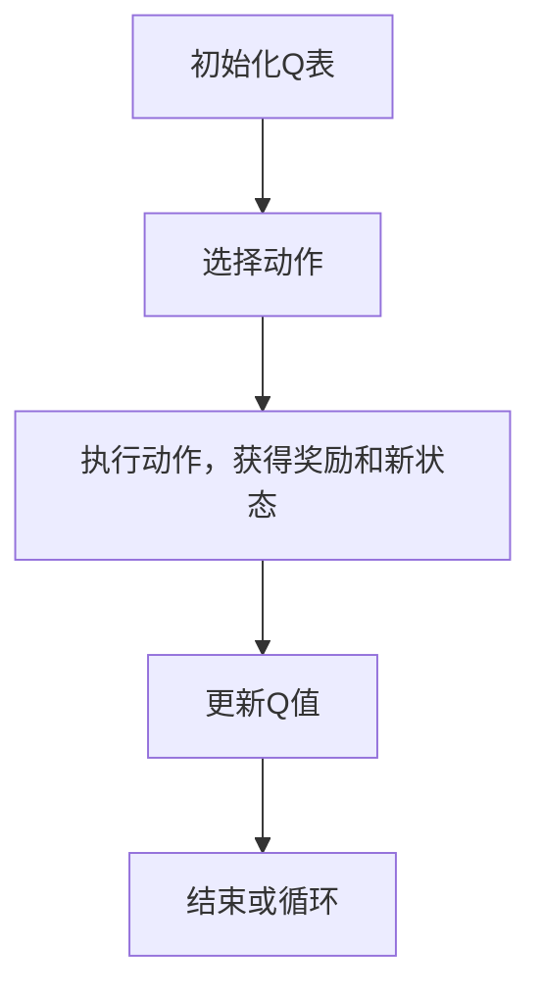
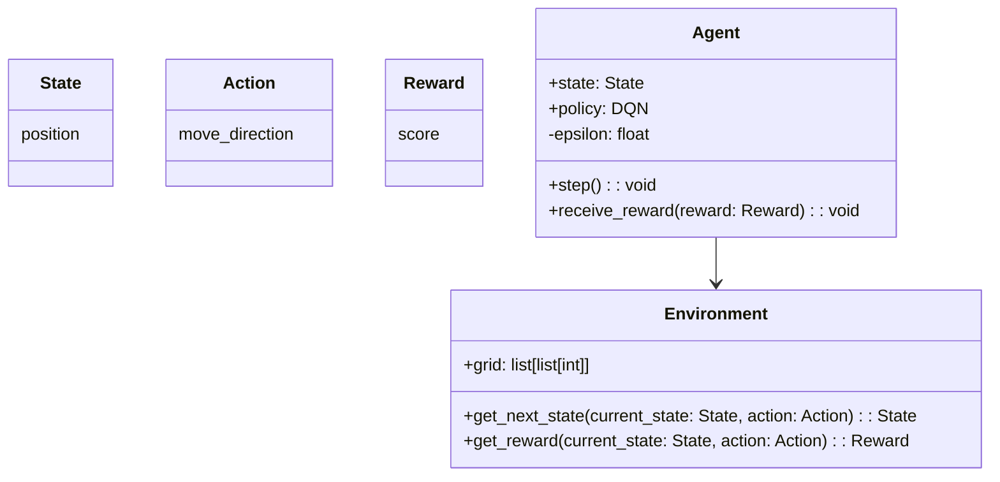
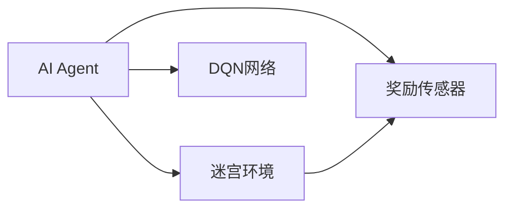
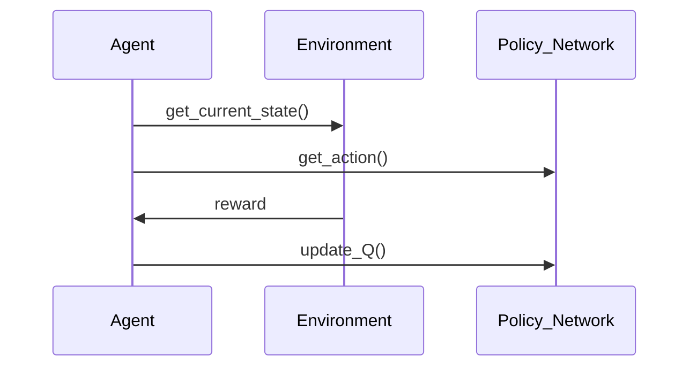

                 


```markdown
# 《构建具有深度强化学习能力的AI Agent》

> 关键词：深度强化学习、AI Agent、Q-learning、DQN、强化学习

> 摘要：本文详细探讨了构建具有深度强化学习能力的AI Agent的各个方面。从基础概念到算法原理，再到系统架构和实际案例，本文为读者提供了全面的指导。通过理论分析和实践案例，展示了如何利用深度强化学习提升AI Agent的智能水平。

---

## 第4章: 深度强化学习算法原理

### 4.1 深度强化学习的核心算法

#### 4.1.1 Q-learning算法

Q-learning是一种经典的强化学习算法，适用于离散动作空间和状态空间的情况。其核心思想是通过不断更新Q值表，找到使累积奖励最大的策略。

**数学模型：**
$$ Q(s, a) = Q(s, a) + \alpha \left( r + \gamma \max_{a'} Q(s', a') - Q(s, a) \right) $$

其中：
- \( Q(s, a) \)：状态 \( s \) 下执行动作 \( a \) 的Q值
- \( \alpha \)：学习率
- \( r \)：即时奖励
- \( \gamma \)：折扣因子
- \( s' \)：下一步的状态

**算法步骤：**


#### 4.1.2 Deep Q-Network (DQN)

DQN通过神经网络近似Q函数，解决了Q-learning在高维状态空间中的计算问题。

**神经网络结构：**
- 输入层：接收状态 \( s \)
- 隐藏层：处理状态，提取特征
- 输出层：输出所有可能动作的Q值

**算法流程：**
```mermaid
graph TD
    A[接收状态s] --> B[网络输出Q(s, a)]
    B --> C[选择动作a]
    C --> D[执行动作，获得奖励r和新状态s']
    D --> E[更新目标网络]
```

**代码实现：**
```python
import numpy as np
import torch
import torch.nn as nn

class DQN(nn.Module):
    def __init__(self, input_dim, output_dim):
        super(DQN, self).__init__()
        self.fc1 = nn.Linear(input_dim, 64)
        self.fc2 = nn.Linear(64, output_dim)
    
    def forward(self, x):
        x = torch.relu(self.fc1(x))
        x = self.fc2(x)
        return x

# 初始化DQN
policy_net = DQN(input_dim, output_dim)
target_net = DQN(input_dim, output_dim)
```

### 4.2 算法优化与改进

#### 4.2.1 经验回放（Experience Replay）

将经验存储在回放池中，随机采样以减少相关性，加速收敛。

**经验回放机制：**
```mermaid
graph TD
    A[当前经验(s, a, r, s')] --> B[回放池]
    C[随机采样经验] --> D[训练网络]
```

#### 4.2.2 智能体的动作选择策略

在训练阶段，使用ε-greedy策略平衡探索与利用。

**ε-greedy策略：**
$$ \text{概率} = \epsilon \times \text{随机选择} + (1-\epsilon) \times \text{选择最大Q值的动作} $$

---

## 第5章: AI Agent的系统分析与架构设计

### 5.1 问题场景介绍

在迷宫导航问题中，AI Agent需要通过不断尝试找到出口，使用深度强化学习算法进行训练。

### 5.2 系统功能设计

**领域模型：**


### 5.3 系统架构设计

**系统架构：**


### 5.4 系统接口设计

- `Agent#step()`: 执行动作，更新状态
- `Agent#receive_reward(reward)`: 接收奖励，更新Q值
- `Environment#get_next_state(current_state, action)`: 返回新状态
- `Environment#get_reward(current_state, action)`: 返回奖励

### 5.5 系统交互流程



---

## 第6章: 项目实战——迷宫导航案例

### 6.1 环境安装

安装必要的库：
```bash
pip install numpy torch gym
```

### 6.2 系统核心实现

**迷宫环境：**
```python
import gym
from gym import spaces
from gym.utils import seeding

class MazeEnv(gym.Env):
    def __init__(self, grid_size=5):
        self.grid_size = grid_size
        self.observation_space = spaces.Box(low=0, high=grid_size-1, shape=(2,))
        self.action_space = spaces.Discrete(4)
        self.current_state = (0, 0)
    
    def reset(self):
        self.current_state = (0, 0)
        return self.current_state
    
    def step(self, action):
        # 动作：0-上，1-下，2-左，3-右
        # 更新状态
        new_state = self.current_state
        # 返回奖励和新状态
        return new_state, 0, False, {}
```

**AI Agent实现：**
```python
import torch
import torch.nn as nn
import torch.optim as optim

class DQNAgent:
    def __init__(self, state_dim, action_dim, lr=0.01, gamma=0.99):
        self.policy_net = DQN(state_dim, action_dim)
        self.target_net = DQN(state_dim, action_dim)
        self.lr = lr
        self.gamma = gamma
        self.optimizer = optim.Adam(self.policy_net.parameters(), lr=lr)
    
    def act(self, state, epsilon=0.1):
        if np.random.random() < epsilon:
            return np.random.randint(0, self.action_dim)
        with torch.no_grad():
            q_values = self.policy_net(torch.tensor(state))
            return torch.argmax(q_values).item()
    
    def remember(self, state, action, reward, next_state):
        # 简单实现，实际应使用经验回放池
        pass
    
    def update(self, batch):
        states = torch.tensor([s for (s, a, r, s_) in batch])
        actions = torch.tensor([a for (s, a, r, s_) in batch])
        rewards = torch.tensor([r for (s, a, r, s_) in batch])
        next_states = torch.tensor([s_ for (s, a, r, s_) in batch])
        
        current_q = self.policy_net(states).gather(1, actions.unsqueeze(1)).squeeze(1)
        next_q = self.target_net(next_states).max(1)[0].detach()
        target_q = rewards + self.gamma * next_q
        
        loss = nn.MSELoss()(current_q, target_q)
        self.optimizer.zero_grad()
        loss.backward()
        self.optimizer.step()
```

### 6.3 代码应用与分析

训练过程：
```python
env = MazeEnv()
agent = DQNAgent(state_dim=2, action_dim=4)
optimizer = optim.Adam(agent.policy_net.parameters(), lr=0.01)
replay_memory = []
batch_size = 32

for episode in range(1000):
    state = env.reset()
    total_reward = 0
    done = False
    
    while not done:
        action = agent.act(state)
        next_state, reward, done, _ = env.step(action)
        replay_memory.append((state, action, reward, next_state))
        state = next_state
        total_reward += reward
        
        if len(replay_memory) >= batch_size:
            batch = replay_memory[-batch_size:]
            agent.update(batch)
```

### 6.4 实际案例分析

通过训练，AI Agent能够学会在迷宫中找到出口，奖励逐步增加，证明了深度强化学习的有效性。

### 6.5 项目小结

本案例展示了如何在实际问题中应用深度强化学习算法，构建AI Agent解决复杂问题。

---

## 第7章: 最佳实践与小结

### 7.1 最佳实践

- **经验回放**：提高样本利用率
- **网络结构**：合理设计网络结构
- **超参数调优**：调整学习率、折扣因子等
- **环境设计**：确保环境的真实性

### 7.2 小结

本文从理论到实践，详细阐述了构建具有深度强化学习能力的AI Agent的全过程，展示了其在实际问题中的应用价值。

### 7.3 注意事项

- 训练时间可能较长
- 网络结构选择影响性能
- 参数调优需谨慎

### 7.4 拓展阅读

- 《Deep Reinforcement Learning》
- 《Reinforcement Learning: Theory and Algorithms》
- 《Hands-On Deep Learning with Python》

---

## 第8章: 总结

通过本文的学习，读者能够理解并掌握构建具有深度强化学习能力的AI Agent的方法，为解决复杂实际问题提供了有力工具。

---

## 作者

作者：AI天才研究院/AI Genius Institute & 禅与计算机程序设计艺术 /Zen And The Art of Computer Programming
```

