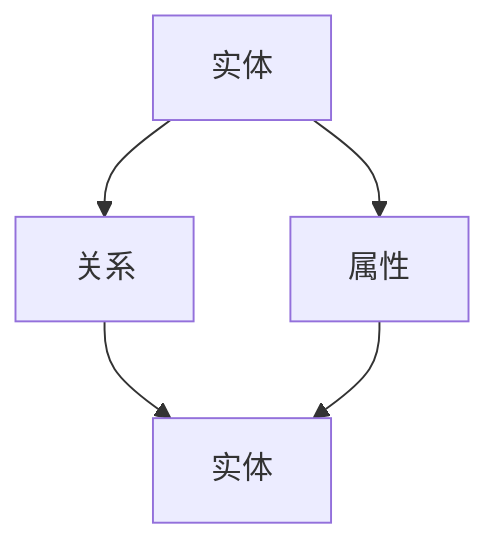
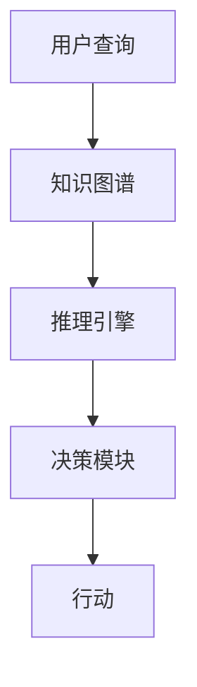
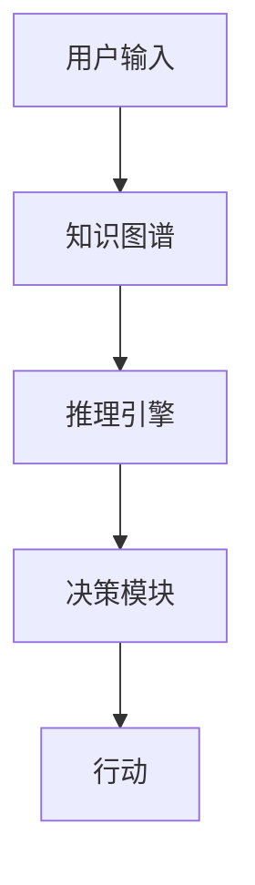
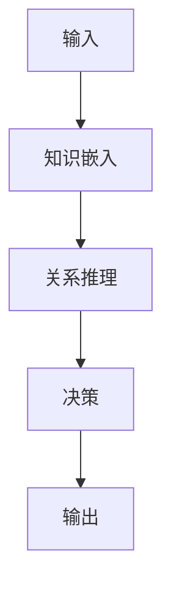
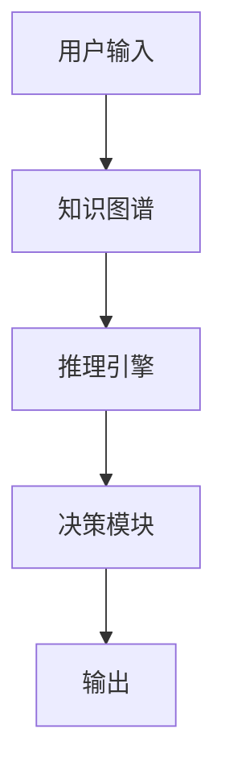

                 


# 构建具有知识图谱的AI Agent系统

> **关键词**：知识图谱、AI Agent、智能系统、自然语言处理、数据挖掘、系统设计

> **摘要**：本文详细探讨了如何构建一个基于知识图谱的AI Agent系统，从背景、核心概念、算法原理到系统架构设计和项目实战，全面分析了知识图谱与AI Agent的结合方式，及其在智能系统中的应用。通过实际案例分析和代码实现，展示了如何利用知识图谱提升AI Agent的智能性和交互能力。

---

# 第1章: 知识图谱与AI Agent系统背景

## 1.1 知识图谱的基本概念

### 1.1.1 知识图谱的定义
知识图谱是一种以图结构形式表示知识的语义网络，由实体（概念）和关系组成，用于描述现实世界中的概念及其相互关系。例如，实体“苹果”可以与“是”、“公司”、“位于”等关系相关联，如“苹果是公司，苹果位于美国”。

### 1.1.2 知识图谱的核心特征
知识图谱具有以下核心特征：
- **结构化**：通过实体和关系构建层次化的结构。
- **语义化**：提供丰富的语义信息，帮助计算机理解数据。
- **动态性**：能够实时更新和扩展。

### 1.1.3 知识图谱的构建过程
知识图谱的构建通常包括以下步骤：
1. **数据收集**：从结构化数据（如数据库）、半结构化数据（如网页）和非结构化数据（如文本）中收集信息。
2. **数据清洗**：去除噪声和冗余数据。
3. **知识抽取**：通过自然语言处理技术提取实体和关系。
4. **知识融合**：将多个来源的数据合并，消除冲突。
5. **知识表示**：将提取的知识表示为图结构。

---

## 1.2 AI Agent的基本概念

### 1.2.1 AI Agent的定义
AI Agent（智能体）是指能够感知环境并采取行动以实现目标的实体。它可以是一个软件程序，也可以是一个物理设备，通过传感器和执行器与环境交互。

### 1.2.2 AI Agent的分类
AI Agent可以分为以下几类：
- **简单反射型**：基于当前感知直接行动。
- **基于模型的反射型**：利用内部模型进行推理和决策。
- **目标驱动型**：根据目标采取行动。
- **实用驱动型**：通过优化目标函数进行决策。

### 1.2.3 AI Agent的核心功能
AI Agent的核心功能包括：
- **感知**：通过传感器或数据源获取环境信息。
- **推理**：利用知识库进行逻辑推理。
- **决策**：基于推理结果做出决策。
- **行动**：通过执行器或输出接口采取行动。

---

## 1.3 知识图谱与AI Agent的结合意义

### 1.3.1 知识图谱为AI Agent提供知识基础
知识图谱为AI Agent提供了丰富的语义信息，使其能够理解上下文并做出更智能的决策。

### 1.3.2 AI Agent为知识图谱提供动态更新能力
AI Agent可以通过与环境交互，实时更新知识图谱，使其保持最新状态。

### 1.3.3 两者的结合对智能系统的影响
通过结合知识图谱和AI Agent，智能系统可以实现以下功能：
- **上下文理解**：基于知识图谱理解用户意图。
- **动态推理**：实时推理和更新知识。
- **智能交互**：通过知识图谱进行更自然的对话。

---

## 1.4 构建知识图谱驱动的AI Agent系统背景

### 1.4.1 当前AI Agent发展的痛点
- **缺乏深度理解**：传统AI Agent通常基于规则或浅层学习，难以理解复杂语义。
- **动态更新能力不足**：无法实时更新知识库，导致决策僵化。

### 1.4.2 知识图谱在AI Agent中的作用
知识图谱为AI Agent提供了丰富的知识表示和推理能力，使其能够理解复杂语义并做出智能决策。

### 1.4.3 知识图谱驱动AI Agent系统的必要性
- **提升智能性**：通过知识图谱实现深度理解。
- **增强动态性**：实时更新知识图谱，保持决策的及时性。

---

# 第2章: 知识图谱与AI Agent的核心概念与联系

## 2.1 知识图谱的核心概念

### 2.1.1 实体与关系
- **实体**：知识图谱中的基本单元，表示具体或抽象事物。
- **关系**：描述实体之间的联系，例如“人名-出生地”关系。

### 2.1.2 知识抽取与表示学习
- **知识抽取**：从文本中提取实体和关系。
- **表示学习**：将知识表示为向量，便于计算。

### 2.1.3 知识图谱的构建流程
1. 数据收集与清洗。
2. 实体识别与关系抽取。
3. 知识融合与冲突消解。
4. 知识表示与存储。

---

## 2.2 AI Agent的核心概念

### 2.2.1 任务驱动
AI Agent通过任务驱动的方式与环境交互，完成目标。

### 2.2.2 知识图谱驱动的AI Agent
知识图谱驱动的AI Agent能够利用知识图谱进行推理和决策，提升智能性。

---

## 2.3 知识图谱与AI Agent的核心概念对比

| 属性 | 知识图谱 | AI Agent |
|------|----------|-----------|
| 核心目标 | 表示知识 | 完成任务 |
| 主要功能 | 存储和检索知识 | 感知、推理、决策、行动 |
| 依赖性 | 数据结构化 | 知识图谱提供支持 |

---

## 2.4 知识图谱与AI Agent的实体关系图



---

## 2.5 知识图谱驱动AI Agent的系统架构



---

## 2.6 知识图谱驱动AI Agent的系统功能

- **知识存储**：存储实体和关系。
- **知识推理**：基于知识图谱进行推理。
- **智能决策**：根据推理结果做出决策。
- **动态更新**：实时更新知识图谱。

---

## 2.7 知识图谱驱动AI Agent的核心算法

### 2.7.1 知识图谱构建算法
- **实体识别**：使用自然语言处理技术提取实体。
- **关系抽取**：基于模式匹配或深度学习抽取关系。

### 2.7.2 AI Agent决策算法
- **基于规则的决策**：根据预定义规则做出决策。
- **基于学习的决策**：利用机器学习模型进行预测。

---

## 2.8 知识图谱驱动AI Agent的流程图



---

## 2.9 知识图谱驱动AI Agent的Python代码示例

```python
from kgtools import KnowledgeGraph

# 创建知识图谱
kg = KnowledgeGraph()

# 添加实体和关系
kg.add_entity("苹果", "公司")
kg.add_relation("苹果", "位于", "美国")

# 查询知识图谱
kg.query("苹果位于哪里？")
```

---

## 2.10 知识图谱驱动AI Agent的数学模型

知识图谱可以表示为一个图结构，其中节点表示实体，边表示关系。推理过程可以通过图遍历来实现，例如：

$$
\text{推理}(A, R, B) = \text{存在}(A, R, B)
$$

其中，$A$、$R$、$B$分别表示实体、关系和目标实体。

---

## 2.11 本章小结

本章详细介绍了知识图谱和AI Agent的核心概念，并探讨了它们的结合方式。通过知识图谱，AI Agent能够实现更智能的决策和交互。

---

# 第3章: 知识图谱驱动AI Agent的算法原理

## 3.1 知识图谱构建算法

### 3.1.1 实体识别算法
- **基于规则的实体识别**：通过正则表达式匹配特定模式。
- **基于机器学习的实体识别**：使用深度学习模型（如LSTM）进行序列标注。

### 3.1.2 关系抽取算法
- **基于模板的关系抽取**：根据预定义模板匹配关系。
- **基于语义角色标注的关系抽取**：通过分析句子结构提取关系。

---

## 3.2 知识图谱表示学习算法

### 3.2.1 知识嵌入
- **Word2Vec**：将实体和关系表示为向量。
- **KG2Vec**：专门用于知识图谱的表示学习。

### 3.2.2 知识图谱表示学习的数学模型
$$
\text{score}(e_i, r_j, e_k) = \text{similarity}(e_i, r_j, e_k)
$$

其中，$e_i$、$r_j$、$e_k$分别表示头实体、关系和尾实体的向量表示。

---

## 3.3 AI Agent决策算法

### 3.3.1 基于规则的决策算法
- **决策树**：通过预定义规则进行决策。
- **基于逻辑推理的决策**：通过知识图谱进行逻辑推理。

### 3.3.2 基于学习的决策算法
- **基于强化学习的决策**：通过与环境交互学习策略。
- **基于监督学习的决策**：基于标注数据进行分类。

---

## 3.4 知识图谱驱动AI Agent的算法流程图



---

## 3.5 知识图谱驱动AI Agent的Python代码示例

```python
from kgtools import KnowledgeGraph

# 创建知识图谱
kg = KnowledgeGraph()

# 添加知识
kg.add_entity("苹果", "公司")
kg.add_relation("苹果", "位于", "美国")

# 查询知识图谱
kg.query("苹果位于哪里？")
```

---

## 3.6 知识图谱驱动AI Agent的数学模型

知识图谱的表示学习可以采用以下数学模型：

$$
\text{score}(e_i, r_j, e_k) = \text{similarity}(e_i, r_j, e_k)
$$

其中，$e_i$、$r_j$、$e_k$分别表示头实体、关系和尾实体的向量表示。

---

## 3.7 本章小结

本章详细探讨了知识图谱驱动AI Agent的算法原理，包括知识图谱构建算法和AI Agent决策算法。通过这些算法，AI Agent能够实现智能决策和推理。

---

# 第4章: 知识图谱驱动AI Agent的系统分析与架构设计

## 4.1 系统问题场景介绍

系统需要实现一个基于知识图谱的AI Agent，能够通过自然语言处理技术与用户交互，并利用知识图谱进行推理和决策。

---

## 4.2 系统功能设计

### 4.2.1 知识图谱管理模块
- **知识存储**：存储实体和关系。
- **知识更新**：实时更新知识图谱。

### 4.2.2 推理引擎模块
- **关系推理**：基于知识图谱进行推理。
- **逻辑推理**：通过逻辑推理得出结论。

### 4.2.3 决策模块
- **基于知识的决策**：根据推理结果做出决策。
- **动态决策**：实时更新决策结果。

---

## 4.3 系统架构设计

### 4.3.1 系统架构图



### 4.3.2 系统接口设计
- **输入接口**：接收用户输入。
- **输出接口**：输出推理结果。
- **知识图谱接口**：与知识图谱进行交互。

---

## 4.4 系统交互流程

### 4.4.1 交互流程图


---

## 4.5 系统功能实现

### 4.5.1 知识图谱管理模块实现
```python
from kgtools import KnowledgeGraph

# 初始化知识图谱
kg = KnowledgeGraph()

# 添加知识
kg.add_entity("苹果", "公司")
kg.add_relation("苹果", "位于", "美国")
```

### 4.5.2 推理引擎模块实现
```python
def infer(head, relation, tail):
    return kg.query(f"{head} {relation} {tail}")
```

### 4.5.3 决策模块实现
```python
def decide(question):
    return kg.query(question)
```

---

## 4.6 本章小结

本章详细分析了知识图谱驱动AI Agent系统的架构设计和功能实现，通过模块化设计，确保系统具有良好的扩展性和可维护性。

---

# 第5章: 知识图谱驱动AI Agent的项目实战

## 5.1 项目背景

本项目旨在构建一个基于知识图谱的AI Agent，能够通过自然语言处理技术与用户交互，并利用知识图谱进行推理和决策。

---

## 5.2 项目环境安装

### 5.2.1 知识图谱库安装
```bash
pip install kgtools
```

### 5.2.2 AI Agent框架安装
```bash
pip install agentx
```

---

## 5.3 项目核心代码实现

### 5.3.1 知识图谱管理模块
```python
from kgtools import KnowledgeGraph

# 初始化知识图谱
kg = KnowledgeGraph()

# 添加知识
kg.add_entity("苹果", "公司")
kg.add_relation("苹果", "位于", "美国")
```

### 5.3.2 推理引擎模块
```python
def infer(head, relation, tail):
    return kg.query(f"{head} {relation} {tail}")
```

### 5.3.3 决策模块实现
```python
def decide(question):
    return kg.query(question)
```

---

## 5.4 项目案例分析与详细解读

### 5.4.1 案例分析
假设用户输入“苹果位于哪里？”，系统通过知识图谱推理得出“苹果位于美国”。

### 5.4.2 实现解读
- **知识图谱查询**：通过知识图谱查询实体之间的关系。
- **推理引擎**：基于知识图谱进行推理。
- **决策模块**：根据推理结果输出答案。

---

## 5.5 项目小结

本章通过项目实战，详细展示了如何构建一个基于知识图谱的AI Agent系统，从环境安装到代码实现，再到案例分析，帮助读者掌握实际操作技能。

---

# 第6章: 知识图谱驱动AI Agent系统的最佳实践与注意事项

## 6.1 最佳实践

### 6.1.1 数据质量
- 确保知识图谱的数据质量，减少噪声。
- 定期更新知识图谱，保持信息的准确性。

### 6.1.2 模型优化
- 使用更先进的深度学习模型提升推理准确性。
- 优化知识嵌入算法，提高表示效果。

### 6.1.3 系统设计
- 模块化设计，便于维护和扩展。
- 采用分布式架构，提升系统性能。

---

## 6.2 注意事项

### 6.2.1 数据隐私
- 注意保护用户数据隐私，遵守相关法律法规。

### 6.2.2 系统安全
- 加强系统安全性，防止恶意攻击。

### 6.2.3 性能优化
- 优化系统性能，提升用户体验。

---

## 6.3 拓展阅读

- **知识图谱相关书籍**：《知识图谱：概念、方法与应用》
- **AI Agent相关书籍**：《人工 intelligence: 一种现代的方法》
- **知识图谱构建工具**：学习使用Ubergraph、Wikidata等知识图谱构建工具。

---

## 6.4 本章小结

本章总结了知识图谱驱动AI Agent系统的最佳实践，并提出了注意事项和拓展阅读资料，帮助读者进一步深入学习和实践。

---

# 作者

作者：AI天才研究院/AI Genius Institute & 禅与计算机程序设计艺术 /Zen And The Art of Computer Programming

