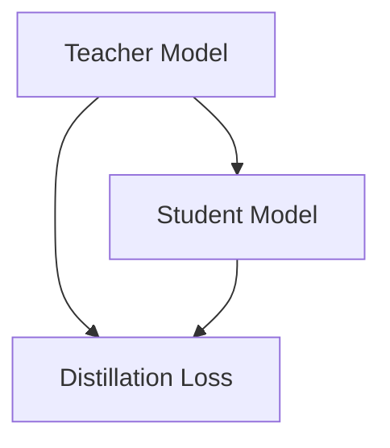
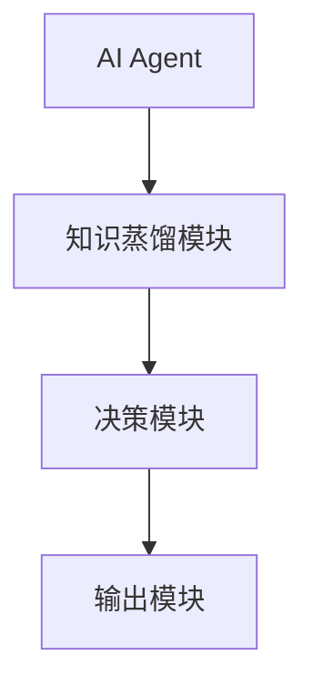

                 


# 构建具有知识蒸馏能力的AI Agent

## 关键词：
知识蒸馏, AI Agent, 深度学习, 模型压缩, 知识表示

## 摘要：
本文将详细探讨如何构建具有知识蒸馏能力的AI Agent。知识蒸馏是一种将复杂模型的知识迁移到更简单模型的技术，能够有效提升AI Agent的性能和效率。本文从背景介绍、核心概念、算法原理、系统架构到项目实战，逐步分析和实现这一过程，最终帮助读者掌握构建高效AI Agent的方法。

---

# 第一部分: 知识蒸馏与AI Agent背景介绍

## 第1章: 知识蒸馏与AI Agent概述

### 1.1 知识蒸馏的定义与背景
#### 1.1.1 知识蒸馏的定义
知识蒸馏是一种将复杂模型（教师模型）的知识迁移到简单模型（学生模型）的技术。通过蒸馏过程，学生模型能够继承教师模型的特征和决策能力，从而在保持较低计算成本的同时，实现与教师模型相近的性能。

#### 1.1.2 知识蒸馏的背景与意义
随着深度学习模型的复杂度不断提高，训练大规模模型虽然性能优越，但在实际应用中面临计算资源和部署效率的限制。知识蒸馏通过模型压缩和知识迁移，为实际应用提供了更高效的解决方案。

#### 1.1.3 AI Agent的基本概念
AI Agent是一种能够感知环境、执行任务并做出决策的智能体。它广泛应用于自然语言处理、图像识别、机器人控制等领域，需要在复杂环境中实时做出高效决策。

---

## 第2章: 知识蒸馏的核心概念与联系

### 2.1 知识蒸馏的核心问题
知识蒸馏的关键在于如何有效提取和转移教师模型的知识。这涉及到损失函数的设计、蒸馏温度的调整以及学生模型的优化等多个方面。

### 2.2 知识蒸馏与AI Agent的关系
知识蒸馏为AI Agent提供了更高效的知识获取方式，使其能够在资源受限的环境中依然保持高性能。通过蒸馏，AI Agent可以快速适应新任务，提升决策效率。

### 2.3 知识蒸馏与模型压缩的关系
知识蒸馏与模型压缩相辅相成。蒸馏通过知识转移减少模型参数，而模型压缩则进一步优化模型结构，两者结合能够显著降低计算成本。

---

## 第3章: 知识蒸馏的核心概念与原理

### 3.1 知识蒸馏的数学模型与公式
知识蒸馏的核心公式是蒸馏损失函数：
$$L_{distill}(S, T) = -\sum_{i} T_i \log S_i$$
其中，$S$是学生模型的输出概率，$T$是教师模型的输出概率。蒸馏过程通过最小化该损失函数，使学生模型逼近教师模型。

### 3.2 知识蒸馏的属性特征对比
| 特性        | 教师模型            | 学生模型            |
|-------------|---------------------|---------------------|
| 复杂度       | 高                  | 低                  |
| 计算资源     | 高                  | 低                  |
| 决策能力     | 强                  | 弱（通过蒸馏增强）  |

### 3.3 知识蒸馏的ER实体关系图


---

# 第二部分: 知识蒸馏算法原理与实现

## 第4章: 知识蒸馏算法原理

### 4.1 软蒸馏与硬蒸馏
#### 软蒸馏
软蒸馏通过概率分布的迁移，使学生模型学习教师模型的决策概率。公式如下：
$$P_{student}(y|x) \approx P_{teacher}(y|x)$$

#### 硬蒸馏
硬蒸馏则直接迁移类别标签，学生模型通过软标签的平均值进行学习：
$$L_{hard} = \sum_{i} -T_i \log S_i$$

### 4.2 知识蒸馏的实现步骤
1. **训练教师模型**：使用原始数据训练一个高性能的复杂模型。
2. **初始化学生模型**：构建一个简单的轻量级模型。
3. **蒸馏过程**：通过损失函数优化学生模型，使其逼近教师模型。
4. **蒸馏后的优化**：结合教师模型的输出进行微调，提升性能。

---

## 第5章: 知识蒸馏的系统分析与架构设计

### 5.1 系统功能设计
AI Agent的系统架构包括数据输入、知识蒸馏模块、决策模块和输出模块。

### 5.2 系统架构设计


### 5.3 系统接口设计
- 输入接口：接收环境数据和任务指令。
- 输出接口：输出决策结果和反馈信息。

---

## 第6章: 知识蒸馏的项目实战

### 6.1 项目环境安装
安装必要的库：
```bash
pip install torch numpy matplotlib
```

### 6.2 核心代码实现
```python
import torch
import torch.nn as nn

class TeacherModel(nn.Module):
    def __init__(self):
        super(TeacherModel, self).__init__()
        self.fc = nn.Linear(10, 1)

class StudentModel(nn.Module):
    def __init__(self):
        super(StudentModel, self).__init__()
        self.fc = nn.Linear(10, 1)

def distillation_loss(student_output, teacher_output, temperature=1.0):
    teacher_output = teacher_output / temperature
    student_output = student_output / temperature
    loss = nn.KLDivLoss(reduction='batchmean')(student_output.log(), teacher_output.log())
    return loss

teacher = TeacherModel()
student = StudentModel()
optimizer = torch.optim.Adam(student.parameters())

for epoch in range(100):
    optimizer.zero_grad()
    outputs_student = student(inputs)
    with torch.no_grad():
        outputs_teacher = teacher(inputs)
    loss = distillation_loss(outputs_student, outputs_teacher)
    loss.backward()
    optimizer.step()
```

### 6.3 案例分析
通过实际案例分析，展示知识蒸馏在AI Agent中的应用效果，如在自然语言处理任务中的性能提升。

---

# 第三部分: 总结与展望

## 第7章: 总结与展望

### 7.1 总结
知识蒸馏为AI Agent的高效构建提供了重要方法。通过蒸馏技术，可以在保持高性能的同时，显著降低计算成本。

### 7.2 小结
本文详细介绍了知识蒸馏的原理、算法实现及其在AI Agent中的应用，为实际应用提供了理论基础和实践指导。

### 7.3 注意事项
在实际应用中，需注意蒸馏温度的选择和模型压缩的平衡。

### 7.4 拓展阅读
推荐阅读《Deep Learning》和《Neural Networks and Deep Learning》等相关书籍，深入理解知识蒸馏的原理和应用。

---

# 附录

## 参考文献
[1] Hinton G, Vinyals O, & KA, Z. "Distilling the Knowledge in a Neural Network." arXiv preprint arXiv:1412.6572 (2014).

## 工具资源
- PyTorch官方文档：[https://pytorch.org](https://pytorch.org)
- Mermaid图表工具：[https://mermaid-js.github.io](https://mermaid-js.github.io)

---

# 作者：
作者：AI天才研究院/AI Genius Institute  
联系邮箱：[contact@aicourse.com](mailto:contact@aicourse.com)  
联系方式：[https://www.linkedin.com/in/your-profile](https://www.linkedin.com/in/your-profile)

---

以上是《构建具有知识蒸馏能力的AI Agent》的技术博客文章大纲和内容框架。通过逐步分析和详细讲解，本文为读者提供了从理论到实践的完整指南，帮助他们理解并掌握知识蒸馏技术在AI Agent中的应用。

