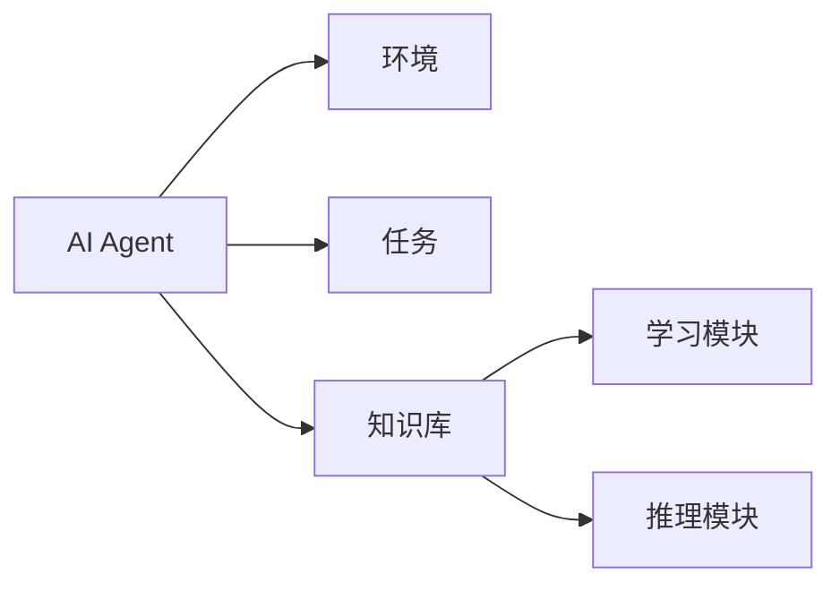
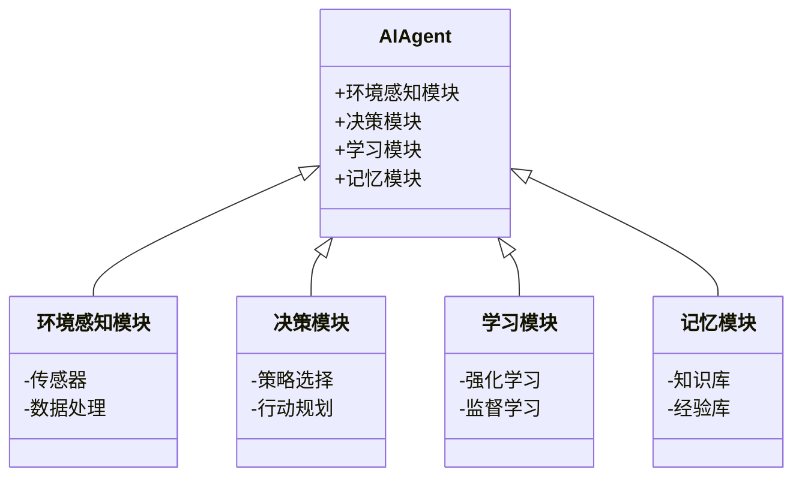

                 


# 构建具有终身学习能力的AI Agent

> 关键词：AI Agent, 终身学习, 强化学习, 知识蒸馏, 迁移学习, 系统架构

> 摘要：本文将详细探讨如何构建一个具有终身学习能力的AI Agent，从背景介绍、核心概念、算法原理到系统架构和项目实战，逐步解析其构建过程。通过结合强化学习、监督学习、知识蒸馏和迁移学习等技术，我们能够设计出一种能够持续优化自身能力的AI系统。

---

## 第一部分: 构建具有终身学习能力的AI Agent背景介绍

### 第1章: AI Agent的基本概念与问题背景

#### 1.1 AI Agent的定义与核心要素
AI Agent（智能体）是指在环境中能够感知并自主行动以实现目标的实体。AI Agent可以是软件程序、机器人或其他智能系统。其核心要素包括：
- **感知能力**：通过传感器或其他输入方式获取环境信息。
- **决策能力**：基于感知信息做出决策并采取行动。
- **学习能力**：通过与环境的交互不断优化自身的知识库和行为策略。

**终身学习能力**是AI Agent的一项高级能力，意味着AI Agent能够在动态环境中不断学习新知识、优化现有模型，并适应新的任务要求。

#### 1.2 终身学习能力的必要性
传统AI系统在面对动态环境时往往表现出以下问题：
- **静态知识库**：无法适应新任务或环境变化。
- **单一任务优化**：在单一任务上表现优秀，但无法扩展到新任务。
- **缺乏自适应性**：在环境或任务变化时，需要人工干预或重新训练。

终身学习能力的引入，使得AI Agent能够：
- **持续优化**：通过与环境的交互，不断更新知识库和行为策略。
- **多任务处理**：能够在多个任务之间切换，并根据新任务的需求调整自身能力。
- **自我改进**：无需人工干预，自动发现并纠正自身的不足。

#### 1.3 问题背景与目标
在动态复杂的环境中，AI Agent需要具备以下能力：
- **环境感知**：能够感知环境的状态和变化。
- **任务理解**：理解任务目标并制定相应的策略。
- **知识更新**：能够根据新信息更新知识库和行为模型。

本文的目标是设计一种AI Agent，使其具备终身学习能力，能够在动态环境中持续优化自身能力，适应新的任务要求。

---

### 第2章: 终身学习能力的核心概念与联系

#### 2.1 终身学习能力的核心原理
终身学习能力的核心在于AI Agent能够：
- **自适应学习**：通过强化学习、监督学习等多种学习方式，持续优化自身的模型。
- **知识表示与更新**：采用灵活的知识表示方法，能够快速更新和扩展知识库。
- **强化学习与监督学习的结合**：通过强化学习获得即时反馈，结合监督学习的长期目标优化。

#### 2.2 核心概念对比与联系
| **概念**         | **传统AI**                         | **具有终身学习能力的AI Agent**
|-------------------|------------------------------------|------------------------------------|
| 知识更新          | 静态知识库，无法更新                | 动态知识库，持续更新                |
| 任务适应性        | 仅适应单一任务                    | 能够适应多任务和新任务              |
| 自我改进能力      | 无法自我改进                      | 具备自我改进和优化能力              |

从上述对比可以看出，终身学习能力使得AI Agent更加灵活和适应性强。

#### 2.3 实体关系图与系统架构
以下是AI Agent与环境的实体关系图：


---

## 第二部分: 终身学习能力的算法原理

### 第3章: 终身学习算法的数学模型与公式

#### 3.1 基于强化学习的终身学习模型
##### 3.1.1 强化学习的基本公式
在强化学习中，智能体通过与环境交互获得奖励，从而优化其策略。即时奖励和状态-动作值函数的公式如下：
$$ R = r_t \text{ 表示即时奖励} $$
$$ Q(s,a) = \max_a Q(s,a) \text{ 表示状态-动作值函数} $$

##### 3.1.2 终身学习的数学模型
结合强化学习和监督学习的终身学习模型如下：
$$ \theta_{t+1} = \theta_t + \alpha (r_t - Q(s_t, a_t; \theta_t)) \nabla Q(s_t, a_t; \theta_t) $$

---

## 第三部分: 系统分析与架构设计方案

### 第4章: 问题场景介绍与系统功能设计

#### 4.1 问题场景介绍
以一个动态游戏环境为例，AI Agent需要在不断变化的规则下完成任务。传统AI Agent在规则变化后无法适应，而具有终身学习能力的AI Agent能够通过与环境的交互，快速更新知识库和行为策略，以适应新的规则。

#### 4.2 系统功能设计
以下是系统功能设计的领域模型：


#### 4.3 系统架构设计
以下是系统架构设计的架构图：


---

## 第四部分: 项目实战

### 第5章: 环境配置与系统核心实现

#### 5.1 环境配置
以一个简单的迷宫导航任务为例，配置如下：
- **环境**：迷宫布局动态变化。
- **任务**：从起点到达终点。

#### 5.2 核心代码实现
以下是Python实现的代码示例：
```python
class AI-Agent:
    def __init__(self):
        self.sensor = Sensor()
        self.decision = Decision()
        self学习模块 = LearningModule()
        self.memory = Memory()

    def感知环境(self):
        return self.sensor.get_data()

    def做出决策(self, 状态):
        return self.decision.choose_action(状态)

    def学习(self, 状态, 行动, 奖励):
        self.学习模块.update_model(状态, 行动, 奖励)

    def存储经验(self, 经验):
        self.memory.store_experience(经验)
```

---

## 第五部分: 总结与展望

### 第6章: 总结与最佳实践

#### 6.1 总结
本文详细探讨了构建具有终身学习能力的AI Agent的过程，从背景介绍、核心概念、算法原理到系统架构和项目实战，逐步解析了其构建过程。

#### 6.2 最佳实践 tips
- **持续优化**：定期更新模型和知识库，确保AI Agent的适应性。
- **多任务训练**：通过多任务训练提高AI Agent的泛化能力。
- **实时监控**：实时监控AI Agent的表现，及时发现并解决问题。

#### 6.3 未来展望
- **更高效的学习算法**：研究更高效的学习算法，提高学习速度和效果。
- **更强大的知识表示**：探索更强大的知识表示方法，提升知识库的灵活性和扩展性。

---

作者：AI天才研究院/AI Genius Institute & 禅与计算机程序设计艺术 /Zen And The Art of Computer Programming

