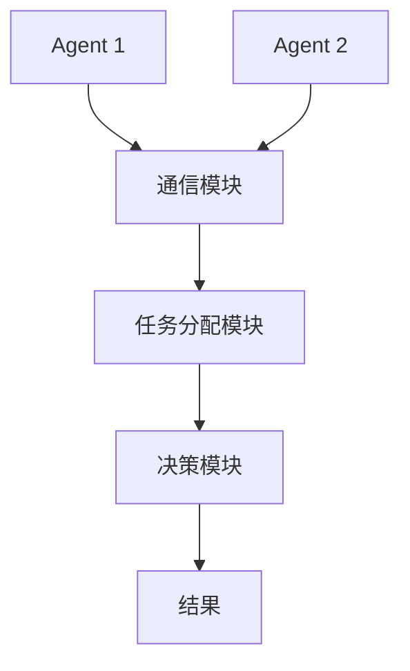

                 


---

# 《构建具有群体智能的多Agent协作系统》

> **关键词**：多Agent系统、群体智能、分布式计算、一致性算法、分布式优化、任务分配

> **摘要**：  
在现代分布式系统中，多Agent协作系统和群体智能技术的应用越来越广泛。本文从多Agent协作系统的背景出发，详细探讨了其核心概念、算法原理、系统架构设计以及实际应用。通过分析分布式计算中的典型算法，如一致性算法和分布式优化算法，本文展示了如何在多Agent系统中实现高效的协作与智能决策。此外，结合实际项目案例，本文深入讲解了系统设计的关键点和最佳实践，为读者提供了一套完整的构建多Agent协作系统的思路和方法。

---

# 第1章: 多Agent协作系统与群体智能概述

## 1.1 多Agent系统的基本概念

### 1.1.1 Agent的定义与特征

**Agent**（智能体）是指能够感知环境并采取行动以实现目标的实体。Agent可以是软件程序、机器人或其他智能设备。其主要特征包括：

- **自主性**：Agent能够自主决策，无需外部干预。
- **反应性**：Agent能够根据环境反馈调整行为。
- **协作性**：Agent能够与其他Agent或人类进行协作。

### 1.1.2 多Agent系统的特点

多Agent系统（Multi-Agent System, MAS）是由多个智能体组成的系统，其特点包括：

- **分布式计算**：多个Agent分布在不同的节点上，协同完成任务。
- **智能协作**：Agent之间通过通信和协调完成复杂的任务。
- **自适应性**：系统能够根据环境变化动态调整协作策略。

### 1.1.3 群体智能的定义与特点

**群体智能**（Swarm Intelligence）是指通过多个简单个体的协作，实现复杂的智能行为。其特点包括：

- **去中心化**：没有单一的控制中心，个体之间通过局部交互实现全局目标。
- **涌现性**：群体智能的结果是单个个体无法实现的，是多个个体协作的“涌现”现象。
- **鲁棒性**：群体智能系统具有较强的容错性和适应性。

## 1.2 多Agent协作系统的应用场景

### 1.2.1 分布式计算中的多Agent协作

在分布式系统中，多Agent协作用于任务分配、负载均衡和资源管理。例如，在云计算环境中，多个Agent可以协作完成任务调度和资源分配。

### 1.2.2 群体智能在机器人领域的应用

在机器人领域，群体智能用于多机器人协作，例如无人机编队、机器人导航和群体决策。

### 1.2.3 多Agent系统在分布式系统中的应用

多Agent系统在分布式系统中的应用广泛，包括分布式数据库、分布式计算和分布式网络管理。

## 1.3 多Agent协作系统的挑战与解决方案

### 1.3.1 群体智能中的通信与协调问题

通信与协调是多Agent协作的核心问题。为了解决这一问题，可以采用分布式通信协议和协调算法，如一致性算法和分布式优化算法。

### 1.3.2 多Agent系统中的任务分配与协作

任务分配与协作是多Agent系统的核心问题。为了解决这一问题，可以采用任务分配算法和协作机制，如蚁群算法和粒子群优化算法。

### 1.3.3 群体智能中的决策与优化

决策与优化是群体智能的关键问题。为了解决这一问题，可以采用分布式决策算法和优化策略，如分布式强化学习和遗传算法。

## 1.4 本章小结

本章介绍了多Agent协作系统和群体智能的基本概念、特点及其应用场景。同时，分析了多Agent协作系统面临的主要挑战，并提出了相应的解决方案。这些内容为后续章节的算法实现和系统设计奠定了基础。

---

# 第2章: 多Agent协作系统的数学模型与算法原理

## 2.1 多Agent协作系统的数学模型

### 2.1.1 群体智能的数学建模

群体智能的数学建模需要考虑多个个体的行为和交互。例如，在分布式一致性问题中，每个Agent需要通过通信达到一致状态。

$$ \text{一致性问题：每个Agent的状态} s_i \rightarrow \text{全局一致状态} s $$

### 2.1.2 多Agent协作的数学表达

多Agent协作的数学表达可以表示为：

$$ \text{任务分配：} \forall i, s_i \rightarrow \text{分配到} t_j $$

## 2.2 群体智能中的典型算法

### 2.2.1 分布式计算中的共识算法

**一致性算法**（Consensus Algorithm）是多Agent协作中的核心算法。一致性算法确保所有Agent达成一致状态。

### 2.2.2 群体智能中的分布式优化算法

**分布式优化算法**（Distributed Optimization Algorithm）用于多Agent协作中的优化问题。例如，分布式凸优化问题可以通过交替方向乘子法（ADMM）解决。

## 2.3 群体智能中的数学模型与公式

### 2.3.1 群体智能中的状态表示

$$ \text{Agent的状态：} s_i \in \mathbb{R}^n $$

### 2.3.2 多Agent协作中的任务分配模型

$$ \text{任务分配：} \forall i, s_i \rightarrow t_j $$

### 2.3.3 群体智能中的决策优化模型

$$ \text{优化目标：} \min_{x_i} f(x_i) $$

## 2.4 本章小结

本章详细介绍了多Agent协作系统的数学模型与典型算法。通过一致性算法和分布式优化算法的分析，为后续章节的实现提供了理论基础。

---

# 第3章: 多Agent协作系统的算法实现

## 3.1 分布式计算中的共识算法实现

### 3.1.1 分布式一致性算法的数学模型

一致性算法的数学模型可以表示为：

$$ \text{初始状态：} s_1, s_2, \ldots, s_n $$

$$ \text{一致状态：} s $$

### 3.1.2 分布式一致性算法的实现步骤

1. 初始化所有Agent的状态。
2. 通过通信协议交换状态信息。
3. 使用一致性算法（如Paxos或Raft）达成一致状态。

### 3.1.3 一致性算法的Python代码示例

```python
# Paxos算法示例
class Paxos:
    def __init__(self, proposers):
        self.proposers = proposers
        self.acceptors = acceptors
        self.leader = None

    def propose(self, value):
        # 提案者向所有接受者发送提案
        for acceptor in self.acceptors:
            acceptor.receiveProposal(value)
        
        # 等待接受者确认
        for acceptor in self.acceptors:
            if acceptor.confirmed:
                self.leader = acceptor

        return self.leader.state
```

### 3.1.4 一致性算法的数学公式

$$ \text{一致性算法的最终状态：} s = \max(s_1, s_2, \ldots, s_n) $$

## 3.2 群体智能中的分布式优化算法实现

### 3.2.1 分布式优化算法的数学模型

$$ \text{优化目标：} \min_{x_i} f(x_i) $$

### 3.2.2 分布式优化算法的实现步骤

1. 初始化所有Agent的优化参数。
2. 通过通信协议交换优化参数。
3. 使用分布式优化算法（如ADMM）进行优化。

### 3.2.3 分布式优化算法的Python代码示例

```python
# ADMM算法示例
import numpy as np

class Agent:
    def __init__(self, data):
        self.data = data
        self.x = np.zeros(data.shape[1])
        self.z = np.zeros(data.shape[1])
        self.y = np.zeros(data.shape[1])

    def update(self, z, y):
        # 更新x
        self.x = np.linalg.inv(self.data.T @ self.data) @ (self.data.T @ (z + y))
        # 更新z
        self.z = self.x + self.y
        return self.z
```

## 3.3 群体智能中的任务分配算法实现

### 3.3.1 任务分配算法的数学模型

$$ \text{任务分配：} \forall i, s_i \rightarrow t_j $$

### 3.3.2 任务分配算法的实现步骤

1. 初始化所有Agent的任务状态。
2. 通过通信协议交换任务信息。
3. 使用任务分配算法（如蚁群算法）分配任务。

### 3.3.3 任务分配算法的Python代码示例

```python
# 蚁群算法示例
import random

class Ant Colony:
    def __init__(self, graph):
        self.graph = graph
        self.n_ants = 10
        self.pheromone_evaporation = 0.5

    def update_pheromone(self, path):
        for i in range(len(path)-1):
            self.graph[path[i]][path[i+1]] *= self.pheromone_evaporation

    def choose_next_node(self, current_node):
        neighbors = self.graph[current_node]
        probabilities = [p / sum(neighbors.values()) for p in neighbors.values()]
        return random.choices([k for k, v in neighbors.items()], weights=probabilities, k=1)[0]

    def run(self):
        for _ in range(100):
            for ant in range(self.n_ants):
                current = 0
                path = [current]
                for _ in range(len(self.graph)-1):
                    next_node = self.choose_next_node(current)
                    path.append(next_node)
                    current = next_node
                self.update_pheromone(path)
```

## 3.4 本章小结

本章详细讲解了多Agent协作系统中一致性算法、分布式优化算法和任务分配算法的实现步骤，并通过Python代码示例展示了这些算法的具体实现。这些算法为后续章节的系统设计提供了基础。

---

# 第4章: 多Agent协作系统的系统架构设计

## 4.1 系统功能设计

### 4.1.1 系统功能模块

- **通信模块**：负责Agent之间的通信。
- **任务分配模块**：负责任务的分配与协调。
- **决策模块**：负责智能决策和优化。

### 4.1.2 系统功能流程

1. 初始化系统。
2. Agent通过通信模块进行交互。
3. 任务分配模块分配任务。
4. 决策模块进行优化和决策。
5. 返回最终结果。

## 4.2 系统架构设计

### 4.2.1 系统架构图



### 4.2.2 系统接口设计

- **通信接口**：提供Agent之间的通信接口。
- **任务分配接口**：提供任务分配的接口。
- **决策接口**：提供决策优化的接口。

### 4.2.3 系统交互流程

1. Agent通过通信模块发送请求。
2. 任务分配模块分配任务。
3. 决策模块进行优化。
4. 返回结果。

## 4.3 本章小结

本章详细设计了多Agent协作系统的架构，并通过mermaid图展示了系统的交互流程。这些设计为后续章节的项目实战提供了指导。

---

# 第5章: 多Agent协作系统的项目实战

## 5.1 项目背景与需求分析

### 5.1.1 项目背景

本项目旨在构建一个基于群体智能的多Agent协作系统，实现分布式任务分配和优化。

### 5.1.2 项目需求

- 实现多Agent协作。
- 实现分布式任务分配。
- 实现智能决策和优化。

## 5.2 项目环境配置

### 5.2.1 系统环境

- 操作系统：Linux
- 开发工具：Python 3.8+
- 依赖库：numpy, matplotlib

## 5.3 项目核心代码实现

### 5.3.1 通信模块实现

```python
import socket

class Communicator:
    def __init__(self, host='127.0.0.1', port=5000):
        self.host = host
        self.port = port
        self.socket = socket.socket(socket.AF_INET, socket.SOCK_STREAM)

    def connect(self):
        self.socket.connect((self.host, self.port))

    def send(self, data):
        self.socket.send(data)

    def receive(self):
        return self.socket.recv(1024)
```

### 5.3.2 任务分配模块实现

```python
class TaskAllocator:
    def __init__(self, agents):
        self.agents = agents

    def allocate_task(self, task):
        # 分配任务给所有Agent
        for agent in self.agents:
            agent.receive_task(task)
```

### 5.3.3 决策模块实现

```python
class DecisionMaker:
    def __init__(self, agents):
        self.agents = agents

    def make_decision(self, tasks):
        # 进行决策和优化
        for agent in self.agents:
            agent.optimize(tasks)
```

## 5.4 项目功能实现与分析

### 5.4.1 功能实现

1. 初始化系统。
2. Agent通过通信模块交互。
3. 任务分配模块分配任务。
4. 决策模块进行优化。
5. 返回结果。

### 5.4.2 功能分析

通过上述实现，系统能够完成多Agent协作、任务分配和智能决策，实现高效的协作与优化。

## 5.5 项目小结

本章通过具体的项目案例，详细讲解了多Agent协作系统的实现过程。通过实际代码的展示，读者可以更好地理解系统的构建过程。

---

# 第6章: 多Agent协作系统的最佳实践与注意事项

## 6.1 最佳实践

### 6.1.1 通信模块的优化

- 使用高效的通信协议。
- 优化通信频率。

### 6.1.2 任务分配的优化

- 使用高效的任务分配算法。
- 考虑任务的优先级。

### 6.1.3 决策模块的优化

- 使用高效的优化算法。
- 考虑系统的实时性。

## 6.2 注意事项

### 6.2.1 系统的可扩展性

- 确保系统的可扩展性。
- 考虑系统的可维护性。

### 6.2.2 系统的安全性

- 确保系统的安全性。
- 考虑系统的容错性。

## 6.3 项目小结

本章总结了多Agent协作系统的最佳实践和注意事项，为读者提供了宝贵的指导和建议。

---

# 第7章: 总结与展望

## 7.1 本章总结

本文详细探讨了多Agent协作系统与群体智能的构建过程，从基本概念到算法实现，再到系统架构设计和项目实战，为读者提供了一套完整的构建思路。

## 7.2 未来展望

随着人工智能和分布式计算技术的发展，多Agent协作系统和群体智能将有更广泛的应用场景。未来的研究方向包括更高效的算法设计、更智能的决策机制以及更强大的系统架构。

---

# 作者：AI天才研究院/AI Genius Institute & 禅与计算机程序设计艺术 /Zen And The Art of Computer Programming

---

**注意**：由于篇幅限制，以上内容为文章的简化版。实际撰写时，需要根据每个章节的具体内容进行扩展，确保文章的深度和广度。

