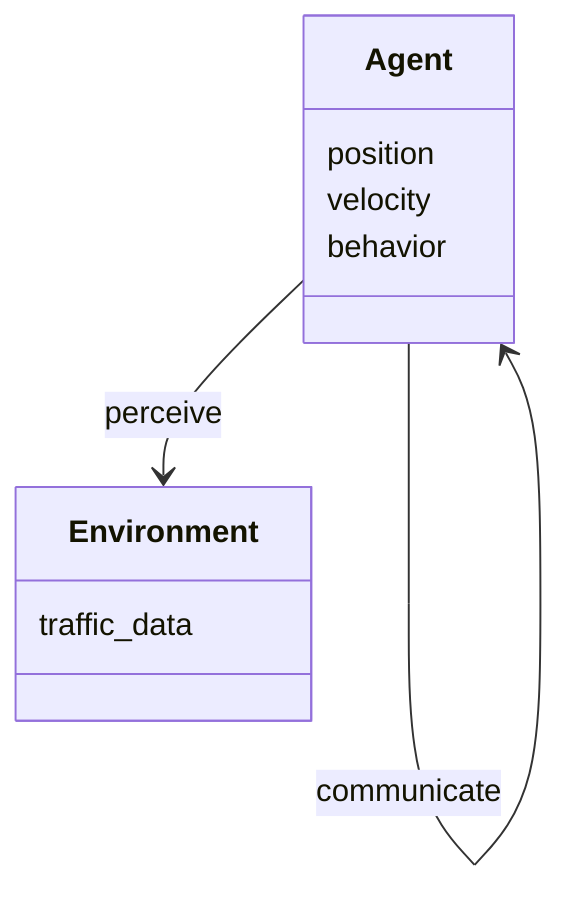
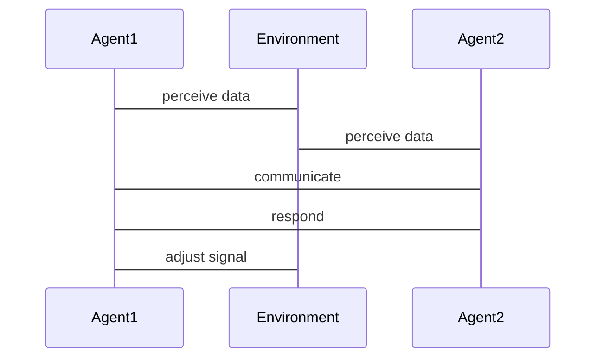

                 


# 构建具有群体智能的多Agent系统

> 关键词：多Agent系统，群体智能，分布式计算，一致性协议，分布式系统，系统架构设计

> 摘要：本文将详细介绍如何构建具有群体智能的多Agent系统。从基础概念到高级算法，从系统架构到项目实战，我们将全面探讨构建这一复杂系统所需的各个关键环节。通过本文，读者将能够理解多Agent系统与群体智能的核心概念，掌握相关算法原理，并学会如何设计和实现一个高效的多Agent系统。

---

## 第1章: 多Agent系统概述

### 1.1 多Agent系统的基本概念

#### 1.1.1 什么是多Agent系统
多Agent系统（Multi-Agent System, MAS）是由多个智能体（Agent）组成的分布式系统，这些智能体能够通过协作完成复杂的任务。Agent是指能够感知环境并采取行动以实现目标的实体。多Agent系统中的Agent可以是软件程序、机器人或其他智能实体。

#### 1.1.2 多Agent系统的特征与优势
多Agent系统具有以下特征：
- **分布式性**：Agent分布在不同的位置，能够独立运行。
- **自主性**：每个Agent都具有自主决策的能力。
- **协作性**：Agent之间可以通过通信和协作完成复杂任务。
- **动态性**：系统能够适应动态变化的环境。

多Agent系统的优势包括：
- 提高系统的可靠性和容错性。
- 支持大规模分布式计算。
- 能够处理复杂的协作任务。

#### 1.1.3 多Agent系统的应用场景
多Agent系统广泛应用于以下领域：
- 分布式计算和分布式系统。
- 机器人协作和 swarm intelligence（群体智能）。
- 多智能体协作和分布式问题求解。
- 电子商务和分布式事务管理。

### 1.2 群体智能的基本概念

#### 1.2.1 什么是群体智能
群体智能（Swarm Intelligence）是指通过多个简单个体（Agent）的协作，实现复杂任务的智能形式。群体智能的核心在于个体之间的局部交互，通过简单的规则实现全局的智能行为。

#### 1.2.2 群体智能的核心特征
群体智能具有以下特征：
- **去中心化**：没有中央控制机构，个体之间通过分布式协作完成任务。
- **自组织性**：个体能够根据环境和任务需求自主组织。
- **涌现性**：群体智能的复杂行为是通过个体简单规则自然涌现的结果。

#### 1.2.3 群体智能与多Agent系统的联系
群体智能是多Agent系统的一种特殊形式，它强调通过简单个体的协作实现复杂的智能行为。多Agent系统为群体智能提供了一个分布式协作的框架，而群体智能则为多Agent系统提供了一种高效的协作机制。

### 1.3 本章小结
本章介绍了多Agent系统和群体智能的基本概念、特征以及应用场景。通过理解这些内容，读者可以为后续章节的学习打下坚实的基础。

---

## 第2章: 多Agent系统的核心概念

### 2.1 多Agent系统的组成与结构

#### 2.1.1 Agent的定义与分类
Agent可以分为以下几类：
- **简单反射Agent**：基于当前感知直接采取行动。
- **基于模型的反射Agent**：具有内部状态和推理能力。
- **目标驱动的Agent**：根据目标采取行动。
- **效用驱动的Agent**：通过最大化效用函数来决策。

#### 2.1.2 多Agent系统的层次结构
多Agent系统的层次结构包括：
- **物理层**：实际的硬件设备和物理环境。
- **通信层**：Agent之间的通信机制。
- **逻辑层**：Agent的行为逻辑和推理机制。
- **应用层**：具体的业务逻辑和应用功能。

#### 2.1.3 Agent之间的交互方式
Agent之间的交互方式包括：
- **直接通信**：Agent之间通过消息传递进行交互。
- **间接通信**：通过中间媒介进行间接交互。
- **基于规则的交互**：根据预定义规则进行协作。

### 2.2 群体智能的机制与模型

#### 2.2.1 群体智能的机制
群体智能的机制包括：
- **信息传播**：个体通过传播信息影响其他个体的行为。
- **局部决策**：每个个体基于局部信息做出决策。
- **协作与竞争**：个体之间通过协作和竞争实现整体目标。

#### 2.2.2 常见的群体智能模型
常见的群体智能模型包括：
- **基于一致性协议的模型**：通过一致性算法实现分布式决策。
- **基于聚群算法的模型**：通过聚群行为实现全局目标。
- **基于分布式计算的模型**：通过分布式计算实现任务协作。

#### 2.2.3 群体智能与分布式计算的关系
群体智能是分布式计算的一种特殊形式，它通过个体协作实现复杂的计算任务。分布式计算为群体智能提供了一个计算框架，而群体智能则为分布式计算提供了一种高效的协作机制。

### 2.3 多Agent系统与群体智能的对比分析

#### 2.3.1 核心概念对比
| 比较维度 | 多Agent系统 | 群体智能 |
|----------|-------------|----------|
| 核心概念 | 分布式协作 | 个体协作 |
| 决策机制 | 去中心化 | 去中心化 |
| 应用场景 | 分布式计算 | 聚群行为 |

#### 2.3.2 实现方式对比
- 多Agent系统通常需要复杂的通信和协调机制，而群体智能则通过简单的规则实现协作。
- 多Agent系统强调系统的整体目标，而群体智能强调个体行为的涌现性。

#### 2.3.3 应用场景对比
多Agent系统广泛应用于分布式计算、电子商务等领域，而群体智能则在机器人协作、交通控制等领域有广泛应用。

### 2.4 本章小结
本章详细讲解了多Agent系统和群体智能的核心概念与实现机制，并通过对比分析明确了它们的区别与联系。

---

## 第3章: 群体智能算法与实现

### 3.1 群体智能算法原理

#### 3.1.1 分布式计算的基本原理
分布式计算通过多个计算节点协作完成任务。每个节点具有局部信息，并通过通信机制进行协作。

#### 3.1.2 群体智能中的通信机制
群体智能的通信机制包括：
- **直接通信**：个体之间直接交换信息。
- **间接通信**：通过中间媒介传递信息。
- **基于广播的通信**：通过广播消息实现全局信息共享。

#### 3.1.3 群体智能中的决策机制
群体智能的决策机制包括：
- **基于一致性协议的决策**：通过一致性算法实现全局决策。
- **基于聚群算法的决策**：通过局部规则实现全局决策。

### 3.2 常见的群体智能算法

#### 3.2.1 一致性协议
一致性协议用于确保分布式系统中所有节点的状态一致。常见的算法包括：
- **Paxos算法**：用于在分布式系统中达成一致。
- **Raft算法**：Paxos算法的一种优化实现。
- **Consensus算法**：通过投票机制达成一致。

#### 3.2.2 分布式计算算法
分布式计算算法包括：
- **MapReduce**：用于大规模数据处理。
- **分布式锁机制**：用于控制对共享资源的访问。
- **分布式事务管理**：用于保证分布式系统中事务的原子性。

#### 3.2.3 聚群算法
聚群算法用于模拟群体行为，常见的算法包括：
- **Ant Colony Optimization (ACO)**：模拟蚂蚁觅食行为。
- **Particle Swarm Optimization (PSO)**：模拟鸟群觅食行为。
- **Flocking Algorithm**：模拟鸟群的聚群行为。

### 3.3 群体智能算法的数学模型

#### 3.3.1 一致性协议的数学模型
一致性协议的数学模型可以表示为：
$$
\text{所有节点的状态在达成一致后，状态值相同。}
$$

#### 3.3.2 聚群算法的数学模型
聚群算法的数学模型可以表示为：
$$
\text{每个个体根据邻居的行为调整自身的位置。}
$$

#### 3.3.3 分布式计算的数学模型
分布式计算的数学模型可以表示为：
$$
\text{任务被分解成多个子任务，分别在不同的节点上执行。}
$$

### 3.4 算法实现与代码示例

#### 3.4.1 一致性协议的实现
以下是一个简单的Paxos算法实现示例：
```python
class Paxos:
    def __init__(self, nodes):
        self.nodes = nodes
        self.current_round = 0

    def propose(self, value):
        self.current_round += 1
        for node in self.nodes:
            node.receive_proposal(self.current_round, value)

    def receive_proposal(self, round, value):
        pass
```

#### 3.4.2 聚群算法的实现
以下是一个简单的Flocking算法实现示例：
```python
class Agent:
    def __init__(self, position):
        self.position = position
        self.velocity = (0, 0)

    def update(self, neighbors):
        for neighbor in neighbors:
            dx = neighbor.position[0] - self.position[0]
            dy = neighbor.position[1] - self.position[1]
            distance = (dx**2 + dy**2)**0.5
            if distance < 10:
                self.velocity = (self.velocity[0] + dx/2, self.velocity[1] + dy/2)

        self.position = (self.position[0] + self.velocity[0], self.position[1] + self.velocity[1])
```

### 3.5 本章小结
本章详细讲解了群体智能算法的原理与实现，包括一致性协议、分布式计算算法和聚群算法。通过代码示例，读者可以更好地理解这些算法的实现细节。

---

## 第4章: 系统设计与实现

### 4.1 系统设计概述

#### 4.1.1 问题场景介绍
我们以一个智能交通系统为例，设计一个基于群体智能的多Agent系统。系统需要实现交通流量的实时监控和智能调度。

#### 4.1.2 系统功能设计
系统功能包括：
- **交通流量监控**：实时采集交通流量数据。
- **智能调度**：根据交通流量数据，智能调整交通信号灯。

### 4.2 系统架构设计

#### 4.2.1 领域模型设计
领域模型设计如图所示：


#### 4.2.2 系统架构设计
系统架构设计如图所示：


#### 4.2.3 系统接口设计
系统接口包括：
- **通信接口**：Agent之间的通信接口。
- **数据接口**：与环境交互的数据接口。

#### 4.2.4 系统交互设计
系统交互如图所示：


### 4.3 系统实现与代码示例

#### 4.3.1 环境搭建
我们需要以下工具和库：
- Python编程语言
- Mermaid图表工具
- 数据库（如MySQL）

#### 4.3.2 系统核心实现
以下是系统核心实现代码示例：
```python
class TrafficAgent:
    def __init__(self, id):
        self.id = id
        self.position = (0, 0)
        self.velocity = (0, 0)

    def perceive(self, environment):
        self.position = environment.get_traffic_data(self.id)

    def communicate(self, other_agents):
        for agent in other_agents:
            if agent.id != self.id:
                self.velocity = self.velocity + (agent.position - self.position) * 0.1

    def adjust_signal(self):
        self.position = (self.position[0] + self.velocity[0], self.position[1] + self.velocity[1])
```

### 4.4 本章小结
本章通过设计一个智能交通系统，详细讲解了多Agent系统的系统设计与实现过程。通过实际案例，读者可以更好地理解系统设计的各个方面。

---

## 第5章: 群体智能算法的优化与扩展

### 5.1 算法优化

#### 5.1.1 性能优化
性能优化包括：
- **并行计算**：通过并行计算提高算法效率。
- **负载均衡**：通过负载均衡技术优化资源利用。

#### 5.1.2 算法的可扩展性设计
算法的可扩展性设计包括：
- **模块化设计**：通过模块化设计提高算法的可扩展性。
- **分层设计**：通过分层设计降低算法的复杂度。

#### 5.1.3 算法的安全性考虑
算法的安全性考虑包括：
- **数据加密**：通过数据加密技术保护数据安全。
- **访问控制**：通过访问控制技术防止未经授权的访问。

### 5.2 算法的扩展与应用

#### 5.2.1 算法的扩展
算法的扩展包括：
- **算法的改进**：通过改进算法提高性能。
- **算法的融合**：通过融合其他算法提高算法的智能性。

#### 5.2.2 算法的应用
算法的应用包括：
- **智能交通系统**：通过算法实现交通流量的智能调度。
- **智能控制系统**：通过算法实现工业自动化控制。

### 5.3 本章小结
本章详细讲解了群体智能算法的优化与扩展，包括性能优化、算法的可扩展性设计和算法的安全性考虑。

---

## 第6章: 总结与展望

### 6.1 总结
本文详细讲解了如何构建具有群体智能的多Agent系统。从基础概念到算法实现，从系统设计到项目实战，我们全面探讨了构建这一复杂系统所需的各个关键环节。

### 6.2 展望
未来的研究方向包括：
- **更高效的算法设计**：通过改进算法提高系统性能。
- **更智能的系统设计**：通过引入人工智能技术提高系统的智能性。
- **更广泛的应用场景**：通过扩展应用场景实现更广泛的应用。

---

## 作者信息

作者：AI天才研究院/AI Genius Institute & 禅与计算机程序设计艺术 /Zen And The Art of Computer Programming

---

以上是《构建具有群体智能的多Agent系统》的技术博客文章的目录和部分内容。希望这篇文章能为您提供有价值的信息和启发！

