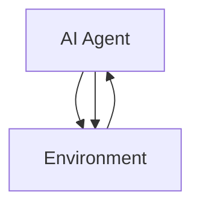
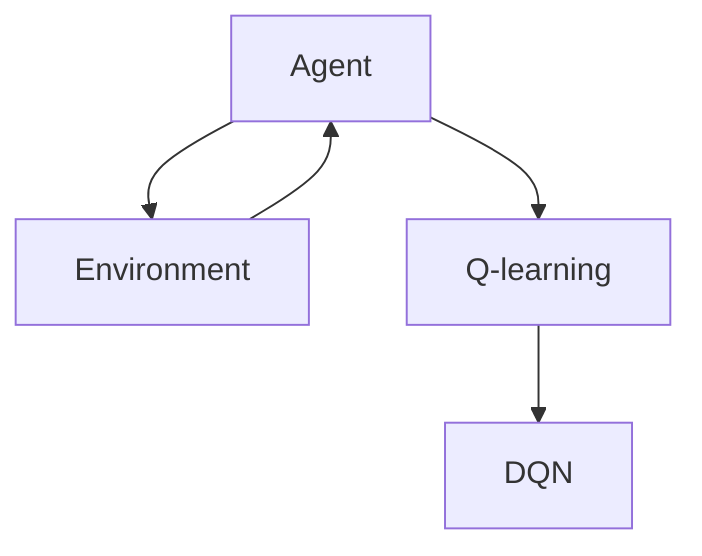
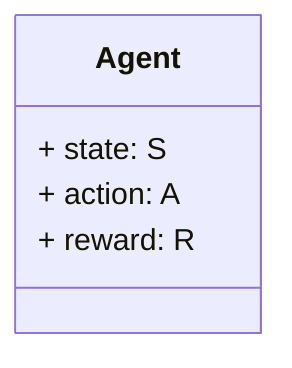

                 


# 《构建具有自主决策能力的AI Agent》

> **关键词**：AI Agent，自主决策，强化学习，Q-learning，DQN，人工智能，算法原理，系统架构设计

> **摘要**：本文详细探讨了如何构建具有自主决策能力的AI Agent，从背景介绍、核心概念到算法原理、系统架构设计，再到项目实战，层层深入，旨在为读者提供一个全面的构建指南。文章通过丰富的实例和详细的代码实现，帮助读者理解并掌握构建自主决策AI Agent的核心技术与方法。

---

# 第1章: 自主决策AI Agent的背景与重要性

## 1.1 人工智能与自主决策的结合

### 1.1.1 人工智能的发展历程

人工智能（Artificial Intelligence，AI）作为计算机科学的重要分支，经历了数十年的发展，从早期的专家系统到现在的深度学习，AI技术不断进步，应用领域也在不断扩大。随着计算能力的提升和数据量的增加，AI技术逐渐从简单的规则匹配发展到复杂的自主决策能力。

### 1.1.2 自主决策在AI中的核心地位

自主决策能力是AI Agent的核心能力之一，它使得AI Agent能够根据当前的状态和环境信息，自主选择最优的动作，以实现目标。这种能力在智能机器人、自动驾驶、智能助手等领域具有重要应用。

### 1.1.3 当前AI Agent的市场需求与趋势

随着物联网、5G技术的发展，AI Agent的应用场景越来越广泛。市场对具有自主决策能力的AI Agent需求旺盛，推动了相关技术的快速发展。未来的AI Agent将更加智能化、个性化，能够适应复杂的动态环境。

---

## 1.2 自主决策AI Agent的定义与特点

### 1.2.1 自主决策的定义

自主决策是指AI Agent在没有外部干预的情况下，基于当前环境信息和历史经验，选择最优动作以实现目标的能力。

### 1.2.2 自主决策的核心特点

1. **自主性**：AI Agent能够在没有外部干预的情况下独立运作。
2. **适应性**：能够根据环境变化调整决策策略。
3. **学习性**：通过与环境的交互，不断优化决策模型。
4. **高效性**：能够在有限时间内做出决策。

### 1.2.3 自主决策与传统AI的区别

| **传统AI** | **自主决策AI** |
|------------|----------------|
| 依赖于规则和逻辑推理 | 基于环境反馈和学习优化 |
| 无法处理动态环境 | 能够适应动态变化的环境 |
| 决策过程固定 | 具备动态调整决策的能力 |

---

## 1.3 自主决策AI Agent的应用场景

### 1.3.1 智能机器人与自动化系统

自主决策AI Agent可以用于工业机器人、服务机器人等领域，实现自主导航、任务规划和操作执行。

### 1.3.2 智慧城市与交通管理

在智慧城市中，AI Agent可以用于交通流量优化、智能路灯控制等场景，提高城市管理效率。

### 1.3.3 游戏AI与虚拟助手

自主决策AI Agent可以应用于游戏AI、智能助手等领域，提供更加智能化的服务。

---

## 1.4 本章小结

本章介绍了自主决策AI Agent的背景、定义、特点及其应用场景，为后续章节的深入分析奠定了基础。

---

# 第2章: 自主决策AI Agent的核心概念与联系

## 2.1 自主决策AI Agent的核心概念

### 2.1.1 状态、动作与奖励的定义

- **状态（State）**：AI Agent所处的环境信息，例如位置、传感器数据等。
- **动作（Action）**：AI Agent基于当前状态做出的决策。
- **奖励（Reward）**：AI Agent执行动作后获得的反馈，用于评估动作的好坏。

### 2.1.2 决策过程的数学模型

决策过程可以用马尔可夫决策过程（MDP）模型表示：

$$
\text{MDP} = \langle S, A, P, R, \gamma \rangle
$$

其中：
- $S$：状态空间
- $A$：动作空间
- $P$：状态转移概率
- $R$：奖励函数
- $\gamma$：折扣因子

### 2.1.3 环境与Agent的交互机制

AI Agent与环境的交互机制可以用以下流程图表示：



---

## 2.2 自主决策AI Agent的类型

### 2.2.1 基于规则的决策模型

- **规则驱动**：基于预定义的规则进行决策。
- **优点**：简单易懂，适用于规则明确的场景。
- **缺点**：无法处理复杂动态环境。

### 2.2.2 基于模型的决策模型

- **模型驱动**：基于环境模型进行决策。
- **优点**：能够处理复杂环境，决策过程可控。
- **缺点**：模型构建难度较大。

### 2.2.3 基于经验的决策模型

- **经验驱动**：基于历史数据和经验进行决策。
- **优点**：能够适应动态环境，学习能力强。
- **缺点**：需要大量数据支持。

---

## 2.3 核心概念对比分析

### 2.3.1 不同决策模型的对比表格

| **决策模型** | **优点** | **缺点** |
|---------------|----------|----------|
| 基于规则 | 简单易懂 | 无法处理复杂环境 |
| 基于模型 | 能够处理复杂环境 | 模型构建难度大 |
| 基于经验 | 能够适应动态环境 | 需要大量数据支持 |

### 2.3.2 实体关系图（ER图）架构

```mermaid
erd
    Agent --|{decision}| State
    State --|{feedback}| Reward
```

---

## 2.4 本章小结

本章详细讲解了自主决策AI Agent的核心概念与不同类型，通过对比分析帮助读者更好地理解不同决策模型的特点和适用场景。

---

# 第3章: 自主决策AI Agent的算法原理

## 3.1 强化学习算法

### 3.1.1 Q-learning算法

- **Q-learning算法**是一种基于值迭代的强化学习算法，适用于离散状态和动作空间。

$$
Q(s, a) \leftarrow Q(s, a) + \alpha \left[ r + \gamma \max_{a'} Q(s', a') - Q(s, a) \right]
$$

其中：
- $\alpha$：学习率
- $\gamma$：折扣因子
- $r$：奖励

### 3.1.2 Deep Q-Networks (DQN)算法

- **DQN算法**通过神经网络近似Q值函数，适用于连续状态和动作空间。

$$
\text{目标：} \min_{\theta} \mathbb{E}[ (y - Q_\theta(s, a))^2 ]
$$

其中：
- $y = r + \gamma Q_\theta(s', a')$

### 3.1.3 算法流程图



---

## 3.2 其他决策算法

### 3.2.1 贪婪算法

- **贪婪算法**：选择当前状态下最优的动作。

### 3.2.2 近端策略优化（PPO）

- **PPO算法**：通过优化策略梯度，避免策略更新幅度过大。

$$
\text{目标：} \min_{\theta} \mathbb{E}[\text{Clip}( \frac{\pi_\theta(a|s)}{\pi_\text{old}(a|s)} ) \cdot Q_\theta(s, a)]
$$`

---

## 3.3 数学

### 3.3.1 Q-learning算法的数学模型

$$
Q(s, a) = Q(s, a) + \alpha (r + \gamma \max_a Q(s', a) - Q(s, a))
$$`

### 3.3.2 DQN算法的数学模型

$$
\text{损失函数：} \mathcal{L} = \mathbb{E}[ (y - Q_\theta(s, a))^2 ]
$$`

---

## 3.4 本章小结

本章详细讲解了Q-learning和DQN等强化学习算法的原理和数学模型，为后续的系统设计和项目实现奠定了理论基础。

---

# 第4章: 系统分析与架构设计

## 4.1 问题场景介绍

- **问题场景**：构建一个能够在动态环境中自主决策的AI Agent。

## 4.2 项目介绍

- **项目名称**：自主决策AI Agent系统。
- **目标**：实现一个能够在动态环境中自主决策的AI Agent。

## 4.3 系统功能设计

### 4.3.1 领域模型



### 4.3.2 系统架构设计


---

## 4.4 系统接口设计

### 4.4.1 接口描述

- **输入接口**：接收环境状态和传感器数据。
- **输出接口**：输出决策动作和控制信号。

### 4.4.2 接口流程图


---

## 4.5 本章小结

本章通过系统分析和架构设计，展示了如何将自主决策AI Agent应用于实际场景中。

---

# 第5章: 项目实战

## 5.1 环境安装

- **Python**：安装Python 3.8及以上版本。
- **深度学习框架**：安装TensorFlow或PyTorch。
- **强化学习库**：安装OpenAI Gym。

## 5.2 核心实现源代码

### 5.2.1 Q-learning算法实现

```python
import numpy as np

class QLearning:
    def __init__(self, state_space, action_space, gamma=0.99, epsilon=1.0, epsilon_min=0.01, epsilon_decay=0.999):
        self.state_space = state_space
        self.action_space = action_space
        self.gamma = gamma
        self.epsilon = epsilon
        self.epsilon_min = epsilon_min
        self.epsilon_decay = epsilon_decay
        self.q_table = np.zeros((state_space, action_space))

    def get_action(self, state):
        if np.random.random() < self.epsilon:
            return np.random.randint(self.action_space)
        else:
            return np.argmax(self.q_table[state])

    def update(self, state, action, reward, next_state):
        target = reward + self.gamma * np.max(self.q_table[next_state])
        self.q_table[state][action] = target
        self.epsilon = max(self.epsilon_min, self.epsilon * self.epsilon_decay)
```

### 5.2.2 DQN算法实现

```python
import tensorflow as tf
from tensorflow.keras import layers

class DQN:
    def __init__(self, state_dim, action_dim, learning_rate=0.001):
        self.state_dim = state_dim
        self.action_dim = action_dim
        self.learning_rate = learning_rate
        self.model = self.build_model()

    def build_model(self):
        model = tf.keras.Sequential([
            layers.Dense(64, activation='relu', input_dim=self.state_dim),
            layers.Dense(64, activation='relu'),
            layers.Dense(self.action_dim, activation='linear')
        ])
        model.compile(optimizer=tf.keras.optimizers.Adam(lr=self.learning_rate), loss='mse')
        return model

    def get_action(self, state):
        state = tf.convert_to_tensor(state)
        predicted_actions = self.model.predict(state)
        return np.argmax(predicted_actions[0])
```

---

## 5.3 实际案例分析

### 5.3.1 案例一：迷宫导航

- **问题描述**：AI Agent在迷宫中导航，寻找出口。
- **解决方案**：使用Q-learning算法实现迷宫导航。

### 5.3.2 案例二：自动驾驶

- **问题描述**：AI Agent在复杂交通环境中自主驾驶。
- **解决方案**：使用DQN算法实现自动驾驶决策。

---

## 5.4 本章小结

本章通过实际案例分析，展示了如何将自主决策AI Agent应用于迷宫导航和自动驾驶等场景中。

---

# 第6章: 总结与展望

## 6.1 本章总结

本文详细探讨了如何构建具有自主决策能力的AI Agent，从背景介绍、核心概念到算法原理、系统设计，再到项目实战，为读者提供了一个全面的构建指南。

## 6.2 未来展望

随着AI技术的不断发展，自主决策AI Agent将具备更强的智能性和适应性，能够处理更加复杂的动态环境。未来的研究方向包括多智能体协作、实时决策优化等。

---

# 作者：AI天才研究院/AI Genius Institute & 禅与计算机程序设计艺术 /Zen And The Art of Computer Programming

---

本文通过系统化的分析和详细的代码实现，帮助读者深入理解并掌握构建自主决策AI Agent的核心技术与方法。希望本文对相关领域的研究和应用提供有价值的参考。

