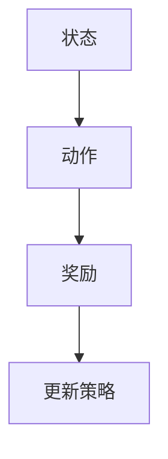
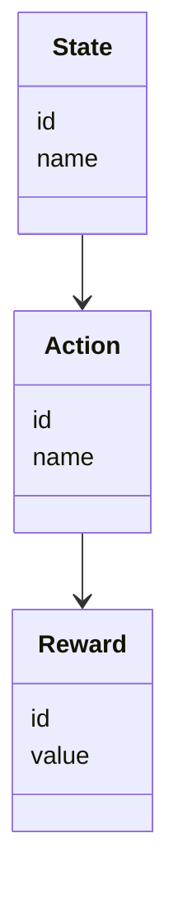
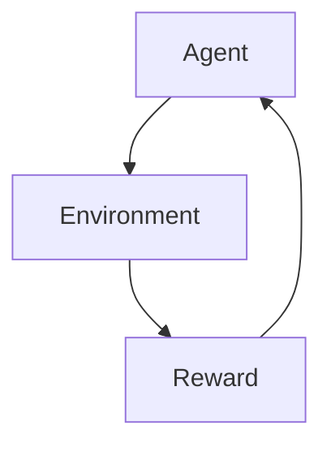
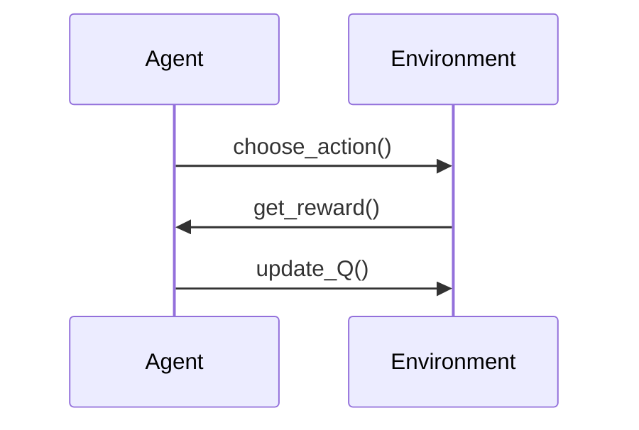

                 


# 构建具有自主探索与假设验证能力的AI Agent

> 关键词：AI Agent, 自主探索, 假设验证, 强化学习, 贝叶斯推理, 系统架构, 项目实战

> 摘要：本文详细探讨了构建具有自主探索与假设验证能力的AI Agent的关键技术与方法。通过分析AI Agent的基本概念、自主探索和假设验证的核心原理、系统架构设计、项目实战以及最佳实践，本文为读者提供了一套系统化的构建方案，帮助他们在实际应用中设计和实现具备自主探索与假设验证能力的AI Agent。

---

# 第一部分: 自主探索与假设验证的AI Agent背景介绍

# 第1章: 自主探索与假设验证的AI Agent概述

## 1.1 问题背景

### 1.1.1 AI Agent的基本概念
AI Agent（人工智能代理）是指能够感知环境、自主决策并执行任务的智能体。AI Agent的核心目标是通过与环境的交互，完成特定任务或优化目标函数。

### 1.1.2 自主探索与假设验证的必要性
在动态和不确定的环境中，AI Agent需要具备自主探索的能力，以发现新的信息和解决方案。同时，假设验证是AI Agent通过数据和实验验证假设的过程，是提升决策准确性和可靠性的关键。

### 1.1.3 当前AI Agent的发展趋势
随着强化学习和深度学习的快速发展，AI Agent正在向更智能、更自主的方向发展。自主探索与假设验证能力的提升是当前研究的热点和未来发展的趋势。

## 1.2 问题描述

### 1.2.1 自主探索的核心问题
- 如何平衡探索与利用，以最大化长期收益。
- 如何在未知环境中发现最优策略。

### 1.2.2 假设验证的关键挑战
- 如何设计有效的假设检验方法。
- 如何处理不确定性，确保假设验证的可靠性。

### 1.2.3 问题解决的边界与外延
- 问题解决的边界：明确AI Agent的任务范围和能力限制。
- 问题解决的外延：AI Agent在不同场景下的应用扩展。

## 1.3 核心概念与联系

### 1.3.1 自主探索与假设验证的关系
自主探索是假设验证的基础，假设验证是自主探索的优化和验证过程。

### 1.3.2 核心要素组成与概念结构
- 核心要素：环境、目标、策略、奖励。
- 概念结构：自主探索是AI Agent的核心能力，假设验证是优化决策的关键手段。

### 1.3.3 核心概念属性特征对比表
```markdown
| 概念 | 属性 | 特征 |
|------|------|------|
| 自主探索 | 独立性 | Agent能够独立决策 |
| 假设验证 | 数据驱动 | 基于数据进行假设检验 |
```

## 1.4 本章小结
本章通过分析AI Agent的基本概念、自主探索与假设验证的核心问题以及它们之间的关系，为后续的算法原理和系统设计奠定了基础。

---

# 第2章: 自主探索与假设验证的核心原理

## 2.1 自主探索的算法原理

### 2.1.1 强化学习的基本原理
强化学习是一种通过与环境交互来学习策略的方法。Agent通过选择动作、观察奖励并更新策略来优化目标函数。

### 2.1.2 探索与利用的平衡
- 探索：尝试新的动作以发现更好的策略。
- 利用：基于当前知识选择最优动作。
- 平衡：通过策略如ε-greedy算法来平衡探索与利用。

### 2.1.3 多臂老虎机问题
多臂老虎机问题是强化学习中的经典问题，用于建模探索与利用的平衡。



### 2.1.4 算法实现与代码示例
以下是一个简单的强化学习算法实现示例：

```python
class Agent:
    def __init__(self, state_space, action_space):
        self.state_space = state_space
        self.action_space = action_space
        self.Q = {s: 0 for s in state_space}

    def choose_action(self, state, epsilon=0.1):
        if random.random() < epsilon:
            return random.choice(self.action_space)
        else:
            return max(self.Q[state], key=lambda x: self.Q[state][x])

    def update_Q(self, state, action, reward):
        self.Q[state][action] = (self.Q[state][action] + reward) / 2
```

## 2.2 假设验证的数学模型

### 2.2.1 假设检验的基本流程
- 建立假设：原假设和备择假设。
- 确定显著性水平：α值。
- 计算统计量：如t统计量。
- 做出决策：拒绝或接受原假设。

### 2.2.2 统计显著性与置信区间
统计显著性用于判断假设检验的结果是否具有实际意义，置信区间用于估计参数的范围。

### 2.2.3 贝叶斯推理简介
贝叶斯推理是一种基于概率的推理方法，用于更新基于数据的假设概率。

```latex
$$P(H|D) = \frac{P(D|H)P(H)}{P(D)}$$
```

### 2.2.4 算法实现与代码示例
以下是一个简单的贝叶斯推理实现示例：

```python
def bayesian_inference(prior, likelihood, evidence):
    posterior = (prior * likelihood) / evidence
    return posterior
```

## 2.3 算法实现与代码示例

### 2.3.1 强化学习算法实现
```python
class ReinforcementLearningAgent:
    def __init__(self, state_space, action_space):
        self.state_space = state_space
        self.action_space = action_space
        self.Q = {s: 0 for s in state_space}

    def choose_action(self, state, epsilon=0.1):
        if random.random() < epsilon:
            return random.choice(self.action_space)
        else:
            max_Q = max(self.Q[state].values())
            actions_with_max_Q = [a for a in self.action_space if self.Q[state][a] == max_Q]
            return random.choice(actions_with_max_Q)

    def update_Q(self, state, action, reward):
        self.Q[state][action] = self.Q[state][action] * 0.8 + reward * 0.2
```

### 2.3.2 贝叶斯推理实现
```python
def bayesian_inference(prior, likelihood, evidence):
    posterior = (prior * likelihood) / evidence
    return posterior
```

## 2.4 本章小结
本章详细讲解了自主探索与假设验证的核心算法原理，包括强化学习和贝叶斯推理，并通过代码示例展示了这些算法的实现。

---

# 第3章: 自主探索与假设验证的系统架构设计

## 3.1 问题场景介绍

### 3.1.1 自主探索的应用场景
- 机器人导航
- 自动驾驶
- 自动交易

### 3.1.2 假设验证的应用场景
- A/B测试
- 数据分析
- 系统优化

## 3.2 系统功能设计

### 3.2.1 领域模型设计


### 3.2.2 系统架构设计


### 3.2.3 接口设计与交互流程


## 3.3 本章小结
本章通过系统架构设计和接口设计，展示了如何将自主探索与假设验证的能力集成到AI Agent中。

---

# 第4章: 自主探索与假设验证的项目实战

## 4.1 环境安装与配置

### 4.1.1 Python环境配置
- 安装Python 3.x
- 安装必要的库：numpy, matplotlib, gym

### 4.1.2 系统依赖管理
- 使用virtualenv管理环境
- 使用pip安装依赖

## 4.2 系统核心实现

### 4.2.1 强化学习实现
```python
class ReinforcementLearningAgent:
    def __init__(self, state_space, action_space):
        self.state_space = state_space
        self.action_space = action_space
        self.Q = {s: 0 for s in state_space}

    def choose_action(self, state, epsilon=0.1):
        if random.random() < epsilon:
            return random.choice(self.action_space)
        else:
            max_Q = max(self.Q[state].values())
            actions_with_max_Q = [a for a in self.action_space if self.Q[state][a] == max_Q]
            return random.choice(actions_with_max_Q)

    def update_Q(self, state, action, reward):
        self.Q[state][action] = self.Q[state][action] * 0.8 + reward * 0.2
```

### 4.2.2 贝叶斯推理实现
```python
def bayesian_inference(prior, likelihood, evidence):
    posterior = (prior * likelihood) / evidence
    return posterior
```

## 4.3 实际案例分析

### 4.3.1 案例一：机器人导航
- 环境：迷宫
- 任务：找到出口
- 算法：强化学习

### 4.3.2 案例二：自动交易
- 环境：金融市场
- 任务：最大化收益
- 算法：强化学习结合贝叶斯推理

## 4.4 本章小结
本章通过实际案例分析，展示了如何将自主探索与假设验证的能力应用到实际项目中。

---

# 第5章: 自主探索与假设验证的最佳实践

## 5.1 小结与总结
- 自主探索与假设验证是AI Agent的核心能力
- 强化学习和贝叶斯推理是实现这些能力的关键算法
- 系统架构设计和项目实战是将理论应用于实践的重要步骤

## 5.2 注意事项
- 确保系统的可扩展性和可维护性
- 处理好探索与利用的平衡
- 确保数据质量和数量

## 5.3 拓展阅读
- 《Reinforcement Learning: Theory and Algorithms》
- 《Bayesian Reasoning and Machine Learning》

---

# 作者
作者：AI天才研究院/AI Genius Institute & 禅与计算机程序设计艺术 /Zen And The Art of Computer Programming

