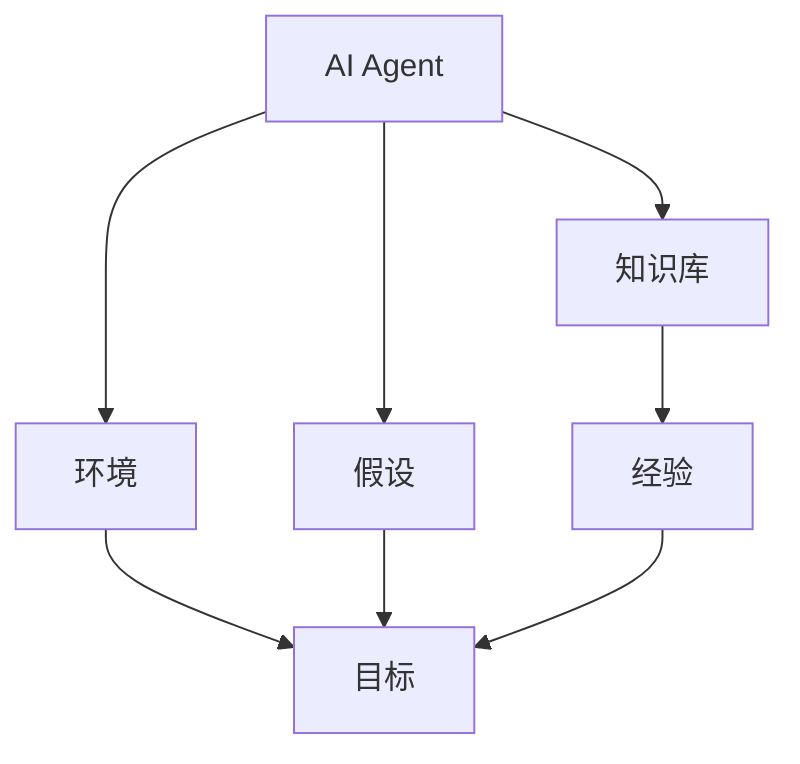
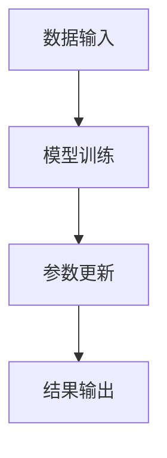
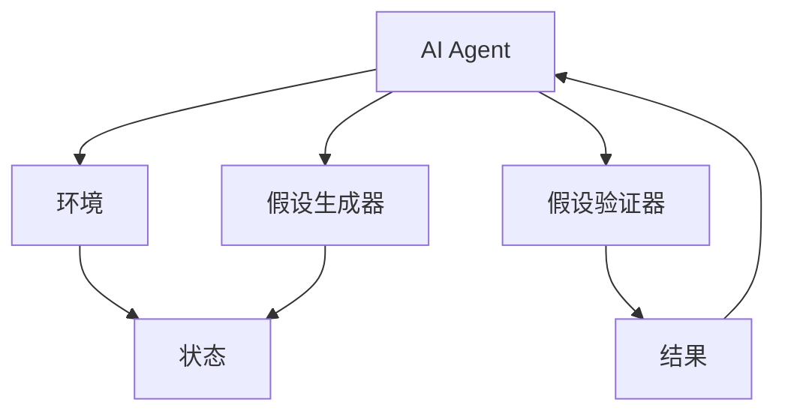

                 


# 构建具有自主探索与假设验证能力的AI Agent

## 关键词：AI Agent，自主探索，假设验证，强化学习，系统架构，项目实战

## 摘要：本文详细探讨了构建具有自主探索与假设验证能力的AI Agent的方法。通过分析自主探索和假设验证的核心概念、算法原理、系统架构以及实际项目案例，本文为读者提供了一个全面的构建框架，帮助他们理解并实现具备这两种能力的AI Agent。

---

## 第一部分: 自主探索与假设验证的AI Agent概述

## 第1章: 自主探索与假设验证的AI Agent概述

### 1.1 问题背景与核心概念

#### 1.1.1 从传统AI到自主探索AI的演进
传统AI依赖于预定义规则和数据，而自主探索AI则通过与环境互动主动学习。例如，在游戏AI中，自主探索AI能够通过尝试不同的策略来优化游戏表现，而不仅仅依赖于预先编程的策略。

#### 1.1.2 假设验证在AI Agent中的重要性
假设验证允许AI代理通过实验验证其假设，从而优化决策过程。例如，在推荐系统中，AI Agent可以假设某一用户偏好，通过A/B测试验证这一假设，从而优化推荐策略。

#### 1.1.3 自主探索和假设验证的定义与特点
- **自主探索**：AI Agent主动寻找解决方案的过程，强调探索未知领域。
- **假设验证**：AI Agent通过实验验证假设的过程，强调数据驱动的决策。

### 1.2 自主探索与假设验证的关系

#### 1.2.1 自主探索的核心原理
自主探索依赖于强化学习算法，例如Q-learning，通过最大化目标函数来选择最优动作。例如，在迷宫导航问题中，AI Agent通过尝试不同的路径来找到最优解。

#### 1.2.2 假设验证的逻辑框架
假设验证涉及生成假设、设计实验、收集数据并分析结果。例如，在优化广告点击率时，AI Agent可以生成不同的广告文案，通过实验验证哪种文案效果最佳。

#### 1.2.3 两者结合的必要性与优势
结合两者可以提高AI Agent的适应性和智能性。例如，在动态环境中，AI Agent可以自主探索新策略，并通过假设验证优化现有策略，从而更好地应对变化。

### 1.3 自主探索与假设验证的边界与外延

#### 1.3.1 自主探索的边界条件
- 环境的不确定性：AI Agent必须能够处理不可预测的情况。
- 行动的代价：高代价的行动可能限制自主探索的范围。
- 时间限制：有限的时间内完成探索任务。

#### 1.3.2 假设验证的适用范围
- 数据驱动的决策：适用于有足够数据支持的场景。
- 可重复实验：假设验证需要在相同条件下多次实验。
- 有限假设空间：假设数量不应过多，否则实验成本过高。

#### 1.3.3 两者的相互作用与影响
自主探索提供新的数据和信息，而假设验证则通过分析这些数据来优化决策。两者相互促进，共同提高AI Agent的能力。

### 1.4 核心概念与联系

#### 1.4.1 核心概念原理
- **自主探索**：通过尝试不同的行动来最大化目标函数。
- **假设验证**：通过实验数据来确认或反驳假设。

#### 1.4.2 核心概念属性特征对比表格
| 核心概念 | 自主探索 | 假设验证 |
|----------|----------|----------|
| 定义     | 主动寻找解决方案 | 通过实验验证假设 |
| 输入     | 环境状态与目标 | 假设与实验数据 |
| 输出     | 新知识与经验 | 验证结果与反馈 |
| 目标     | 最大化目标函数 | 确认或反驳假设 |

#### 1.4.3 ER实体关系图


### 1.5 本章小结
本章介绍了AI Agent的自主探索和假设验证的核心概念，分析了它们的关系和相互作用，为后续章节的深入探讨奠定了基础。

---

## 第2章: 自主探索与假设验证的数学模型与算法原理

### 2.1 自主探索算法原理

#### 2.1.1 强化学习算法
Q-learning是一种常用的强化学习算法，通过更新Q值函数来学习最优策略。例如，在迷宫问题中，AI Agent通过尝试不同的路径来更新Q值，最终找到最优路径。

$$ Q(s, a) = Q(s, a) + \alpha [r + \gamma \max Q(s', a') - Q(s, a)] $$

其中：
- \( Q(s, a) \)：状态s动作a的Q值。
- \( \alpha \)：学习率。
- \( r \)：奖励。
- \( \gamma \)：折扣因子。
- \( s' \)：新状态。
- \( a' \)：新动作。

#### 2.1.2 探索与利用的平衡
探索与利用是强化学习中的关键问题。探索概率\( \epsilon \)用于平衡探索和利用：
- 当\( \epsilon \)较高时，AI Agent倾向于探索。
- 当\( \epsilon \)较低时，AI Agent倾向于利用已知的最佳策略。

$$ \text{探索概率} = \epsilon $$

### 2.2 假设验证算法原理

#### 2.2.1 假设生成与选择
生成多个假设，选择最有可能的假设进行验证。例如，在广告优化中，生成不同的广告文案，并选择最有潜力的进行测试。

#### 2.2.2 假设验证的统计方法
假设验证通常使用p值来判断假设是否成立。例如，在A/B测试中，通过计算p值来判断是否拒绝零假设。

$$ p \text{-值} = \text{观测数据与零假设符合的概率} $$

### 2.3 自主探索与假设验证的联合模型

#### 2.3.1 联合模型的数学表达
联合模型将自主探索和假设验证结合起来，例如：

$$ Q(s, a) = \alpha v(s) + (1 - \alpha) q(s, a) $$

其中：
- \( v(s) \)：基于假设验证的价值函数。
- \( q(s, a) \)：基于自主探索的价值函数。
- \( \alpha \)：平衡参数。

#### 2.3.2 模型训练流程
模型训练包括数据输入、模型训练、参数更新和结果输出。例如：



### 2.4 本章小结
本章详细介绍了自主探索和假设验证的数学模型和算法原理，为后续章节的系统设计和项目实战奠定了理论基础。

---

## 第3章: 自主探索与假设验证的系统架构设计

### 3.1 问题场景介绍

#### 3.1.1 问题场景
以智能客服优化为例，AI Agent需要通过自主探索和假设验证来优化客服流程。例如，生成不同的客服策略，通过实验验证哪种策略能提高客户满意度。

#### 3.1.2 项目介绍
项目目标是构建一个能够自主探索和假设验证的AI Agent，用于优化智能客服系统。

### 3.2 系统功能设计

#### 3.2.1 领域模型（mermaid类图）
领域模型展示了系统的主要组件及其关系。

```mermaid
classDiagram
    class AI Agent {
        +目标：目标函数
        +知识库：已验证的知识
        +环境接口：与环境交互
    }
    class 环境 {
        +状态：当前状态
        +动作：可执行动作
        +反馈：实验结果
    }
    class 假设生成器 {
        +生成假设
        +选择假设
    }
    class 假设验证器 {
        +设计实验
        +分析结果
    }
    AI Agent --> 环境：互动
    AI Agent --> 假设生成器：生成假设
    AI Agent --> 假设验证器：验证假设
```

### 3.3 系统架构设计

#### 3.3.1 系统架构设计（mermaid架构图）
系统架构展示了各模块的协作关系。



### 3.4 系统接口设计

#### 3.4.1 系统接口设计
- **输入接口**：接收环境状态和目标。
- **输出接口**：输出动作和假设验证结果。
- **反馈接口**：接收实验结果并更新知识库。

### 3.5 系统交互设计（mermaid序列图）

```mermaid
sequenceDiagram
    participant AI Agent
    participant 环境
    AI Agent -> 环境：发送动作
    环境 -> AI Agent：返回反馈
    AI Agent -> 假设生成器：生成假设
    假设生成器 -> AI Agent：返回假设
    AI Agent -> 假设验证器：验证假设
    假设验证器 -> AI Agent：返回结果
```

### 3.6 本章小结
本章通过实际案例展示了系统架构设计，包括领域模型、系统架构、接口设计和交互流程，为项目实战提供了指导。

---

## 第4章: 自主探索与假设验证的项目实战

### 4.1 项目环境与工具安装

#### 4.1.1 环境安装
- **Python 3.8+**
- **安装库**：numpy, pandas, matplotlib, scikit-learn, gym, transformers。

#### 4.1.2 工具安装
- **Jupyter Notebook**：用于实验和展示。
- **Git**：用于版本控制。

### 4.2 系统核心实现源代码

#### 4.2.1 AI Agent核心代码实现
以下是AI Agent的核心代码示例：

```python
import numpy as np

class AI_Agent:
    def __init__(self, state_space, action_space):
        self.state_space = state_space
        self.action_space = action_space
        self.Q = np.zeros((state_space, action_space))
        self.epsilon = 0.1

    def take_action(self, state):
        if np.random.random() < self.epsilon:
            return np.random.randint(self.action_space)
        else:
            return np.argmax(self.Q[state])

    def update_Q(self, state, action, reward, next_state):
        self.Q[state, action] += 0.1 * (reward + 0.95 * np.max(self.Q[next_state]) - self.Q[state, action])
```

#### 4.2.2 假设生成器与验证器代码实现
以下是假设生成器和验证器的代码示例：

```python
from sklearn.model_selection import train_test_split
from sklearn.metrics import accuracy_score

class Hypothesis_Generator:
    def generate_hypotheses(self, data, target):
        # 生成多个假设
        hypotheses = []
        for feature in data.columns:
            hypotheses.append(f"假设：{feature}对目标有显著影响")
        return hypotheses

class Hypothesis_Verifier:
    def verify_hypothesis(self, data, hypothesis, target):
        X = data.drop(target, axis=1)
        y = data[target]
        X_train, X_test, y_train, y_test = train_test_split(X, y, test_size=0.2)
        # 验证假设
        model = LogisticRegression()
        model.fit(X_train, y_train)
        y_pred = model.predict(X_test)
        accuracy = accuracy_score(y_test, y_pred)
        return accuracy
```

### 4.3 代码应用解读与分析

#### 4.3.1 AI Agent核心代码解读
- **初始化**：初始化Q值矩阵，epsilon用于控制探索与利用。
- **take_action**：根据epsilon选择随机动作或最佳动作。
- **update_Q**：通过强化学习更新Q值。

#### 4.3.2 假设生成器与验证器代码解读
- **Hypothesis_Generator**：生成多个假设，每个假设基于数据的不同特征。
- **Hypothesis_Verifier**：通过机器学习模型验证假设，并返回准确率作为验证结果。

### 4.4 实际案例分析与详细讲解剖析

#### 4.4.1 案例介绍
以优化智能客服系统为例，AI Agent需要通过自主探索和假设验证来优化客服流程。

#### 4.4.2 案例实现步骤
1. **环境设定**：定义状态空间和动作空间。
2. **假设生成**：生成不同客服策略。
3. **假设验证**：通过实验验证假设。
4. **系统优化**：根据结果优化AI Agent的行为。

### 4.5 项目小结
本章通过实际案例展示了如何将理论应用于实践，详细讲解了项目的实现步骤和代码实现，帮助读者更好地理解和应用这些技术。

---

## 第5章: 总结与展望

### 5.1 核心内容回顾

- **自主探索**：通过强化学习算法主动寻找解决方案。
- **假设验证**：通过实验验证假设，优化决策过程。
- **系统架构**：设计合理的系统架构以支持这两种能力。
- **项目实战**：通过实际案例展示实现过程。

### 5.2 最佳实践 tips

- **数据质量**：高质量的数据是假设验证的基础。
- **环境设计**：合理设计环境以支持自主探索。
- **模型选择**：选择适合的算法和模型。
- **持续优化**：根据实验结果持续优化AI Agent。

### 5.3 未来展望

随着AI技术的进步，自主探索和假设验证的AI Agent将在更多领域得到应用。未来的研究方向包括：
- 更高效的强化学习算法。
- 更智能的假设生成与验证方法。
- 更复杂的系统架构设计。

### 5.4 本章小结
本章总结了全文的核心内容，提供了实际应用中的注意事项，并展望了未来的研究方向。

---

## 作者：AI天才研究院/AI Genius Institute & 禅与计算机程序设计艺术/Zen And The Art of Computer Programming

---

这篇文章详细探讨了构建具有自主探索与假设验证能力的AI Agent的方法，从理论到实践，为读者提供了全面的指导。通过系统的架构设计和实际案例分析，帮助读者理解并实现具备这两种能力的AI Agent。

