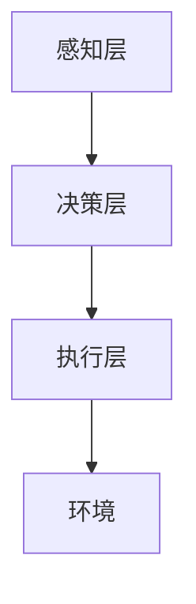
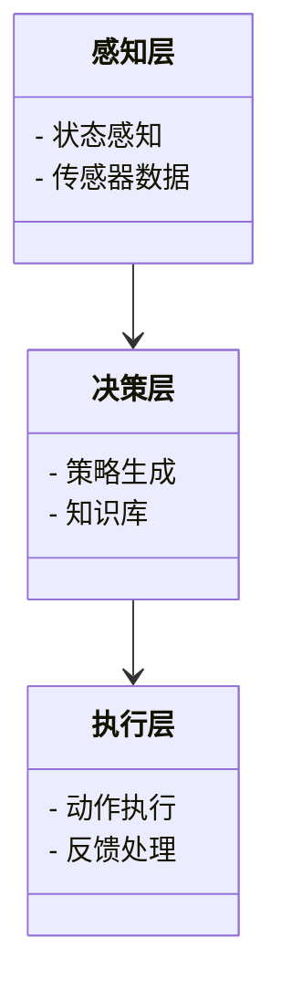

                 


# 构建具有自主探索能力的AI Agent

> 关键词：AI Agent，自主探索能力，强化学习，深度强化学习，自主决策，环境交互

> 摘要：本文详细探讨了构建具有自主探索能力的AI Agent的核心概念、算法原理、系统架构和实际应用。通过分析自主探索能力的关键要素，结合强化学习和深度强化学习的算法原理，以及系统架构设计，提供了从理论到实践的全面指导。

---

# 第一部分: AI Agent与自主探索能力概述

# 第1章: AI Agent与自主探索能力概述

## 1.1 AI Agent的基本概念

### 1.1.1 什么是AI Agent
AI Agent（人工智能代理）是指在环境中能够感知并自主行动以实现目标的智能实体。它能够通过与环境的交互，动态调整策略以适应复杂场景。

### 1.1.2 自主探索能力的定义
自主探索能力是指AI Agent在未知或动态变化的环境中，通过不断探索和尝试，主动学习和优化自身行为的能力。这种能力使AI Agent能够解决复杂问题，而无需依赖外部指令或预定义规则。

### 1.1.3 自主探索能力的核心要素
| 核心要素 | 描述 |
|----------|------|
| 感知     | 通过传感器或数据源获取环境信息 |
| 决策     | 基于感知信息做出最优动作的选择 |
| 学习     | 通过经验积累优化决策策略 |
| 执行     | 将决策转化为具体动作，与环境交互 |

---

## 1.2 自主探索能力的应用场景

### 1.2.1 自主探索在AI Agent中的应用
AI Agent的自主探索能力广泛应用于机器人控制、自动驾驶、智能推荐系统等领域。例如，在机器人导航中，AI Agent需要在未知环境中自主探索路径。

### 1.2.2 自主探索能力的典型应用案例
- **机器人导航**：AI Agent在迷宫中自主探索路径。
- **游戏AI**：AI Agent在复杂游戏中自主学习策略。
- **智能推荐系统**：通过用户行为数据自主探索最优推荐策略。

### 1.2.3 自主探索能力的未来发展趋势
随着深度强化学习的进步，AI Agent的自主探索能力将更加智能化和高效化。未来，AI Agent将能够处理更复杂、更高维度的环境。

---

## 1.3 自主探索能力的核心挑战

### 1.3.1 环境不确定性
环境的不确定性是自主探索能力的核心挑战之一。AI Agent需要在部分可观察或完全不可观察的环境中做出决策。

### 1.3.2 动作选择的复杂性
在高维动作空间中，AI Agent需要在有限时间内找到最优或近似最优的动作。

### 1.3.3 学习效率与稳定性
自主探索需要高效的学习算法和稳定的训练过程，以避免陷入局部最优或训练不收敛的问题。

---

## 1.4 本章小结

本章介绍了AI Agent的基本概念和自主探索能力的核心要素。通过分析应用场景和核心挑战，为后续章节的深入探讨奠定了基础。

---

# 第二部分: 自主探索能力的核心概念与原理

# 第2章: 自主探索能力的核心概念

## 2.1 自主探索能力的核心概念

### 2.1.1 感知与决策的结合
AI Agent通过感知环境信息，结合内部状态和目标，生成决策策略。感知和决策的结合是自主探索能力的关键。

### 2.1.2 动作选择与环境交互
AI Agent需要根据当前状态和决策策略选择动作，并与环境交互以获取反馈。

### 2.1.3 知识表示与更新机制
知识表示是AI Agent的核心，通过状态表示、动作表示和奖励表示，结合更新机制，不断优化知识表示。

---

## 2.2 自主探索能力的关键属性

### 2.2.1 智能性
AI Agent具备智能性，能够通过学习和推理优化决策。

### 2.2.2 独立性
AI Agent能够独立运行，无需依赖外部指令。

### 2.2.3 自适应性
AI Agent能够根据环境变化动态调整策略。

---

## 2.3 自主探索能力与传统AI的区别

### 2.3.1 传统AI的局限性
传统AI依赖于预定义规则和数据，无法在未知环境中自主适应。

### 2.3.2 自主探索能力的突破点
通过强化学习和深度强化学习，AI Agent能够在未知环境中自主探索和学习。

### 2.3.3 自主探索能力的核心优势
- 更强的适应性
- 更高的自主性
- 更好的可扩展性

---

## 2.4 本章小结

本章详细讲解了自主探索能力的核心概念和关键属性，分析了与传统AI的区别，为后续算法和系统设计奠定了理论基础。

---

# 第三部分: 自主探索能力的算法原理

# 第3章: 自主探索能力的算法基础

## 3.1 强化学习基础

### 3.1.1 马尔可夫决策过程
马尔可夫决策过程（MDP）是强化学习的基础模型，定义了状态、动作、奖励和转移概率。

### 3.1.2 状态、动作与奖励的定义
- **状态（State）**：环境中的当前情况。
- **动作（Action）**：AI Agent的选择。
- **奖励（Reward）**：环境对动作的反馈。

### 3.1.3 策略与价值函数
- **策略（Policy）**：动作选择的概率分布。
- **价值函数（Value Function）**：状态或动作的价值评估。

---

## 3.2 深度强化学习

### 3.2.1 DQN算法原理
深度强化学习（DRL）结合了深度学习和强化学习，DQN算法通过神经网络近似Q值函数。

### 3.2.2 网络结构与训练目标
- **输入层**：环境状态。
- **输出层**：动作价值。
- **训练目标**：最小化预测值与真实值的差。

### 3.2.3 探索与利用的平衡
通过平衡探索（随机选择动作）和利用（选择最优动作）来优化学习效率。

---

## 3.3 自主探索能力的数学模型

### 3.3.1 状态空间的表示
状态空间可以表示为高维向量，通过神经网络进行压缩和表示。

### 3.3.2 动作空间的表示
动作空间可以表示为多分类问题，通过神经网络预测最优动作。

### 3.3.3 奖励函数的设计
奖励函数需要设计合理的奖励机制，引导AI Agent学习期望的行为。

---

## 3.4 本章小结

本章详细讲解了强化学习和深度强化学习的算法原理，重点分析了DQN算法及其数学模型。

---

# 第四部分: 自主探索能力的系统架构设计

# 第4章: 自主探索能力的系统架构

## 4.1 系统架构概述

### 4.1.1 感知层
感知层负责获取环境信息，包括传感器数据和状态信息。

### 4.1.2 决策层
决策层基于感知信息和内部知识，生成决策策略。

### 4.1.3 执行层
执行层将决策转化为具体动作，与环境交互。

---

## 4.2 系统功能设计

### 4.2.1 环境感知模块
环境感知模块通过传感器或数据源获取环境信息。

### 4.2.2 决策模块
决策模块基于感知信息和内部知识，生成决策策略。

### 4.2.3 执行模块
执行模块将决策转化为具体动作，与环境交互。

---

## 4.3 系统架构设计

### 4.3.1 系统架构图


### 4.3.2 系统功能模块设计


---

## 4.4 本章小结

本章详细讲解了AI Agent的系统架构设计，包括感知层、决策层和执行层的功能设计和交互关系。

---

# 第五部分: 项目实战

# 第5章: 项目实战

## 5.1 项目介绍

### 5.1.1 项目背景
训练一个AI Agent在迷宫中自主探索路径。

### 5.1.2 项目目标
通过强化学习算法实现迷宫导航。

### 5.1.3 项目实现
使用Python和OpenAI Gym库实现迷宫导航。

---

## 5.2 环境配置

### 5.2.1 安装依赖
```bash
pip install gym numpy matplotlib
```

### 5.2.2 环境配置
```python
import gym
env = gym.make('CustomMazeEnv-v0')
```

---

## 5.3 系统核心实现源代码

### 5.3.1 算法实现
```python
class AIAgent:
    def __init__(self, state_space, action_space):
        self.state_space = state_space
        self.action_space = action_space
        self.model = self.build_model()

    def build_model(self):
        # 神经网络模型
        pass

    def act(self, state):
        # 根据状态选择动作
        pass

    def learn(self, state, action, reward, next_state):
        # 更新神经网络模型
        pass
```

### 5.3.2 训练过程
```python
agent = AIAgent(state_space, action_space)
for episode in range(1000):
    state = env.reset()
    while not done:
        action = agent.act(state)
        next_state, reward, done, _ = env.step(action)
        agent.learn(state, action, reward, next_state)
```

---

## 5.4 项目小结

本章通过一个迷宫导航案例，详细讲解了AI Agent的项目实现过程，包括环境配置、算法实现和训练过程。

---

# 第六部分: 最佳实践与小结

# 第6章: 最佳实践

## 6.1 实践总结

### 6.1.1 算法选择
选择适合场景的强化学习算法，如DQN适用于离散动作空间。

### 6.1.2 环境设计
设计合理的环境和奖励机制，确保AI Agent能够高效学习。

### 6.1.3 系统优化
优化算法和系统架构，提高学习效率和稳定性。

---

## 6.2 注意事项

### 6.2.1 环境不确定性
合理设计环境模型，降低不确定性对学习的影响。

### 6.2.2 动作选择
避免动作空间过于复杂，确保动作选择的高效性。

### 6.2.3 学习效率
通过合理的网络结构和训练策略，提高学习效率。

---

## 6.3 拓展阅读

### 6.3.1 强化学习经典论文
- "Deep Reinforcement Learning with Double Q-learning"

### 6.3.2 深度强化学习框架
- OpenAI Gym
- TensorFlow

---

## 6.4 本章小结

本章总结了构建AI Agent的最佳实践，提供了实际应用中的注意事项和拓展阅读方向。

---

# 作者：AI天才研究院/AI Genius Institute & 禅与计算机程序设计艺术 /Zen And The Art of Computer Programming

