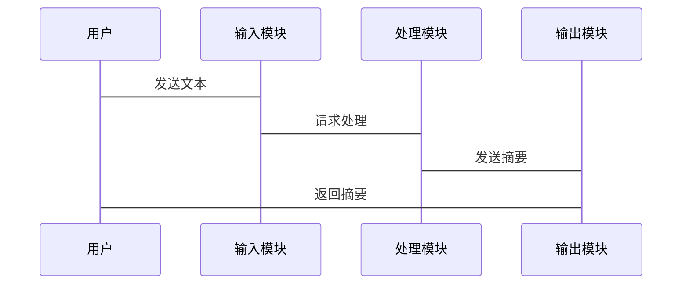

                 


# 构建具有自动摘要能力的AI Agent

## 关键词：
- 自动摘要
- AI Agent
- 自然语言处理
- 深度学习
- 文本挖掘

## 摘要：
本文详细介绍如何构建一个具有自动摘要能力的AI Agent。通过分析自动摘要技术的基本原理、AI Agent的核心概念及其结合，详细阐述算法实现、系统架构设计和实战案例，帮助读者全面掌握构建AI Agent的能力。

---

# 第一部分：AI Agent与自动摘要概述

## 第1章：AI Agent与自动摘要的背景介绍

### 1.1 AI Agent的基本概念

#### 1.1.1 什么是AI Agent
AI Agent（人工智能代理）是一种智能系统，能够感知环境、执行任务并做出决策。它通过与用户或环境交互，完成特定目标，如信息检索、数据分析或内容生成。

#### 1.1.2 AI Agent的核心特点
- **自主性**：无需外部干预，自主决策。
- **反应性**：能感知环境变化并实时调整行为。
- **社交能力**：与人类或其他系统进行有效交互。
- **学习能力**：通过数据和经验提升性能。

#### 1.1.3 自动摘要能力的重要性
自动摘要使AI Agent能够高效处理大量信息，提取关键内容，提升信息处理效率和用户体验。

### 1.2 自动摘要技术的发展历程

#### 1.2.1 自动摘要技术的起源
20世纪90年代，基于统计的自动摘要技术出现，利用关键词和句法结构生成摘要。

#### 1.2.2 基于传统算法的自动摘要
- **关键词提取**：使用TF-IDF算法识别重要词汇。
- **句法分析**：基于句子结构选择关键句子。

#### 1.2.3 基于深度学习的自动摘要
近年来，深度学习模型（如Transformer）在自动摘要中表现出色，生成更自然流畅的摘要。

### 1.3 本章小结

- **AI Agent定义**：AI Agent是一种智能系统，具备自主性和学习能力。
- **自动摘要重要性**：提升信息处理效率，增强用户体验。
- **发展历程**：从传统算法到深度学习，技术不断进步。

---

# 第二部分：AI Agent的核心概念与原理

## 第2章：AI Agent的核心概念与联系

### 2.1 AI Agent的组成与功能

#### 2.1.1 AI Agent的组成模块
- **感知模块**：接收输入数据，如文本、语音。
- **处理模块**：解析数据，生成摘要。
- **决策模块**：根据处理结果做出决策。
- **执行模块**：输出结果，如摘要文本。

#### 2.1.2 各模块的功能描述
- **感知模块**：通过API接收输入，解析结构化数据。
- **处理模块**：运用自然语言处理技术提取关键信息。
- **决策模块**：基于预设规则或机器学习模型选择摘要内容。
- **执行模块**：生成并输出摘要，反馈给用户。

#### 2.1.3 模块之间的关系
感知模块接收输入，处理模块提取信息，决策模块选择内容，执行模块输出结果。各模块协同工作，完成自动摘要任务。

### 2.2 自动摘要技术的原理

#### 2.2.1 自动摘要的基本原理
自动摘要通过分析文本内容，提取关键信息，生成简明扼要的摘要。

#### 2.2.2 基于语言模型的自动摘要
利用语言模型评估文本片段的重要性，选择概率高的片段生成摘要。

#### 2.2.3 基于检索模型的自动摘要
检索模型根据相关性排序文本片段，选择最相关的片段生成摘要。

### 2.3 AI Agent与自动摘要的结合

#### 2.3.1 AI Agent如何实现自动摘要
AI Agent整合自动摘要技术，实时处理输入文本，生成摘要反馈给用户。

#### 2.3.2 自动摘要在AI Agent中的应用场景
- **信息检索**：帮助用户快速获取关键信息。
- **内容管理**：自动整理和摘要文档内容。
- **对话系统**：实时摘要对话内容，提供高效反馈。

#### 2.3.3 本章小结
- **AI Agent结构**：感知、处理、决策、执行四模块协同工作。
- **自动摘要原理**：基于语言模型或检索模型提取关键内容。
- **应用场景**：信息检索、内容管理和对话系统。

---

## 第3章：AI Agent的算法原理与实现

### 3.1 自动摘要算法的原理

#### 3.1.1 基于TF-IDF的自动摘要
- **TF-IDF计算**：衡量词语的重要性。
- **关键词提取**：选择TF-IDF值高的关键词。
- **句子加权**：基于关键词分布加权句子。

#### 3.1.2 基于语言模型的自动摘要
- **语言模型训练**：使用大量文本数据训练语言模型。
- **概率评估**：评估每个句子的生成概率。
- **摘要生成**：选择概率高的句子生成摘要。

#### 3.1.3 基于深度学习的自动摘要
- **编码器-解码器结构**：编码输入文本，解码生成摘要。
- **注意力机制**：聚焦文本关键部分，提升摘要准确性。

### 3.2 AI Agent的算法实现

#### 3.2.1 算法选择与优化
- **算法选择**：根据任务需求选择合适的算法。
- **优化策略**：调整超参数，提升模型性能。

#### 3.2.2 算法实现的步骤
1. 数据预处理：清洗和标注数据。
2. 模型训练：训练自动摘要模型。
3. 接口开发：构建API，接收输入，返回摘要。

#### 3.2.3 算法实现的代码示例

```python
def automatic_summarization(text):
    # 数据预处理
    processed_text = preprocess(text)
    # 提取关键词
    keywords = extract_keywords(processed_text)
    # 生成摘要
    summary = generate_summary(processed_text, keywords)
    return summary
```

### 3.3 算法的数学模型与公式

#### 3.3.1 TF-IDF公式
$$
TF-IDF = \frac{TF \times ID} \times \log(1 + \frac{N}{ID})
$$

#### 3.3.2 语言模型的概率计算
$$
P(s) = \prod_{i=1}^{n} P(word_i | word_{i-1})
$$

#### 3.3.3 深度学习模型的损失函数
$$
L = -\sum_{i=1}^{n} \log P(y_i | x_i)
$$

---

## 第4章：系统分析与架构设计

### 4.1 系统功能设计

#### 4.1.1 系统功能模块划分
- **输入模块**：接收输入文本。
- **处理模块**：分析和生成摘要。
- **输出模块**：展示摘要结果。

#### 4.1.2 功能模块的交互流程
1. 用户输入文本。
2. 系统处理生成摘要。
3. 系统输出摘要结果。

### 4.2 系统架构设计

#### 4.2.1 系统架构的分层设计
- **数据层**：存储和管理数据。
- **业务逻辑层**：处理业务逻辑。
- **表现层**：展示结果。

#### 4.2.2 系统架构的组件关系
- **输入模块**：接收文本输入。
- **处理模块**：执行摘要生成。
- **输出模块**：展示摘要结果。

### 4.3 系统接口设计

#### 4.3.1 系统内部接口设计
- **模块间通信接口**：处理模块调用输入模块和输出模块。

#### 4.3.2 系统外部接口设计
- **API接口**：供外部系统调用。

### 4.4 系统交互的mermaid序列图



---

## 第5章：项目实战与案例分析

### 5.1 环境安装与配置

#### 5.1.1 开发环境的选择
- **操作系统**：Windows 10或更高版本。
- **编程语言**：Python 3.8或更高版本。
- **框架和库**：TensorFlow、Keras、NLTK。

#### 5.1.2 开发工具的安装
```bash
pip install numpy
pip install tensorflow
pip install nltk
```

### 5.2 系统核心实现源代码

#### 5.2.1 数据预处理代码
```python
import nltk
from nltk.corpus import stopwords

def preprocess(text):
    tokens = nltk.word_tokenize(text.lower())
    tokens = [token for token in tokens if token not in stopwords.words('english')]
    return tokens
```

#### 5.2.2 关键词提取代码
```python
from sklearn.feature_extraction.text import TfidfVectorizer

def extract_keywords(text):
    vectorizer = TfidfVectorizer()
    tfidf = vectorizer.fit_transform([text])
    keywords = vectorizer.get_feature_names_out()[tfidf[0].argmax()]
    return keywords
```

#### 5.2.3 摘要生成代码
```python
def generate_summary(text, keywords):
    summary = ''
    for keyword in keywords:
        if keyword in text:
            summary += text.split(keyword)[0] + '\n'
    return summary.strip()
```

### 5.3 实际案例分析

#### 5.3.1 案例描述
输入文本：一篇科技新闻文章，目标生成100字摘要。

#### 5.3.2 代码实现
```python
text = "Recent advancements in AI technology have revolutionized the way we live and work. Deep learning models have achieved remarkable success in various applications, including image recognition and natural language processing. The development of generative AI has opened new possibilities for content creation and problem-solving."
keywords = extract_keywords(text)
summary = generate_summary(text, keywords)
print(summary)
```

#### 5.3.3 案例分析结果
输出摘要：Recent advancements in AI technology have revolutionized the way we live and work. Deep learning models have achieved remarkable success in various applications.

### 5.4 项目小结

- **环境安装**：安装必要的库和工具。
- **代码实现**：预处理、提取关键词、生成摘要。
- **案例分析**：通过实际案例展示系统功能。

---

# 第六部分：小结与展望

## 6.1 小结

- **核心概念**：AI Agent和自动摘要的基本概念及其联系。
- **算法实现**：基于TF-IDF和深度学习的自动摘要算法。
- **系统设计**：系统架构和接口设计。
- **实战案例**：环境安装、代码实现和案例分析。

## 6.2 最佳实践

- **数据质量**：确保输入数据的高质量，提升摘要准确率。
- **模型优化**：通过调参和数据增强优化模型性能。
- **用户体验**：设计友好的交互界面，提升用户体验。

## 6.3 注意事项

- **数据隐私**：确保数据处理符合隐私保护法规。
- **性能优化**：优化算法和系统架构，提升运行效率。
- **模型泛化能力**：确保模型在不同领域的适用性。

## 6.4 拓展阅读

- **相关书籍**：《自然语言处理实战》、《深度学习》。
- **技术博客**：关注AI领域的技术博客，获取最新动态。
- **在线课程**：参加Coursera或Udemy上的相关课程。

---

# 作者

作者：AI天才研究院/AI Genius Institute & 禅与计算机程序设计艺术/Zen And The Art of Computer Programming

