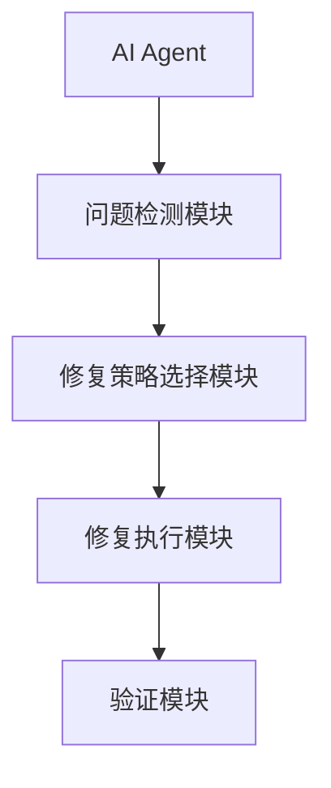
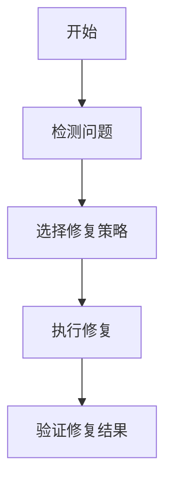
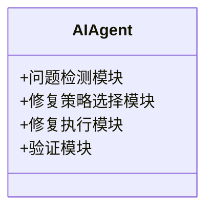
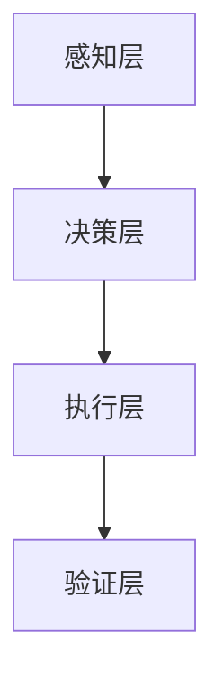
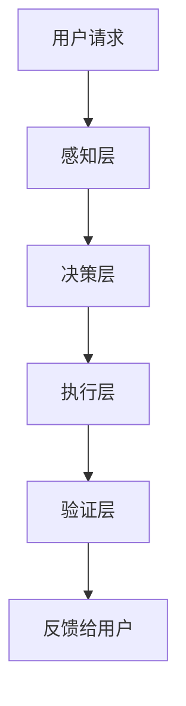

                 


# 构建具有自我修复能力的AI Agent

## 关键词：AI Agent, 自我修复, 自适应学习, 错误检测, 修复策略

## 摘要：  
本文探讨了构建具有自我修复能力的AI Agent的关键技术，从基本概念到算法实现，再到系统架构设计，详细分析了自我修复机制的核心原理及其在实际场景中的应用。通过理论与实践相结合的方式，本文为读者提供了构建高效、可靠的智能系统提供了新的思路和方法。

---

# 第1章: AI Agent与自我修复能力概述

## 1.1 AI Agent的基本概念

### 1.1.1 AI Agent的定义
AI Agent（人工智能代理）是一种能够感知环境、自主决策并执行任务的智能实体。它通过传感器获取信息，利用推理能力做出决策，并通过执行器与环境交互。AI Agent可以是软件程序、机器人或其他智能系统。

### 1.1.2 AI Agent的核心特征
1. **自主性**：能够在没有外部干预的情况下自主运行。
2. **反应性**：能够实时感知环境并做出反应。
3. **目标导向**：通过设定目标来指导行为和决策。
4. **学习能力**：能够通过经验改进性能。

### 1.1.3 自我修复能力的定义与内涵
自我修复能力是指AI Agent在运行过程中检测问题、分析问题原因，并自动采取措施修复问题的能力。这种能力使得AI Agent能够在动态和不确定的环境中保持稳定运行。

---

## 1.2 自我修复能力的重要性

### 1.2.1 AI Agent在复杂环境中的挑战
1. **动态环境**：环境条件不断变化，可能导致系统故障。
2. **不确定性**：AI Agent需要处理不完整或模糊的信息。
3. **复杂任务**：复杂的任务可能涉及多个子任务，容易出现错误。

### 1.2.2 自我修复能力的必要性
1. **提高系统可靠性**：通过自动修复问题，减少人为干预的需求。
2. **增强适应性**：使AI Agent能够更好地应对环境变化。
3. **提升用户体验**：减少系统故障对用户造成的影响。

### 1.2.3 自我修复能力的边界与外延
1. **边界**：自我修复能力仅限于系统内部问题，无法解决外部环境中的不可抗力因素。
2. **外延**：自我修复能力可以与其他技术（如自适应学习）结合，进一步增强系统的智能性。

---

## 1.3 自我修复AI Agent的应用场景

### 1.3.1 智能助手中的自我修复
AI助手（如Siri、Alexa）需要处理用户的多样化请求，自我修复能力可以帮助其在出现故障时快速恢复，确保用户体验。

### 1.3.2 自动化系统中的自我修复
在工业自动化、智能家居等领域，AI Agent需要能够检测设备故障并自动修复，减少停机时间。

### 1.3.3 人机协作中的自我修复
在团队协作中，AI Agent需要能够检测与人类协作中的问题，并主动调整策略，以提高协作效率。

---

## 1.4 本章小结
本章介绍了AI Agent的基本概念和自我修复能力的重要性。通过分析自我修复能力在不同场景中的应用，我们理解了其在提升系统可靠性、适应性和用户体验方面的关键作用。

---

# 第2章: 自我修复AI Agent的核心概念与联系

## 2.1 自我修复机制的原理

### 2.1.1 错误检测与识别
AI Agent通过传感器或监控模块实时收集数据，利用异常检测算法识别潜在问题。

### 2.1.2 自我修复策略的选择
根据问题的严重性和影响范围，AI Agent会选择合适的修复策略，如重新配置参数、调用备用模块等。

### 2.1.3 修复执行与验证
修复策略执行后，AI Agent会验证修复结果，确保问题已解决，并记录修复过程以供后续优化。

---

## 2.2 核心概念对比分析

### 2.2.1 AI Agent与传统自动化系统对比
| **特性**          | **AI Agent**          | **传统自动化系统**          |
|-------------------|-----------------------|-----------------------------|
| **自主性**        | 高                    | 低                          |
| **适应性**        | 强                    | 较弱                        |
| **学习能力**      | 有                    | 无                          |

### 2.2.2 自我修复与自适应学习的对比
| **特性**          | **自我修复**          | **自适应学习**              |
|-------------------|-----------------------|-----------------------------|
| **目标**          | 修复问题              | 改进性能                    |
| **机制**          | 错误检测与修复        | 数据学习与优化              |

### 2.2.3 自我修复与容错机制的对比
| **特性**          | **自我修复**          | **容错机制**                |
|-------------------|-----------------------|-----------------------------|
| **主动性**        | 主动修复问题          | 被动应对故障                |
| **范围**          | 系统内部问题          | 整体系统容错                |

---

## 2.3 实体关系图与流程图

### 2.3.1 ER实体关系图


### 2.3.2 自我修复流程图


---

## 2.4 本章小结
本章通过对比分析，明确了AI Agent自我修复能力的核心概念及其与其他技术的区别与联系。实体关系图和流程图进一步展示了自我修复机制的实现过程。

---

# 第3章: 自我修复AI Agent的算法原理

## 3.1 错误检测算法

### 3.1.1 基于强化学习的错误检测
通过强化学习，AI Agent可以学习如何识别异常状态，并将其标记为错误。

### 3.1.2 基于自监督学习的错误检测
自监督学习利用任务内部的监督信号，如重建任务，来检测数据中的异常。

---

## 3.2 修复策略选择算法

### 3.2.1 基于Q-Learning的修复策略选择
Q-Learning是一种经典的强化学习算法，适用于离散动作空间的策略选择。

公式：
$$ Q(s, a) = Q(s, a) + \alpha (r + \max_{a'} Q(s', a') - Q(s, a)) $$

---

## 3.3 修复执行与验证算法

### 3.3.1 基于反馈的修复验证
通过执行修复操作并观察结果，AI Agent可以验证修复是否成功。

---

## 3.4 本章小结
本章详细介绍了自我修复AI Agent中常用的算法，包括错误检测、修复策略选择和验证算法。这些算法为实现自我修复能力提供了理论基础。

---

# 第4章: 自我修复AI Agent的系统架构设计

## 4.1 问题场景介绍

### 4.1.1 系统组成
AI Agent系统通常包括感知层、决策层和执行层。

### 4.1.2 系统目标
设计一个能够检测问题、选择修复策略并执行修复的智能系统。

---

## 4.2 系统功能设计

### 4.2.1 领域模型


### 4.2.2 系统架构图


### 4.2.3 接口设计
1. **问题检测接口**：接收传感器数据，返回问题诊断结果。
2. **修复策略接口**：接收问题诊断结果，返回修复策略。
3. **修复执行接口**：接收修复策略，执行修复操作。
4. **验证接口**：验证修复结果，反馈给AI Agent。

### 4.2.4 交互流程图


---

## 4.3 本章小结
本章从系统架构设计的角度，详细介绍了自我修复AI Agent的组成部分和工作流程。通过领域模型和交互流程图，我们清晰地理解了系统的运行机制。

---

# 第5章: 自我修复AI Agent的项目实战

## 5.1 环境配置

### 5.1.1 开发环境
1. Python 3.8+
2. PyTorch 1.9+
3. Mermaid 8.5.0
4. VS Code或Jupyter Notebook

---

## 5.2 核心代码实现

### 5.2.1 错误检测模块
```python
def detect_error(data):
    # 实现错误检测逻辑
    pass
```

### 5.2.2 修复策略选择模块
```python
def choose_repair_strategy(error_type):
    # 根据错误类型选择修复策略
    pass
```

### 5.2.3 修复执行模块
```python
def execute_repair(repair_strategy):
    # 执行修复操作
    pass
```

### 5.2.4 验证模块
```python
def validate_repair():
    # 验证修复结果
    pass
```

---

## 5.3 代码解读与分析

### 5.3.1 错误检测模块的实现细节
详细解释`detect_error`函数的实现逻辑，包括数据预处理、异常检测算法的选择等。

### 5.3.2 修复策略选择模块的实现细节
详细解释`choose_repair_strategy`函数的实现逻辑，包括策略选择算法的选择、修复策略的优先级等。

---

## 5.4 实际案例分析

### 5.4.1 案例背景
描述一个具体的场景，如AI Agent在智能家居中的应用。

### 5.4.2 案例分析
详细分析AI Agent在该场景中的问题检测、修复策略选择和执行过程。

### 5.4.3 案例总结
总结该案例的成功经验，提出改进建议。

---

## 5.5 本章小结
本章通过具体的项目实战，详细展示了自我修复AI Agent的实现过程。通过代码解读和案例分析，读者可以更好地理解理论知识的实际应用。

---

# 第6章: 自我修复AI Agent的最佳实践

## 6.1 小结

### 6.1.1 核心观点回顾
总结本文的核心观点，强调自我修复能力在AI Agent中的重要性。

---

## 6.2 注意事项

### 6.2.1 系统设计中的常见问题
1. **过度修复**：修复策略选择不当可能导致问题扩大。
2. **反馈延迟**：验证模块的反馈延迟可能影响系统实时性。
3. **数据依赖**：错误检测和修复策略依赖于高质量的数据。

### 6.2.2 代码实现中的常见问题
1. **算法选择**：选择合适的算法以提高系统性能。
2. **模块耦合**：避免模块之间的高度耦合，确保系统可扩展性。
3. **测试不足**：充分的测试是确保系统稳定运行的关键。

---

## 6.3 拓展阅读

### 6.3.1 相关技术
1. **强化学习**：进一步研究强化学习在AI Agent中的应用。
2. **自监督学习**：探索自监督学习在错误检测中的潜力。
3. **分布式系统**：研究分布式AI Agent的自我修复机制。

### 6.3.2 推荐书籍
1. 《强化学习入门》
2. 《自监督学习实战》
3. 《分布式系统设计与实现》

---

# 第7章: 结语

## 7.1 未来展望
随着AI技术的不断发展，自我修复AI Agent将更加智能化和自主化。未来的挑战在于如何在更复杂的环境中实现高效的自我修复能力。

## 7.2 致谢
感谢读者的耐心阅读，感谢同行的指导与支持。

---

# 作者：AI天才研究院 & 禅与计算机程序设计艺术

---

以上是《构建具有自我修复能力的AI Agent》的技术博客文章的完整目录和部分内容。由于篇幅限制，这里只展示了部分章节的内容，具体内容可根据实际需求进一步扩展和详细阐述。

