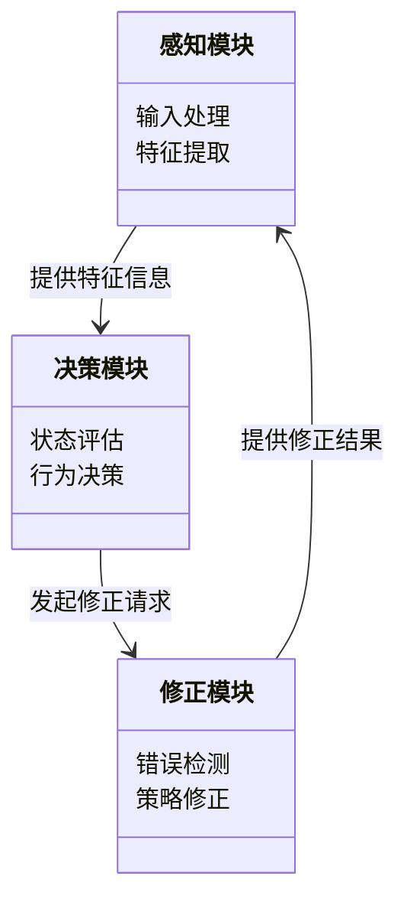
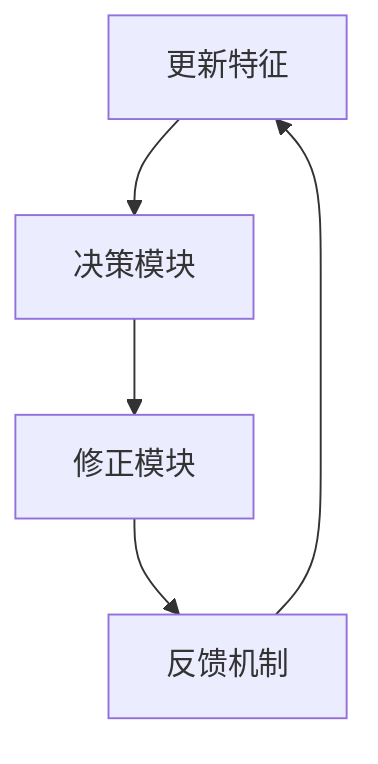
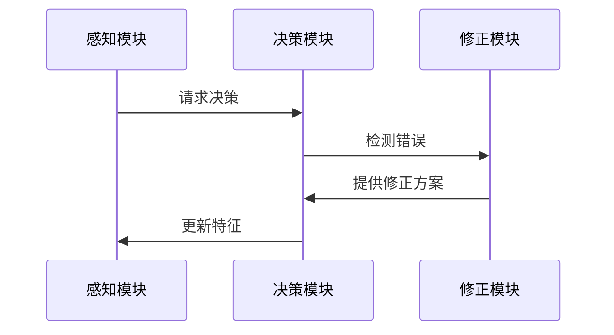

                 


# 构建具有自我修正能力的AI Agent

> 关键词：AI Agent，自我修正，强化学习，监督学习，混合学习策略

> 摘要：本文详细探讨了构建具有自我修正能力的AI Agent的理论基础、算法实现、系统架构设计及项目实战。文章从核心概念出发，逐步分析了自我修正机制的实现原理，并通过数学模型和代码示例展示了如何将这些理论应用于实际项目中。最后，本文总结了构建此类AI Agent的关键点及未来的研究方向。

---

# 第一部分: 构建具有自我修正能力的AI Agent概述

## 第1章: 自我修正AI Agent的核心概念

### 1.1 问题背景与定义

#### 1.1.1 传统AI Agent的局限性
传统的AI Agent通常依赖于预先设定的规则或训练好的模型，但在面对动态变化的环境或未见数据时，往往难以适应新的情况，导致错误发生后无法自动修复。

#### 1.1.2 自我修正能力的定义
自我修正能力是指AI Agent在运行过程中能够检测自身的行为或决策中的错误，并通过学习或调整策略来修复这些错误，从而提高系统的稳定性和可靠性。

#### 1.1.3 自我修正AI Agent的必要性
随着AI技术在复杂场景中的广泛应用，构建能够自我修正的AI Agent变得尤为重要。这种能力可以显著减少人为干预的需求，提升系统的自主性和智能性。

---

### 1.2 技术背景与演进

#### 1.2.1 AI Agent的历史发展
AI Agent的概念可以追溯到20世纪60年代，早期的研究主要集中在逻辑推理和专家系统上。随着机器学习和深度学习的兴起，AI Agent的能力得到了显著提升。

#### 1.2.2 自我修正能力的技术基础
自我修正能力依赖于多种技术的结合，包括强化学习、监督学习以及反馈机制等。这些技术的融合使得AI Agent能够从经验中学习，并不断优化自身的决策过程。

#### 1.2.3 当前研究现状与挑战
当前，学术界和工业界都在积极探索AI Agent的自我修正能力。然而，如何在动态变化的环境中实现高效的自我修正，仍是一个具有挑战性的研究方向。

---

## 第2章: 自我修正AI Agent的核心机制

### 2.1 错误检测与识别

#### 2.1.1 错误检测的原理
错误检测可以通过多种方式实现，例如基于模型预测的置信度、用户反馈或环境反馈等。当模型预测的结果与预期不符时，系统会触发错误检测机制。

#### 2.1.2 基于反馈的错误识别
用户或系统的反馈是识别错误的重要来源。通过分析反馈，AI Agent可以定位错误的具体原因，并采取相应的修正措施。

#### 2.1.3 基于上下文的错误定位
上下文信息（如环境状态、历史操作等）可以帮助AI Agent更准确地定位错误。例如，在自然语言处理任务中，上下文可以提供额外的线索来识别错误。

---

### 2.2 自我修正算法

#### 2.2.1 基于强化学习的自我修正
强化学习是一种有效的自我修正策略。通过定义适当的奖励函数，AI Agent可以在与环境的交互中学习最优行为。

#### 2.2.2 基于监督学习的自我修正
监督学习通过提供带标签的训练数据，帮助AI Agent学习如何修正错误。这种方法适用于有明确修正目标的场景。

#### 2.2.3 混合学习策略的自我修正
结合强化学习和监督学习的优点，混合学习策略可以在复杂场景中实现更高效的自我修正。

---

## 第3章: 自我修正AI Agent的系统架构

### 3.1 系统模块划分

#### 3.1.1 感知模块
感知模块负责收集环境中的信息，并将其转化为系统可处理的形式。例如，在自然语言处理任务中，感知模块可能负责文本的预处理和特征提取。

#### 3.1.2 决策模块
决策模块基于感知模块提供的信息，生成相应的决策或行动计划。这个过程可能涉及多种算法的结合使用。

#### 3.1.3 修正模块
修正模块负责检测和修正系统中的错误。它可能通过调用外部工具或重新优化内部模型来实现自我修正。

---

### 3.2 模块间关系与协作

#### 3.2.1 感知与决策的交互
感知模块和决策模块之间需要高效的通信机制，以确保信息的及时传递和决策的正确性。

#### 3.2.2 决策与修正的协同
决策模块和修正模块需要紧密协作，以确保在出现错误时能够迅速响应并采取修正措施。

#### 3.2.3 模块间的通信机制
模块间的通信机制需要设计得高效且可靠，以确保系统的整体性能。

---

# 第二部分: 自我修正AI Agent的算法原理

## 第4章: 自我修正AI Agent的数学模型与算法

### 4.1 基于强化学习的数学模型

#### 4.1.1 Q-learning算法
Q-learning是一种经典的强化学习算法，其核心思想是通过更新Q值表来学习最优策略。

$$ Q(s, a) = Q(s, a) + \alpha (r + \max Q(s', a') - Q(s, a)) $$

其中，$s$是状态，$a$是动作，$r$是奖励，$\alpha$是学习率。

#### 4.1.2 策略梯度方法
策略梯度方法通过优化策略的参数来直接最大化期望奖励。

$$ \nabla \theta \leftarrow \nabla \log \pi_\theta(s) \cdot Q(s, a) $$

其中，$\pi_\theta$是策略函数，$Q$是价值函数。

#### 4.1.3 算法的数学推导
通过数学推导，可以证明Q-learning和策略梯度方法在特定条件下的收敛性。

---

### 4.2 基于监督学习的数学模型

#### 4.2.1 损失函数设计
监督学习的损失函数通常采用均方误差或交叉熵损失。

$$ \mathcal{L} = \frac{1}{N} \sum_{i=1}^{N} (y_i - \hat{y}_i)^2 $$

其中，$y_i$是真实标签，$\hat{y}_i$是模型预测值。

#### 4.2.2 梯度下降优化
通过梯度下降优化算法，可以最小化损失函数。

$$ \theta \leftarrow \theta - \eta \nabla \mathcal{L} $$

其中，$\eta$是学习率。

---

### 4.3 混合学习策略的数学模型

#### 4.3.1 强化学习与监督学习的结合
混合学习策略可以通过加权组合强化学习和监督学习的损失函数来实现。

$$ \mathcal{L}_{\text{total}} = \lambda \mathcal{L}_{\text{RL}} + (1 - \lambda) \mathcal{L}_{\text{SL}} $$

其中，$\lambda$是权重系数，$\mathcal{L}_{\text{RL}}$和$\mathcal{L}_{\text{SL}}$分别是强化学习和监督学习的损失函数。

#### 4.3.2 算法的收敛性分析
通过数学分析，可以证明混合学习策略在特定条件下的收敛性。

---

## 第5章: 自我修正AI Agent的系统分析与设计

### 5.1 问题场景介绍

#### 5.1.1 典型应用场景
例如，在自然语言处理任务中，AI Agent需要能够检测并修正自身的语法错误或语义理解错误。

#### 5.1.2 系统目标与约束
系统的总体目标是实现自我修正能力，同时满足实时性、可靠性和可扩展性的约束。

#### 5.1.3 项目需求分析
项目需求可能包括错误检测的准确率、修正的效率以及系统的可维护性等。

---

### 5.2 系统功能设计

#### 5.2.1 领域模型设计
领域模型类图展示了系统的各个模块及其之间的关系。



---

#### 5.2.2 系统架构设计



---

#### 5.2.3 系统交互流程



---

## 第6章: 自我修正AI Agent的项目实战

### 6.1 环境安装与配置

#### 6.1.1 开发环境搭建
安装Python、TensorFlow和Keras等必要的开发工具。

#### 6.1.2 环境配置
设置虚拟环境并安装所需的依赖包。

---

### 6.2 核心代码实现

#### 6.2.1 错误检测模块

```python
class ErrorDetection:
    def __init__(self):
        self.model = self.build_model()

    def build_model(self):
        # 定义模型架构
        model = Sequential()
        model.add(Dense(64, activation='relu', input_dim=100))
        model.add(Dense(1, activation='sigmoid'))
        model.compile(optimizer='adam', loss='binary_crossentropy', metrics=['accuracy'])
        return model

    def detect_error(self, input_data):
        prediction = self.model.predict(input_data)
        if prediction[0][0] > 0.5:
            return True
        else:
            return False
```

---

#### 6.2.2 自我修正模块

```python
class SelfCorrection:
    def __init__(self):
        self.rl_agent = RLAgent()
        self.sl_model = SLModel()

    def correct_error(self, error_info):
        # 使用强化学习策略进行修正
        action = self.rl_agent.act(error_info)
        # 使用监督学习进行验证
        if self.sl_model.predict(action):
            return action
        else:
            return self.correct_error(error_info)
```

---

### 6.3 实际案例分析

#### 6.3.1 案例背景
假设在自然语言处理任务中，AI Agent需要修正语法错误。

#### 6.3.2 代码实现
使用上述代码实现错误检测和修正模块，并进行实际测试。

#### 6.3.3 结果分析
分析测试结果，评估系统的自我修正能力。

---

## 第7章: 总结与展望

### 7.1 最佳实践 tips

- 确保系统的模块化设计，便于维护和扩展。
- 在实际应用中，结合具体场景选择合适的算法组合。

### 7.2 小结

本文详细探讨了构建具有自我修正能力的AI Agent的理论基础、算法实现和系统设计。通过实际案例的分析，展示了如何将理论应用于实践。

### 7.3 注意事项

- 系统的自我修正能力需要在实际应用中不断优化。
- 注意数据隐私和模型安全问题。

### 7.4 拓展阅读

建议读者进一步研究强化学习和监督学习的结合应用，以及如何在更复杂的场景中实现自我修正。

---

作者：AI天才研究院 & 禅与计算机程序设计艺术

