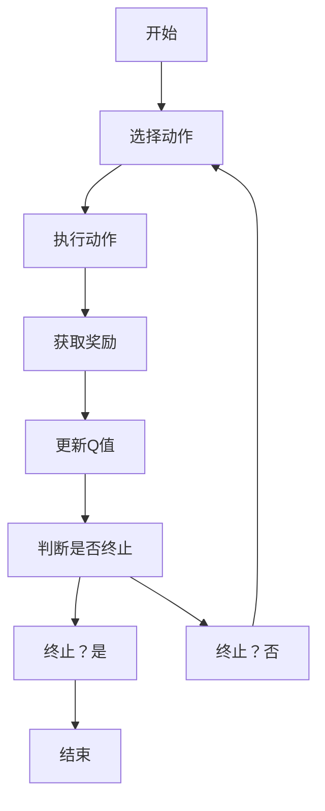
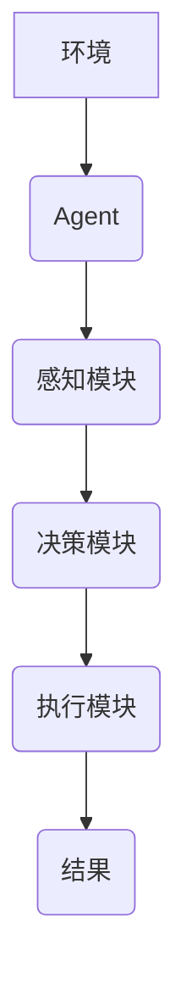
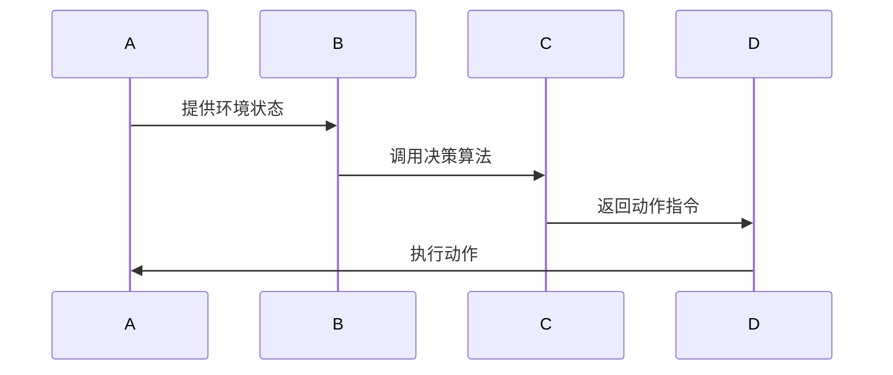

                 


# 构建具有自我演化能力的AI Agent系统

---

## 关键词：
- AI Agent
- 自我演化
- 强化学习
- 自适应控制
- 系统架构

---

## 摘要：
本文将详细探讨如何构建具有自我演化能力的AI Agent系统。通过分析AI Agent的核心概念、算法原理、系统架构以及实际案例，我们将一步步揭示如何让AI Agent具备自我学习、适应和优化的能力。文章从背景介绍到系统实现，从理论分析到代码实战，全面解析自我演化AI Agent的构建过程。

---

# 第一部分: 自我演化AI Agent系统背景与核心概念

## 第1章: AI Agent与自我演化能力概述

### 1.1 AI Agent的基本概念

#### 1.1.1 什么是AI Agent

AI Agent（人工智能代理）是一种能够感知环境、自主决策并执行任务的智能实体。它可以是一个软件程序，也可以是一个物理设备，通过与环境交互来实现特定目标。

#### 1.1.2 AI Agent的核心特征

AI Agent的核心特征包括：

- **自主性**：能够在没有外部干预的情况下独立运行。
- **反应性**：能够实时感知环境并做出反应。
- **目标导向性**：所有行为都围绕实现特定目标展开。

#### 1.1.3 自我演化能力的定义

自我演化能力是指AI Agent在运行过程中，能够根据环境反馈不断优化自身行为、调整策略并适应变化的能力。

### 1.2 自我演化AI Agent的背景与意义

#### 1.2.1 当前AI技术的发展现状

当前AI技术主要依赖于大量数据和计算能力，虽然在图像识别、自然语言处理等领域取得了显著成果，但大多数AI系统仍然缺乏真正的“自主性”和“适应性”。

#### 1.2.2 自我演化能力的必要性

在动态变化的环境中，传统的静态AI系统难以应对不确定性，而具备自我演化能力的AI Agent能够更好地适应环境变化，提高任务执行效率。

#### 1.2.3 自我演化AI Agent的应用场景

自我演化AI Agent在智能机器人、自动驾驶、智能助手等领域有广泛应用，能够显著提升系统的灵活性和智能性。

### 1.3 自我演化能力与传统AI的区别

#### 1.3.1 传统AI的局限性

传统AI系统依赖于预设的规则和数据，缺乏自主学习和适应能力。

#### 1.3.2 自我演化AI的优势

自我演化AI能够根据环境反馈动态调整策略，具有更强的适应性和自主性。

#### 1.3.3 两者的对比分析

| 特性 | 传统AI | 自我演化AI |
|------|--------|------------|
| 自主性 | 低     | 高         |
| 适应性 | 低     | 高         |
| 学习能力 | 无     | 有         |

## 第2章: 自我演化AI Agent的核心概念与联系

### 2.1 自我演化能力的特征分析

#### 2.1.1 自适应性

AI Agent能够根据环境变化调整自身行为，以实现目标。

#### 2.1.2 自学习能力

AI Agent能够通过经验积累和反馈优化自身算法。

#### 2.1.3 自优化能力

AI Agent能够自动优化其内部参数和策略，以提高性能。

### 2.2 自我演化系统的核心模块

#### 2.2.1 感知模块

AI Agent通过传感器或API接口感知外部环境的状态。

#### 2.2.2 决策模块

基于感知信息，决策模块生成行动策略。

#### 2.2.3 执行模块

根据决策模块的指令，执行模块采取具体行动。

### 2.3 自我演化能力与相关技术的关系

#### 2.3.1 与强化学习的关系

强化学习是实现自我演化能力的重要技术，通过奖励机制优化AI Agent的行为。

#### 2.3.2 与自适应控制的关系

自适应控制技术为AI Agent提供了动态调整系统参数的能力。

#### 2.3.3 与知识图谱的关系

知识图谱为AI Agent提供了丰富的先验知识，帮助其更好地理解环境。

### 2.4 核心概念对比表

| 特征 | 自我演化AI Agent | 传统AI Agent |
|------|------------------|--------------|
| 自适应性 | 强               | 弱            |
| 学习能力 | 强               | 无            |
| 

---

# 第二部分: 自我演化AI Agent的算法原理

## 第3章: 自我演化AI Agent的算法实现

### 3.1 强化学习算法

#### 3.1.1 强化学习的基本原理

强化学习是一种通过试错机制来优化决策策略的算法。AI Agent通过与环境交互，学习最优行为策略。

#### 3.1.2 Q-Learning算法

Q-Learning是一种经典的强化学习算法，通过维护Q值表来记录状态-动作对的期望奖励。

#### 3.1.3 算法流程图（使用mermaid）



### 3.2 自我演化算法的数学模型

#### 3.2.1 状态空间

状态空间表示所有可能的状态集合，通常用S表示。

#### 3.2.2 动作空间

动作空间表示所有可能的动作集合，通常用A表示。

#### 3.2.3 状态转移概率

状态转移概率P(s', r | s, a)表示在状态s下执行动作a后，转移到状态s'并获得奖励r的概率。

#### 3.2.4 Q值更新公式

Q-learning算法的更新公式为：

$$ Q(s, a) = Q(s, a) + \alpha [r + \gamma \max Q(s', a') - Q(s, a)] $$

其中，α是学习率，γ是折扣因子。

### 3.3 算法实现的Python代码示例

```python
import numpy as np

class AI-Agent:
    def __init__(self, state_space_size, action_space_size):
        self.q_table = np.zeros((state_space_size, action_space_size))
        
    def choose_action(self, state, epsilon=0.1):
        if np.random.random() < epsilon:
            return np.random.randint(0, action_space_size)
        else:
            return np.argmax(self.q_table[state])
    
    def learn(self, state, action, reward, next_state):
        self.q_table[state, action] += 0.1 * (reward + 0.9 * np.max(self.q_table[next_state]) - self.q_table[state, action])
```

---

## 第4章: 自我演化AI Agent的系统架构设计

### 4.1 系统功能模块设计

#### 4.1.1 感知模块

通过传感器或API接口获取环境信息。

#### 4.1.2 决策模块

基于感知信息生成行动策略。

#### 4.1.3 执行模块

根据决策结果执行具体动作。

### 4.2 系统架构图（使用mermaid）



### 4.3 接口设计与交互流程

#### 4.3.1 接口设计

- 输入接口：接收环境状态信息。
- 输出接口：发送动作指令。

#### 4.3.2 交互流程图



---

## 第5章: 自我演化AI Agent的项目实战

### 5.1 环境配置

安装必要的库，如numpy、pandas等。

### 5.2 核心代码实现

```python
import numpy as np

class Agent:
    def __init__(self, state_size, action_size):
        self.q_table = np.zeros((state_size, action_size))
        
    def choose_action(self, state, epsilon=0.1):
        if np.random.random() < epsilon:
            return np.random.randint(0, action_size)
        else:
            return np.argmax(self.q_table[state])
    
    def learn(self, state, action, reward, next_state):
        self.q_table[state, action] += 0.1 * (reward + 0.9 * np.max(self.q_table[next_state]) - self.q_table[state, action])
```

### 5.3 案例分析

通过一个简单的迷宫导航案例，展示AI Agent如何通过强化学习实现自我演化。

---

## 第6章: 自我演化AI Agent的最佳实践与注意事项

### 6.1 实践 tips

- 定期更新算法模型，保持系统的适应性。
- 在复杂环境中逐步训练AI Agent，避免过度优化。

### 6.2 小结

通过本文的详细讲解，读者可以掌握构建自我演化AI Agent的核心方法和实际应用技巧。

---

## 第7章: 总结与展望

### 7.1 全文总结

本文从理论到实践，全面解析了自我演化AI Agent的构建过程，为读者提供了系统的知识体系。

### 7.2 未来展望

随着AI技术的发展，自我演化AI Agent将在更多领域发挥重要作用，为人类创造更大的价值。

---

## 作者：AI天才研究院 & 禅与计算机程序设计艺术

---

以上是《构建具有自我演化能力的AI Agent系统》的文章内容，希望对您有所帮助！

