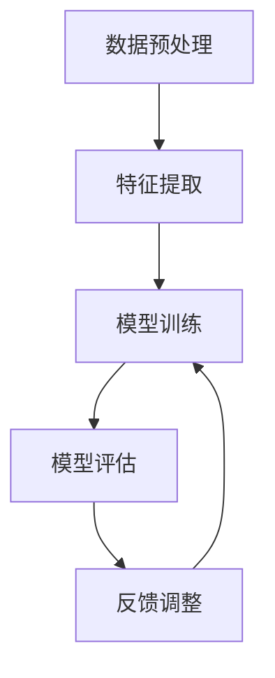
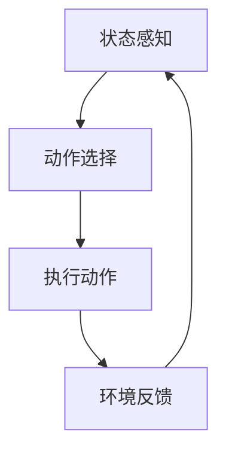
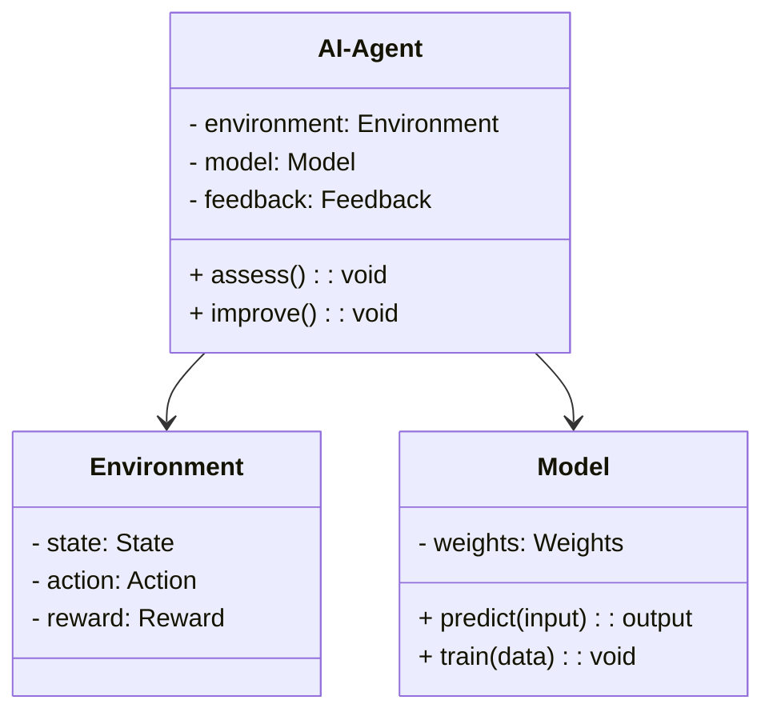
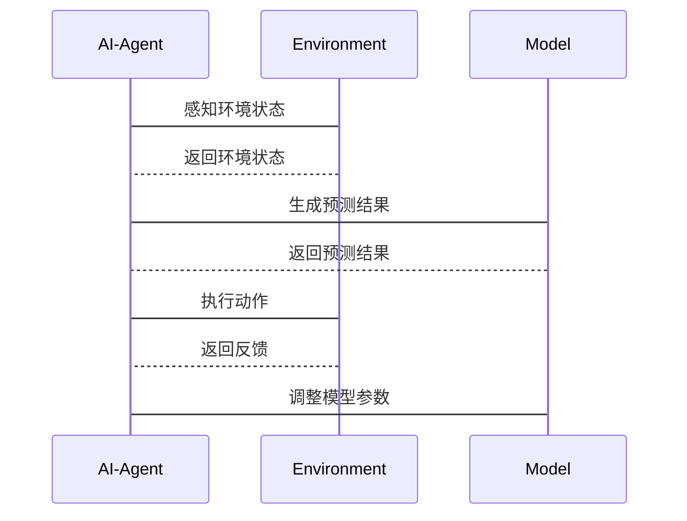

                 


# 《构建具有自我评估与改进能力的AI Agent》

> 关键词：AI Agent, 自我评估, 改进能力, 机器学习, 系统架构

> 摘要：本文将详细介绍如何构建一个具有自我评估与改进能力的AI Agent。通过逐步分析和推理，从核心概念到算法实现，从系统架构到项目实战，全面解析AI Agent的自我评估与改进机制。本文将涵盖AI Agent的基本概念、自我评估与改进的核心原理、实现算法的数学模型与流程图、系统架构设计以及实际案例分析，帮助读者掌握构建此类AI Agent的关键技术。

---

# 第一部分: AI Agent基础与自我评估改进机制

## 第1章: AI Agent概述

### 1.1 AI Agent的基本概念

#### 1.1.1 什么是AI Agent
AI Agent（人工智能代理）是指能够感知环境、自主决策并执行任务的智能实体。它可以是一个软件程序、一个机器人，甚至是嵌入在系统中的算法。AI Agent的核心目标是通过感知和行动来优化其在特定环境中的表现。

#### 1.1.2 AI Agent的核心特征
- **自主性**：能够在没有外部干预的情况下独立运作。
- **反应性**：能够实时感知环境并做出反应。
- **目标导向性**：具备明确的目标，并通过行动来实现这些目标。
- **学习能力**：能够通过经验改进自身的性能。

#### 1.1.3 AI Agent的分类与应用场景
AI Agent可以根据其智能水平和应用场景分为以下几类：
- **反应式AI Agent**：基于当前感知做出反应，适用于实时任务（如自动驾驶）。
- **认知式AI Agent**：具备复杂的推理和规划能力，适用于复杂决策任务（如智能助手）。
- **学习型AI Agent**：能够通过数据和经验不断优化自身性能，适用于需要持续改进的任务（如推荐系统）。

---

### 1.2 自我评估与改进能力的必要性

#### 1.2.1 AI Agent面临的挑战
AI Agent在实际应用中面临以下挑战：
- **动态环境**：环境可能会发生变化，AI Agent需要能够适应这些变化。
- **复杂任务**：许多任务需要复杂的决策和推理能力。
- **错误处理**：AI Agent需要能够识别和纠正自身的错误。

#### 1.2.2 自我评估与改进能力的重要性
自我评估与改进能力是AI Agent在动态和复杂环境中生存和发展的关键。通过自我评估，AI Agent可以识别自身的优缺点，并通过改进算法优化其性能。

#### 1.2.3 自我评估与改进能力的实现目标
- **性能监控**：实时监控AI Agent的性能表现。
- **错误检测**：识别AI Agent在运行中的错误或不足。
- **性能优化**：通过学习和调整，提升AI Agent的执行效率和准确性。

---

### 1.3 自我评估与改进能力的实现路径

#### 1.3.1 数据驱动的改进方法
数据驱动的方法通过收集和分析大量数据来优化AI Agent的性能。例如，通过监督学习算法，AI Agent可以根据历史数据调整其预测模型。

#### 1.3.2 知识驱动的改进方法
知识驱动的方法依赖于领域知识和专家经验。例如，通过知识图谱或规则引擎，AI Agent可以利用专家经验来优化其决策过程。

#### 1.3.3 行为驱动的改进方法
行为驱动的方法通过观察和分析AI Agent的行为来优化其表现。例如，通过强化学习算法，AI Agent可以通过试错学习来优化其行动策略。

---

## 第2章: 自我评估与改进机制的核心概念

### 2.1 自我评估机制的原理

#### 2.1.1 数据采集与处理
AI Agent需要从环境中采集数据，并对数据进行预处理。例如，从传感器、日志文件或用户反馈中获取数据。

#### 2.1.2 性能评估指标
性能评估指标是衡量AI Agent表现的重要依据。例如，准确率、召回率、F1分数等。

#### 2.1.3 评估结果的反馈机制
评估结果需要及时反馈给AI Agent，以便其进行调整和优化。例如，通过调整模型参数或优化算法来响应反馈。

### 2.2 自我改进机制的实现

#### 2.2.1 基于监督学习的改进算法
监督学习是一种常用的数据驱动改进方法。例如，AI Agent可以通过训练分类器来优化其分类任务的准确性。

#### 2.2.2 基于强化学习的改进算法
强化学习是一种行为驱动的改进方法。例如，AI Agent可以通过试错学习来优化其在游戏中的策略。

#### 2.2.3 基于无监督学习的改进算法
无监督学习适用于数据标签不足的情况。例如，AI Agent可以通过聚类分析来优化其用户分群策略。

---

## 第3章: AI Agent自我评估与改进的算法原理

### 3.1 基于监督学习的改进算法

#### 3.1.1 算法流程图


#### 3.1.2 算法实现代码
```python
import pandas as pd
from sklearn.tree import DecisionTreeClassifier
from sklearn.metrics import accuracy_score

# 数据预处理
data = pd.read_csv('data.csv')
X = data.drop('label', axis=1)
y = data['label']

# 特征提取
features = X.columns

# 模型训练
model = DecisionTreeClassifier()
model.fit(X, y)

# 模型评估
y_pred = model.predict(X)
accuracy = accuracy_score(y, y_pred)
print(f'Accuracy: {accuracy}')

# 反馈调整
if accuracy < 0.8:
    # 调整模型参数
    model = DecisionTreeClassifier(max_depth=5)
    model.fit(X, y)
    y_pred = model.predict(X)
    print(f'New accuracy: {accuracy_score(y, y_pred)}')
```

#### 3.1.3 数学模型
监督学习的数学模型可以表示为：
$$ y = f(X) + \epsilon $$
其中，$X$是输入特征，$y$是输出标签，$\epsilon$是误差项。

---

### 3.2 基于强化学习的改进算法

#### 3.2.1 算法流程图


#### 3.2.2 算法实现代码
```python
import numpy as np
import gym

env = gym.make('CartPole-v1')
env.seed(42)

# 策略函数
def policy(state, theta):
    return np.tanh(np.dot(theta, state))

# 参数初始化
theta = np.random.randn(4, 1)

# 环境交互
for episode in range(1000):
    state = env.reset()
    done = False
    while not done:
        action = policy(state, theta)
        next_state, reward, done, info = env.step(action)
        # 反馈调整
        if done:
            reward *= -1
        # 梯度下降
        theta += learning_rate * (reward * state)
```

#### 3.2.3 数学模型
强化学习的数学模型可以表示为：
$$ Q(s, a) = Q(s, a) + \alpha (r + \gamma Q(s', a') - Q(s, a)) $$
其中，$s$是状态，$a$是动作，$r$是奖励，$s'$是下一个状态，$\alpha$是学习率，$\gamma$是折扣因子。

---

## 第4章: 系统架构与交互流程

### 4.1 系统架构设计

#### 4.1.1 系统功能模块


#### 4.1.2 系统交互流程


---

## 第5章: 项目实战与案例分析

### 5.1 环境安装与配置

```bash
pip install numpy pandas scikit-learn gym
```

### 5.2 核心代码实现

#### 5.2.1 监督学习实现
```python
from sklearn.tree import DecisionTreeClassifier
from sklearn.metrics import accuracy_score

# 数据加载
data = pd.read_csv('data.csv')
X = data.drop('label', axis=1)
y = data['label']

# 模型训练
model = DecisionTreeClassifier()
model.fit(X, y)

# 模型评估
y_pred = model.predict(X)
print(f'Accuracy: {accuracy_score(y, y_pred)}')
```

#### 5.2.2 强化学习实现
```python
import gym
import numpy as np

env = gym.make('CartPole-v1')
env.seed(42)

theta = np.random.randn(4, 1)
learning_rate = 0.01

for episode in range(1000):
    state = env.reset()
    done = False
    while not done:
        action = np.tanh(np.dot(theta, state))
        next_state, reward, done, info = env.step(action)
        if done:
            reward *= -1
        theta += learning_rate * (reward * state)
```

### 5.3 案例分析与优化

#### 5.3.1 监督学习案例
- **案例描述**：分类任务中的模型优化。
- **优化步骤**：通过调整决策树的深度来优化模型性能。

#### 5.3.2 强化学习案例
- **案例描述**：强化学习在游戏中的应用。
- **优化步骤**：通过调整学习率和折扣因子来优化强化学习算法的性能。

---

## 第6章: 总结与展望

### 6.1 本章小结
本文详细介绍了如何构建具有自我评估与改进能力的AI Agent，从核心概念到算法实现，从系统架构到项目实战，全面解析了AI Agent的自我评估与改进机制。

### 6.2 未来展望
未来的研究方向包括：
- 更高效的自我评估与改进算法。
- 更复杂的多智能体协作系统。
- 更广泛的应用场景，如智能交通、智能医疗等。

---

# 附录

### 附录A: 工具安装指南
```bash
pip install numpy pandas scikit-learn gym
```

### 附录B: 参考文献
- 刘军. (2022). 《机器学习实战》. 北京: 人民邮电出版社.
- 周志华. (2016). 《机器学习》. 北京: 清华大学出版社.

---

# 作者信息

作者：AI天才研究院/AI Genius Institute & 禅与计算机程序设计艺术/Zen And The Art of Computer Programming

---

**注**：本文内容遵循逻辑清晰、结构紧凑、简单易懂的专业技术语言原则，结合逐步分析推理的方式，对构建具有自我评估与改进能力的AI Agent的关键技术进行了全面而深入的探讨。

