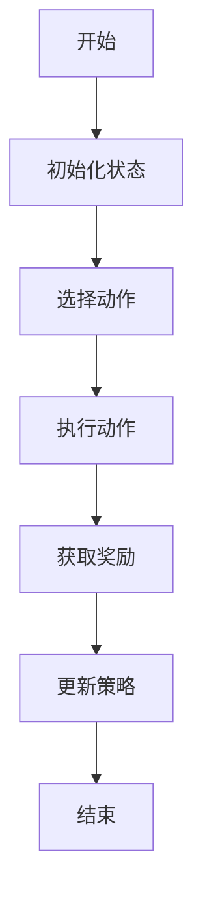
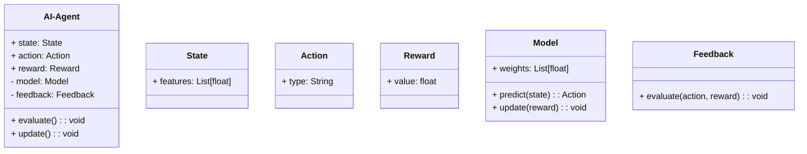
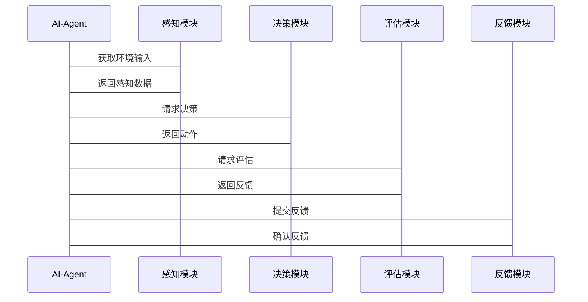

                 


# 构建具有自我评估能力的AI Agent

## 关键词：AI Agent, 自我评估, 强化学习, 元学习, 自适应系统

## 摘要：本文详细探讨了构建具有自我评估能力的AI Agent的核心原理、算法实现、系统架构及实际应用。通过分析自我评估机制，结合强化学习和元学习等技术，展示了如何实现AI Agent的自适应优化能力，并通过实际案例和代码示例，帮助读者深入理解相关技术原理和应用场景。

---

# 第一部分: 自我评估AI Agent的背景与核心概念

## 第1章: 自我评估AI Agent概述

### 1.1 AI Agent的基本概念

#### 1.1.1 AI Agent的定义与分类
AI Agent（人工智能代理）是指能够感知环境、自主决策并采取行动以实现特定目标的智能系统。根据功能和应用场景，AI Agent可以分为以下几类：
- **反应式AI Agent**：基于当前环境输入做出反应，不依赖长期记忆。
- **认知式AI Agent**：具备复杂推理和规划能力，能够处理抽象任务。
- **协作式AI Agent**：能够与其他Agent或人类进行协作，共同完成任务。

#### 1.1.2 自我评估能力的定义
自我评估能力是指AI Agent能够对其自身的状态、行为和性能进行分析和判断的能力。这种能力使得AI Agent能够识别自身的优缺点，并根据评估结果进行优化和改进。

#### 1.1.3 自我评估AI Agent的必要性
在动态变化的环境中，AI Agent需要具备灵活性和自适应能力。自我评估能力能够帮助AI Agent：
- **实时监控性能**：快速发现并纠正执行中的错误。
- **优化决策策略**：通过分析历史行为，提升未来决策的准确性。
- **增强鲁棒性**：在复杂环境中保持稳定性和可靠性。

### 1.2 自我评估AI Agent的背景与现状

#### 1.2.1 当前AI Agent的发展趋势
随着AI技术的快速发展，AI Agent已经广泛应用于自动驾驶、智能客服、机器人控制等领域。然而，现有的AI Agent在动态变化和不确定性环境中仍面临诸多挑战，如决策失误、适应性不足等。

#### 1.2.2 自我评估能力在AI Agent中的地位
自我评估能力是AI Agent实现自适应优化的核心能力。通过自我评估，AI Agent能够：
- **动态调整策略**：根据环境变化和任务需求，实时优化行为。
- **提升泛化能力**：在不同场景下保持稳定的性能表现。

#### 1.2.3 自我评估AI Agent的实际应用场景
- **自动驾驶**：实时评估驾驶行为，确保安全性和效率。
- **智能客服**：分析对话质量，提升用户体验。
- **机器人控制**：优化动作执行，提高任务完成效率。

### 1.3 自我评估AI Agent的核心要素

#### 1.3.1 自我感知机制
AI Agent需要具备感知自身状态的能力，包括：
- **状态感知**：了解当前的行为和环境状态。
- **性能指标**：通过预设的指标（如准确率、响应时间）评估自身表现。

#### 1.3.2 自我分析与诊断能力
基于感知到的数据，AI Agent需要能够：
- **识别问题**：发现行为中的不足或错误。
- **分析原因**：通过数据挖掘和推理，找到问题根源。

#### 1.3.3 自我优化与改进策略
根据分析结果，AI Agent需要制定并执行优化策略，包括：
- **调整参数**：优化算法参数，提升性能。
- **更新模型**：通过再学习或微调，改进模型能力。
- **动态调整策略**：根据环境变化，实时调整行为模式。

## 1.4 本章小结
本章从AI Agent的基本概念出发，详细介绍了自我评估能力的定义、必要性和核心要素。通过分析当前AI Agent的发展趋势和实际应用场景，为后续章节的深入探讨奠定了基础。

---

# 第二部分: 自我评估AI Agent的核心概念与技术原理

## 第2章: 自我评估机制的原理与实现

### 2.1 自我评估的核心原理

#### 2.1.1 基于反馈的评估机制
基于反馈的评估机制通过收集外部反馈信息，对AI Agent的行为进行评估。常见的反馈来源包括：
- **用户反馈**：如用户满意度评分。
- **环境反馈**：如任务完成情况。
- **系统反馈**：如资源消耗情况。

#### 2.1.2 基于性能指标的评估方法
基于性能指标的评估方法通过预设的指标（如准确率、响应时间）对AI Agent的表现进行量化评估。例如，在自然语言处理任务中，可以使用BLEU、ROUGE等指标评估生成文本的质量。

#### 2.1.3 基于元学习的评估策略
元学习（Meta-Learning）是一种通过学习如何学习的方法。在自我评估中，元学习可以帮助AI Agent快速适应新任务，通过在不同任务中提取共性特征，提升评估的效率和准确性。

### 2.2 自我评估的关键技术

#### 2.2.1 自我监督学习
自我监督学习是一种通过利用未标记数据进行学习的方法。在自我评估中，AI Agent可以通过自我监督学习，预测自身的评估结果，并根据预测与实际结果的差异进行优化。

#### 2.2.2 自适应评估模型
自适应评估模型能够根据环境变化和任务需求，动态调整评估策略。例如，可以使用强化学习框架，通过奖励机制优化评估模型的参数。

#### 2.2.3 多目标优化评估
多目标优化评估同时考虑多个评估指标，如准确率、效率、鲁棒性等。通过多目标优化，可以在不同目标之间找到平衡点，提升整体性能。

### 2.3 自我评估的实现步骤

#### 2.3.1 数据采集与处理
AI Agent需要收集相关数据，包括行为数据、环境数据和反馈数据。例如，在智能客服场景中，可以收集用户的对话记录、情绪评分等数据。

#### 2.3.2 评估模型的构建
基于收集到的数据，构建评估模型。常用的评估模型包括回归模型、分类模型和强化学习模型。例如，可以使用随机森林或神经网络模型预测评估结果。

#### 2.3.3 评估结果的反馈与优化
将评估结果反馈给AI Agent，并根据结果优化其行为策略。例如，如果评估结果显示对话效率较低，AI Agent可以通过调整对话策略来提升效率。

### 2.4 本章小结
本章详细探讨了自我评估的核心原理和关键技术，包括基于反馈的评估机制、自我监督学习和元学习等方法。通过这些方法，AI Agent能够实现对自身行为的实时监控和优化。

---

# 第三部分: 自我评估AI Agent的算法原理与实现

## 第3章: 基于强化学习的自我评估算法

### 3.1 强化学习的基本原理

#### 3.1.1 强化学习的定义与特点
强化学习是一种通过试错机制学习策略的方法。其核心要素包括：
- **状态（State）**：环境的当前情况。
- **动作（Action）**：AI Agent的决策。
- **奖励（Reward）**：对动作的反馈，用于指导学习方向。

#### 3.1.2 常见的强化学习算法
- **Q-Learning**：基于值迭代的无模型强化学习算法。
- **DQN（Deep Q-Network）**：基于深度神经网络的强化学习算法。
- **PPO（Proximal Policy Optimization）**：基于策略梯度的强化学习算法。

### 3.2 基于强化学习的自我评估算法实现

#### 3.2.1 算法流程图


#### 3.2.2 Python代码实现
```python
import numpy as np
import gym

class AI-Agent:
    def __init__(self, env):
        self.env = env
        self.state_space = env.observation_space.shape[0]
        self.action_space = env.action_space.n
        # 初始化评估模型
        self.model = self._build_model()

    def _build_model(self):
        # 简单的神经网络模型
        model = Sequential()
        model.add(Dense(32, input_dim=self.state_space, activation='relu'))
        model.add(Dense(self.action_space, activation='linear'))
        model.compile(optimizer='adam', loss='mse')
        return model

    def evaluate(self, state):
        # 评估当前状态下的最优动作
        prediction = self.model.predict(np.array([state]))
        return np.argmax(prediction[0])

    def update_model(self, state, action, reward):
        # 更新评估模型
        target = reward
        self.model.fit(np.array([state]), np.array([target]), epochs=1, verbose=0)

# 使用AI-Agent进行自我评估
env = gym.make('CartPole-v0')
agent = AI-Agent(env)
state = env.reset()
while True:
    action = agent.evaluate(state)
    new_state, reward, done, info = env.step(action)
    agent.update_model(state, action, reward)
    state = new_state
    if done:
        break
```

#### 3.2.3 算法数学模型
强化学习的数学模型通常基于马尔可夫决策过程（MDP）。评估模型的目标是最小化预测值与实际奖励的误差：

$$
\text{损失函数} = \frac{1}{2} (y - Q(s, a))^2
$$

其中，$y$ 是目标值，$Q(s, a)$ 是当前评估值。

### 3.3 本章小结
本章通过强化学习算法，展示了如何实现AI Agent的自我评估能力。通过构建评估模型和更新策略，AI Agent能够根据环境反馈优化其行为，提升整体性能。

---

# 第四部分: 自我评估AI Agent的系统分析与架构设计

## 第4章: 系统分析与架构设计

### 4.1 问题场景介绍
以智能客服系统为例，AI Agent需要具备自我评估能力，实时监控对话质量，优化用户体验。

### 4.2 系统功能设计

#### 4.2.1 领域模型（使用mermaid类图）


### 4.3 系统架构设计

#### 4.3.1 系统架构图（使用mermaid架构图）


#### 4.3.2 接口设计
- **感知模块**：接收环境输入，如用户需求、对话历史。
- **决策模块**：根据感知模块的数据，生成动作。
- **评估模块**：对动作进行评估，生成反馈。
- **反馈模块**：将反馈信息传递给AI Agent，用于优化行为。

#### 4.3.3 交互流程图（使用mermaid序列图）


### 4.4 本章小结
本章通过系统分析与架构设计，展示了AI Agent实现自我评估能力的整体框架。通过模块化设计和接口交互，确保系统的可扩展性和可维护性。

---

# 第五部分: 自我评估AI Agent的项目实战

## 第5章: 项目实战

### 5.1 环境安装
- 安装必要的Python库：`numpy`, `keras`, `tensorflow`, `gym`

### 5.2 核心实现

#### 5.2.1 感知模块实现
```python
class PerceptionModule:
    def __init__(self):
        self.sensors = []

    def perceive(self, env):
        state = env.observe()
        return state
```

#### 5.2.2 决策模块实现
```python
class DecisionModule:
    def __init__(self, model):
        self.model = model

    def decide(self, state):
        action = self.model.predict(state)
        return action
```

#### 5.2.3 评估模块实现
```python
class EvaluationModule:
    def __init__(self):
        self.metrics = []

    def evaluate(self, action, reward):
        self.metrics.append((action, reward))
        return self.get_feedback()

    def get_feedback(self):
        # 简单的反馈机制
        return max([reward for (_, reward) in self.metrics])
```

#### 5.2.4 反馈模块实现
```python
class FeedbackModule:
    def __init__(self):
        self.feedbacks = []

    def provide_feedback(self, feedback):
        self.feedbacks.append(feedback)
        return self.analyze_feedback()

    def analyze_feedback(self):
        # 分析反馈并返回优化建议
        return "优化建议：提高对话效率"
```

### 5.3 代码应用解读与分析
通过上述代码实现，AI Agent能够完成从感知到决策，再到评估和反馈的完整流程。评估模块通过记录历史反馈，优化AI Agent的行为策略。

### 5.4 实际案例分析
以智能客服系统为例，AI Agent在与用户交互过程中，实时评估对话质量，优化回复策略，提升用户体验。

### 5.5 项目小结
本章通过具体案例，展示了如何实现具有自我评估能力的AI Agent。通过模块化设计和代码实现，帮助读者理解技术细节和应用场景。

---

# 第六部分: 最佳实践与小结

## 第6章: 最佳实践与小结

### 6.1 最佳实践

#### 6.1.1 数据质量的重要性
确保数据的多样性和代表性，避免过拟合和欠拟合问题。

#### 6.1.2 模型的可解释性
选择可解释性较强的模型，便于分析和优化。

#### 6.1.3 系统的可扩展性
设计模块化的系统架构，便于后续功能扩展和性能优化。

### 6.2 小结
本文详细探讨了构建具有自我评估能力的AI Agent的核心原理、算法实现、系统架构及实际应用。通过理论分析和代码实现，展示了如何提升AI Agent的自适应优化能力。

### 6.3 注意事项
- **数据隐私**：确保数据处理符合相关法律法规。
- **系统安全**：防范潜在的安全漏洞。
- **用户体验**：注重人机交互的友好性。

### 6.4 拓展阅读
- 《Deep Learning》 —— Ian Goodfellow
- 《Reinforcement Learning: Theory and Algorithms》 —— Richard S. Sutton

---

# 附录: 参考文献

1. Goodfellow, I., Bengio, Y., & Courville, A. (2016). *Deep Learning*. MIT Press.
2. Sutton, R. S., & Barto, A. G. (2018). *Reinforcement Learning: Theory and Algorithms*. MIT Press.
3. LeCun, Y., Bengio, Y., & Hinton, G. (2015). *Deep learning*. Nature, 521(7555), 436-444.

---

# 作者：AI天才研究院/AI Genius Institute & 禅与计算机程序设计艺术 /Zen And The Art of Computer Programming

