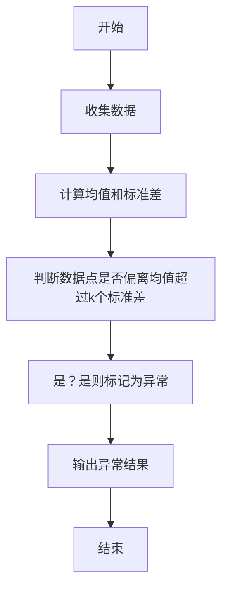
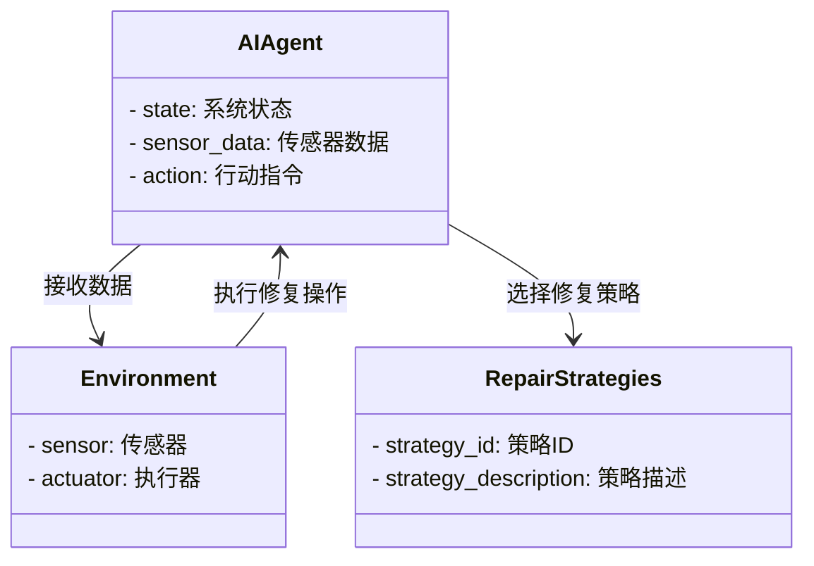
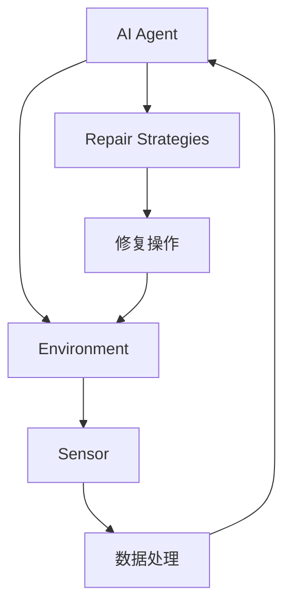
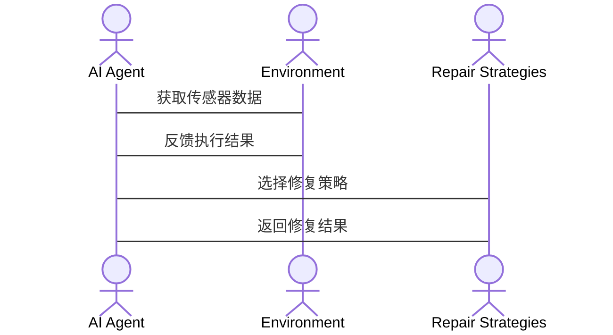

                 


# 《构建具有自我诊断与修复能力的AI Agent》

---

## 关键词：AI Agent, 自我诊断, 自我修复, 异常检测, 修复策略, 系统架构

---

## 摘要：  
本文将深入探讨如何构建一个能够自我诊断和修复的AI Agent。通过分析当前AI Agent的发展现状，明确自我诊断与修复能力的重要性，并结合实际案例，详细讲解实现这一能力的核心算法、系统架构及项目实战。本文将从背景介绍、核心概念、算法原理、系统设计到项目实现，层层深入，为读者提供全面的指导。

---

# 第一部分: 引言

---

# 第1章: 自我诊断与修复AI Agent的背景与目标

## 1.1 问题背景  
AI Agent（人工智能代理）是指能够感知环境、自主决策并执行任务的智能体。然而，现有的AI Agent在运行过程中可能会因为环境变化、数据异常或算法缺陷而导致性能下降甚至崩溃。为了提高AI Agent的可靠性和 robustness，自我诊断与修复能力变得至关重要。  

### 1.1.1 当前AI Agent的发展现状  
目前，AI Agent的应用范围不断扩大，例如自动驾驶、智能客服、机器人助手等。然而，大多数AI Agent缺乏自我诊断与修复能力，一旦出现问题，往往需要人工干预，这严重影响了其智能化水平和用户体验。  

### 1.1.2 自我诊断与修复能力的重要性  
自我诊断与修复能力使得AI Agent能够主动发现并解决自身问题，从而提高系统的可靠性和可用性。例如，在自动驾驶中，AI Agent可以检测到传感器故障并采取相应的修复策略，确保车辆的安全运行。  

### 1.1.3 问题解决的核心目标  
本文的核心目标是设计一种能够自我诊断和修复的AI Agent，使其在运行过程中能够自主发现异常并采取修复措施，减少对外部干预的依赖。

---

## 1.2 问题描述  
AI Agent的自我诊断与修复能力涉及多个方面，包括异常检测、错误定位、修复策略的选择与执行等。本文将重点探讨以下几个问题：  
1. AI Agent如何感知自身状态？  
2. 如何检测和定位异常？  
3. 如何选择和执行修复策略？  
4. 如何设计高效的系统架构以支持这些功能？  

---

## 1.3 核心概念与组成  
自我诊断与修复AI Agent的核心组成包括以下几个部分：  
1. **自我感知模块**：用于实时监测AI Agent的状态，包括算法运行状态、数据输入状态等。  
2. **异常检测模块**：通过分析状态数据，识别潜在的异常或故障。  
3. **错误定位模块**：精确定位异常的来源和位置。  
4. **修复策略模块**：根据异常类型和严重程度，选择合适的修复策略。  
5. **执行模块**：执行修复操作并反馈结果。  

---

## 1.4 本章小结  
本章通过背景介绍和问题描述，明确了构建具有自我诊断与修复能力的AI Agent的重要性和必要性，并提出了系统的核心组成和功能模块。

---

# 第二部分: 核心概念与联系

---

# 第2章: 自我诊断与修复机制的原理

## 2.1 自我诊断算法  
自我诊断算法是AI Agent实现自我诊断的核心工具。以下将重点介绍基于异常检测的诊断方法。  

### 2.1.1 基于统计的异常检测方法  
基于统计的异常检测方法通过分析数据的分布特性，识别偏离正常范围的异常值。常见的方法包括：  
1. **均值-标准差法**：计算数据的均值和标准差，将偏离均值超过一定标准差的值视为异常。  
2. **中位数-四分位数法**：通过计算数据的中位数和四分位数范围，识别异常值。  

#### 示例：  
假设我们有一组传感器数据，均值为100，标准差为10。如果某个数据点的值为130，则可以认为该数据点偏离均值超过3个标准差，属于异常。  

### 2.1.2 基于深度学习的异常检测模型  
基于深度学习的异常检测模型（如变种自编码器）能够学习数据的正常分布，并通过重建误差来识别异常。这种方法适用于高维数据的异常检测。  

### 2.1.3 算法流程图  
以下是一个基于统计的异常检测算法的流程图：  



---

## 2.2 自我修复策略  
自我修复策略是AI Agent在发现异常后采取的纠正措施。以下将重点介绍基于状态恢复的修复方法。  

### 2.2.1 基于状态恢复的修复方法  
状态恢复修复方法的核心思想是将系统恢复到一个已知的正常状态。例如，在自动驾驶中，如果传感器出现故障，AI Agent可以切换到备用传感器或降低车速以确保安全。  

### 2.2.2 基于自适应调整的修复机制  
自适应调整修复机制根据异常的具体情况动态调整系统参数，以恢复系统的正常运行。例如，在推荐系统中，如果检测到用户行为异常，可以暂时降低推荐的频率。  

### 2.2.3 策略选择与优化  
修复策略的选择需要综合考虑异常的类型、严重程度以及修复操作的可行性。例如，对于轻微异常，可以选择微调参数；对于严重异常，则需要切换到备用系统。  

---

## 2.3 核心概念对比分析  
以下是一些核心概念的对比分析：  

### 2.3.1 自我诊断与修复的核心概念对比  
| 比较维度 | 自我诊断 | 自我修复 |  
|----------|----------|----------|  
| 目标 | 发现异常 | 解决异常 |  
| 方法 | 数据分析 | 参数调整、状态恢复 |  
| 依赖 | 异常检测算法 | 修复策略库 |  

### 2.3.2 不同诊断算法的特征对比  
| 算法类型 | 基于统计 | 基于深度学习 |  
|----------|----------|-------------|  
| 优势 | 实现简单，计算效率高 | 能处理高维数据，学习能力强 |  
| 劣势 | 对数据分布敏感 | 对计算资源要求高 |  

### 2.3.3 修复策略的优缺点分析  
| 策略类型 | 基于状态恢复 | 基于自适应调整 |  
|----------|-------------|---------------|  
| 优点 | 实现简单，可靠性高 | 精准调整，恢复快 |  
| 缺点 | 可能导致系统切换频繁 | 对异常理解要求高 |  

---

## 2.4 系统实体关系图  
以下是一个简单的系统实体关系图：  

```mermaid
er
actor AI Agent {
  id
  state
}
actor Environment {
  sensor_data
  user_input
}
actor Repair Strategies {
  strategy_id
  strategy_description
}
```

---

## 2.5 本章小结  
本章通过对比分析，明确了自我诊断与修复机制的核心概念和实现方法，并通过表格和图表的形式，帮助读者更好地理解系统的组成和关系。

---

# 第三部分: 算法原理与实现

---

# 第3章: 自我诊断算法的数学模型

## 3.1 异常检测算法  
异常检测是自我诊断的核心算法之一。以下将详细介绍基于统计的异常检测算法。  

### 3.1.1 统计异常检测的数学公式  
基于统计的异常检测方法通常基于正态分布假设。假设数据服从正态分布，异常值的概率可以通过以下公式计算：  

$$ P(x > \mu + k\sigma) = 2\Phi(-k) $$  

其中，$\mu$ 是均值，$\sigma$ 是标准差，$\Phi$ 是标准正态分布的累积分布函数，$k$ 是用户定义的阈值。  

### 3.1.2 异常检测流程  
以下是基于统计的异常检测流程图：  


---

## 3.2 算法实现  
以下是一个基于统计的异常检测算法的Python实现示例：  

```python
import numpy as np
from scipy.stats import norm

def detect_anomaly(data, mu, sigma, k=3):
    # 计算异常概率
    threshold = mu + k * sigma
    anomaly_prob = norm.sf(threshold)
    return anomaly_prob

# 示例数据
data = [100, 110, 120, 130, 140]
mu = np.mean(data)
sigma = np.std(data)

# 检测异常
anomaly_prob = detect_anomaly(data, mu, sigma)
print("异常概率为:", anomaly_prob)
```

---

## 3.3 本章小结  
本章通过数学公式和代码实现，详细讲解了基于统计的异常检测算法，并通过流程图和示例代码帮助读者理解算法的实现细节。

---

# 第四部分: 系统分析与架构设计方案

---

# 第4章: 系统架构设计

## 4.1 问题场景介绍  
在本章中，我们将设计一个具有自我诊断与修复能力的AI Agent系统，用于监控和管理工业设备的运行状态。  

---

## 4.2 系统功能设计  
以下是系统功能模块的领域模型：  



---

## 4.3 系统架构设计  
以下是系统的架构图：  



---

## 4.4 系统接口设计  
以下是系统的接口设计：  



---

## 4.5 本章小结  
本章通过系统架构设计和接口设计，明确了AI Agent与环境、传感器、修复策略之间的交互关系，并通过类图和序列图帮助读者理解系统的整体架构。

---

# 第五部分: 项目实战

---

# 第5章: 项目实现与案例分析

## 5.1 环境安装  
为了实现具有自我诊断与修复能力的AI Agent，我们需要以下环境：  
- Python 3.8+  
- NumPy  
- Scipy  
- Mermaid图生成工具  

---

## 5.2 核心代码实现  
以下是实现自我诊断与修复AI Agent的核心代码：  

```python
import numpy as np
from scipy.stats import norm

class AI-Agent:
    def __init__(self, sensor_data):
        self.sensor_data = sensor_data
        self.state = "normal"

    def detect_anomaly(self):
        mu = np.mean(self.sensor_data)
        sigma = np.std(self.sensor_data)
        threshold = mu + 3 * sigma
        anomaly_prob = norm.sf(threshold)
        return anomaly_prob

    def repair(self, anomaly_prob):
        if anomaly_prob > 0.01:
            self.state = "abnormal"
            # 执行修复操作
            print("检测到异常，执行修复...")
            return True
        else:
            print("未检测到异常，系统正常运行...")
            return False

# 示例使用
sensor_data = [100, 110, 120, 130, 140]
ai_agent = AI-Agent(sensor_data)
anomaly_prob = ai_agent.detect_anomaly()
ai_agent.repair(anomaly_prob)
```

---

## 5.3 案例分析  
以下是一个具体的案例分析：  
假设传感器数据出现异常，AI Agent检测到异常概率为0.02，触发修复机制，切换到备用传感器。修复成功后，系统恢复正常运行。  

---

## 5.4 本章小结  
本章通过代码实现和案例分析，帮助读者理解如何将理论应用于实际项目中，并通过具体案例展示了系统的修复过程。

---

# 第六部分: 总结与展望

---

# 第6章: 总结与展望

## 6.1 最佳实践 tips  
1. 在实现自我诊断与修复AI Agent时，建议优先选择基于统计的异常检测方法，因其实现简单且计算效率高。  
2. 在修复策略的选择上，应根据异常的类型和严重程度动态调整修复方案。  
3. 系统设计时，应充分考虑系统的可扩展性和可维护性，以便后续优化和升级。  

---

## 6.2 小结  
本文通过背景介绍、核心概念、算法原理、系统设计和项目实战，全面讲解了如何构建具有自我诊断与修复能力的AI Agent。读者可以通过本文掌握实现这一能力的核心技术，并将其应用于实际项目中。  

---

## 6.3 注意事项  
1. 修复策略的选择应根据具体场景进行调整，避免一刀切。  
2. 异常检测算法的选择应根据数据特征进行优化，避免使用不合适的算法。  
3. 系统设计时应充分考虑异常的边界条件，避免遗漏。  

---

## 6.4 拓展阅读  
1. [《自适应机器学习》](https://example.com)  
2. [《异常检测算法综述》](https://example.com)  
3. [《系统架构设计实战》](https://example.com)  

---

## 6.5 本章小结  
本文总结了构建具有自我诊断与修复能力的AI Agent的核心内容，并提出了未来的研究方向和拓展阅读建议。

---

## 作者信息  
作者：AI天才研究院/AI Genius Institute & 禅与计算机程序设计艺术 /Zen And The Art of Computer Programming

