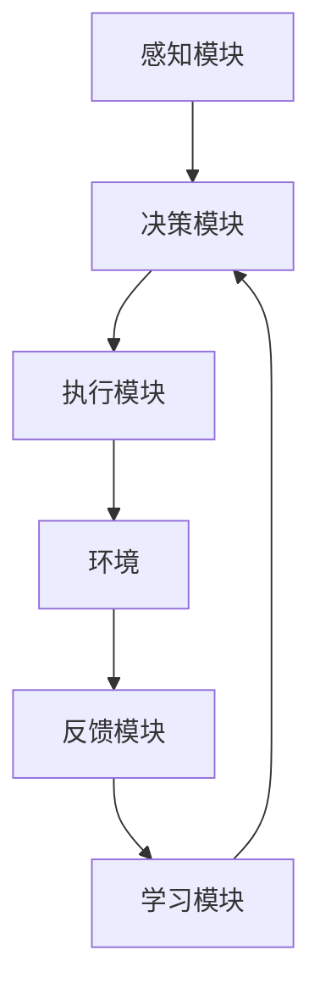

                 


# 构建具有自我进化能力的AI Agent系统

> 关键词：AI Agent，自我进化，强化学习，自适应算法，系统架构设计

> 摘要：本文探讨了构建具有自我进化能力的AI Agent系统的各个方面，从核心概念到系统架构设计，再到算法实现和项目实战。通过详细分析自我进化机制的原理、实现框架、系统架构、数学模型以及具体项目的实现，为读者提供了一个全面的理解和实践指南。

---

# 第一部分: 自我进化AI Agent的概念与背景

# 第1章: 自我进化AI Agent的概念与背景

## 1.1 自我进化AI Agent的定义与核心特征
### 1.1.1 自我进化AI Agent的定义
自我进化AI Agent是一种能够通过环境反馈和内部机制不断优化自身行为和决策能力的智能体。它具备自我学习、自适应调整和持续改进的能力。

### 1.1.2 自我进化能力的核心特征
- **自主性**：能够在没有外部干预的情况下自主决策。
- **适应性**：能够根据环境变化调整自身的策略和行为。
- **学习性**：能够通过与环境交互学习新知识和技能。
- **进化性**：能够通过迭代优化自身的算法和参数。

### 1.1.3 自我进化AI Agent与传统AI Agent的区别
- **传统AI Agent**：基于预设规则和静态策略进行决策，不具备学习和优化能力。
- **自我进化AI Agent**：能够通过与环境交互不断优化自身的策略和行为，具备动态调整的能力。

## 1.2 自我进化能力的实现背景
### 1.2.1 当前AI Agent技术的发展现状
AI Agent技术在近年来取得了显著进展，特别是在自然语言处理、计算机视觉和强化学习领域。然而，现有的AI Agent大多依赖于静态规则或固定的训练数据，难以在动态环境中进行自适应优化。

### 1.2.2 自我进化能力的必要性
在复杂多变的环境中，AI Agent需要具备自我进化的能力才能更好地适应环境变化，提高决策的准确性和效率。

### 1.2.3 自我进化AI Agent的应用场景
- **游戏AI**：在游戏环境中不断优化策略。
- **机器人控制**：在动态环境中自适应调整动作。
- **自动驾驶**：在复杂的交通环境中实时优化驾驶策略。

## 1.3 本章小结
本章介绍了自我进化AI Agent的定义、核心特征及其与传统AI Agent的区别，探讨了实现自我进化能力的背景和应用场景。

---

# 第二部分: 自我进化AI Agent的核心概念与原理

# 第2章: 自我进化机制的核心概念

## 2.1 自我进化机制的原理
### 2.1.1 自我进化机制的基本原理
自我进化机制通过不断地与环境交互，收集反馈信息，并根据反馈信息优化自身的策略和行为。

### 2.1.2 自我进化机制的关键要素
- **感知模块**：负责收集环境中的信息。
- **决策模块**：基于感知信息做出决策。
- **学习模块**：通过反馈信息优化决策策略。

### 2.1.3 自我进化机制的数学模型
$$ Q(s, a) = Q(s, a) + \alpha [r + \max_{a'} Q(s', a') - Q(s, a)] $$
其中，$Q(s, a)$表示状态$s$下动作$a$的Q值，$\alpha$是学习率，$r$是奖励，$s'$是下一个状态。

## 2.2 自我进化机制的实现框架
### 2.2.1 自我进化机制的模块划分
- **学习模块**：负责优化策略。
- **决策模块**：负责根据当前状态选择动作。
- **自适应优化模块**：负责动态调整参数。

### 2.2.2 各模块之间的关系与协作
- **感知模块**将环境信息传递给**决策模块**。
- **决策模块**根据当前状态选择动作，并将动作传递给**执行模块**。
- **反馈模块**将环境反馈传递给**学习模块**，用于优化策略。

## 2.3 自我进化机制的核心算法
### 2.3.1 强化学习算法
- **Q-learning**：基于Q值函数的强化学习算法。
- **Deep Q-Network (DQN)**：基于深度神经网络的Q-learning算法。

### 2.3.2 进化策略算法
- **进化策略(ES)**：通过优化策略参数来最大化预期奖励。
- **自然选择算法**：模拟自然进化过程，选择最优策略。

## 2.4 本章小结
本章详细介绍了自我进化机制的原理、关键要素、实现框架和核心算法，为后续的系统设计和实现奠定了基础。

---

# 第三部分: 自我进化AI Agent的系统架构设计

# 第3章: 系统架构与模块划分

## 3.1 系统整体架构设计
### 3.1.1 系统架构图


### 3.1.2 各模块的功能描述
- **感知模块**：负责收集环境中的信息。
- **决策模块**：根据感知信息选择动作。
- **执行模块**：执行选择的动作。
- **反馈模块**：收集环境反馈信息。
- **学习模块**：根据反馈信息优化策略。

### 3.1.3 系统架构的优缺点分析
- **优点**：模块化设计，便于扩展和维护。
- **缺点**：模块之间的协作需要精确设计，否则可能影响整体性能。

## 3.2 核心模块设计
### 3.2.1 学习模块设计
- **功能**：通过反馈信息优化策略。
- **实现**：使用强化学习算法，如Q-learning或DQN。

### 3.2.2 决策模块设计
- **功能**：根据当前状态选择动作。
- **实现**：基于Q值函数或策略网络进行决策。

### 3.2.3 自适应优化模块设计
- **功能**：动态调整策略参数。
- **实现**：使用进化策略或自然选择算法。

## 3.3 系统接口设计
### 3.3.1 系统内部接口
- **感知模块接口**：提供环境信息。
- **决策模块接口**：接收状态和动作。
- **反馈模块接口**：提供奖励信息。

### 3.3.2 系统外部接口
- **用户接口**：与外部系统或用户交互。
- **日志接口**：记录系统运行日志。

## 3.4 本章小结
本章详细介绍了自我进化AI Agent系统的整体架构设计、核心模块设计和接口设计，为后续的实现提供了清晰的指导。

---

# 第四部分: 自我进化AI Agent的算法实现与数学模型

# 第4章: 自我进化机制的数学模型

## 4.1 强化学习算法的数学模型
### 4.1.1 Q-learning算法的数学模型
$$ Q(s, a) = Q(s, a) + \alpha [r + \max_{a'} Q(s', a') - Q(s, a)] $$
其中，$Q(s, a)$表示状态$s$下动作$a$的Q值，$\alpha$是学习率，$r$是奖励，$s'$是下一个状态。

### 4.1.2 策略梯度算法的数学模型
$$ \nabla \theta \log \pi(a|s) \cdot Q(s,a) $$
其中，$\theta$是策略参数，$\pi(a|s)$是策略函数，$Q(s,a)$是Q值函数。

## 4.2 自我进化机制的数学公式
### 4.2.1 状态转移概率公式
$$ P(s' | s, a) = \text{概率从状态$s$执行动作$a$转移到状态$s'$} $$

### 4.2.2 奖励函数的定义
$$ R(s, a, s') = \text{在状态$s$执行动作$a$后转移到状态$s'$的奖励} $$

### 4.2.3 动作选择的数学公式
$$ a = \arg\max_a Q(s, a) $$

## 4.3 算法实现的代码示例
### 4.3.1 Q-learning算法的Python实现
```python
class QLearning:
    def __init__(self, state_space, action_space, learning_rate=0.1, gamma=0.9):
        self.q_table = np.zeros((state_space, action_space))
        self.learning_rate = learning_rate
        self.gamma = gamma

    def choose_action(self, state):
        return np.argmax(self.q_table[state])

    def update_q_table(self, state, action, reward, next_state):
        self.q_table[state][action] += self.learning_rate * (reward + self.gamma * np.max(self.q_table[next_state]) - self.q_table[state][action])
```

## 4.4 本章小结
本章详细介绍了自我进化机制的数学模型和强化学习算法的实现，为后续的系统实现提供了理论基础。

---

# 第五部分: 自我进化AI Agent的系统实现与项目实战

# 第5章: 项目实战与案例分析

## 5.1 环境配置与安装
- **安装依赖**：Python、TensorFlow、Keras、OpenAI Gym。
- **环境配置**：设置运行环境，如虚拟环境或容器。

## 5.2 核心代码实现
### 5.2.1 学习模块实现
```python
class LearningModule:
    def __init__(self):
        self.model = self.build_model()
        self.model.compile(optimizer='adam', loss='mse')

    def build_model(self):
        model = tf.keras.Sequential()
        model.add(tf.keras.layers.Dense(64, activation='relu'))
        model.add(tf.keras.layers.Dense(1))
        return model
```

### 5.2.2 决策模块实现
```python
class DecisionModule:
    def __init__(self, learning_module):
        self.learning_module = learning_module

    def decide_action(self, state):
        prediction = self.learning_module.model.predict(np.array([state]))
        return np.argmax(prediction)
```

### 5.2.3 系统接口实现
```python
class SystemInterface:
    def __init__(self):
        self.modules = {
            'learning': LearningModule(),
            'decision': DecisionModule(LearningModule())
        }

    def process(self, state, action):
        next_state = self.env.step(action)
        reward = self.env.get_reward(next_state)
        self.modules['learning'].update_model(state, action, reward, next_state)
        return next_state
```

## 5.3 案例分析与结果解读
### 5.3.1 案例分析
通过在OpenAI Gym环境中训练一个自我进化AI Agent，展示其在动态环境中的适应能力和优化效果。

### 5.3.2 实验结果
- **收敛速度**：通过多次迭代，观察算法的收敛速度和稳定性。
- **决策准确率**：比较传统AI Agent和自我进化AI Agent的决策准确率。

## 5.4 本章小结
本章通过具体的项目实战，详细展示了自我进化AI Agent的实现过程，包括环境配置、核心代码实现和案例分析。

---

# 第六部分: 总结与展望

# 第6章: 总结与展望

## 6.1 本章总结
本文详细探讨了构建具有自我进化能力的AI Agent系统的各个方面，包括核心概念、系统架构设计、算法实现和项目实战。通过理论分析和实践验证，展示了自我进化AI Agent在复杂环境中的适应能力和优化效果。

## 6.2 当前成果与存在的问题
尽管自我进化AI Agent在理论和实践上都取得了一定的成果，但仍然存在一些问题，如算法收敛速度慢、系统稳定性不足等。

## 6.3 未来研究方向
- **算法优化**：进一步优化强化学习算法，提高收敛速度和稳定性。
- **多智能体协作**：研究多个自我进化AI Agent的协作机制。
- **复杂环境适应**：探索在更复杂环境中的应用和优化。

## 6.4 本章小结
本文总结了自我进化AI Agent的研究成果和当前存在的问题，并展望了未来的研究方向。

---

# 作者：AI天才研究院 & 禅与计算机程序设计艺术

