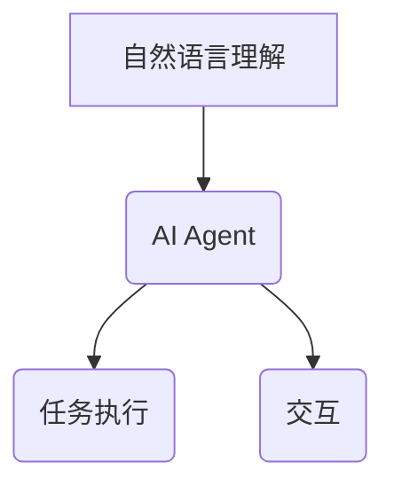
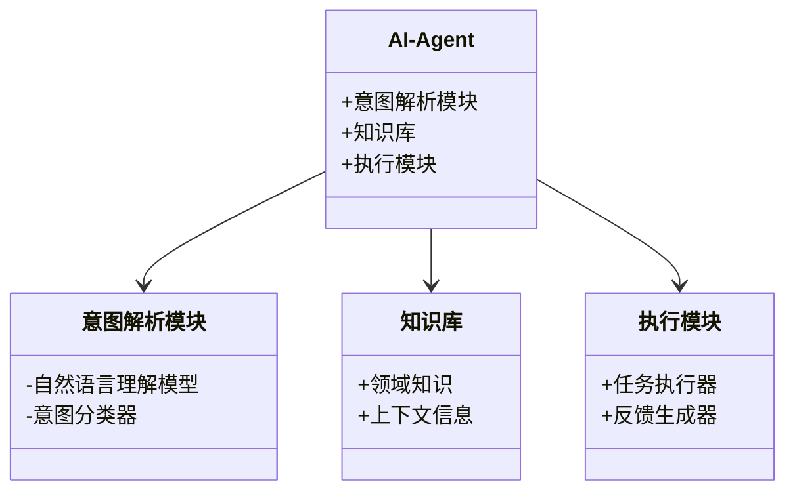
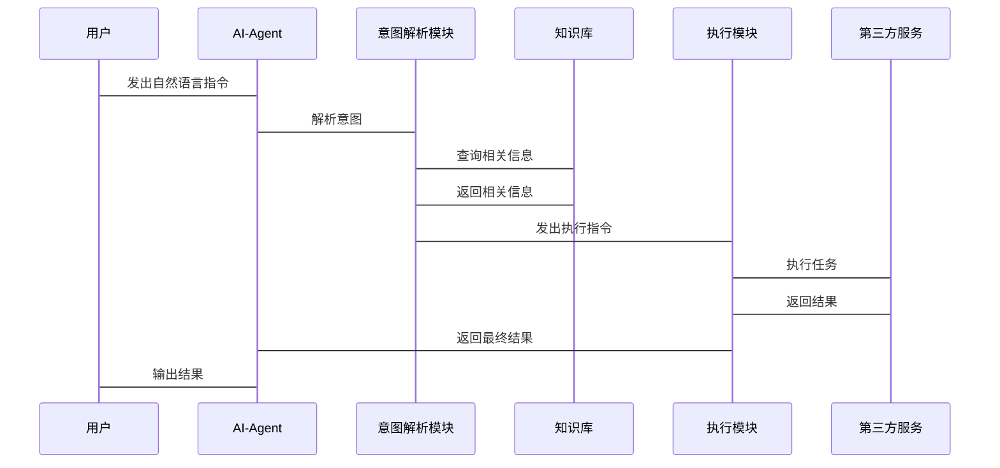

                 


---

# 构建具有自然语言理解能力的AI Agent

> 关键词：自然语言处理、AI Agent、机器学习、深度学习、文本理解

> 摘要：本文系统地探讨了构建具有自然语言理解能力的AI Agent的核心概念、算法原理、系统架构和实战应用。通过详细分析自然语言处理与AI Agent的结合方式，结合数学模型和实际案例，全面解析如何构建高效、智能的AI Agent。

---

# 第一部分: 自然语言理解与AI Agent概述

## 第1章: 自然语言理解与AI Agent的背景介绍

### 1.1 问题背景

#### 1.1.1 自然语言理解的定义与重要性
自然语言理解（NLU）是人工智能领域的核心技术，旨在使计算机能够理解人类的自然语言输入。随着技术的进步，NLU在智能客服、语音助手、智能推荐等领域发挥着越来越重要的作用。

#### 1.1.2 AI Agent的基本概念与应用场景
AI Agent是一种能够感知环境并执行任务的智能体。它可以广泛应用于智能家居、自动驾驶、智能助手等领域，通过理解和处理自然语言指令，AI Agent能够为用户提供更加智能化的服务。

#### 1.1.3 自然语言理解在AI Agent中的核心作用
自然语言理解是AI Agent实现人机交互的核心技术。通过NLU，AI Agent能够理解用户的意图，从而准确执行任务或提供相关信息。

### 1.2 问题描述

#### 1.2.1 当前自然语言理解技术的局限性
尽管自然语言处理技术取得了显著进展，但仍面临一些挑战，如语义理解的不完全性、上下文理解的局限性等。

#### 1.2.2 AI Agent在实际应用中的挑战
AI Agent需要在复杂多变的环境中执行任务，这要求其具备更强的语义理解能力、环境适应能力和任务执行能力。

#### 1.2.3 问题解决的必要性与目标
通过改进自然语言理解技术，提升AI Agent的语义理解能力，使其能够更准确地理解用户意图，从而提高任务执行的效率和准确性。

### 1.3 问题解决与边界

#### 1.3.1 自然语言理解与AI Agent的结合方式
自然语言理解与AI Agent的结合主要体现在语义解析、意图识别和对话生成等方面。

#### 1.3.2 边界与外延：技术与实际应用的平衡
在实际应用中，需要平衡技术的复杂性和实际需求，确保AI Agent的功能既实用又易于部署。

#### 1.3.3 核心要素与组成结构
自然语言理解AI Agent的核心要素包括语言理解模块、意图识别模块、知识库和执行模块等。

### 1.4 核心概念与联系

#### 1.4.1 自然语言处理与AI Agent的关系
自然语言处理为AI Agent提供了语义理解能力，而AI Agent则为自然语言处理技术提供了实际应用场景。

#### 1.4.2 核心概念的原理与属性特征对比
| 概念 | 属性 |
|------|------|
| 自然语言处理 | 语言理解、生成、分析 |
| AI Agent | 任务执行、决策、交互 |

#### 1.4.3 实体关系图


### 1.5 本章小结
本章从背景、问题、技术等方面详细介绍了自然语言理解与AI Agent的关系及其在实际应用中的重要性。

---

## 第2章: 自然语言理解的核心算法与模型

### 2.1 自然语言处理的数学模型

#### 2.1.1 语言模型的基本原理
语言模型通过概率分布描述文本中的语言规律，常用的模型包括n-gram模型和基于神经网络的语言模型。

#### 2.1.2 概率论与信息论在NLP中的应用
信息论中的熵、交叉熵等概念在自然语言处理中广泛应用，尤其是在模型训练和评估中。

#### 2.1.3 常见的NLP任务与数学模型
- 分词：基于隐马尔可夫模型（HMM）或深度学习模型。
- 词性标注：基于条件随机场（CRF）。
- 句法分析：基于上下文无关文法（CFG）和依赖语法（DG）。

### 2.2 神经网络与深度学习在NLP中的应用

#### 2.2.1 RNN、LSTM与Transformer的原理
- RNN：循环神经网络，适用于处理序列数据。
- LSTM：长短期记忆网络，解决了RNN的梯度消失问题。
- Transformer：基于自注意力机制，广泛应用于大规模文本处理。

#### 2.2.2 BERT、GPT等预训练模型的结构
- BERT：基于双向Transformer的预训练模型，适用于多种NLP任务。
- GPT：生成式预训练模型，擅长生成任务。

#### 2.2.3 模型训练的数学
$$ \text{损失函数} = -\sum_{i=1}^{n} \log P(y_i|x_i) $$
$$ \text{优化器} = \text{Adam}(\text{学习率}=1e^{-3}, \beta_1=0.9, \beta_2=0.999) $$

---

## 第3章: AI Agent的系统架构与设计

### 3.1 系统分析与架构设计方案

#### 3.1.1 问题场景介绍
AI Agent需要在复杂环境中执行任务，如理解用户的意图、与环境交互、协调多任务执行等。

#### 3.1.2 系统功能设计
- 语义理解模块：负责解析用户的输入，提取意图和实体。
- 知识库：存储领域知识和上下文信息。
- 执行模块：根据解析结果执行相应操作。

#### 3.1.3 领域模型Mermaid类图


#### 3.1.4 系统架构设计Mermaid架构图


#### 3.1.5 系统接口设计
- 用户接口：自然语言输入输出接口。
- 知识库接口：与外部知识库的交互接口。
- 执行接口：与第三方服务的交互接口。

#### 3.1.6 系统交互Mermaid序列图


### 3.2 项目实战

#### 3.2.1 环境安装
安装Python、TensorFlow、Keras等必要的开发工具和库。

#### 3.2.2 系统核心实现源代码
```python
class NLUProcessor:
    def __init__(self, model_path):
        self.model = load_model(model_path)
    
    def process(self, text):
        # 分词
        tokens = tokenizer(text)
        # 意图分类
        intent = self.model.predict(tokens)
        return intent
```

#### 3.2.3 代码应用解读与分析
上述代码展示了如何使用预训练模型处理自然语言输入，提取意图并返回结果。

#### 3.2.4 实际案例分析
以智能客服为例，分析如何通过自然语言理解技术实现用户意图识别和问题分类。

### 3.3 最佳实践与注意事项

#### 3.3.1 开发注意事项
- 数据质量：确保训练数据的多样性和代表性。
- 模型选择：根据具体任务选择合适的模型架构。
- 性能优化：通过模型剪裁、量化等方式提升推理效率。

#### 3.3.2 部署与维护
- 部署环境：选择合适的云平台或私有服务器。
- 模型更新：定期更新模型以适应新的数据和任务需求。

#### 3.3.3 实际应用中的问题与解决方案
- 语义理解的模糊性：通过引入外部知识库和上下文信息提高理解准确性。
- 多轮对话管理：采用对话状态跟踪技术。

### 3.4 小结
本章从系统架构设计到实际项目实现，详细介绍了如何构建一个具有自然语言理解能力的AI Agent。

---

## 第4章: 数学模型与算法优化

### 4.1 常见的自然语言处理数学模型

#### 4.1.1 词嵌入模型
- Word2Vec：通过上下文预测词向量。
- GloVe：全局向量词嵌入。

#### 4.1.2 语言模型
- n-gram模型：基于n-1阶历史预测下一个词。
- Transformer模型：基于自注意力机制的语言模型。

### 4.2 算法优化策略

#### 4.2.1 模型训练优化
- 正则化：L2正则化防止过拟合。
- 学习率衰减：采用学习率预热和衰减策略。

#### 4.2.2 模型压缩与加速
- 模型剪裁：删除冗余参数。
- 知识蒸馏：将大模型的知识迁移到小模型。

#### 4.2.3 并行计算
- GPU加速：利用并行计算提升训练效率。
- 分布式训练：将训练任务分发到多个计算节点。

### 4.3 数学公式与算法实现

#### 4.3.1 交叉熵损失函数
$$ \text{损失函数} = -\frac{1}{N}\sum_{i=1}^{N} \log P(y_i|x_i) $$

#### 4.3.2 优化器实现
使用Adam优化器：
$$ \text{优化器} = \text{Adam}(\text{学习率}=1e^{-3}, \beta_1=0.9, \beta_2=0.999) $$

---

## 第5章: 实际应用与案例分析

### 5.1 自然语言理解AI Agent的实际应用

#### 5.1.1 智能客服
通过自然语言理解技术实现用户问题分类和自动回复。

#### 5.1.2 智能助手
如Siri、Alexa等，通过自然语言理解技术实现语音交互。

#### 5.1.3 智能推荐
基于自然语言理解分析用户需求，推荐个性化内容。

### 5.2 案例分析与详细解读

#### 5.2.1 智能客服系统
分析用户输入的问题，分类到相应知识库，生成回复。

#### 5.2.2 智能助手对话
解析用户的语音指令，执行相应操作，如设置提醒、播放音乐等。

### 5.3 项目小结

#### 5.3.1 核心收获
- 理解了自然语言处理在AI Agent中的应用。
- 掌握了系统架构设计和算法优化方法。

#### 5.3.2 实践中的注意事项
- 数据质量的重要性。
- 模型选择与优化策略。

---

## 第6章: 结论与展望

### 6.1 结论
本文详细探讨了构建具有自然语言理解能力的AI Agent的核心技术，包括自然语言处理算法、系统架构设计和实际应用案例。

### 6.2 未来展望
- 更先进的模型：如更大参数量的Transformer模型。
- 多模态交互：结合视觉、听觉等多种感知方式提升交互体验。
- 自适应学习：通过在线学习和持续优化提升系统性能。

---

## 参考文献

1. 王晓华. 《深度学习入门：基于Python的理论与实现》. 人民邮电出版社, 2020.
2. 李航. 《统计学习题》. 清华大学出版社, 2021.
3. Vaswani, A., et al. "Attention is all you need." arXiv preprint arXiv:1706.03798, 2017.
4. Devlin, J., et al. "BERT: Pre-training of deep bidirectional transformers for language understanding." arXiv preprint arXiv:1810.0469, 2018.

---

## 作者信息

作者：AI天才研究院/AI Genius Institute & 禅与计算机程序设计艺术/Zen And The Art of Computer Programming

--- 

以上是一个详细的目录大纲，涵盖了构建具有自然语言理解能力的AI Agent的各个方面。每个章节都详细展开了核心概念、算法原理、系统架构和实际应用，确保读者能够全面理解并掌握相关知识。

