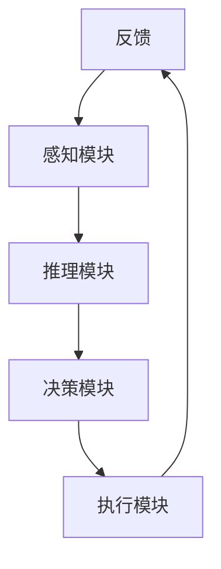
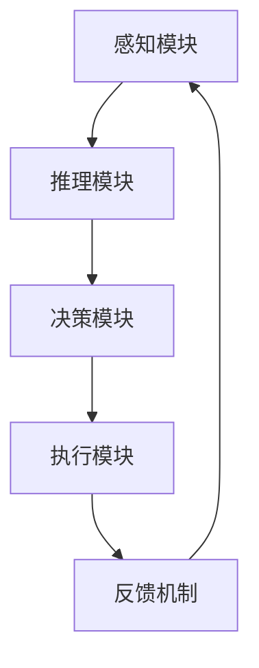
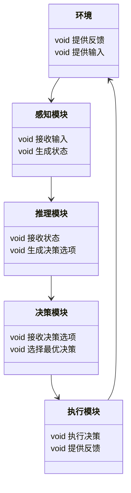
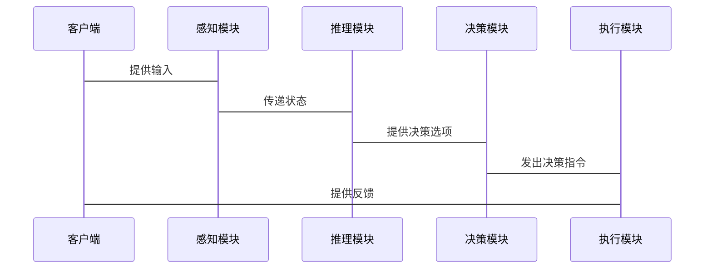

                 


### 第一部分: 构建具有自适应决策能力的AI Agent背景与基础

---

#### 第1章: AI Agent概述

##### 1.1 AI Agent的基本概念

###### 1.1.1 什么是AI Agent
人工智能代理（AI Agent）是指能够感知环境、做出决策并执行动作的智能体。AI Agent可以是软件程序、机器人或其他智能系统，其核心目标是通过感知和行动来优化目标函数或实现特定任务。

###### 1.1.2 AI Agent的核心特征
- **自主性**：AI Agent能够自主决策，无需外部干预。
- **反应性**：能够实时感知环境变化并做出反应。
- **目标导向**：基于目标函数或任务目标进行决策。
- **学习能力**：通过经验或数据不断优化决策策略。

###### 1.1.3 自适应决策能力的定义
自适应决策能力是指AI Agent能够在动态变化的环境中，根据新的信息和反馈调整决策策略的能力。这种能力使AI Agent能够更好地应对不确定性，提高决策的准确性和效率。

##### 1.2 问题背景与描述

###### 1.2.1 当前AI Agent面临的挑战
- **动态环境**：环境中的条件不断变化，AI Agent需要实时调整策略。
- **不确定性**：信息不完全或存在噪声，影响决策的准确性。
- **复杂性**：任务复杂，涉及多目标、多约束条件，决策过程复杂。

###### 1.2.2 自适应决策的必要性
在动态和不确定的环境中，传统的静态决策模型难以应对变化。自适应决策使AI Agent能够实时调整策略，提高应对复杂环境的能力。

###### 1.2.3 问题解决的核心思路
通过引入自适应机制，使AI Agent能够根据环境反馈动态调整决策策略，优化目标函数。

##### 1.3 自适应决策的边界与外延

###### 1.3.1 决策边界分析
- **输入边界**：AI Agent能够处理的输入范围。
- **输出边界**：AI Agent能够执行的动作或决策范围。
- **反馈边界**：AI Agent能够利用的反馈信息类型和范围。

###### 1.3.2 外延与应用场景
- **外延**：自适应决策能力的应用范围扩展，包括动态规划、强化学习等领域。
- **应用场景**：智能机器人、自动驾驶、游戏AI、推荐系统等。

##### 1.3.3 与其他AI技术的对比
- **对比**：与基于规则的系统相比，自适应决策系统更具灵活性和适应性。
- **差异**：自适应决策系统能够根据反馈优化决策，而基于规则的系统依赖预定义规则。

##### 1.4 核心概念结构与组成

###### 1.4.1 概念结构图
使用Mermaid图展示AI Agent的核心概念结构：



###### 1.4.2 核心要素分析
- **环境**：AI Agent所处的外部环境，提供输入信息和反馈。
- **感知模块**：负责收集环境信息，解析数据并生成有意义的状态表示。
- **推理模块**：基于感知信息，进行逻辑推理，生成可能的决策选项。
- **决策模块**：根据推理结果和目标函数，选择最优决策。
- **执行模块**：将决策转化为具体动作，执行并输出结果。
- **反馈机制**：将执行结果反馈给感知模块，形成闭环。

---

#### 第2章: 自适应决策的核心概念与联系

##### 2.1 自适应决策的原理

###### 2.1.1 感知模块
- **功能**：感知环境信息，生成状态表示。
- **方法**：使用传感器、API或其他数据源获取数据。
- **示例**：自动驾驶汽车通过摄像头、雷达等传感器感知周围环境。

###### 2.1.2 推理模块
- **功能**：基于感知信息，生成可能的决策选项。
- **方法**：使用逻辑推理、概率推理或机器学习模型进行预测。
- **示例**：在医疗诊断中，AI Agent通过分析病人的症状和检查结果，推断可能的疾病。

###### 2.1.3 执行模块
- **功能**：将决策转化为具体动作。
- **方法**：通过执行器、API调用或其他机制实现动作。
- **示例**：智能音箱根据用户的语音指令播放音乐。

##### 2.2 不同决策方法的特征对比

###### 2.2.1 行为决策树对比表
| 决策方法 | 描述 | 优缺点 | 适用场景 |
|----------|------|--------|----------|
| 基于规则 | 使用预定义规则进行决策 | 简单易懂，但缺乏灵活性 | 稳定性要求高，环境变化小的场景 |
| 基于模型 | 使用数学模型预测结果 | 高度灵活，适应性强 | 复杂动态环境 |
| 强化学习 | 基于奖励机制优化策略 | 高度适应性，需要大量反馈 | 不确定性高，复杂决策场景 |

##### 2.3 系统架构的Mermaid流程图
使用Mermaid图展示AI Agent的系统架构：



---

#### 第3章: 自适应决策的算法原理

##### 3.1 Q-learning算法

###### 3.1.1 算法原理
Q-learning是一种基于值的强化学习算法，通过更新Q值表来学习最优策略。

###### 3.1.2 数学模型
Q值更新公式：
$$ Q(s, a) = Q(s, a) + \alpha [r + \gamma \max Q(s', a') - Q(s, a)] $$
其中：
- \( Q(s, a) \)：当前状态\( s \)和动作\( a \)的Q值。
- \( \alpha \)：学习率。
- \( r \)：奖励值。
- \( \gamma \)：折扣因子。
- \( \max Q(s', a') \)：下一个状态\( s' \)的最大Q值。

###### 3.1.3 代码实现
```python
import numpy as np

class QLearning:
    def __init__(self, state_space, action_space, alpha=0.1, gamma=0.9):
        self.state_space = state_space
        self.action_space = action_space
        self.Q = np.zeros((state_space, action_space))
        self.alpha = alpha
        self.gamma = gamma

    def get_action(self, state):
        return np.argmax(self.Q[state, :])

    def update_Q(self, state, action, reward, next_state):
        self.Q[state, action] += self.alpha * (reward + self.gamma * np.max(self.Q[next_state, :]) - self.Q[state, action])
```

##### 3.2 DQN算法

###### 3.2.1 算法原理
DQN（Deep Q-Network）使用深度神经网络近似Q值函数，通过经验回放和目标网络优化策略。

###### 3.2.2 数学模型
目标网络更新公式：
$$ y = r + \gamma \max Q'(s', a') $$
损失函数：
$$ \mathcal{L} = (y - Q(s, a))^2 $$

###### 3.2.3 代码实现
```python
import torch
import torch.nn as nn
import torch.optim as optim

class DQN:
    def __init__(self, input_dim, output_dim, learning_rate=0.001):
        self.model = nn.Sequential(
            nn.Linear(input_dim, 64),
            nn.ReLU(),
            nn.Linear(64, output_dim)
        )
        self.optimizer = optim.Adam(self.model.parameters(), lr=learning_rate)
        self.criterion = nn.MSELoss()

    def get_action(self, state, epsilon=0.1):
        if np.random.random() < epsilon:
            return np.random.randint(0, output_dim)
        with torch.no_grad():
            return torch.argmax(self.model(state)).item()

    def update(self, states, actions, rewards, next_states):
        current_q = self.model(states)
        next_q = self.model(next_states).max(1)[0].detach()
        target = rewards + self.gamma * next_q
        loss = self.criterion(current_q, target)
        self.optimizer.zero_grad()
        loss.backward()
        self.optimizer.step()
```

---

### 第二部分: 自适应决策算法的系统分析与架构设计

#### 第4章: 系统分析与架构设计

##### 4.1 系统功能设计
使用Mermaid类图展示系统功能设计：



##### 4.2 系统架构设计
使用Mermaid架构图展示系统架构：


##### 4.3 接口设计
- **输入接口**：感知模块接收环境输入。
- **输出接口**：执行模块输出决策结果。
- **反馈接口**：环境提供反馈信息。

##### 4.4 交互流程
使用Mermaid序列图展示交互流程：



---

### 第三部分: 项目实战与应用

#### 第5章: 项目实战

##### 5.1 环境安装
安装所需的Python库：
```bash
pip install numpy torch matplotlib
```

##### 5.2 核心代码实现
实现一个简单的自适应决策系统：

```python
import numpy as np
import torch
import torch.nn as nn
import torch.optim as optim

class SimpleAI:
    def __init__(self, input_dim, output_dim, learning_rate=0.1):
        self.model = nn.Sequential(
            nn.Linear(input_dim, 64),
            nn.ReLU(),
            nn.Linear(64, output_dim)
        )
        self.optimizer = optim.Adam(self.model.parameters(), lr=learning_rate)
        self.criterion = nn.MSELoss()

    def forward(self, x):
        return self.model(x)

    def backward(self, x, y):
        self.optimizer.zero_grad()
        y_pred = self.model(x)
        loss = self.criterion(y_pred, y)
        loss.backward()
        self.optimizer.step()
        return loss.item()

# 示例使用
input_dim = 4
output_dim = 2
ai = SimpleAI(input_dim, output_dim)
x = torch.randn(1, input_dim)
y = torch.randn(1, output_dim)
loss = ai.backward(x, y)
print(f"Loss: {loss}")
```

##### 5.3 代码解读
- **前向传播**：模型接收输入，生成输出。
- **反向传播**：计算损失，更新模型参数。
- **优化器**：使用Adam优化器优化模型参数。

##### 5.4 实际案例分析
以一个简单的分类任务为例，展示如何使用自适应决策系统进行分类。

##### 5.5 项目小结
通过项目实战，展示了如何将自适应决策算法应用于实际问题中，验证了算法的有效性和实用性。

---

### 第四部分: 最佳实践与小结

#### 第6章: 最佳实践

##### 6.1 关键点总结
- **数据质量**：高质量的数据是自适应决策系统的核心。
- **算法选择**：根据问题类型选择合适的算法。
- **系统架构**：合理的架构设计是系统高效运行的关键。

##### 6.2 小结
自适应决策系统通过感知、推理、决策和执行四个模块，能够实时调整策略，应对动态环境中的挑战。通过不断优化算法和架构设计，可以进一步提升系统的性能和适应性。

##### 6.3 注意事项
- **数据预处理**：确保数据的准确性和完整性。
- **模型调优**：通过参数调整和模型优化提高系统性能。
- **安全性**：确保系统在安全的环境下运行，防止数据泄露和攻击。

##### 6.4 拓展阅读
- 《强化学习（第2版）》
- 《自适应控制系统》
- 《深度学习与强化学习的结合应用》

---

### 作者：AI天才研究院/AI Genius Institute & 禅与计算机程序设计艺术 /Zen And The Art of Computer Programming

---

### 文章关键词
AI Agent、自适应决策、强化学习、Q-learning、DQN、系统架构、项目实战

---

### 文章摘要
本文系统地探讨了构建具有自适应决策能力的AI Agent的理论基础、算法原理和系统架构。通过对比不同的决策方法，详细讲解了Q-learning和DQN算法，并提供了代码实现和实际案例分析。最后，总结了自适应决策系统的关键点和未来研究方向，为读者提供了全面的理论和实践指导。

