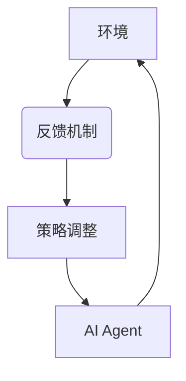
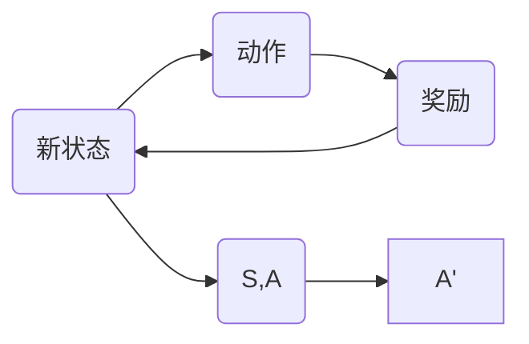
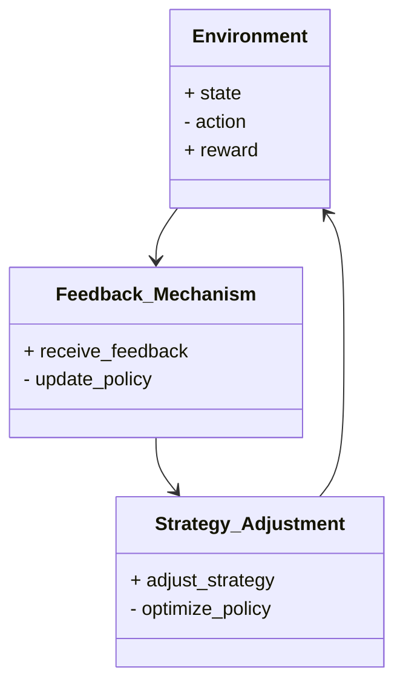
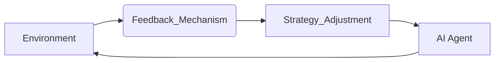

                 


# 《构建具有自适应学习策略的AI Agent》

> **关键词**：AI Agent，自适应学习策略，强化学习，系统架构，自适应优化算法，动态环境

> **摘要**：本文详细探讨了如何构建具有自适应学习策略的AI Agent。通过分析动态环境中的学习需求，结合强化学习、元学习和自适应优化算法，提出了一种基于反馈机制的自适应学习策略。文章从背景介绍、核心概念、算法原理、系统架构到项目实战，层层深入，旨在为读者提供一套完整的构建方案。

---

## 第一部分: 背景介绍

### 第1章: 自适应学习策略的背景与问题背景

#### 1.1 问题背景
- **1.1.1 AI Agent的基本概念**
  - AI Agent（人工智能代理）是指能够感知环境、自主决策并执行任务的智能体。它可以是一个软件程序，也可以是一个物理机器人。
  
- **1.1.2 自适应学习策略的必要性**
  - AI Agent需要在动态环境中工作，环境的变化要求其具备自适应能力，能够根据新信息调整策略。

- **1.1.3 当前AI Agent面临的挑战**
  - 动态环境中的不确定性；复杂任务的多样性；实时反馈的需求。

#### 1.2 问题描述
- **1.2.1 自适应学习的定义**
  - 自适应学习是指AI Agent能够根据环境反馈动态调整其学习策略，以优化任务执行能力。

- **1.2.2 AI Agent在动态环境中的适应性需求**
  - 快速响应变化；处理不确定性；持续优化性能。

- **1.2.3 自适应学习策略的核心问题**
  - 如何设计高效的反馈机制；如何实现多目标优化；如何动态调整策略。

#### 1.3 问题解决
- **1.3.1 自适应学习策略的设计目标**
  - 提高AI Agent的环境适应能力；优化任务执行效率；增强决策的准确性。

- **1.3.2 解决方案的总体思路**
  - 强化学习框架；动态反馈机制；多目标优化算法。

- **1.3.3 解决方案的实现路径**
  - 建立反馈机制；设计自适应学习算法；实现动态策略调整。

#### 1.4 边界与外延
- **1.4.1 自适应学习的边界条件**
  - 环境变化的范围；任务目标的明确性；反馈的及时性。

- **1.4.2 相关概念的区分与联系**
  - 区分自适应学习与其他学习方法；联系动态环境与静态环境。

- **1.4.3 自适应学习的外延范围**
  - 应用场景扩展；技术融合趋势；未来发展方向。

#### 1.5 概念结构与核心要素
- **1.5.1 概念结构图**
  - 自适应学习策略由环境感知、反馈机制、策略调整三个核心模块组成。

- **1.5.2 核心要素的详细描述**
  - 环境感知：获取环境信息；反馈机制：处理反馈信息；策略调整：优化策略。

- **1.5.3 要素之间的关系分析**
  - 环境感知为反馈机制提供数据；反馈机制指导策略调整；策略调整影响环境感知。

---

## 第二部分: 核心概念与联系

### 第2章: 自适应学习策略的核心概念

#### 2.1 自适应学习策略的原理
- **2.1.1 策略调整机制**
  - 策略调整基于反馈信息，动态优化策略参数。

- **2.1.2 动态环境中的反馈机制**
  - 实时反馈用于调整策略；累积反馈用于长期优化。

- **2.1.3 多目标优化的实现方式**
  - 使用优先级权重；构建联合目标函数。

#### 2.2 核心概念的属性特征对比
- **2.2.1 表格形式的属性对比**
  | 概念       | 定义                                                                 | 特性          |
  |------------|----------------------------------------------------------------------|---------------|
  | 策略调整   | 根据反馈信息调整策略参数                                                 | 动态性、反馈驱动 |

- **2.2.2 关键属性的详细分析**
  - 动态性：策略随时间变化；反馈驱动：调整基于反馈。

- **2.2.3 属性之间的相互影响**
  - 动态性依赖反馈驱动；反馈驱动影响动态性。

#### 2.3 ER实体关系图
- **2.3.1 实体关系图的Mermaid流程图**



- **2.3.2 实体之间的关系分析**
  - 环境与反馈机制：环境提供反馈信息。
  - 反馈机制与策略调整：反馈指导策略调整。
  - 策略调整与AI Agent：策略调整影响AI Agent的行为。

---

## 第三部分: 算法原理讲解

### 第3章: 强化学习算法原理

#### 3.1 强化学习的基本概念
- **3.1.1 状态、动作、奖励的定义**
  - 状态：环境的当前情况。
  - 动作：AI Agent的行为选择。
  - 奖励：反馈信息，指导行为优化。

#### 3.2 算法实现
- **3.2.1 Q-learning算法的流程图**



- **3.2.2 算法的数学模型**
  - Q-learning目标函数：$$ Q(s,a) = Q(s,a) + \alpha (r + \gamma \max Q(s',a') - Q(s,a)) $$
  - 其中，$\alpha$是学习率，$\gamma$是折扣因子。

#### 3.3 元学习的实现
- **3.3.1 元学习的基本概念**
  - 元学习：通过学习如何学习，加速新任务的适应。

- **3.3.2 元学习的数学公式**
  - 等式：$$ \theta = \theta + \eta (g(\theta) - \theta) $$
  - 其中，$\eta$是步长，$g(\theta)$是目标梯度。

---

## 第四部分: 系统分析与架构设计方案

### 第4章: 系统架构设计

#### 4.1 问题场景介绍
- **4.1.1 系统设计背景**
  - AI Agent需要在动态环境中执行复杂任务。

- **4.1.2 系统设计目标**
  - 实现实时反馈机制；动态调整策略；优化任务执行效率。

#### 4.2 领域模型类图设计
- **4.2.1 领域模型类图**



#### 4.3 系统架构设计
- **4.3.1 系统架构图**



#### 4.4 系统接口设计
- **4.4.1 系统接口描述**
  - 环境接口：提供状态、接收动作。
  - 反馈机制接口：处理奖励，调整策略。

---

## 第五部分: 项目实战

### 第5章: 项目实战

#### 5.1 环境安装
- **5.1.1 开发环境要求**
  - Python 3.8+
  - 安装库：numpy, gym, matplotlib.

#### 5.2 系统核心实现源代码
- **5.2.1 自适应学习策略的核心代码**

```python
class AdaptiveLearningAgent:
    def __init__(self, state_space, action_space):
        self.state_space = state_space
        self.action_space = action_space
        self.Q_table = defaultdict(int)

    def take_action(self, state):
        # 探索与利用策略
        if random.random() < 0.1:
            return random.choice(self.action_space)
        else:
            return max(zip(self.Q_table[state], self.action_space))[1]

    def update_Q_table(self, state, action, reward, next_state):
        current_Q = self.Q_table[state, action]
        next_max_Q = max(self.Q_table[next_state, a] for a in self.action_space)
        self.Q_table[state, action] = current_Q + 0.1 * (reward + 0.99 * next_max_Q - current_Q)
```

#### 5.3 代码应用解读与分析
- **5.3.1 代码实现的详细说明**
  - Q-table存储状态-动作值；探索与利用策略平衡探索和利用。

---

## 第六部分: 最佳实践

### 第6章: 最佳实践

#### 6.1 小结
- 本文详细介绍了构建具有自适应学习策略的AI Agent的全过程。

#### 6.2 注意事项
- 确保反馈机制的实时性；平衡探索与利用；动态调整策略参数。

#### 6.3 拓展阅读
- 《强化学习导论》；《自适应控制系统》。

---

## 作者：AI天才研究院/AI Genius Institute & 禅与计算机程序设计艺术 /Zen And The Art of Computer Programming

