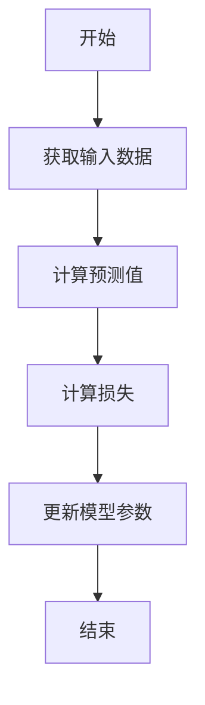

                 


# 构建具有自适应学习能力的AI Agent

> 关键词：AI Agent, 自适应学习, 机器学习, 强化学习, 系统架构设计, 项目实战

> 摘要：本文将详细介绍如何构建一个具有自适应学习能力的AI Agent。通过分析自适应学习的基本原理、算法实现、系统架构设计以及项目实战，我们将探讨如何使AI Agent能够根据环境变化动态调整其学习策略，从而实现更高效、更智能的决策和行为。本文将结合理论与实践，为读者提供一个全面的构建指南。

---

## 第一部分: 自适应学习AI Agent概述

### 第1章: 自适应学习AI Agent的背景与概念

#### 1.1 AI Agent的基本概念
- **什么是AI Agent？**  
  AI Agent（人工智能代理）是指能够感知环境、自主决策并采取行动的智能实体。它可以是一个软件程序，也可以是一个物理设备，其核心目标是通过与环境的交互来实现特定任务。

- **自适应学习能力的定义**  
  自适应学习能力是指AI Agent能够在动态变化的环境中，根据新的数据或反馈，自动调整其学习策略和模型参数，以提高任务执行效率和准确性。

- **自适应学习AI Agent的核心要素**  
  - **感知能力**：能够从环境中获取信息（如传感器数据、用户反馈等）。  
  - **学习能力**：通过机器学习算法不断优化模型。  
  - **决策能力**：基于当前状态和目标，做出最优决策。  
  - **自适应能力**：根据环境变化动态调整学习策略。

#### 1.2 自适应学习的重要性
- **传统AI Agent的局限性**  
  传统AI Agent通常基于静态模型，在环境变化时无法有效调整其行为策略。  

- **自适应学习的优势**  
  - 能够在动态环境中保持高性能。  
  - 可以通过在线学习快速适应新任务。  
  - 更适合处理不确定性高、数据动态变化的应用场景。  

- **自适应学习的应用场景**  
  - 金融领域：实时股票交易、风险评估。  
  - 游戏AI：动态调整策略以应对对手变化。  
  - 智能推荐系统：根据用户行为实时优化推荐策略。  

---

### 第2章: 自适应学习的基本原理

#### 2.1 自适应算法概述
- **常见自适应算法**  
  - **在线学习算法**：如在线随机梯度下降（Online SGD）。  
  - **强化学习算法**：如Q-Learning、Deep Q-Network（DQN）。  
  - **迁移学习算法**：如领域适配（Domain Adaptation）。  

- **自适应算法的核心特征对比**  
  | 特性        | 在线学习       | 强化学习       | 迁移学习       |
  |-------------|---------------|---------------|---------------|
  | 数据来源     | 实时数据流     | 环境交互       | 不同领域数据   |
  | 学习目标     | 预测/分类      | 最大化奖励     | 任务迁移       |
  | 适用场景     | 实时推荐       | 动态环境决策    | 跨领域任务     |

- **自适应算法的优缺点分析**  
  - 优点：快速响应变化、适应性强。  
  - 缺点：计算资源消耗大、算法复杂度高。  

#### 2.2 自适应学习与传统学习的对比
- **传统机器学习的局限性**  
  - 数据集固定，无法实时更新。  
  - 模型一旦训练完成，无法根据新数据调整。  

- **自适应学习的独特性**  
  - 数据流式处理能力。  
  - 动态调整模型参数能力。  

- **自适应学习的数学模型**  
  自适应学习的核心在于动态更新模型参数。以线性回归为例，自适应学习的更新公式可以表示为：  
  $$ w_{t+1} = w_t + \alpha (y_t - \hat{y}_t) x_t $$  
  其中，$w_t$ 是当前时刻的权重，$\alpha$ 是学习率，$x_t$ 是输入，$y_t$ 是真实值，$\hat{y}_t$ 是预测值。

---

## 第三部分: 自适应学习AI Agent的算法实现

### 第3章: 自适应学习算法的实现原理

#### 3.1 自适应算法的流程图


#### 3.2 自适应算法的Python实现
```python
import numpy as np

def adaptive_learning(X, y, learning_rate=0.1):
    # 初始化权重
    weights = np.zeros(X.shape[1])
    # 迭代更新权重
    for i in range(len(X)):
        x = X[i]
        y_pred = np.dot(x, weights)
        error = y[i] - y_pred
        weights += learning_rate * error * x
    return weights
```

---

### 第4章: 自适应学习的系统架构设计

#### 4.1 系统架构概述
- **系统功能模块划分**  
  - **感知层**：负责数据采集和环境交互。  
  - **决策层**：负责模型训练和策略生成。  
  - **执行层**：负责根据决策层的指令采取行动。  

- **系统架构设计图**  
  ```mermaid
  graph TD
      UI[用户界面] --> Agent[AI Agent]
      Agent --> Env[环境]
      Env --> Senser[传感器]
      Agent --> Model[模型]
      Model --> Decision[决策模块]
      Decision --> Action[动作]
  ```

---

## 第五部分: 自适应学习AI Agent的项目实战

### 第5章: 自适应学习AI Agent的项目实战

#### 5.1 项目背景与目标
- **项目需求分析**  
  本文将以一个简单的股票交易AI Agent为例，展示如何实现一个能够自适应学习的交易系统。  

- **项目目标设定**  
  - 实现一个基于在线学习的股票交易AI Agent。  
  - 系统能够根据市场变化动态调整交易策略。  

#### 5.2 项目实现
- **环境安装**  
  ```bash
  pip install numpy scikit-learn matplotlib
  ```

- **核心代码实现**  
  ```python
  import numpy as np
  from sklearn.linear_model import SGDRegressor

  def train_agent(data, labels):
      model = SGDRegressor()
      model.fit(data, labels)
      return model

  def predict_price(model, new_data):
      return model.predict(new_data)
  ```

- **实际案例分析**  
  以股票价格预测为例，假设我们有历史价格数据和实际价格数据，我们可以训练一个自适应学习模型，并使用该模型预测未来的价格。  

---

## 结论

通过本文的详细讲解，我们了解了如何构建一个具有自适应学习能力的AI Agent。从基本概念到算法实现，再到系统架构设计和项目实战，我们逐步探讨了自适应学习的核心原理和应用场景。未来，随着AI技术的不断发展，自适应学习AI Agent将在更多领域展现出其强大的潜力和价值。

---

作者：AI天才研究院/AI Genius Institute & 禅与计算机程序设计艺术 /Zen And The Art of Computer Programming

