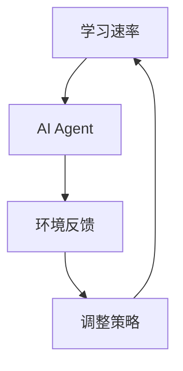

                 

# 构建具有自适应学习速率的AI Agent

> 关键词：自适应学习速率，AI Agent，强化学习，动态环境，算法优化

> 摘要：本文将深入探讨如何构建一个能够根据环境动态自适应调整学习速率的AI Agent。文章从背景介绍、核心概念、算法原理、系统架构到项目实战，全面分析自适应学习速率AI Agent的构建过程。通过详细讲解每一步骤，结合数学公式、Mermaid图和Python代码示例，帮助读者理解并实现一个高效的自适应学习速率AI Agent。

---

# 第1章 自适应学习速率AI Agent的背景与问题背景

## 1.1 问题背景

### 1.1.1 AI Agent的基本概念
AI Agent（人工智能代理）是指在环境中能够感知并自主行动以实现目标的智能实体。它可以是一个软件程序，也可以是一个物理机器人，通过传感器接收输入，利用算法处理信息，并通过执行器输出行动。AI Agent的核心目标是根据环境反馈不断优化自己的行为策略。

### 1.1.2 学习速率在AI Agent中的重要性
在强化学习（Reinforcement Learning）中，学习速率（Learning Rate）是一个关键的超参数，决定了模型参数更新的速度。过高的学习速率可能导致模型振荡，无法收敛；过低的学习速率则会减缓训练速度，甚至陷入局部最优。因此，学习速率的选择直接影响AI Agent的学习效率和最终性能。

### 1.1.3 自适应学习速率的必要性
在动态环境中，AI Agent需要应对不断变化的挑战，如环境参数的变化、任务目标的调整或对抗性干扰。固定学习速率在这些情况下往往表现不佳，无法高效适应环境变化。自适应学习速率能够根据当前环境状态和学习进展动态调整，使AI Agent在各种情况下都能保持高效的学习能力。

---

## 1.2 问题描述

### 1.2.1 固定学习速率的局限性
固定学习速率在训练过程中表现不稳定。在某些阶段，如初始阶段，可能需要较高的学习速率以快速收敛；而在后期，可能需要较低的学习速率以进行精细调整。固定的单一速率无法兼顾这些需求，导致训练效率低下或模型性能不佳。

### 1.2.2 动态环境中的学习挑战
动态环境中，环境状态不断变化，新的情况层出不穷。AI Agent需要快速适应这些变化，但固定学习速率可能无法在不同阶段灵活调整，导致其在变化的环境中表现欠佳。

### 1.2.3 自适应学习速率的目标与意义
自适应学习速率的目标是根据当前的环境反馈和学习进度动态调整学习速率，使AI Agent能够在不同阶段以最优的速度更新参数，从而提高学习效率和最终性能。这种灵活性使AI Agent能够更好地应对复杂和动态的环境挑战。

---

## 1.3 问题解决

### 1.3.1 自适应学习速率的核心思想
自适应学习速率的核心思想是根据训练过程中的损失函数变化、梯度信息或环境反馈动态调整学习速率。通过实时监控训练状态，AI Agent能够智能地选择合适的速率，以加快收敛速度并提高最终性能。

### 1.3.2 自适应学习速率的实现方法
自适应学习速率可以通过多种方法实现，如基于梯度的自适应方法（Adam优化器）、元学习方法（Meta-Learning）或动态规划方法。这些方法利用不同的机制来调整学习速率，以适应当前的学习环境。

### 1.3.3 自适应学习速率的优势与价值
自适应学习速率能够提高AI Agent的学习效率，减少训练时间，同时增强模型的泛化能力和适应性。特别是在复杂和动态的环境中，自适应学习速率使AI Agent能够更高效地应对各种挑战，显著提升其性能和实用性。

---

## 1.4 边界与外延

### 1.4.1 自适应学习速率的适用场景
自适应学习速率适用于动态环境中的任务，如游戏AI、机器人控制、自适应推荐系统等。这些场景需要AI Agent能够快速响应环境变化，并持续优化其行为策略。

### 1.4.2 自适应学习速率的限制与不足
自适应学习速率并非在所有情况下都适用。在某些情况下，如环境高度不稳定或任务目标频繁变化，可能会导致学习速率调整过于频繁，从而影响模型的稳定性。此外，自适应学习速率的实现可能增加计算复杂度，对硬件性能提出更高要求。

### 1.4.3 自适应学习速率与其他学习方法的对比
自适应学习速率与固定学习速率的主要区别在于灵活性和适应性。自适应学习速率能够根据环境变化动态调整，而固定学习速率则缺乏这种灵活性。与元学习和动态规划等方法相比，自适应学习速率更注重实时调整，适用于需要快速响应的场景。

---

## 1.5 概念结构与核心要素

### 1.5.1 自适应学习速率的组成要素
自适应学习速率系统通常包括以下几个核心要素：
1. **学习速率调整机制**：根据当前状态调整学习速率。
2. **环境反馈模块**：提供训练过程中的反馈信息。
3. **参数更新模块**：根据调整后的学习速率更新模型参数。
4. **监控与评估模块**：实时监控训练状态并评估调整效果。

### 1.5.2 各要素之间的关系
各要素之间相互关联，共同构成一个动态调整的系统。环境反馈模块为学习速率调整机制提供输入，参数更新模块执行具体的更新操作，监控与评估模块则实时跟踪整个系统的运行状态。

### 1.5.3 自适应学习速率的数学模型
自适应学习速率的数学模型可以表示为：
$$ \alpha(t) = \alpha_{\text{base}} \cdot \frac{1}{1 + \beta \cdot t} $$
其中，$\alpha(t)$ 表示第 $t$ 步的学习速率，$\alpha_{\text{base}}$ 是基础学习速率，$\beta$ 是调节参数，$t$ 是时间步数。

---

## 总结
自适应学习速率AI Agent的核心思想是根据动态环境和学习进展实时调整学习速率，以提高学习效率和模型性能。通过分析其背景、核心概念和实现方法，我们可以更好地理解如何构建这样一个高效的AI Agent。

---

# 第2章 自适应学习速率的核心概念与联系

## 2.1 核心概念原理

### 2.1.1 自适应学习速率的基本原理
自适应学习速率的基本原理是通过监控训练过程中的损失函数变化、梯度信息或环境反馈，动态调整学习速率。例如，当损失函数下降速度变慢时，系统会降低学习速率以进行精细调整；当损失函数迅速下降时，系统则会提高学习速率以加快收敛速度。

### 2.1.2 自适应学习速率的数学表达式
常用的自适应学习速率算法之一是Adam优化器，其数学表达式如下：
$$ \theta_{t+1} = \theta_t - \alpha \cdot \frac{\rho_1 \cdot g_t + (1-\rho_1) \cdot g_t^2}{\sqrt{\rho_2 \cdot g_t^2 + (1-\rho_2) \cdot g_t^4 + \epsilon}} $$
其中，$\theta$ 表示模型参数，$\alpha$ 表示学习速率，$\rho_1$ 和 $\rho_2$ 分别表示一阶和二阶动量的衰减率，$g_t$ 表示梯度，$\epsilon$ 是防止除以零的epsilon参数。

### 2.1.3 自适应学习速率的实现机制
自适应学习速率的实现机制通常包括以下几个步骤：
1. 计算当前梯度：$$ g_t = \frac{\partial L}{\partial \theta} $$
2. 计算一阶动量：$$ m_t = \beta_1 \cdot m_{t-1} + (1 - \beta_1) \cdot g_t $$
3. 计算二阶动量：$$ v_t = \beta_2 \cdot v_{t-1} + (1 - \beta_2) \cdot g_t^2 $$
4. 调整学习速率：$$ \alpha_{\text{effective}} = \frac{\alpha}{\sqrt{v_t + \epsilon}} $$
5. 更新参数：$$ \theta_{t+1} = \theta_t - \alpha_{\text{effective}} \cdot m_t $$

---

## 2.2 核心概念属性特征对比

| 属性                | 固定学习速率             | 自适应学习速率           |
|---------------------|-------------------------|-------------------------|
| 灵活性              | 低                     | 高                     |
| 收敛速度            | 中等                   | 快                     |
| 适应性              | 低                     | 高                     |
| 训练效率            | 可能需要多次调整        | 无需手动调整，自动优化  |
| 适用场景            | 稳定环境               | 动态环境               |

---

## 2.3 ER实体关系图

---

## 总结
本章详细讲解了自适应学习速率的核心概念和实现原理，通过对比分析和实体关系图，帮助读者更好地理解自适应学习速率AI Agent的构建基础。

---

接下来的章节将继续深入探讨自适应学习速率的算法实现、系统架构设计、项目实战等内容，具体内容请参考后续章节。

---

# 作者

作者：AI天才研究院 & 禅与计算机程序设计艺术

