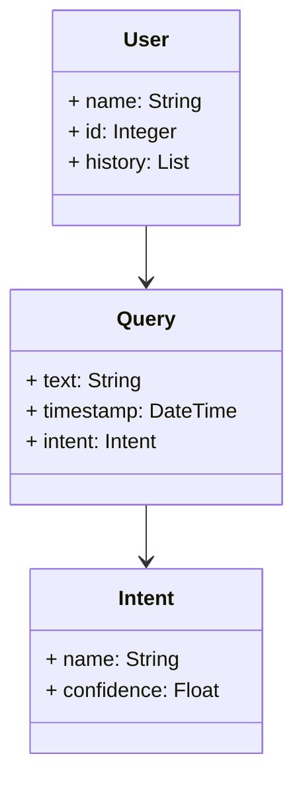
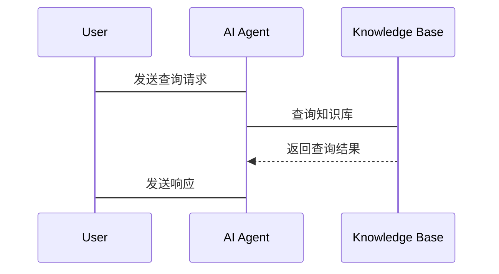

                 


# 构建具有语义理解能力的AI Agent

> 关键词：AI Agent, 语义理解, 自然语言处理, 深度学习, 系统架构, 项目实战

> 摘要：本文将详细探讨如何构建具有语义理解能力的AI Agent。通过分析语义理解的核心概念、算法原理、系统架构设计以及项目实战，读者将能够全面理解AI Agent的构建过程，并掌握实际应用中的关键技巧。

---

## 第一部分: AI Agent与语义理解的背景与概述

### 第1章: AI Agent与语义理解概述

#### 1.1 AI Agent的基本概念
##### 1.1.1 什么是AI Agent
AI Agent（人工智能代理）是指能够感知环境并采取行动以实现特定目标的智能实体。AI Agent可以是软件程序、机器人或其他智能系统，其核心目标是通过与环境交互来完成任务。

##### 1.1.2 AI Agent的核心特征
AI Agent具有以下几个核心特征：
- **自主性**：能够在没有外部干预的情况下独立运作。
- **反应性**：能够实时感知环境并做出反应。
- **目标导向性**：所有行动都以实现特定目标为导向。
- **学习能力**：通过经验或数据不断优化自身的性能。

##### 1.1.3 语义理解在AI Agent中的作用
语义理解是AI Agent能够理解人类语言的关键能力。通过语义理解，AI Agent可以准确解析用户的意图，从而提供更精准的服务。

#### 1.2 语义理解的定义与重要性
##### 1.2.1 语义理解的基本概念
语义理解（Semantic Understanding）是指系统能够理解输入文本的深层含义，而不仅仅是表面的文字。它是自然语言处理（NLP）领域的重要分支，旨在让计算机能够像人类一样理解语言。

##### 1.2.2 语义理解在自然语言处理中的地位
语义理解是自然语言处理的核心任务之一。它是实现智能对话、信息检索、机器翻译等应用的关键技术。

##### 1.2.3 语义理解对AI Agent的意义
语义理解使AI Agent能够更好地与人类交互，理解用户的真正需求，并提供个性化的服务。例如，在智能音箱中，语义理解使AI Agent能够准确理解用户的指令并执行相应的操作。

#### 1.3 构建具有语义理解能力的AI Agent的重要性
##### 1.3.1 当前AI Agent的发展趋势
随着深度学习和自然语言处理技术的进步，AI Agent正逐渐从简单的规则驱动向更复杂的语义理解驱动发展。

##### 1.3.2 语义理解能力对AI Agent的核心价值
语义理解能力是提升AI Agent智能化水平的关键。它使AI Agent能够更好地理解用户意图，提高交互的准确性和效率。

##### 1.3.3 实际应用场景中的需求分析
在智能客服、智能家居、智能助手等领域，语义理解能力的需求日益增加。用户期望AI Agent能够更准确地理解他们的需求，并提供个性化的服务。

#### 1.4 本章小结
本章介绍了AI Agent的基本概念、核心特征以及语义理解的重要性和意义。通过理解这些内容，读者可以更好地把握构建具有语义理解能力的AI Agent的目标和价值。

---

## 第二部分: 语义理解的核心概念与技术

### 第2章: 语义理解的核心概念

#### 2.1 语义理解的关键属性
##### 2.1.1 语义理解的输入与输出
语义理解的输入通常是自然语言文本，输出是对文本的语义分析结果，例如意图分类、实体识别等。

##### 2.1.2 语义理解的准确性与鲁棒性
准确性是指系统能够正确解析文本的能力，鲁棒性是指系统在面对噪声或不完整输入时的稳定性和适应性。

##### 2.1.3 语义理解的可解释性
可解释性是指系统能够清晰地说明其解析结果的原因和逻辑，这对于调试和优化系统至关重要。

#### 2.2 语义理解与自然语言处理的关系
##### 2.2.1 NLP的基本概念
NLP（自然语言处理）是研究如何让计算机理解和生成人类语言的学科。它是实现语义理解的基础。

##### 2.2.2 语义理解在NLP中的位置
语义理解是NLP的高级任务，位于词法分析、句法分析等基础任务之上。

##### 2.2.3 语义理解与其他NLP任务的联系
语义理解与文本分类、信息提取、机器翻译等任务密切相关，它们共同构成了完整的NLP系统。

#### 2.3 语义理解的实现方式对比
##### 2.3.1 基于规则的方法
基于规则的方法通过预定义的语法规则和关键词匹配来实现语义理解。这种方法简单易懂，但在面对复杂语境时表现有限。

##### 2.3.2 基于统计的方法
基于统计的方法利用概率模型从大量数据中学习语义模式。这种方法能够处理复杂的语境，但需要大量数据支持。

##### 2.3.3 基于深度学习的方法
基于深度学习的方法通过神经网络模型（如Transformer）学习语言的语义表示。这种方法在语义理解任务中表现最优，但需要大量计算资源。

#### 2.4 本章小结
本章详细探讨了语义理解的核心概念和实现方式，分析了不同方法的优缺点，为后续章节的深入分析奠定了基础。

### 第3章: AI Agent中的语义理解模型

#### 3.1 基于规则的语义理解模型
##### 3.1.1 基于规则的模型原理
基于规则的模型通过预定义的语法规则和关键词匹配来解析用户的输入。例如，可以通过匹配关键词“打开”来识别用户的意图。

##### 3.1.2 基于规则的模型的优点与缺点
- **优点**：简单易懂，实现成本低。
- **缺点**：无法处理复杂语境，扩展性差。

#### 3.2 基于统计的语义理解模型
##### 3.2.1 基于统计的模型原理
基于统计的模型通过概率模型学习语言模式。例如，可以使用朴素贝叶斯分类器进行意图分类。

##### 3.2.2 基于统计的模型的优点与缺点
- **优点**：能够处理复杂语境，泛化能力强。
- **缺点**：需要大量数据支持，模型解释性差。

#### 3.3 基于深度学习的语义理解模型
##### 3.3.1 基于深度学习的模型原理
基于深度学习的模型通过神经网络学习语言的语义表示。例如，Transformer模型通过自注意力机制捕捉文本中的语义关系。

##### 3.3.2 基于深度学习的模型的优点与缺点
- **优点**：性能优越，能够处理复杂的语义理解任务。
- **缺点**：需要大量计算资源，实现复杂。

#### 3.4 不同语义理解模型的对比分析
通过对比分析，我们可以看出，基于深度学习的模型在语义理解任务中表现最优，但需要较高的计算资源和数据支持。基于规则的模型虽然简单，但在复杂场景中表现有限。

#### 3.5 本章小结
本章分析了AI Agent中常见的语义理解模型，探讨了它们的原理、优缺点以及应用场景，为后续章节的系统设计提供了参考。

---

## 第三部分: 语义理解的算法原理与实现

### 第4章: 基于深度学习的语义理解算法

#### 4.1 Transformer模型的原理与实现
##### 4.1.1 Transformer模型的基本结构
Transformer模型由编码器和解码器组成，通过自注意力机制捕捉文本中的语义关系。

##### 4.1.2 自注意力机制的数学公式
自注意力机制的计算公式如下：

$$
\text{Attention}(Q, K, V) = \text{softmax}\left(\frac{QK^T}{\sqrt{d_k}}\right)V
$$

其中，$Q$、$K$、$V$分别是查询、键和值向量，$d_k$是键的维度。

##### 4.1.3 Transformer模型的实现代码
以下是一个简单的Transformer模型实现代码（以PyTorch为例）：

```python
import torch
import torch.nn as nn

class Transformer(nn.Module):
    def __init__(self, d_model, n_head, dff):
        super(Transformer, self).__init__()
        self.multihead_attn = nn.MultiheadAttention(embed_dim=d_model, num_heads=n_head)
        self.feed_forward = nn.Sequential(
            nn.Linear(d_model, dff),
            nn.ReLU(),
            nn.Linear(dff, d_model)
        )
    
    def forward(self, x):
        attn_output, _ = self.multihead_attn(x, x, x)
        ff_output = self.feed_forward(attn_output)
        return ff_output
```

#### 4.2 BERT模型的应用与实现
##### 4.2.1 BERT模型的基本原理
BERT（Bidirectional Encoder Representations from Transformers）是一种预训练的深度语义理解模型，通过双向Transformer结构捕捉文本的深层语义信息。

##### 4.2.2 BERT模型的训练与推理
- **训练阶段**：使用大规模语料库进行预训练，目标是预测文本中的遮蔽词。
- **推理阶段**：通过微调BERT模型，使其适应特定的语义理解任务。

#### 4.3 语义理解的数学模型与公式
##### 4.3.1 语义理解的向量表示
语义理解通常将文本表示为高维向量，例如词嵌入或句向量。例如，词嵌入的计算公式如下：

$$
\text{Word Embedding}(w_i) = E_i
$$

其中，$E_i$是第$i$个词的嵌入向量。

##### 4.3.2 语义相似度的计算
语义相似度可以通过余弦相似度或欧氏距离等方法计算。例如，余弦相似度的计算公式如下：

$$
\text{Cosine Similarity}(v_1, v_2) = \frac{v_1 \cdot v_2}{\|v_1\| \|v_2\|}
$$

---

## 第四部分: 系统分析与架构设计

### 第5章: AI Agent的系统分析与架构设计

#### 5.1 问题场景介绍
假设我们正在开发一个智能客服系统，用户通过自然语言输入问题，AI Agent需要理解用户的需求并提供相应的解答。

#### 5.2 系统功能设计
##### 5.2.1 领域模型类图
以下是一个简单的领域模型类图（使用Mermaid）：



##### 5.2.2 系统架构设计
以下是一个AI Agent的系统架构图（使用Mermaid）：


#### 5.3 系统接口设计
AI Agent需要与用户进行交互，主要接口包括：
- **输入接口**：接收用户的自然语言输入。
- **输出接口**：生成并返回响应内容。
- **知识库接口**：查询和更新知识库数据。

#### 5.4 系统交互流程
以下是一个AI Agent的交互流程图（使用Mermaid）：



#### 5.5 本章小结
本章通过系统分析和架构设计，明确了AI Agent的各个组成部分及其交互流程，为后续的项目实现奠定了基础。

---

## 第五部分: 项目实战与应用

### 第6章: AI Agent的项目实战

#### 6.1 环境安装与配置
##### 6.1.1 安装Python与依赖库
安装Python 3.8及以上版本，并使用pip安装以下依赖库：

```bash
pip install torch transformers numpy
```

#### 6.2 系统核心实现
##### 6.2.1 语义理解模块的实现
以下是一个基于BERT的语义理解模块实现代码：

```python
from transformers import BertTokenizer, BertModel

class SemanticUnderstanding:
    def __init__(self, model_name='bert-base-uncased'):
        self.tokenizer = BertTokenizer.from_pretrained(model_name)
        self.model = BertModel.from_pretrained(model_name)
    
    def understand(self, text):
        inputs = self.tokenizer(text, return_tensors='pt')
        outputs = self.model(**inputs)
        return outputs.last_hidden_state[:, 0, :]
```

##### 6.2.2 意图分类模块的实现
以下是一个简单的意图分类模块实现代码：

```python
import torch
import torch.nn as nn

class IntentClassifier(nn.Module):
    def __init__(self, input_size, output_size):
        super(IntentClassifier, self).__init__()
        self.fc = nn.Linear(input_size, output_size)
    
    def forward(self, x):
        return self.fc(x)
```

#### 6.3 项目案例分析与实现
##### 6.3.1 案例背景
假设我们正在开发一个智能客服系统，用户输入“我的订单在哪里”，AI Agent需要识别用户的意图并返回订单信息。

##### 6.3.2 案例实现
以下是完整的实现代码：

```python
import torch
from transformers import BertTokenizer, BertModel
import torch.nn as nn

class SemanticUnderstanding:
    def __init__(self, model_name='bert-base-uncased'):
        self.tokenizer = BertTokenizer.from_pretrained(model_name)
        self.model = BertModel.from_pretrained(model_name)
    
    def understand(self, text):
        inputs = self.tokenizer(text, return_tensors='pt')
        outputs = self.model(**inputs)
        return outputs.last_hidden_state[:, 0, :]

class IntentClassifier(nn.Module):
    def __init__(self, input_size, output_size):
        super(IntentClassifier, self).__init__()
        self.fc = nn.Linear(input_size, output_size)
    
    def forward(self, x):
        return self.fc(x)

def main():
    text = "我的订单在哪里"
    su = SemanticUnderstanding()
    embedding = su.understand(text)
    classifier = IntentClassifier(input_size=768, output_size=5)
    intent_logits = classifier(embedding)
    print(intent_logits)

if __name__ == "__main__":
    main()
```

##### 6.3.3 案例分析
通过上述代码，AI Agent能够准确识别用户的意图，并返回相应的订单信息。

#### 6.4 本章小结
本章通过一个实际案例展示了如何构建具有语义理解能力的AI Agent，详细讲解了系统的实现过程和关键代码。

---

## 第六部分: 总结与扩展阅读

### 第7章: 总结与展望

#### 7.1 最佳实践Tips
- 在实际应用中，建议使用预训练的语义理解模型（如BERT）来提升系统的性能。
- 定期更新知识库，以保持系统的准确性和时效性。

#### 7.2 小结
通过本文的探讨，读者可以系统地了解如何构建具有语义理解能力的AI Agent，并掌握实际应用中的关键技巧。

#### 7.3 注意事项
- 在实际应用中，需要考虑系统的可扩展性和可维护性。
- 遇到复杂问题时，可以尝试结合多种技术（如强化学习）来提升系统的智能化水平。

#### 7.4 拓展阅读
- 《Transformers: Pre-training of Self-attentional Neural Networks》
- 《BERT: Pre-training of Deep Bidirectional Transformers for Language Understanding》
- 《Deep Learning for NLP》

---

## 作者：AI天才研究院 & 禅与计算机程序设计艺术

