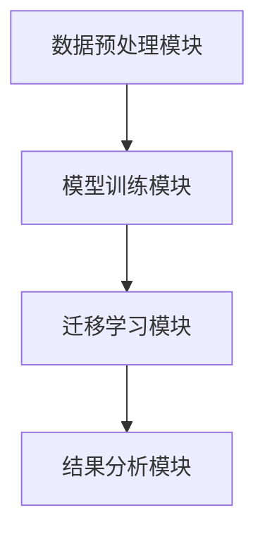

                 


# 构建具有迁移学习能力的AI Agent

---

## 关键词：
- 迁移学习
- AI Agent
- 机器学习
- 系统架构
- 项目实战

---

## 摘要：
本文详细探讨了构建具有迁移学习能力的AI Agent的理论基础、算法原理和系统设计。首先，我们介绍了迁移学习的核心概念、挑战和应用场景，帮助读者理解其重要性。接着，我们深入分析了迁移学习的算法原理，包括基于样本、特征、目标和模型的迁移学习算法，并通过数学公式和代码示例进行了详细讲解。随后，我们设计了一个AI Agent的系统架构，展示了如何将迁移学习技术整合到实际系统中，并通过项目实战验证了系统的可行性和有效性。最后，我们总结了迁移学习的关键要点，并提出了实际应用中的最佳实践和注意事项。

---

## 第1章: 迁移学习的背景与挑战

### 1.1 迁移学习的定义与核心概念

#### 1.1.1 迁移学习的定义
迁移学习是一种机器学习技术，旨在将从源任务（source task）中学到的知识迁移到目标任务（target task），以提高目标任务的性能。与传统机器学习不同，迁移学习允许模型在不同数据分布的任务之间共享知识。

#### 1.1.2 迁移学习的核心概念
- **源任务（Source Task）**：用于迁移学习的训练任务，通常有充足的数据和标注。
- **目标任务（Target Task）**：需要迁移学习的目标任务，通常数据有限或无标注。
- **领域适应（Domain Adaptation）**：源任务和目标任务的数据分布不同，但任务相同。
- **任务归纳（Task Generalization）**：源任务和目标任务的数据分布相同，但任务不同。
- **多任务学习（Multi-Task Learning）**：同时学习多个任务，并共享特征或参数。

#### 1.1.3 迁移学习的背景与问题背景
随着AI Agent在复杂环境中的应用增加，迁移学习变得尤为重要。AI Agent需要在动态环境中快速适应新任务，而迁移学习能够帮助其高效利用已有的知识。

---

### 1.2 迁移学习的挑战与技术类型

#### 1.2.1 迁移学习的挑战
1. **数据分布差异**：源任务和目标任务的数据分布可能不同，导致模型在目标任务上表现不佳。
2. **小样本问题**：目标任务可能只有少量样本，难以直接训练。
3. **可解释性**：迁移学习的黑箱特性可能影响模型的可解释性。

#### 1.2.2 不同迁移学习技术的对比
| 技术类型       | 特点                                   | 适用场景                           |
|----------------|--------------------------------------|------------------------------------|
| 基于样本的     | 确保源任务和目标任务样本相似          | 数据分布差异较小                   |
| 基于特征的     | 学习共享特征表示                       | 数据分布差异较大                   |
| 基于目标的     | 调整目标函数以适应目标任务           | 任务相关性高                       |
| 基于模型的     | 利用预训练模型并进行微调             | 需要大量计算资源                   |

#### 1.2.3 迁移学习的边界与外延
迁移学习的外延包括多任务学习、领域适应和任务归纳，这些都是通过共享知识来提高模型性能的方法。

---

## 第2章: 迁移学习的核心概念与联系

### 2.1 迁移学习的原理与机制

#### 2.1.1 迁移学习的原理
迁移学习的核心在于共享特征或参数，通过降低源任务和目标任务之间的差距，提高模型的泛化能力。

#### 2.1.2 迁移学习的核心机制
1. **特征对齐**：通过学习共享特征，使源任务和目标任务的特征空间对齐。
2. **参数共享**：在多任务学习中，共享模型参数以提高任务间的学习效率。

#### 2.1.3 迁移学习与传统机器学习的区别
- 传统机器学习：独立学习每个任务。
- 迁移学习：共享知识，提高学习效率。

---

### 2.2 迁移学习的关键属性与特征对比

#### 2.2.1 迁移学习的属性特征
- 数据依赖性：依赖源任务和目标任务的数据分布。
- 任务相关性：任务之间的相似性影响迁移效果。
- 模型复杂性：模型结构影响迁移学习的效率和效果。

#### 2.2.2 不同迁移学习技术的特征对比
| 技术类型       | 数据依赖性 | 任务相关性 | 模型复杂性 |
|----------------|------------|------------|------------|
| 基于样本的     | 高         | 中         | 低         |
| 基于特征的     | 中         | 高         | 中         |
| 基于目标的     | 低         | 高         | 高         |
| 基于模型的     | 中         | 中         | 高         |

#### 2.2.3 迁移学习的ER实体关系图
```mermaid
er
  entity 源任务 {
    key 源任务ID
    源任务数据 源任务-> 数据
  }
  entity 目标任务 {
    key 目标任务ID
    目标任务数据 目标任务-> 数据
  }
  entity 特征 {
    key 特征ID
    特征值 特征-> 特征值
  }
  源任务与特征之间存在关联：源任务 -> 特征
  目标任务与特征之间存在关联：目标任务 -> 特征
```

---

## 第3章: 迁移学习算法原理与数学模型

### 3.1 迁移学习算法的分类与选择

#### 3.1.1 基于样本的迁移学习算法
这种方法通过直接对齐源任务和目标任务的样本分布来实现迁移。

#### 3.1.2 基于特征的迁移学习算法
这种方法通过学习共享特征表示，使得源任务和目标任务的特征空间对齐。

#### 3.1.3 基于目标的迁移学习算法
这种方法通过调整目标函数，使模型在目标任务上表现更好。

#### 3.1.4 基于模型的迁移学习算法
这种方法利用预训练模型，并在目标任务上进行微调。

---

### 3.2 迁移学习算法的数学模型与公式

#### 3.2.1 迁移学习的数学模型
假设我们有源任务和目标任务的数据分布$P_{\text{source}}$和$P_{\text{target}}$，目标是学习一个模型$f$，使得在目标任务上的表现最优。

#### 3.2.2 常见迁移学习算法的公式推导
以最大均值差异（Maximum Mean Discrepancy，MMD）为例：
$$
\text{MMD}(P_{\text{source}}, P_{\text{target}}) = \mathbb{E}_{x \sim P_{\text{source}}}[f(x)] - \mathbb{E}_{x \sim P_{\text{target}}}[f(x)]
$$

#### 3.2.3 迁移学习算法的对比分析
通过公式对比，我们可以看到不同迁移学习算法在优化目标上的差异。

---

### 3.3 迁移学习算法的实现与代码示例

#### 3.3.1 基于样本的迁移学习实现
```python
import numpy as np
from sklearn.metrics.pairwise import rbf_kernel

def compute_mmd(X_source, X_target, gamma=1.0):
    K_ss = rbf_kernel(X_source, X_source, gamma)
    K_st = rbf_kernel(X_source, X_target, gamma)
    K_tt = rbf_kernel(X_target, X_target, gamma)
    return np.mean(K_ss) - 2 * np.mean(K_st) + np.mean(K_tt)
```

#### 3.3.2 基于特征的迁移学习实现
```python
import torch
import torch.nn as nn

class FeatureExtractor(nn.Module):
    def __init__(self, input_dim):
        super(FeatureExtractor, self).__init__()
        self.fc = nn.Linear(input_dim, 64)
        self.relu = nn.ReLU()
        self.dropout = nn.Dropout(0.5)
    
    def forward(self, x):
        x = self.fc(x)
        x = self.relu(x)
        x = self.dropout(x)
        return x
```

---

## 第4章: 迁移学习算法的系统分析与架构设计

### 4.1 迁移学习系统的整体架构

#### 4.1.1 系统的模块划分
1. 数据预处理模块
2. 模型训练模块
3. 迁移学习模块
4. 结果分析模块

#### 4.1.2 系统的功能设计
- 数据预处理：对源任务和目标任务的数据进行归一化和特征提取。
- 模型训练：在源任务上训练初始模型。
- 迁移学习：将模型迁移到目标任务。
- 结果分析：评估迁移后的模型性能。

#### 4.1.3 系统的架构图


---

## 第5章: 迁移学习算法的项目实战

### 5.1 项目背景与目标
我们将在一个图像分类任务中应用迁移学习，目标是将从源任务（例如，猫的分类）中学到的知识迁移到目标任务（例如，狗的分类）。

### 5.2 环境配置
```bash
pip install torch torchvision matplotlib
```

### 5.3 数据准备与预处理
```python
import torch
from torchvision import datasets, transforms

transform = transforms.Compose([
    transforms.Resize(224),
    transforms.ToTensor(),
])

source_dataset = datasets.CatDataset(root='./data', train=True, download=True, transform=transform)
target_dataset = datasets.DogDataset(root='./data', train=False, download=True, transform=transform)
```

### 5.4 模型实现与迁移学习
```python
class ResNet18(nn.Module):
    def __init__(self, num_classes=1000):
        super(ResNet18, self).__init__()
        self.conv1 = nn.Conv2d(3, 64, kernel_size=3, padding=1)
        self.relu = nn.ReLU()
        self.maxpool = nn.MaxPool2d(2, 2)
        self.fc = nn.Linear(64 * 112 * 112, num_classes)
    
    def forward(self, x):
        x = self.conv1(x)
        x = self.relu(x)
        x = self.maxpool(x)
        x = x.view(-1, 64 * 112 * 112)
        x = self.fc(x)
        return x
```

### 5.5 迁移学习过程与结果分析
1. 在源任务上训练模型。
2. 使用迁移学习技术将模型迁移到目标任务。
3. 评估模型在目标任务上的性能。

---

## 第6章: 迁移学习算法的高级主题与扩展

### 6.1 自适应迁移学习
根据目标任务的数据动态调整迁移策略。

### 6.2 在线迁移学习
实时更新模型以适应新的目标任务。

### 6.3 迁移学习的可解释性
通过可视化技术分析迁移学习的特征对齐过程。

---

## 小结

通过本文的详细讲解，我们了解了构建具有迁移学习能力的AI Agent的理论基础、算法实现和系统设计。迁移学习能够有效提高AI Agent在复杂环境中的适应能力，是实现智能系统的重要技术。

---

## 最佳实践 tips

- 在实际应用中，选择合适的迁移学习算法需要考虑任务相关性和数据分布差异。
- 定期监控模型的迁移效果，并根据需要调整迁移策略。
- 迁移学习的可解释性是未来研究的重要方向。

---

## 注意事项

- 迁移学习可能引入数据泄漏问题，需谨慎处理。
- 在目标任务上进行微调时，需注意过拟合风险。

---

## 扩展阅读

1.《迁移学习：理论与应用》
2.《深度学习中的迁移学习》
3.《迁移学习在自然语言处理中的应用》

---

## 作者

作者：AI天才研究院/AI Genius Institute & 禅与计算机程序设计艺术 /Zen And The Art of Computer Programming

---

通过本文，我们系统地探讨了构建具有迁移学习能力的AI Agent的各个方面，从理论到实践，帮助读者全面理解并掌握这一技术。

