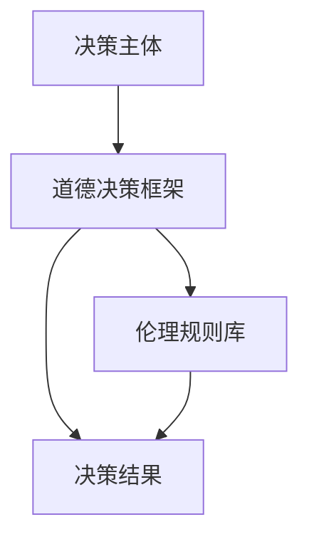
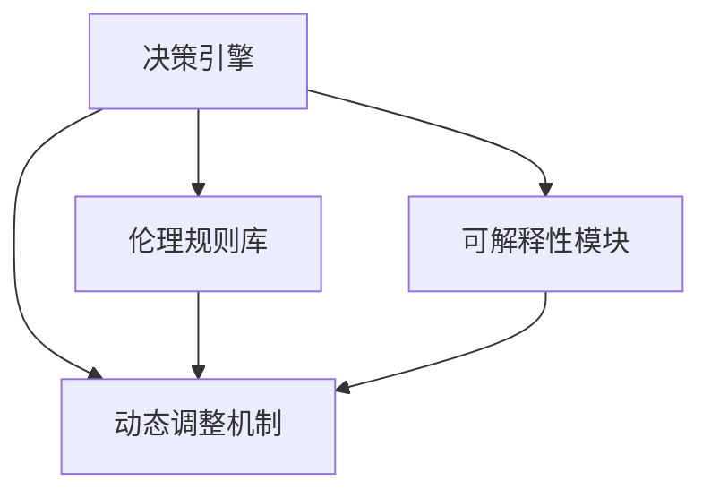

                 


# 《构建具有道德决策框架的AI Agent》

---

## 关键词：AI Agent, 道德决策框架, 伦理决策, 强化学习, 系统架构, 项目实战

---

## 摘要：  
本文详细探讨了如何构建一个具有道德决策框架的AI Agent，从理论到实践，系统性地分析了道德决策框架的核心原理、算法实现、系统架构设计以及实际应用案例。通过对比分析和具体实现，展示了如何将道德决策框架融入AI Agent的决策过程中，确保AI在复杂场景中的决策既符合伦理规范，又能实现高效、准确的判断。

---

## 正文

### 第一部分: 背景介绍

#### 第1章: 问题背景与核心概念

##### 1.1 问题背景
随着人工智能技术的快速发展，AI Agent在各个领域的应用日益广泛。然而，AI Agent的决策过程往往忽视了伦理和道德因素，导致在某些场景下可能出现不符合人类价值观的结果。例如，在自动驾驶汽车中，AI需要在紧急情况下做出决策，如选择碰撞哪一侧的物体以减少伤害。这种情况下，单纯依赖技术逻辑的决策可能无法满足社会的伦理期待。

##### 1.2 问题描述
AI Agent的决策过程需要考虑以下问题：
1. **伦理困境**：在复杂场景中，AI Agent需要在多个选项中选择最优解，但这些选项可能涉及伦理冲突。
2. **决策不透明**：现有的决策模型往往缺乏对决策过程的可解释性，导致用户对AI的决策结果缺乏信任。
3. **动态变化**：实际场景中的伦理标准可能因文化、法律和社会环境的不同而变化，AI Agent需要具备动态调整的能力。

##### 1.3 问题解决
为了应对上述问题，我们需要构建一个道德决策框架，将伦理规则和价值观融入AI Agent的决策过程中。这个框架需要具备以下特点：
1. **可解释性**：确保AI Agent的决策过程透明，用户能够理解决策背后的逻辑。
2. **动态适应性**：能够根据不同的场景和环境调整伦理规则的权重。
3. **可扩展性**：能够支持多种伦理框架和决策模型的集成。

##### 1.4 边界与外延
道德决策框架的边界在于其适用的场景和范围。例如，在医疗AI中，伦理决策框架需要考虑患者隐私和医疗规范，而在商业AI中，则需要考虑商业伦理和法律合规。此外，道德决策框架需要与现有的决策算法（如强化学习和监督学习）相结合，才能实现高效的决策过程。

##### 1.5 概念结构与核心要素
道德决策框架的核心要素包括：
1. **伦理规则库**：包含具体的伦理规范和价值观。
2. **决策模型**：用于根据输入信息和伦理规则生成决策。
3. **可解释性模块**：用于解释决策过程和结果。
4. **动态调整机制**：用于根据环境变化调整伦理规则的权重。

---

### 第二部分: 核心概念与联系

#### 第2章: 道德决策框架的核心原理

##### 2.1 道德决策框架的原理
道德决策框架的核心原理是通过将伦理规则嵌入到AI Agent的决策过程中，确保决策结果符合伦理规范。具体步骤包括：
1. **伦理规则的提取**：从人类社会的伦理规范中提取关键规则。
2. **规则的权重化**：根据具体场景为每个规则分配权重。
3. **决策计算**：结合输入信息和伦理规则生成决策。
4. **决策验证**：通过可解释性模块验证决策的合理性。

##### 2.2 核心概念的对比分析
以下是几种决策框架的对比分析：

| 决策框架 | 基于伦理规则 | 动态调整能力 | 可解释性 |
|----------|---------------|---------------|----------|
| 监督学习 | 无             | 无             | 低        |
| 强化学习 | 无             | 高             | 中        |
| 道德决策框架 | 高             | 高             | 高        |

##### 2.3 实体关系图


---

### 第三部分: 算法原理讲解

#### 第3章: 基于伦理的决策算法

##### 3.1 算法原理
基于伦理的决策算法是一种结合伦理规则和决策逻辑的算法。其核心思想是通过伦理规则的加权，生成符合伦理规范的决策。

##### 3.2 算法流程
1. **初始化**：加载伦理规则库。
2. **输入处理**：接收输入信息并解析。
3. **规则匹配**：根据输入信息匹配相关的伦理规则。
4. **权重计算**：根据场景动态调整规则的权重。
5. **决策计算**：结合规则和权重生成决策。
6. **结果输出**：输出决策结果并存档。

##### 3.3 算法实现
以下是基于伦理的决策算法的Python实现示例：

```python
class EthicalDecisionAgent:
    def __init__(self, ethical_rules):
        self.ethical_rules = ethical_rules
        self.risk_factors = {}

    def update_weights(self, scenario):
        for rule in self.ethical_rules:
            self.risk_factors[rule] = scenario.get(rule, 1.0)

    def make_decision(self, input_data):
        decision_scores = {}
        for rule in self.ethical_rules:
            weight = self.risk_factors[rule]
            decision_scores[rule] = input_data.get(rule, 0) * weight
        total = sum(decision_scores.values())
        if total == 0:
            return None
        for rule in self.ethical_rules:
            score = decision_scores[rule] / total
            if score > 0.5:
                return rule
        return max(decision_scores, key=lambda k: decision_scores[k])
```

##### 3.4 数学模型
基于伦理的决策算法的数学模型如下：

$$
\text{决策结果} = \arg\max_{i} \sum_{j=1}^{n} w_j \cdot r_{i,j}
$$

其中：
- $w_j$ 是第j个伦理规则的权重。
- $r_{i,j}$ 是第i个选项在第j个伦理规则下的评分。

---

### 第四部分: 系统分析与架构设计

#### 第4章: 系统架构设计

##### 4.1 系统功能设计
系统功能模块包括：
1. **伦理规则库**：存储和管理伦理规则。
2. **决策引擎**：负责决策的计算和生成。
3. **可解释性模块**：提供决策的解释和验证。
4. **动态调整机制**：根据环境变化调整伦理规则的权重。

##### 4.2 系统架构图


##### 4.3 接口设计
系统主要接口包括：
1. **输入接口**：接收决策输入数据。
2. **输出接口**：输出决策结果。
3. **管理接口**：管理伦理规则库和动态调整机制。

---

### 第五部分: 项目实战

#### 第5章: 项目实战

##### 5.1 项目介绍
本项目旨在开发一个具有道德决策框架的AI Agent，应用于自动驾驶场景。

##### 5.2 核心代码实现
以下是核心代码实现：

```python
class EthicalDecisionAgent:
    def __init__(self, ethical_rules):
        self.ethical_rules = ethical_rules
        self.risk_factors = {}

    def update_weights(self, scenario):
        for rule in self.ethical_rules:
            self.risk_factors[rule] = scenario.get(rule, 1.0)

    def make_decision(self, input_data):
        decision_scores = {}
        for rule in self.ethical_rules:
            weight = self.risk_factors[rule]
            decision_scores[rule] = input_data.get(rule, 0) * weight
        total = sum(decision_scores.values())
        if total == 0:
            return None
        max_score = max(decision_scores.values())
        best_rule = [rule for rule, score in decision_scores.items() if score == max_score]
        return best_rule[0]
```

##### 5.3 案例分析
在自动驾驶场景中，假设发生紧急情况，AI Agent需要在碰撞不可避免时选择碰撞哪一侧的物体。根据伦理规则库，优先保护行人，因此AI Agent会选择碰撞障碍物而非行人。

---

### 第六部分: 最佳实践与小结

#### 第6章: 最佳实践

##### 6.1 小结
本文详细介绍了如何构建一个具有道德决策框架的AI Agent，从理论到实践，系统性地分析了道德决策框架的核心原理、算法实现、系统架构设计以及实际应用案例。

##### 6.2 注意事项
在实际应用中，需要注意以下几点：
1. **伦理规则的动态调整**：根据环境变化及时调整伦理规则的权重。
2. **可解释性**：确保用户能够理解AI的决策过程。
3. **数据隐私**：在处理用户数据时，需要保护用户隐私。

##### 6.3 拓展阅读
推荐阅读以下资料：
1. **《伦理与人工智能》**：深入探讨AI伦理问题。
2. **《强化学习实战》**：学习强化学习的实现方法。
3. **《系统架构设计》**：了解系统架构设计的最佳实践。

---

## 作者：AI天才研究院 & 禅与计算机程序设计艺术

