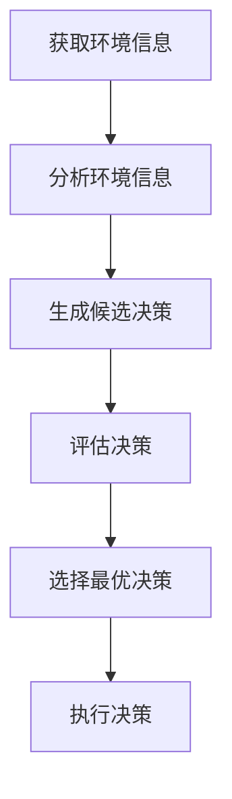
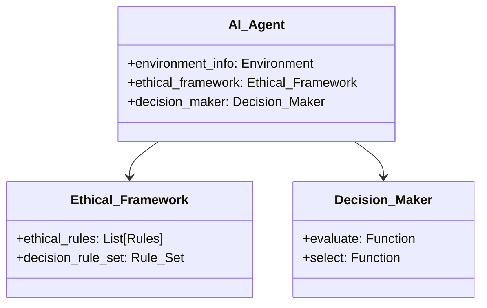
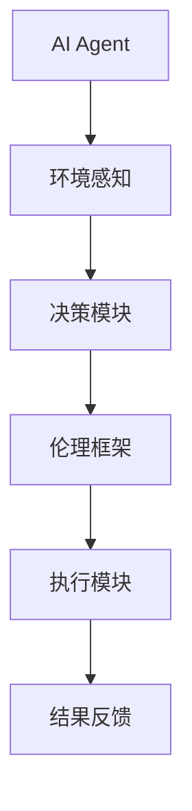
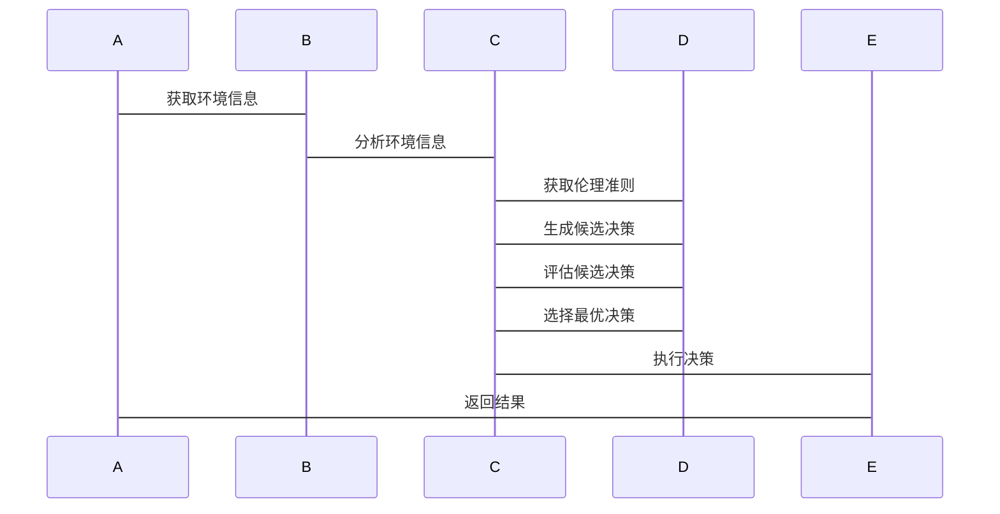

                 


# 构建具有道德决策框架的AI Agent系统

## 关键词：AI Agent, 道德决策框架, 伦理准则, 决策算法, 系统架构

## 摘要

在人工智能技术迅速发展的背景下，AI Agent系统的广泛应用带来了诸多伦理挑战。本文旨在探讨如何构建一个具有道德决策框架的AI Agent系统，以确保其在决策过程中遵循伦理准则，减少潜在的负面社会影响。文章从背景介绍、核心概念、算法原理、系统架构设计、项目实战等多个方面展开，详细分析了道德决策框架的设计目标、实现路径及应用场景，为构建符合伦理规范的AI Agent系统提供了理论依据和实践指导。

---

# 第1章: 背景介绍

## 1.1 问题背景

### 1.1.1 当前AI Agent系统的局限性

AI Agent（智能体）是一种能够感知环境、自主决策并采取行动的智能系统。随着技术的进步，AI Agent已广泛应用于自动驾驶、智能助手、机器人等领域。然而，这些系统在实际应用中常常面临伦理决策的挑战。例如，自动驾驶汽车在紧急情况下如何选择优先保护谁，智能助手在用户需求与隐私保护之间如何权衡等问题，都凸显了AI Agent系统在缺乏道德决策框架时的局限性。

### 1.1.2 道德决策在AI Agent中的重要性

AI Agent的决策过程直接影响其行为结果，而缺乏伦理约束的决策可能导致负面社会影响。例如，AI Agent可能因为追求效率最大化而忽视社会责任，导致环境破坏或社会不公。因此，构建一个能够遵循伦理准则的道德决策框架，是确保AI Agent系统安全可靠运行的关键。

### 1.1.3 伦理问题对AI Agent应用的影响

伦理问题不仅影响AI Agent系统的社会接受度，还可能引发法律纠纷。例如，自动驾驶汽车的决策错误可能导致事故，进而引发法律诉讼。因此，如何在AI Agent系统中融入道德决策框架，成为当前研究的热点问题。

## 1.2 问题描述

### 1.2.1 AI Agent在决策过程中的道德挑战

AI Agent的决策过程需要综合考虑多种因素，包括效率、安全、公平等。然而，这些因素往往存在冲突，如何在冲突中选择最优解是道德决策的核心问题。

### 1.2.2 道德决策框架的必要性

道德决策框架为AI Agent提供了一套伦理准则和决策规则，帮助其在复杂场景中做出符合伦理的决策。

### 1.2.3 伦理决策在不同场景中的应用需求

不同场景下，AI Agent的决策需求有所不同。例如，在医疗领域，AI Agent需要确保患者隐私和医疗伦理；在金融领域，则需要遵守金融监管法规。

## 1.3 问题解决

### 1.3.1 道德决策框架的设计目标

道德决策框架的设计目标是为AI Agent提供一套可执行的伦理准则，使其能够在复杂场景中做出符合伦理的决策。

### 1.3.2 道德决策框架的核心要素

道德决策框架的核心要素包括伦理准则、决策规则、评估机制等。

### 1.3.3 道德决策框架的实现路径

实现道德决策框架需要结合伦理学、人工智能、计算机科学等多学科知识，设计一套完整的伦理准则和决策规则。

## 1.4 边界与外延

### 1.4.1 道德决策框架的适用范围

道德决策框架适用于所有需要伦理决策的AI Agent系统，特别是在涉及人类生命安全和社会公共利益的领域。

### 1.4.2 道德决策框架的限制与不足

目前的道德决策框架仍存在一些局限性，例如如何处理复杂的伦理冲突，如何动态调整伦理准则等。

### 1.4.3 道德决策框架与其他AI技术的关系

道德决策框架是AI Agent系统的重要组成部分，与机器学习、自然语言处理等技术密切相关。

## 1.5 概念结构与核心要素

### 1.5.1 道德决策框架的组成要素

道德决策框架由伦理准则、决策规则、评估机制等组成。

### 1.5.2 AI Agent系统的核心模块

AI Agent系统的核心模块包括感知模块、决策模块、执行模块等。

### 1.5.3 道德决策与AI Agent的交互关系

道德决策框架通过提供伦理准则和决策规则，指导AI Agent的决策过程，确保其行为符合伦理要求。

---

# 第2章: 道德决策框架的核心原理

## 2.1 道德决策框架的原理

### 2.1.1 道德决策的定义与特征

道德决策是指基于伦理准则的决策过程。其特征包括可解释性、可调整性等。

### 2.1.2 道德决策框架的基本架构

道德决策框架通常包括伦理准则库、决策规则集、评估机制等模块。

### 2.1.3 道德决策框架的实现机制

实现机制包括伦理准则的获取、决策规则的执行、结果的评估等。

## 2.2 道德决策框架与AI Agent的关系

### 2.2.1 AI Agent的决策过程

AI Agent的决策过程包括感知环境、分析问题、制定决策、执行行动等步骤。

### 2.2.2 道德决策框架在AI Agent中的作用

道德决策框架为AI Agent提供伦理准则和决策规则，指导其决策过程。

### 2.2.3 道德决策框架对AI Agent行为的影响

通过遵循伦理准则，AI Agent的行为更加符合社会伦理规范，减少负面社会影响。

## 2.3 核心概念对比表

| 概念       | 描述                                                                 |
|------------|----------------------------------------------------------------------|
| 道德决策   | 基于伦理准则的决策过程                                             |
| AI Agent   | 具有自主决策能力的智能体                                           |
| 决策框架   | 包含决策规则、伦理准则和执行机制的结构化框架                     |

## 2.4 ER实体关系图

```mermaid
erd
actor(AI Agent) --> rule_set(道德决策规则)
actor --> ethical_criterion(伦理准则)
rule_set --> decision(决策)
```

---

## 2.5 算法原理

### 2.5.1 算法流程

1. 获取环境信息
2. 分析环境信息，提取关键特征
3. 根据伦理准则生成候选决策
4. 评估候选决策的伦理合规性
5. 选择最优决策
6. 执行决策

### 2.5.2 算法实现



### 2.5.3 Python代码实现

```python
class EthicalDecisionFramework:
    def __init__(self, ethical_rules):
        self.ethical_rules = ethical_rules

    def make_decision(self, environment_info):
        # 分析环境信息
        features = self.analyze_environment(environment_info)
        # 生成候选决策
        candidates = self.generate_candidates(features)
        # 评估候选决策
        evaluations = self.evaluate_candidates(candidates)
        # 选择最优决策
        optimal_decision = self.select_optimal(candidates, evaluations)
        return optimal_decision

    def analyze_environment(self, environment_info):
        # 简单示例：提取关键特征
        return {"feature1": True, "feature2": False}

    def generate_candidates(self, features):
        # 简单示例：生成候选决策
        return ["decision1", "decision2"]

    def evaluate_candidates(self, candidates):
        # 简单示例：评估候选决策
        evaluations = {}
        for decision in candidates:
            evaluations[decision] = self.check_ethical_rules(decision)
        return evaluations

    def check_ethical_rules(self, decision):
        # 简单示例：检查决策是否符合伦理规则
        for rule in self.ethical_rules:
            if not rule.check(decision):
                return False
        return True

    def select_optimal(self, candidates, evaluations):
        # 简单示例：选择最优决策
        best = None
        for decision, is_ethical in evaluations.items():
            if is_ethical:
                if best is None or self.prefer(decision, best):
                    best = decision
        return best

    def prefer(self, decision1, decision2):
        # 简单示例：决策偏好规则
        return True  # 示例中不考虑复杂情况
```

---

## 2.6 数学模型

### 2.6.1 线性加权模型

$$
\text{score}(d) = \sum_{i=1}^{n} w_i \cdot f_i(d)
$$

其中，$d$ 表示决策，$w_i$ 表示特征 $i$ 的权重，$f_i(d)$ 表示特征 $i$ 在决策 $d$ 中的值。

### 2.6.2 伦理准则的优先级排序

$$
\text{priority}(e) = \{1, 2, ..., m\}
$$

其中，$e$ 表示伦理准则，$\text{priority}(e)$ 表示准则 $e$ 的优先级。

---

## 2.7 伦理准则的动态调整

### 2.7.1 动态调整机制

根据环境变化和决策结果，动态调整伦理准则的优先级。

### 2.7.2 调整算法

$$
\text{new_priority}(e) = \text{current_priority}(e) \times \alpha + \beta
$$

其中，$\alpha$ 和 $\beta$ 是调整参数。

---

# 第3章: 系统分析与架构设计

## 3.1 系统功能设计

### 3.1.1 领域模型



### 3.1.2 系统架构设计



### 3.1.3 系统交互设计



---

## 3.2 项目实战

### 3.2.1 环境安装

安装Python和相关库（如numpy、pandas、scikit-learn等）。

### 3.2.2 核心实现

实现道德决策框架的Python代码，包括伦理准则库、决策规则集、评估机制等。

### 3.2.3 代码解读与分析

详细解读代码实现，说明每部分的功能和实现细节。

---

## 3.3 最佳实践

### 3.3.1 设计原则

1. 简洁性：尽量简化伦理准则和决策规则。
2. 可扩展性：确保框架能够适应不同的应用场景。
3. 可解释性：确保决策过程可追溯和可解释。

### 3.3.2 注意事项

1. 道德决策框架的设计需要结合具体应用场景。
2. 需要动态调整伦理准则以适应环境变化。
3. 确保框架的可扩展性和可维护性。

---

## 3.4 小结

构建具有道德决策框架的AI Agent系统是一个复杂但重要的任务。通过合理设计道德决策框架，可以确保AI Agent在决策过程中遵循伦理准则，减少负面社会影响。

---

# 作者：AI天才研究院/AI Genius Institute & 禅与计算机程序设计艺术 /Zen And The Art of Computer Programming

---

本文通过系统分析和详细设计，探讨了如何构建具有道德决策框架的AI Agent系统。从背景介绍到系统实现，文章为读者提供了全面的理论依据和实践指导。希望本文能够为AI Agent系统的伦理决策研究提供有益的参考。

