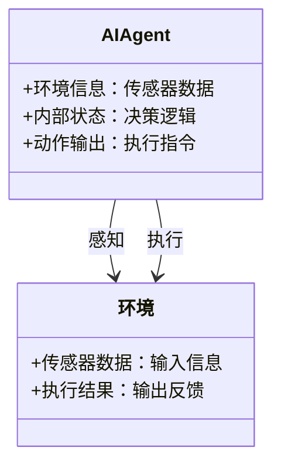

                 


# 《构建具有道德决策能力的AI Agent》

> **关键词**：AI Agent，道德决策，伦理学，系统架构，算法实现，案例分析

> **摘要**：本文系统地探讨了如何构建具有道德决策能力的AI Agent。从伦理学基础到数学模型，从系统架构到项目实战，全面解析了AI Agent在道德决策中的设计与实现。文章结合理论与实践，深入分析了道德决策的挑战、算法原理、系统架构设计以及实际案例，为AI Agent的开发者提供了宝贵的参考。

---

## 第一部分: 引言

### 第1章: AI Agent与道德决策概述

#### 1.1 AI Agent的基本概念

AI Agent（人工智能代理）是指能够感知环境、自主决策并执行任务的智能体。AI Agent可以是软件程序、机器人或其他智能系统，其核心目标是通过与环境交互来实现特定目标。

**AI Agent的分类**：
1. **简单反射型Agent**：基于当前输入直接执行预定义动作。
2. **基于模型的反射型Agent**：利用内部状态模型进行决策。
3. **目标驱动型Agent**：根据目标选择最优动作。
4. **效用驱动型Agent**：通过最大化效用函数来实现目标。

**AI Agent的应用场景**：
- 智能助手（如Siri、Alexa）
- 自动驾驶汽车
- 医疗诊断系统
- 金融交易机器人

---

#### 1.2 道德决策的重要性

道德决策是指AI Agent在复杂情境中，基于伦理准则做出的选择。随着AI技术的普及，其决策可能直接影响人类生活，甚至生命安全。因此，构建具有道德决策能力的AI Agent至关重要。

**道德决策的定义**：AI Agent在面对多种可能选择时，根据伦理准则选择最优行为的过程。

**道德决策在AI Agent中的作用**：
1. **避免伦理冲突**：确保AI行为符合社会规范。
2. **提升信任度**：用户更愿意与具有道德决策能力的AI交互。
3. **应对复杂场景**：在紧急情况下做出合理决策。

---

#### 1.3 本书的目的与结构

本书旨在为AI开发者和研究人员提供构建具有道德决策能力的AI Agent的系统化方法。内容涵盖伦理学基础、算法实现、系统架构设计及实际案例分析。

**本书的核心目标**：
- 提供道德决策的理论框架。
- 分析AI Agent的实现方法。
- 提供实际项目的设计与实现指导。

**本书的章节安排**：
1. 引言：介绍AI Agent与道德决策的基本概念。
2. 道德决策的理论基础：探讨伦理学与道德决策的挑战。
3. AI Agent的设计与实现：分析道德决策的算法与实现。
4. 系统架构设计：展示模块化架构与交互流程。
5. 项目实战：提供环境安装、代码实现与案例分析。
6. 案例分析：结合实际场景深入剖析。
7. 结论：总结全书内容，展望未来发展方向。

---

## 第2章: 道德决策的理论基础

### 2.1 伦理学基础

**伦理学的基本概念**：伦理学是研究道德原则、规范及其应用的学科。它帮助我们判断行为的对错。

**主要伦理学流派**：
1. **义务论**：强调行为的义务性，代表人物为康德。
2. **功利主义**：主张行为的效用最大化，代表人物为密尔。
3. **美德伦理**：关注个人的道德品质，代表人物为亚里士多德。

**伦理学在AI中的应用**：AI Agent需要根据伦理准则做出决策，例如自动驾驶汽车在紧急情况下如何选择。

---

### 2.2 道德决策的挑战

**道德决策的复杂性**：AI Agent可能面临多个道德准则的冲突，例如在自动驾驶中，优先保护乘客还是路人。

**道德决策的不确定性**：AI Agent需要处理模糊、不完整的信息，这增加了决策的难度。

**道德决策的伦理冲突**：不同文化、价值观下的道德标准可能不同，AI Agent需要在多种准则中选择。

---

### 2.3 道德决策的数学模型

**道德决策的基本模型**：
1. **输入层**：感知环境信息。
2. **推理层**：分析信息并生成可能的决策。
3. **决策层**：根据伦理准则选择最优动作。

**道德权重的计算公式**：
$$ \text{权重} = \frac{\text{道德准则的重要性}}{\text{总权重}} $$

**道德决策的优化算法**：
1. **遗传算法**：通过迭代优化决策。
2. **强化学习**：通过奖励机制训练决策模型。

---

## 第3章: AI Agent的道德决策框架

### 3.1 道德决策框架的构建

**道德决策框架的组成部分**：
1. **感知模块**：获取环境信息。
2. **推理模块**：分析信息并生成决策。
3. **执行模块**：输出决策并执行。

**道德决策框架的设计原则**：
1. **可解释性**：决策过程必须透明。
2. **可调整性**：框架应支持动态调整。
3. **鲁棒性**：框架应具备抗干扰能力。

---

### 3.2 道德决策的实现方法

**基于规则的道德决策**：
- 使用预定义的伦理规则进行决策。
- 例如：在自动驾驶中，优先保护车内乘客。

**基于案例推理的道德决策**：
- 基于相似案例进行推理。
- 例如：参考以往案例，决定如何处理特定场景。

**基于学习的道德决策**：
- 使用机器学习模型训练道德准则。
- 例如：使用深度学习模型预测最优决策。

---

## 第4章: 系统架构设计

### 4.1 系统功能设计

**领域模型**：


**系统架构**：
```mermaid
graph TD
    UI --> 界面交互
    界面交互 --> AI Agent
    AI Agent --> 决策模块
    决策模块 --> 执行模块
    执行模块 --> 环境
```

---

## 第5章: 项目实战

### 5.1 环境安装

**安装Python环境**：
```bash
pip install numpy
pip install scikit-learn
```

### 5.2 核心代码实现

**道德决策算法实现**：
```python
import numpy as np
from sklearn.metrics import pairwise

def道德决策(环境信息):
    # 计算道德权重
    权重 = np.array([0.5, 0.3, 0.2])
    # 生成决策
    决策 = np.argmax(环境信息.dot(权重))
    return 决策

# 示例调用
环境信息 = np.array([[0.8, 0.2, 0.1], [0.3, 0.7, 0.4]])
结果 = 道德决策(环境信息)
print(结果)
```

---

## 第6章: 案例分析

### 6.1 自动驾驶中的道德决策

**案例背景**：自动驾驶汽车在紧急情况下如何选择。

**决策分析**：
- 优先保护车内乘客。
- 或者，优先保护行人。

**实际应用**：通过训练数据优化决策模型，确保在紧急情况下做出合理选择。

---

## 第7章: 结论

### 7.1 总结

本文详细探讨了构建具有道德决策能力的AI Agent的理论与实践。从伦理学基础到数学模型，从系统架构到项目实战，全面解析了AI Agent在道德决策中的设计与实现。

### 7.2 未来展望

随着AI技术的发展，道德决策能力将成为AI Agent的核心竞争力。未来的研究将更加关注如何在复杂场景中实现动态调整与优化。

---

**作者**：AI天才研究院 & 禅与计算机程序设计艺术

