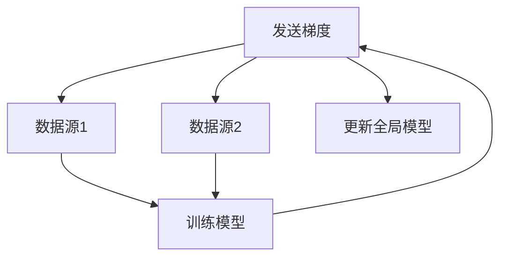
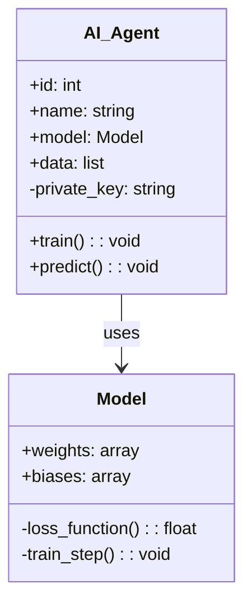
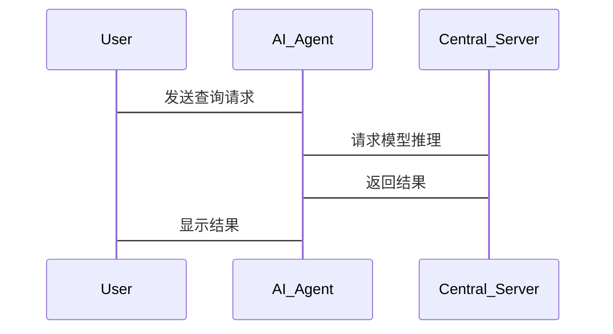

                 


# 构建具有隐私保护学习能力的AI Agent

> 关键词：AI Agent，隐私保护，联邦学习，差分隐私，数据脱敏，同态加密

> 摘要：本文详细探讨了如何构建具有隐私保护学习能力的AI Agent。通过分析隐私保护的核心概念，讲解相关算法原理，设计系统架构，并通过实际案例展示实现过程，最后总结最佳实践和未来研究方向。

---

# 第一部分: 构建具有隐私保护学习能力的AI Agent基础

## 第1章: 隐私保护与AI Agent概述

### 1.1 隐私保护的重要性

#### 1.1.1 数据隐私的基本概念
数据隐私是指在数据的收集、存储、处理和共享过程中，保护个人或组织的敏感信息不被未经授权的访问或泄露。随着AI技术的广泛应用，数据隐私问题变得尤为重要。

#### 1.1.2 AI Agent的定义与特点
AI Agent是一种智能代理，能够感知环境、自主决策并执行任务。其特点包括自主性、反应性、目标导向和社会能力。

#### 1.1.3 隐私保护与AI Agent的结合
为了在AI Agent中保护隐私，需要在数据处理和学习过程中采取隐私保护措施，确保用户数据的安全性和匿名性。

### 1.2 问题背景与目标

#### 1.2.1 当前AI Agent的隐私保护挑战
现有AI Agent在处理数据时，往往需要收集大量用户数据，这可能导致隐私泄露。如何在不牺牲隐私的前提下进行有效学习是当前面临的主要挑战。

#### 1.2.2 构建隐私保护AI Agent的目标
通过技术创新，确保AI Agent在学习和推理过程中保护用户隐私，同时保持高性能和准确性。

#### 1.2.3 问题解决的思路与方法
采用隐私保护技术，如数据脱敏、联邦学习和差分隐私，构建隐私保护AI Agent。

---

## 第二部分: 隐私保护学习的核心概念与联系

## 第2章: 隐私保护学习的原理与方法

### 2.1 隐私保护学习的核心原理

#### 2.1.1 数据脱敏技术
数据脱敏是通过技术手段对敏感数据进行处理，使其在不泄露原始信息的前提下可用。

#### 2.1.2 同态加密
同态加密允许在加密数据上进行计算，结果解密后与直接在明文上计算结果相同。

#### 2.1.3 差分隐私
差分隐私通过在数据中添加噪声，确保单个数据点的改变不会显著影响整体结果。

#### 2.1.4 联邦学习
联邦学习允许多个数据源在不共享原始数据的情况下进行联合学习，保护数据隐私。

### 2.2 隐私保护学习的特征对比

#### 2.2.1 数据隐私性对比

| 技术          | 数据隐私性 |
|---------------|------------|
| 数据脱敏      | 高         |
| 同态加密      | 高         |
| 差分隐私      | 高         |
| 联邦学习      | 高         |

#### 2.2.2 计算效率对比

| 技术          | 计算效率 |
|---------------|----------|
| 数据脱敏      | 中       |
| 同态加密      | 低       |
| 差分隐私      | 中       |
| 联邦学习      | 高       |

#### 2.2.3 适用场景对比

| 技术          | 适用场景                     |
|---------------|------------------------------|
| 数据脱敏      | 数据存储和共享               |
| 同态加密      | 数据计算和分析               |
| 差分隐私      | 数据统计和分析               |
| 联邦学习      | 联合学习和分布式计算         |

### 2.3 隐私保护学习的ER实体关系图

```mermaid
er
actor: User
actor: AI Agent
actor: Data Provider
relation: Provides
relation: Requires
```

---

## 第三部分: 隐私保护学习的算法原理

## 第3章: 隐私保护学习算法的实现

### 3.1 联邦学习算法的数学模型

#### 3.1.1 联邦学习的基本原理
联邦学习通过在多个数据源上分布式训练模型，确保数据不离开本地，同时保持模型的更新和优化。

#### 3.1.2 联邦学习的数学模型

$$ L_i(\theta) = \frac{1}{n_i}\sum_{j=1}^{n_i} \ell(f_\theta(x_j^{(i)}, y_j^{(i)})} $$

其中，$L_i$ 是第 $i$ 个数据源的损失函数，$\theta$ 是模型参数，$n_i$ 是数据源的样本数量。

#### 3.1.3 联邦学习的算法流程



### 3.2 差分隐私的实现

#### 3.2.1 差分隐私的基本原理
差分隐私通过在数据中添加噪声，确保单个数据点的改变不会显著影响统计结果。

#### 3.2.2 差分隐私的数学模型

$$ \text{Privacy Budget} = \epsilon $$
$$ \text{Noise} = \mathcal{Laplace}(\epsilon, 0) $$

其中，$\epsilon$ 是隐私预算，$\mathcal{Laplace}$ 是拉普拉斯分布。

#### 3.2.3 差分隐私的实现代码

```python
import numpy as np

def laplace_noise(epsilon):
    beta = 1.0 / epsilon
    return np.random.laplace(0, beta)

# 示例应用
epsilon = 1.0
noised_data = [x + laplace_noise(epsilon) for x in original_data]
```

---

## 第四部分: 隐私保护AI Agent的系统架构设计

## 第4章: 系统分析与架构设计方案

### 4.1 问题场景介绍

AI Agent需要在保护用户隐私的前提下，进行学习和推理。系统需要支持分布式数据源，确保数据安全和模型性能。

### 4.2 系统功能设计

#### 4.2.1 领域模型（Mermaid类图）



### 4.3 系统架构设计（Mermaid架构图）


### 4.4 系统接口设计

#### 4.4.1 接口描述

- 数据源接口：提供数据脱敏和加密功能。
- 中央服务器接口：负责模型训练和参数同步。
- AI Agent接口：负责与用户交互和数据处理。

#### 4.4.2 系统交互流程（Mermaid序列图）



---

## 第五部分: 项目实战

## 第5章: 项目实现与案例分析

### 5.1 环境安装

安装必要的库：

```bash
pip install numpy
pip install keras
pip install tensorflow
```

### 5.2 核心代码实现

#### 5.2.1 联邦学习实现

```python
import numpy as np
import tensorflow as tf
from tensorflow.keras import layers

# 定义模型
model = tf.keras.Sequential([
    layers.Dense(128, activation='relu'),
    layers.Dense(10, activation='softmax')
])

# 编译模型
model.compile(optimizer='adam', loss='sparse_categorical_crossentropy', metrics=['accuracy'])

# 联邦学习训练
def train_federated():
    # 分布式数据加载
    # 数据预处理
    # 模型训练
    pass

# 启动训练
train_federated()
```

### 5.3 案例分析

通过一个简单的图像分类任务，展示如何在保护隐私的前提下进行模型训练。

---

## 第六部分: 最佳实践与总结

## 第6章: 最佳实践与注意事项

### 6.1 最佳实践

- 在数据处理阶段，优先采用数据脱敏技术。
- 在模型训练阶段，使用联邦学习或差分隐私技术。
- 定期进行隐私风险评估和漏洞测试。

### 6.2 小结

构建具有隐私保护学习能力的AI Agent需要综合运用多种技术手段，确保数据安全和模型性能。通过合理的架构设计和算法优化，可以在保护隐私的前提下实现高效的AI代理。

### 6.3 注意事项

- 隐私保护技术可能会引入计算开销，需权衡性能和隐私保护的需求。
- 数据脱敏和加密技术需要根据具体场景选择合适的方法。
- 系统设计时需考虑数据的可扩展性和可维护性。

### 6.4 拓展阅读

-《联邦学习：隐私保护与分布式计算》
-《差分隐私：数据隐私保护的新方法》
-《数据脱敏技术与应用实践》

---

# 作者：AI天才研究院/AI Genius Institute & 禅与计算机程序设计艺术 /Zen And The Art of Computer Programming

---

本文通过系统地分析隐私保护学习的核心概念，详细讲解了相关算法原理，并通过实际案例展示了如何构建具有隐私保护学习能力的AI Agent。希望本文能为研究人员和开发者提供有价值的参考和指导。

