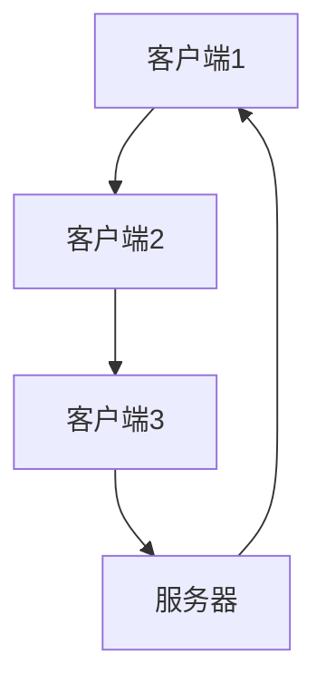
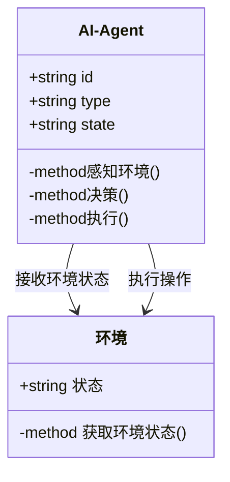

                 


# 构建具有隐私计算能力的AI Agent

> 关键词：AI Agent, 隐私计算, 同态加密, 联邦学习, 数据安全

> 摘要：本文将详细探讨如何构建一个具有隐私计算能力的AI Agent。通过分析隐私计算的核心技术，结合AI Agent的算法原理，本文将从理论到实践，一步步引导读者理解并实现一个基于隐私计算的AI Agent。文章内容涵盖隐私计算的基本概念、AI Agent的核心原理、算法实现、系统架构设计以及项目实战，帮助读者掌握构建具有隐私计算能力的AI Agent的完整流程。

---

## 第1章: AI Agent与隐私计算概述

### 1.1 AI Agent的基本概念

AI Agent（人工智能代理）是一种能够感知环境、自主决策并执行任务的智能实体。它可以分为以下几类：

- **反应式AI Agent**：根据当前环境输入做出实时反应，通常用于需要快速决策的任务。
- **认知式AI Agent**：具备推理、规划和学习能力，能够处理复杂任务。
- **混合式AI Agent**：结合反应式和认知式的特点，适用于复杂多变的环境。

### 1.2 隐私计算的基本概念

隐私计算是一种在保护数据隐私的前提下，对数据进行处理和分析的技术。其核心目标是在不泄露原始数据的情况下，完成数据的计算和分析任务。隐私计算的主要技术包括：

- **数据加密技术**：通过对数据进行加密，确保数据在传输和存储过程中的安全性。
- **多方计算与安全协议**：在多个参与方之间进行计算，确保各方数据的隐私性。
- **差分隐私与同态加密**：通过数学方法对数据进行处理，确保数据在计算过程中无法被逆向还原。

### 1.3 AI Agent与隐私计算的结合意义

AI Agent需要处理大量敏感数据，例如用户隐私信息、交易数据等。通过结合隐私计算技术，AI Agent可以在不泄露原始数据的前提下，完成数据的分析和决策任务。这种结合不仅能够保护用户隐私，还能提高系统的安全性。

---

## 第2章: 隐私计算与AI Agent的核心原理

### 2.1 隐私计算的数学模型

隐私计算的核心在于数据的加密和解密过程。以下是一个简单的加密模型：

$$ \text{加密}：E(x) = x \times k \mod p $$

$$ \text{解密}：D(y) = y \times k^{-1} \mod p $$

其中，$x$ 是明文，$k$ 是加密密钥，$p$ 是模数。

### 2.2 AI Agent的算法原理

AI Agent的算法设计需要考虑隐私保护的需求。以下是一个基于联邦学习的AI Agent算法流程：

1. 数据预处理：将数据加密后分发给多个节点。
2. 模型训练：各节点在本地数据上训练模型，并将梯度更新发送到中心节点。
3. 模型聚合：中心节点对各节点的梯度更新进行聚合，生成全局模型。
4. 模型分发：中心节点将全局模型分发给各节点，进行下一轮训练。

### 2.3 隐私计算与AI Agent的对比分析

以下是隐私计算与传统加密技术的对比：

| **特性**       | **隐私计算**             | **传统加密**             |
|----------------|--------------------------|--------------------------|
| 数据可用性     | 高                      | 低                      |
| 计算效率       | 较低                    | 较高                    |
| 数据隐私性     | 高                      | 中                      |
| 适用场景       | 分布式计算、多方协作     | 单点计算、单点存储       |

---

## 第3章: 算法原理与数学模型

### 3.1 同态加密算法

同态加密是一种特殊的加密技术，允许在密文上进行计算，而不需要知道密钥。以下是一个简单的同态加密实现：

```python
class HomomorphicEncryption:
    def __init__(self, key):
        self.key = key

    def encrypt(self, plaintext):
        return plaintext * self.key

    def decrypt(self, ciphertext):
        return ciphertext / self.key
```

### 3.2 联邦学习的数学模型

联邦学习是一种分布式机器学习技术，以下是一个简单的联邦学习流程：



---

## 第4章: 系统架构与项目实战

### 4.1 系统架构设计

以下是AI Agent的系统架构图：



### 4.2 项目实战

以下是构建具有隐私计算能力的AI Agent的代码示例：

```python
# 环境感知模块
class Environment:
    def get_state(self):
        return "环境状态"

# AI Agent实现
class AIAgent:
    def __init__(self, environment):
        self.environment = environment

    def perceive(self):
        return self.environment.get_state()

    def decide(self, state):
        # 基于隐私计算的决策逻辑
        return "决策结果"

    def act(self, decision):
        return "执行结果"
```

---

## 第5章: 总结与展望

### 5.1 总结

本文详细探讨了如何构建一个具有隐私计算能力的AI Agent。通过分析隐私计算的核心技术，结合AI Agent的算法原理，本文从理论到实践，一步步引导读者理解并实现一个基于隐私计算的AI Agent。

### 5.2 展望

随着隐私保护需求的不断增加，隐私计算技术将在AI Agent领域发挥越来越重要的作用。未来的研究方向包括更高效的隐私计算算法、更强大的数据安全保护机制以及更广泛的应用场景。

---

## 作者

作者：AI天才研究院/AI Genius Institute & 禅与计算机程序设计艺术 /Zen And The Art of Computer Programming

