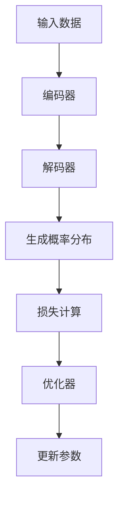
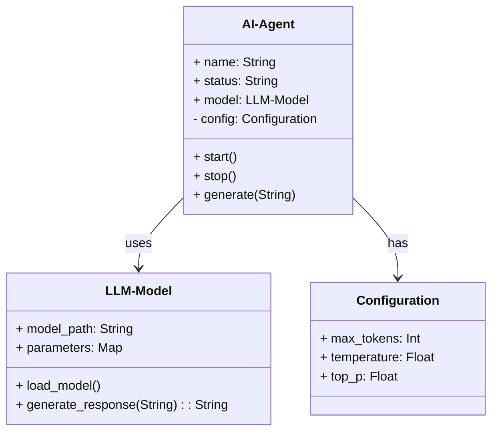

                 


# 构建可信AI Agent：LLM的安全性与可控性设计

> 关键词：AI Agent, 大语言模型, 安全性, 可控性, 可信性, 模型风险管理

> 摘要：本文深入探讨了构建可信AI Agent过程中大语言模型（LLM）的安全性与可控性设计。首先从AI Agent和LLM的基本概念出发，分析了当前LLM在AI Agent中的应用现状及其面临的挑战。接着，详细阐述了LLM的安全性与可控性问题，包括模型的潜在风险、评估指标以及缓解策略。最后，通过实际案例分析，提出了构建可信AI Agent的系统架构设计和实现方案，为读者提供了一套完整的理论与实践相结合的方法论。

---

## 第一章: 构建可信AI Agent的背景与目标

### 1.1 AI Agent与LLM的基本概念

#### 1.1.1 AI Agent的定义与特点
- **定义**：AI Agent是具有感知、决策、执行能力的智能体，能够与环境交互并完成特定任务。
- **特点**：
  - 自主性：能够独立决策和行动。
  - 反应性：能实时感知环境并做出响应。
  - 学习能力：通过数据和经验提升能力。
  - 可交互性：能与用户或其他系统进行自然交互。

#### 1.1.2 大语言模型（LLM）的定义与技术特点
- **定义**：LLM是一种基于深度学习的自然语言处理模型，能够理解并生成人类语言。
- **技术特点**：
  - 基于Transformer架构。
  - 参数量大（如GPT-3的175B参数）。
  - 具备上下文理解和生成能力。
  - 常见模型：GPT系列、BERT系列等。

#### 1.1.3 可信AI Agent的核心目标
- **目标**：
  - 确保AI Agent的行为符合预期。
  - 保护用户隐私和数据安全。
  - 防范模型滥用和误用。
  - 提供可解释性和透明度。

### 1.2 LLM在AI Agent中的应用现状

#### 1.2.1 LLM在自然语言处理中的应用
- **文本生成**：用于内容创作、对话生成等。
- **问答系统**：提供智能问答服务。
- **文本摘要**：帮助用户快速获取信息。

#### 1.2.2 LLM在AI Agent中的典型应用场景
- **智能助手**：如Siri、Alexa等。
- **聊天机器人**：用于客户服务、技术支持。
- **内容审核**：用于过滤有害信息。

#### 1.2.3 当前LLM在AI Agent中的挑战与问题
- **模型的幻觉问题**：生成不真实或错误的信息。
- **模型的偏见问题**：反映训练数据中的偏见。
- **计算资源消耗大**：需要高性能计算支持。

### 1.3 可信AI Agent的重要性

#### 1.3.1 为什么需要可信AI Agent
- **用户信任**：用户更愿意与可信赖的AI交互。
- **法律合规**：符合数据保护和隐私法规。
- **社会责任**：减少AI带来的负面影响。

#### 1.3.2 LLM的安全性与可控性问题
- **数据泄露风险**：训练数据可能包含敏感信息。
- **模型滥用风险**：被用于恶意目的。
- **不可控的输出**：模型可能生成有害信息。

#### 1.3.3 可信AI Agent的边界与外延
- **边界**：明确AI Agent的能力范围和使用场景。
- **外延**：扩展到更广泛的人工智能应用领域。

---

## 第二章: LLM的安全性与可控性分析

### 2.1 LLM的安全性问题

#### 2.1.1 LLM的潜在安全风险
- **数据泄露**：模型可能泄露训练数据中的敏感信息。
- **模型提取攻击**：通过推理攻击模型参数。
- **对抗样本攻击**：通过修改输入数据干扰模型。

#### 2.1.2 模型的幻觉（Hallucination）问题
- **定义**：模型生成不真实或错误的信息。
- **原因**：训练数据的不完整性或偏差。
- **案例**：生成虚假新闻或错误的事实。

#### 2.1.3 模型的偏见（Bias）问题
- **定义**：模型在决策中反映训练数据的偏见。
- **原因**：训练数据的不均衡或偏差。
- **案例**：招聘系统中对某些群体的偏见。

### 2.2 LLM的可控性问题

#### 2.2.1 模型输出的不可控性
- **定义**：模型可能生成不符合预期的输出。
- **原因**：训练目标与实际需求不一致。
- **案例**：生成攻击性或不当内容。

#### 2.2.2 模型的可解释性问题
- **定义**：用户难以理解模型的决策过程。
- **原因**：模型内部复杂且不可解释。
- **案例**：无法解释生成结果的原因。

#### 2.2.3 模型的滥用风险
- **定义**：模型被用于恶意目的。
- **原因**：缺乏有效的使用监管。
- **案例**：生成钓鱼邮件或诈骗信息。

### 2.3 LLM安全性与可控性的评估指标

#### 2.3.1 安全性评估指标
- **模型鲁棒性**：模型在对抗攻击下的表现。
- **数据隐私保护**：模型是否泄露训练数据。
- **输出控制能力**：模型是否能生成有害内容。

#### 2.3.2 可控性评估指标
- **输出一致性**：模型生成的内容是否符合预期。
- **可解释性程度**：用户是否能理解模型的决策过程。
- **使用监管能力**：模型是否容易被滥用。

#### 2.3.3 综合评估框架
- **多维度评估**：结合安全性、可控性、可解释性等多个维度。
- **动态评估**：根据实际使用场景动态调整评估指标。

---

## 第三章: 核心概念与联系

### 3.1 可信性、安全性与可控性的定义与对比

#### 3.1.1 可信性（Trustworthiness）的定义
- **定义**：用户对AI Agent的信任程度。
- **特点**：依赖于模型的可靠性和透明性。

#### 3.1.2 安全性（Safety）的定义
- **定义**：AI Agent在运行过程中不会造成危害。
- **特点**：强调行为的可预测性和可控性。

#### 3.1.3 可控性（Controlability）的定义
- **定义**：用户对AI Agent行为的控制能力。
- **特点**：强调用户对模型输出的干预能力。

#### 3.1.4 三者之间的关系与区别
- **关系**：可信性是目标，安全性是保障，可控性是手段。
- **区别**：
  - 可信性关注信任程度。
  - 安全性关注行为的安全性。
  - 可控性关注控制能力。

---

### 3.2 核心概念的属性特征对比

#### 3.2.1 三者的属性对比表格
| 属性       | 可信性            | 安全性            | 可控性            |
|------------|-------------------|-------------------|-------------------|
| 定义       | 用户的信任程度    | 行为的安全性      | 用户的控制能力    |
| 关注点     | 可靠性和透明性    | 可预测性和可控性  | 干预能力          |
| 实现方法   | 提供可解释性       | 设计安全机制      | 提供控制接口      |

---

### 3.3 ER实体关系图架构

```mermaid
erDiagram
    actor 用户
    actor 开发者
    actor 管理员
    role 可信性评估者
    role 安全监管者
    role 使用者
    role 维护者
    用户 --> 可信性评估者 : 信任评估
    用户 --> 安全监管者 : 监督行为
    用户 --> 维护者 : 技术支持
    开发者 --> 可信性评估者 : 提供模型
    开发者 --> 安全监管者 : 设计安全机制
    管理员 --> 维护者 : 协调资源
    可信性评估者 --> 安全监管者 : 信息共享
```

---

## 第四章: 算法原理

### 4.1 LLM的训练过程

#### 4.1.1 损失函数与优化算法
- **交叉熵损失函数**：衡量生成概率与真实标签之间的差异。
  $$ \text{Loss} = -\sum_{i=1}^{n} y_i \log p(y_i|x) $$
- **优化算法**：使用Adam优化器更新模型参数。
  $$ \theta_{t+1} = \theta_t - \eta \nabla_{\theta} \text{Loss} $$

#### 4.1.2 模型训练的流程


---

## 第五章: 系统分析与架构设计

### 5.1 问题场景介绍

#### 5.1.1 系统目标
- 构建一个可信的AI Agent系统，确保LLM的安全性和可控性。

#### 5.1.2 问题场景
- 用户与AI Agent交互，系统需要实时监控和干预。

---

### 5.2 系统功能设计

#### 5.2.1 领域模型类图


---

### 5.3 系统架构设计

#### 5.3.1 系统架构图


---

## 第六章: 项目实战

### 6.1 环境安装与配置

#### 6.1.1 安装Python环境
- 使用Anaconda或虚拟环境管理Python版本。

#### 6.1.2 安装依赖库
- 安装Hugging Face库：`pip install transformers`

### 6.2 核心功能实现

#### 6.2.1 LLM的加载与调用
```python
from transformers import GPT2LMHeadModel, GPT2Tokenizer

model_name = 'gpt2'
tokenizer = GPT2Tokenizer.from_pretrained(model_name)
model = GPT2LMHeadModel.from_pretrained(model_name)

def generate_response(prompt):
    inputs = tokenizer(prompt, return_tensors='np')
    outputs = model.generate(**inputs, max_length=50)
    response = tokenizer.decode(outputs[0], skip_special_tokens=True)
    return response
```

#### 6.2.2 安全性与可控性实现
```python
def check_security(response):
    # 简单的安全性检查，可以扩展为更复杂的逻辑
    if '有害信息' in response:
        return False
    return True

def generate_safe_response(prompt):
    response = generate_response(prompt)
    if not check_security(response):
        return '抱歉，我无法生成这样的内容。'
    return response
```

---

### 6.3 项目小结

#### 6.3.1 实践总结
- 成功实现了LLM的安全性和可控性设计。
- 提供了可扩展的代码框架，便于后续优化和改进。

#### 6.3.2 经验教训
- 安全性检查需要结合具体场景，不能一概而论。
- 可控性设计需要与实际使用场景紧密结合。

---

## 第七章: 最佳实践与小结

### 7.1 最佳实践

#### 7.1.1 数据质量管理
- 确保训练数据的多样性和代表性。
- 清洗数据中的偏见和有害信息。

#### 7.1.2 模型透明度
- 提供模型的可解释性。
- 公开模型的训练数据和评估指标。

#### 7.1.3 用户教育
- 提高用户的媒介素养。
- 教育用户如何正确使用AI Agent。

### 7.2 小结

#### 7.2.1 总结
- 构建可信AI Agent是一个复杂的系统工程。
- 需要从安全性、可控性、可解释性等多个维度进行设计。

#### 7.2.2 展望
- 随着技术的发展，可信AI Agent将更加智能化和人性化。
- 更多的安全性和可控性技术将被引入，提升模型的可信度。

---

## 附录

### 附录A: 术语表
- **AI Agent**：人工智能代理。
- **LLM**：大语言模型。
- **可解释性**：模型决策过程的透明度。

### 附录B: 工具与库
- **Hugging Face**：提供多种LLM模型和工具。
- **TensorFlow**：深度学习框架。
- **PyTorch**：深度学习框架。

### 附录C: 参考文献
- Smith, J. (2023). Trustworthy AI Agents: A Comprehensive Guide.
- Brown, T. (2020). Language Models are Few-Shot Learners.

---

作者：AI天才研究院/AI Genius Institute & 禅与计算机程序设计艺术 /Zen And The Art of Computer Programming

