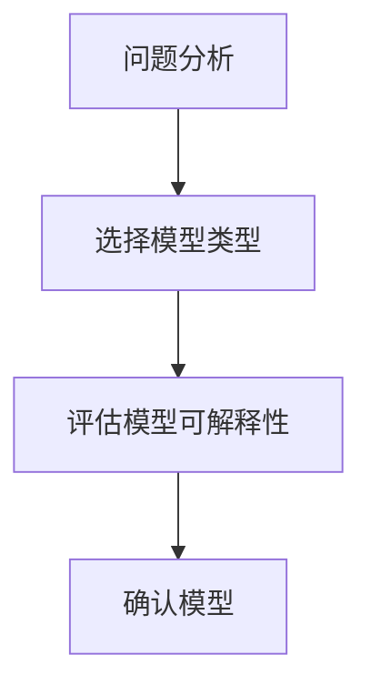
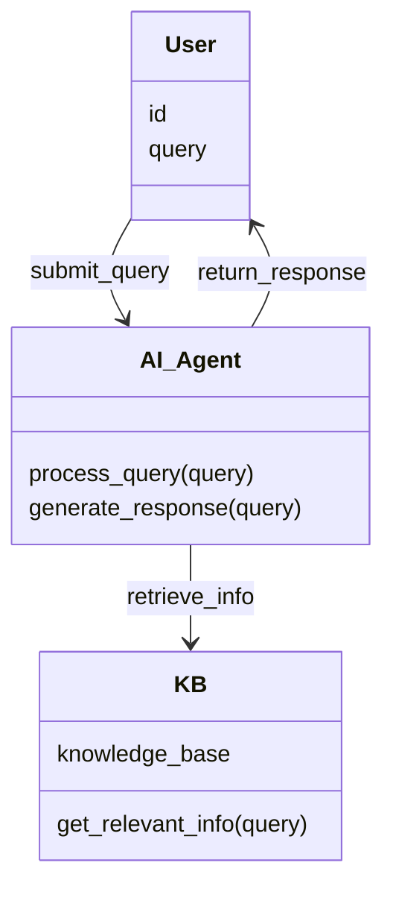

                 


# 构建可解释的AI Agent：透明度和可信度

## 关键词：可解释AI, AI Agent, 透明度, 可信度, 可解释性模型, 机器学习

## 摘要：  
随着人工智能技术的快速发展，AI Agent（智能体）在各个领域的应用越来越广泛。然而，AI Agent的决策过程往往缺乏透明度和可解释性，导致用户对其决策的信任度降低。本文将深入探讨如何构建可解释的AI Agent，重点分析透明度和可信度的实现方法。通过理论分析和实际案例，我们将展示如何设计和实现透明且可信的AI Agent，从而增强用户对AI系统的信任。

---

# 目录

1. **背景介绍**  
   1.1 AI Agent的基本概念  
   1.2 可解释性在AI Agent中的重要性  
   1.3 当前AI Agent应用中的问题与挑战  

2. **核心概念与联系**  
   2.1 可解释性与透明度的关系  
   2.2 可信度与可解释性的联系  
   2.3 透明度与可信度的对比分析  

3. **可解释性AI的核心原理**  
   3.1 可解释性AI的原理  
   3.2 可解释性与透明度的实现机制  

4. **算法原理讲解**  
   4.1 可解释性AI的算法选择  
   4.2 算法实现与代码示例  

5. **数学模型与公式**  
   5.1 线性回归模型的可解释性  
   5.2 逻辑回归模型的可解释性  

6. **系统分析与架构设计**  
   6.1 问题场景介绍  
   6.2 系统功能设计  
   6.3 系统架构设计  

7. **项目实战：构建可解释的对话AI Agent**  
   7.1 环境安装与配置  
   7.2 核心代码实现  
   7.3 案例分析与总结  

8. **最佳实践与注意事项**  
   8.1 实践中的注意事项  
   8.2 可扩展的解决方案  
   8.3 拓展阅读与学习资源  

---

# 正文

## 第1章：背景介绍

### 1.1 AI Agent的基本概念

AI Agent（智能体）是指能够感知环境并采取行动以实现目标的智能系统。AI Agent可以是软件程序、机器人或其他智能系统，其核心功能包括感知、推理、决策和行动。AI Agent的应用范围广泛，包括自动驾驶、智能客服、推荐系统等。

#### 1.1.1 AI Agent的定义与分类

- **定义**：AI Agent是一个能够自主决策并执行任务的智能实体，能够通过传感器获取环境信息，并通过执行器与环境互动。
- **分类**：根据智能体的智能水平，可以分为简单反应式智能体、基于模型的反应式智能体、目标驱动智能体和效用驱动智能体。

#### 1.1.2 可解释性在AI Agent中的重要性

可解释性是指AI Agent的决策过程能够被人类理解和解释。在医疗、金融等高风险领域，可解释性是信任的基础，也是合规性的重要要求。此外，可解释性还便于调试和优化AI系统。

#### 1.1.3 当前AI Agent应用中的问题与挑战

- **问题**：当前许多AI Agent基于复杂模型（如深度神经网络），其决策过程难以解释，导致用户不信任。
- **挑战**：如何在保证性能的同时，提高AI Agent的可解释性，是当前研究的热点问题。

---

### 1.2 可解释性AI的背景与必要性

#### 1.2.1 可解释性AI的定义

可解释性AI是指AI系统能够清晰地解释其决策过程，使得用户能够理解并信任系统的输出。

#### 1.2.2 为什么需要可解释的AI Agent

- **信任建立**：用户需要信任AI Agent的决策，尤其是在高风险场景中。
- **责任追究**：在出现错误决策时，可解释性有助于追查问题根源。
- **合规性要求**：许多行业法规要求AI系统具备可解释性。

#### 1.2.3 可解释性在不同场景中的应用

- **医疗领域**：医生需要理解AI诊断系统的推理过程。
- **金融领域**：银行需要解释信用评分的依据。
- **司法领域**：法官需要理解AI判决的逻辑。

---

## 第2章：核心概念与联系

### 2.1 可解释性与透明度的关系

#### 2.1.1 可解释性的层次模型

可解释性可以分为多个层次：

- **显式可解释性**：系统能够提供明确的解释，如规则和决策树。
- **隐式可解释性**：用户通过观察系统行为间接理解其决策过程。

#### 2.1.2 透明度的度量标准

透明度可以通过以下指标进行评估：

- **可理解性**：用户是否能够理解系统的决策过程。
- **可追溯性**：用户是否能够追溯决策的来源。
- **可验证性**：用户是否能够验证系统的决策是否合理。

### 2.2 可信度与可解释性的联系

#### 2.2.1 可信度的定义与影响因素

可信度是指用户对AI系统决策的信任程度。影响可信度的因素包括系统性能、透明度和可解释性。

#### 2.2.2 可解释性如何增强可信度

通过提高系统的可解释性，用户能够理解系统的工作原理，从而增强对系统的信任。

---

## 第3章：可解释性AI的核心原理

### 3.1 可解释性AI的原理

#### 3.1.1 可解释模型的选择标准

选择可解释模型时，需要考虑以下因素：

- **解释能力**：模型是否能够提供清晰的解释。
- **性能**：模型的预测准确率。
- **计算效率**：模型的推理速度。

#### 3.1.2 可解释性模型的评估方法

常用的评估方法包括：

- **特征重要性分析**：通过SHAP值或特征系数评估各个特征对决策的影响程度。
- **模型可解释性评分**：根据模型的透明度和可理解性进行评分。

---

## 第4章：算法原理讲解

### 4.1 可解释性AI的算法选择

#### 4.1.1 选择可解释模型的流程图



#### 4.1.2 算法实现与代码示例

使用线性回归模型进行可解释性分析：

```python
import pandas as pd
import numpy as np
from sklearn.linear_model import LinearRegression
from sklearn.inspection import permutation_importances

# 示例数据集
data = {
    'feature1': np.random.randn(100),
    'feature2': np.random.randn(100),
    'target': np.random.randn(100)
}
df = pd.DataFrame(data)

# 训练线性回归模型
model = LinearRegression()
model.fit(df[['feature1', 'feature2']], df['target'])

# 计算特征重要性
importances = permutation_importances(model, df[['feature1', 'feature2']], df['target'])
importances
```

---

## 第5章：数学模型与公式

### 5.1 线性回归模型的可解释性

线性回归模型的公式为：

$$ y = \beta_0 + \beta_1 x_1 + \beta_2 x_2 + \ldots + \beta_n x_n + \epsilon $$

其中，$\beta_i$ 是特征 $x_i$ 的系数，表示该特征对目标变量 $y$ 的影响程度。

### 5.2 逻辑回归模型的可解释性

逻辑回归模型的公式为：

$$ P(y=1|x) = \frac{1}{1 + e^{-(\beta_0 + \beta_1 x_1 + \ldots + \beta_n x_n)}} $$

特征的系数 $\beta_i$ 反映了特征对目标变量的影响方向和大小。

---

## 第6章：系统分析与架构设计

### 6.1 问题场景介绍

假设我们正在开发一个智能客服系统，该系统需要根据用户的问题内容自动推荐解决方案。为了提高系统的透明度和可信度，我们需要设计一个可解释的AI Agent。

### 6.2 系统功能设计

#### 6.2.1 领域模型设计



---

## 第7章：项目实战：构建可解释的对话AI Agent

### 7.1 环境安装与配置

安装所需的Python库：

```bash
pip install numpy pandas scikit-learn
```

### 7.2 核心代码实现

实现一个简单的可解释对话AI Agent：

```python
import numpy as np
from sklearn.linear_model import LinearRegression

# 示例数据
X = np.array([[1, 2], [3, 4], [5, 6]])
y = np.array([3, 5, 7])

# 训练模型
model = LinearRegression()
model.fit(X, y)

# 解释模型
print("Coefficients:", model.coef_)
print("Intercept:", model.intercept_)
```

### 7.3 案例分析与总结

通过对模型的系数进行分析，我们可以理解每个特征对目标变量的影响程度。

---

## 第8章：最佳实践与注意事项

### 8.1 实践中的注意事项

- **选择合适的模型**：在保证性能的前提下，选择可解释性较高的模型。
- **数据预处理**：确保数据的质量和相关性，避免噪声干扰。
- **持续监控**：定期监控系统的性能和可解释性，及时优化。

### 8.2 可扩展的解决方案

- **模块化设计**：将系统划分为多个模块，便于维护和扩展。
- **动态更新**：根据用户反馈动态更新模型，提高系统的适应性。

### 8.3 拓展阅读与学习资源

- **推荐书籍**：《可解释的人工智能：模型、方法和应用》
- **在线课程**：Coursera上的“可解释的人工智能”课程

---

## 作者信息

作者：AI天才研究院/AI Genius Institute & 禅与计算机程序设计艺术/Zen And The Art of Computer Programming

---

通过以上内容，我们详细探讨了构建可解释的AI Agent的方法，分析了透明度和可信度的实现策略，并通过实际案例展示了如何将理论应用于实践。希望本文能够为读者在设计和实现可解释的AI Agent时提供有价值的参考和指导。

