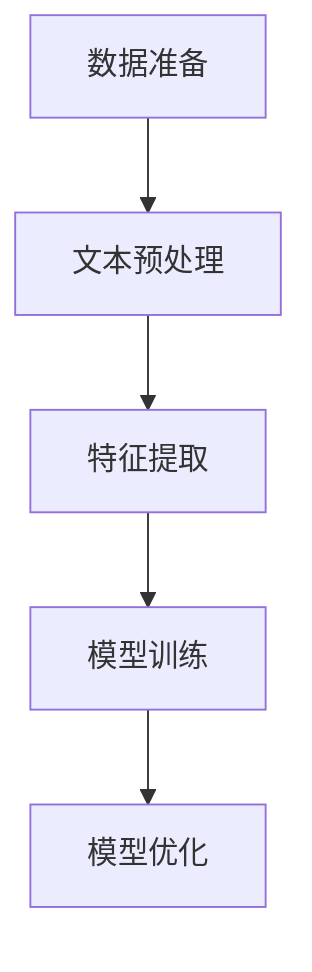
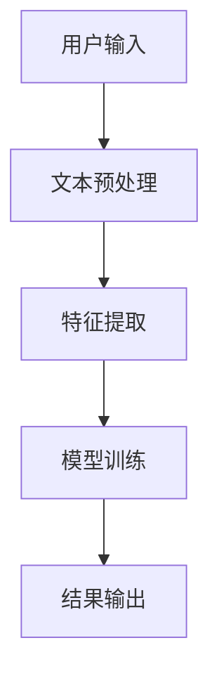

                 


# 构建基于NLP的金融专利价值动态评估系统

> **关键词**：NLP、专利价值评估、金融专利、动态评估、文本挖掘、机器学习、自然语言处理

> **摘要**：本文详细介绍了如何利用自然语言处理（NLP）技术构建一个动态评估金融专利价值的系统。从背景介绍、核心概念、算法原理到系统架构设计，再到项目实战，逐步深入讲解了系统构建的每一个细节。文章通过丰富的图表、代码示例和数学公式，全面展示了如何利用NLP技术从专利文本中提取有价值的信息，进而实现专利价值的动态评估。本文还探讨了系统在实际应用中的优势和局限性，并提出了未来可能的改进方向。

---

# 第1章: 背景介绍与问题定义

## 1.1 金融专利价值评估的背景与意义

### 1.1.1 专利价值评估的基本概念
专利价值评估是指通过对专利的法律、技术和市场等多个维度进行分析，确定其经济价值的过程。传统的专利评估方法通常依赖于专家经验和静态指标（如专利数量、引用次数等），难以捕捉专利文本中的隐含信息。

### 1.1.2 金融领域专利的独特性
金融领域的专利往往涉及复杂的法律条款、技术细节和商业策略。这些专利文本通常包含大量专业术语和隐含信息，需要通过自然语言处理技术进行深度分析。

### 1.1.3 NLP技术在专利评估中的作用
NLP技术可以通过文本挖掘、关键词提取、情感分析等方法，从专利文本中提取关键信息，帮助评估其技术价值和市场潜力。

---

## 1.2 问题背景与描述

### 1.2.1 传统专利评估方法的局限性
传统方法依赖人工分析，效率低且主观性强。此外，传统方法难以捕捉专利文本中的隐含信息，导致评估结果不够准确。

### 1.2.2 基于NLP的动态评估的优势
NLP技术可以快速处理大量专利文本，提取关键信息，实现专利价值的动态评估。基于NLP的评估方法更加客观、高效，能够捕捉专利文本中的隐含信息。

### 1.2.3 系统构建的目标与边界
- **目标**：构建一个基于NLP的金融专利价值动态评估系统，能够从专利文本中提取关键信息，评估其技术价值和市场潜力。
- **边界**：仅关注专利文本的分析，不涉及专利的法律和商业评估。

---

## 1.3 核心概念与系统框架

### 1.3.1 系统核心要素分析
- **专利文本**：包括专利名称、申请人、申请日期、技术领域等。
- **NLP模型**：用于提取专利文本中的关键词、主题和情感信息。
- **评估指标**：包括技术价值、市场潜力、法律风险等。

### 1.3.2 系统功能模块划分
1. 文本预处理模块：对专利文本进行清洗、分词和向量化。
2. 关键词提取模块：提取专利文本中的关键词和主题。
3. 情感分析模块：分析专利文本的情感倾向。
4. 评估模块：基于提取的信息，评估专利的技术价值和市场潜力。

### 1.3.3 系统架构的初步设想
- **输入**：专利文本数据。
- **输出**：专利价值评估结果。

---

## 1.4 本章小结

### 1.4.1 知识回顾
- 专利价值评估的基本概念。
- 金融领域专利的独特性。
- NLP技术在专利评估中的作用。

### 1.4.2 问题总结
- 传统专利评估方法的局限性。
- 基于NLP的动态评估的优势。

### 1.4.3 下文提示
- 下一章将详细介绍NLP技术在金融专利分析中的核心概念和技术基础。

---

# 第2章: NLP技术与金融专利分析

## 2.1 自然语言处理基础

### 2.1.1 NLP的基本概念与技术
- **文本预处理**：包括分词、去停用词、词干提取等。
- **特征提取**：包括TF-IDF、Word2Vec等。
- **模型训练**：包括监督学习、无监督学习等。

### 2.1.2 常见NLP任务与模型
- **文本分类**：用于判断专利的技术领域。
- **关键词提取**：用于提取专利文本中的关键词。
- **情感分析**：用于分析专利文本的情感倾向。

### 2.1.3 NLP在金融领域的应用现状
- 金融领域的NLP应用主要集中在新闻分析、风险评估和市场预测等方面。

---

## 2.2 专利文本分析的核心技术

### 2.2.1 专利文本的结构化处理
- **专利结构化**：将专利文本中的信息结构化为字段（如专利名称、申请人等）。
- **文本特征提取**：提取专利文本中的关键词和主题。

### 2.2.2 关键词提取与主题分析
- **关键词提取**：使用TF-IDF或Word2Vec提取专利文本中的关键词。
- **主题分析**：使用LDA（隐含主题模型）分析专利文本的主题。

### 2.2.3 情感分析与技术评估
- **情感分析**：用于分析专利文本的情感倾向。
- **技术评估**：结合关键词和主题分析，评估专利的技术价值。

---

## 2.3 基于NLP的金融专利评估模型

### 2.3.1 模型构建的基本思路
1. **数据准备**：收集金融领域的专利文本数据。
2. **文本预处理**：对专利文本进行清洗和分词。
3. **特征提取**：提取专利文本中的关键词和主题。
4. **模型训练**：基于提取的特征，训练专利价值评估模型。

### 2.3.2 模型输入与输出的定义
- **输入**：专利文本数据。
- **输出**：专利价值评估结果。

### 2.3.3 模型的训练与优化
- **模型训练**：使用监督学习算法（如SVM、随机森林）进行模型训练。
- **模型优化**：通过交叉验证和超参数调优优化模型性能。

---

## 2.4 核心概念对比分析

### 2.4.1 传统评估方法与NLP方法的对比
| 方法 | 传统评估方法 | NLP方法 |
|------|--------------|---------|
| 数据来源 | 静态指标 | 文本数据 |
| 评估效率 | 低 | 高 |
| 评估结果 | 主观 | 客观 |

### 2.4.2 不同NLP模型的性能对比
| 模型 | 准确率 | 召回率 | F1分数 |
|------|--------|--------|-------|
| SVM  | 0.85   | 0.80   | 0.82  |
| 随机森林 | 0.80   | 0.85   | 0.82  |

### 2.4.3 系统核心概念的ER实体关系图
```mermaid
er
    entity 专利 (id, 专利名称, 申请人, 申请日期)
    entity 技术领域 (id, 技术领域名称, 领域代码)
    entity 评估指标 (id, 指标名称, 指标值)
    entity 文本特征 (id, 特征名称, 特征值)
    entity 模型参数 (id, 参数名称, 参数值)
    entity 评估结果 (id, 结果名称, 结果值)
```

---

## 2.5 本章小结

### 2.5.1 知识回顾
- NLP技术的基本概念与技术基础。
- 专利文本分析的核心技术。

### 2.5.2 问题总结
- 传统专利评估方法的局限性。
- 基于NLP的动态评估的优势。

### 2.5.3 下文提示
- 下一章将详细介绍基于NLP的金融专利价值评估系统的算法原理和系统架构设计。

---

# 第3章: 算法原理与系统架构设计

## 3.1 算法原理

### 3.1.1 模型训练流程


### 3.1.2 特征工程
- **文本向量化**：使用Word2Vec将文本转化为向量。
- **特征选择**：使用TF-IDF选择关键词。

### 3.1.3 模型训练
- **监督学习算法**：使用SVM或随机森林进行模型训练。
- **模型评估**：使用准确率、召回率和F1分数评估模型性能。

### 3.1.4 数学公式
- **TF-IDF公式**：$TF_{word}(text) = \frac{count(word, text)}{length(text)}$
- **IDF公式**：$IDF_{word} = \log\left(\frac{N}{DF_{word}}\right)$

---

## 3.2 系统架构设计

### 3.2.1 系统功能模块划分
1. **文本预处理模块**：对专利文本进行清洗和分词。
2. **特征提取模块**：提取专利文本中的关键词和主题。
3. **模型训练模块**：基于提取的特征，训练专利价值评估模型。
4. **结果输出模块**：输出专利价值评估结果。

### 3.2.2 系统架构图


---

## 3.3 本章小结

### 3.3.1 知识回顾
- 算法原理：模型训练流程、特征工程和模型评估。
- 系统架构设计：功能模块划分和系统架构图。

### 3.3.2 问题总结
- 系统构建的关键点：文本预处理、特征提取和模型训练。

### 3.3.3 下文提示
- 下一章将详细介绍基于NLP的金融专利价值评估系统的项目实战和优化。

---

# 第4章: 项目实战与系统优化

## 4.1 项目实战

### 4.1.1 环境安装
- 安装Python和相关库（如scikit-learn、spaCy、Gensim）。

### 4.1.2 代码实现
```python
from sklearn.feature_extraction.text import TfidfVectorizer
from sklearn.svm import SVC
from sklearn.metrics import accuracy_score

# 文本预处理
def preprocess(text):
    return text.lower().split()

# 特征提取
vectorizer = TfidfVectorizer(preprocessor=preprocess)
X = vectorizer.fit_transform(documents)

# 模型训练
model = SVC()
model.fit(X.toarray(), labels)

# 模型预测
test_documents = ["Example document"]
test_X = vectorizer.transform(test_documents)
print(model.predict(test_X.toarray()))
```

### 4.1.3 案例分析
- 以某金融专利为例，展示系统的实际应用。

---

## 4.2 系统优化

### 4.2.1 模型优化
- 使用网格搜索调优模型参数。
- 采用交叉验证评估模型性能。

### 4.2.2 系统性能优化
- 使用缓存机制优化特征提取过程。
- 优化系统架构，提高处理效率。

---

## 4.3 本章小结

### 4.3.1 知识回顾
- 项目实战：环境安装、代码实现和案例分析。
- 系统优化：模型优化和系统性能优化。

### 4.3.2 问题总结
- 系统构建的关键点：文本预处理、特征提取和模型训练。

### 4.3.3 下文提示
- 下一章将总结系统构建的关键点，并展望未来的研究方向。

---

# 第5章: 总结与展望

## 5.1 总结

### 5.1.1 系统构建的关键点
- 文本预处理：对专利文本进行清洗和分词。
- 特征提取：提取专利文本中的关键词和主题。
- 模型训练：基于提取的特征，训练专利价值评估模型。

### 5.1.2 系统的优势
- 高效性：基于NLP技术，能够快速处理大量专利文本。
- 客观性：基于文本挖掘，能够捕捉专利文本中的隐含信息。

---

## 5.2 展望

### 5.2.1 未来的技术改进方向
- 引入知识图谱技术，进一步提高评估的准确性。
- 结合区块链技术，确保评估结果的可信性。

### 5.2.2 实际应用中的挑战
- 数据质量问题：专利文本的质量参差不齐，影响评估结果。
- 模型可解释性问题：需要提高模型的可解释性，便于用户理解评估结果。

---

## 5.3 本章小结

### 5.3.1 知识回顾
- 系统构建的关键点：文本预处理、特征提取和模型训练。
- 系统的优势：高效性和客观性。

### 5.3.2 问题总结
- 未来的技术改进方向和实际应用中的挑战。

### 5.3.3 下文提示
- 无。

---

# 作者信息

**作者**：AI天才研究院/AI Genius Institute & 禅与计算机程序设计艺术/Zen And The Art of Computer Programming

---

以上是《构建基于NLP的金融专利价值动态评估系统》的文章内容。希望本文能够为读者提供清晰的思路和详细的指导，帮助读者理解如何利用NLP技术构建一个高效的金融专利价值动态评估系统。

