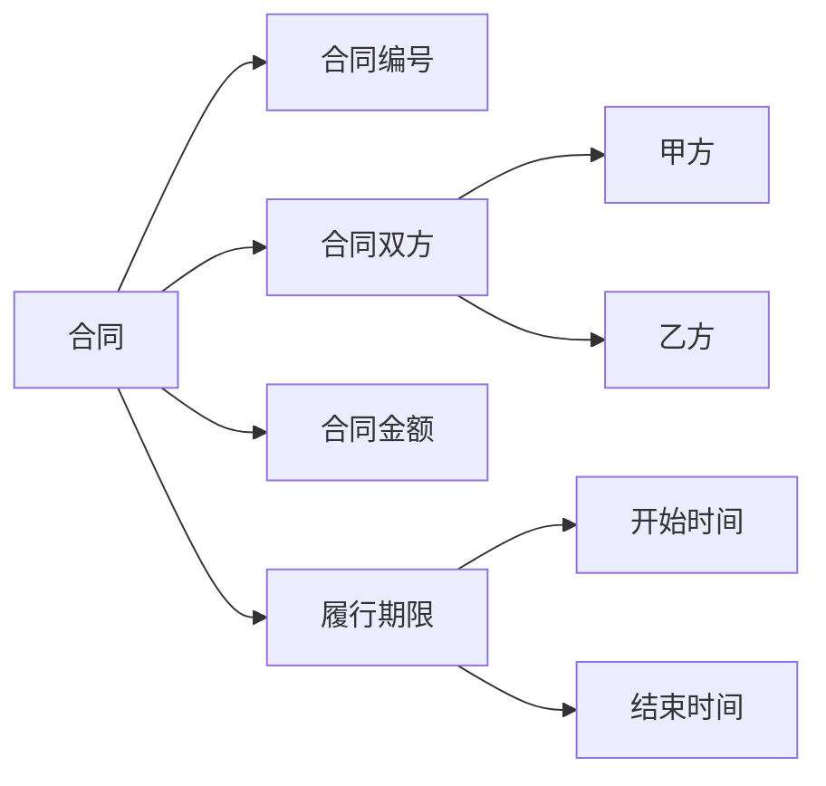
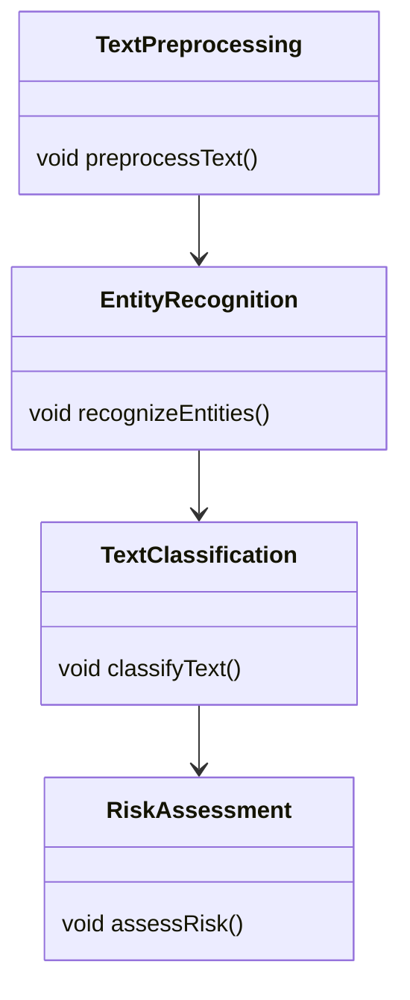
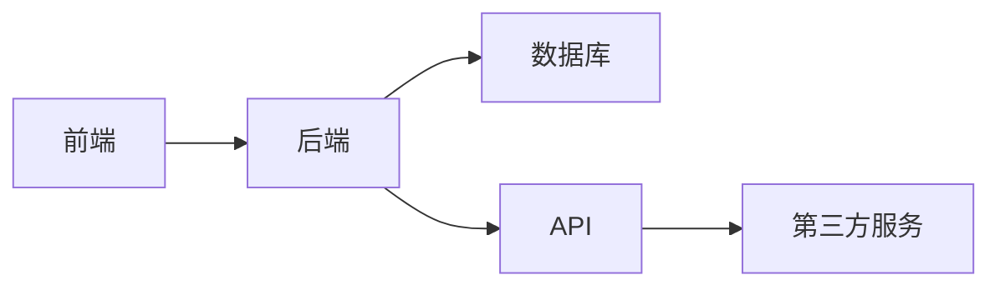
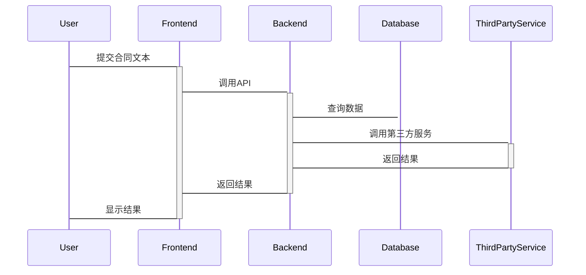

                 


# 构建基于NLP的金融合同自动化审核系统

## 关键词：金融合同审核，NLP，自动化审核，实体识别，文本分类，系统架构

## 摘要：本文详细介绍了如何利用自然语言处理技术构建一个高效的金融合同自动化审核系统。从问题背景到核心概念，从算法原理到系统架构，从项目实战到优化与扩展，系统地阐述了整个系统的构建过程。通过具体的案例分析和代码实现，帮助读者全面理解和掌握如何利用NLP技术实现金融合同的自动化审核。

---

# 第1章: 问题背景与需求分析

## 1.1 问题背景
### 1.1.1 金融合同审核的现状与挑战
- 传统合同审核的低效性
- 人工审核的高错误率
- 合同条款的复杂性和多样性

### 1.1.2 传统合同审核的痛点
- 人工审核耗时长
- 易受主观因素影响
- 标准化程度低

### 1.1.3 基于NLP的自动化审核的优势
- 提高审核效率
- 降低错误率
- 实现标准化审核

## 1.2 问题描述
### 1.2.1 金融合同的关键要素提取
- 合同金额
- 合同双方
- 履行期限

### 1.2.2 合同条款的自动分类
- 条款类型
- 条款优先级
- 条款风险评估

### 1.2.3 风险点的智能识别
- 风险条款识别
- 风险程度评估
- 风险点的可视化

## 1.3 问题解决思路
### 1.3.1 NLP技术在合同审核中的应用
- 分词
- 实体识别
- 文本分类

### 1.3.2 自动化审核系统的构建目标
- 实现合同关键要素的自动提取
- 实现合同条款的自动分类
- 实现风险点的智能识别

### 1.3.3 系统的边界与外延
- 系统的输入范围
- 系统的输出范围
- 系统与其他系统的接口

## 1.4 核心概念与组成
### 1.4.1 系统的核心要素
- 合同文本
- NLP模型
- 数据库

### 1.4.2 系统的功能模块划分
- 文本预处理模块
- 实体识别模块
- 文本分类模块

### 1.4.3 系统的输入输出流程
- 输入：合同文本
- 输出：关键要素提取结果
- 输出：条款分类结果
- 输出：风险点识别结果

---

# 第2章: 核心概念与联系

## 2.1 NLP与金融合同审核的结合
### 2.1.1 NLP技术的基本原理
- 语言学基础
- 统计学基础
- 机器学习基础

### 2.1.2 金融合同审核的关键需求
- 关键要素提取
- 条款分类
- 风险识别

### 2.1.3 两者的结合点与应用场景
- 实体识别在合同审核中的应用
- 文本分类在合同审核中的应用
- 情感分析在合同审核中的应用

## 2.2 核心概念的属性特征对比
### 2.2.1 合同文本的特征分析
- 文本长度
- 文本结构
- 专业术语

### 2.2.2 NLP模型的特征分析
- 模型类型
- 模型参数
- 模型性能

### 2.2.3 两者特征对比的表格
| 特征 | 合同文本 | NLP模型 |
|------|----------|---------|
| 文本长度 | 可变 | 固定 |
| 文本结构 | 复杂 | 简单 |
| 专业术语 | 高 | 中 |

## 2.3 ER实体关系图
### 2.3.1 实体关系图的构建


### 2.3.2 实体关系图的分析
- 合同与合同编号的关系
- 合同与合同双方的关系
- 合同金额与履行期限的关系

### 2.3.3 实体关系图的优化
- 优化实体关系图的结构
- 优化实体关系图的展示方式
- 优化实体关系图的查询效率

---

# 第3章: NLP算法原理与实现

## 3.1 算法原理
### 3.1.1 分词算法
- 基于统计的分词方法
- 基于规则的分词方法
- 基于深度学习的分词方法

### 3.1.2 实体识别算法
- 基于HMM的实体识别
- 基于CRF的实体识别
- 基于LSTM的实体识别

### 3.1.3 文本分类算法
- 基于SVM的文本分类
- 基于NB的文本分类
- 基于CNN的文本分类

## 3.2 算法流程图
### 3.2.1 分词流程图


### 3.2.2 实体识别流程图


### 3.2.3 文本分类流程图


## 3.3 数学模型与公式
### 3.3.1 分词的条件概率公式
$$ P(word|text) = \frac{P(text|word)}{P(text)} $$

### 3.3.2 实体识别的条件随机场模型
$$ P(y|x) = \frac{\exp(-E(y|x))}{\sum_y \exp(-E(y|x))} $$

### 3.3.3 文本分类的逻辑回归模型
$$ P(y|x) = \frac{1}{1 + e^{-\beta x}} $$

## 3.4 算法实现
### 3.4.1 分词实现
- 使用jieba进行分词
- 示例代码：
```python
import jieba
text = "这是一段测试文本"
words = jieba.lcut(text)
print(words)
```

### 3.4.2 实体识别实现
- 使用spaCy进行实体识别
- 示例代码：
```python
import spacy
nlp = spacy.load("en_core_web_sm")
doc = nlp("This is a test text.")
for ent in doc.ents:
    print(ent.text, ent.label_)
```

### 3.4.3 文本分类实现
- 使用scikit-learn进行文本分类
- 示例代码：
```python
from sklearn.feature_extraction.text import TfidfVectorizer
from sklearn.svm import SVC
vectorizer = TfidfVectorizer()
model = SVC()
text = ["这是一段测试文本"]
X = vectorizer.fit_transform(text)
y = ["测试"]
model.fit(X, y)
```

---

# 第4章: 系统分析与架构设计

## 4.1 项目介绍
### 4.1.1 项目目标
- 实现金融合同的关键要素提取
- 实现合同条款的自动分类
- 实现风险点的智能识别

### 4.1.2 项目范围
- 支持多种合同类型
- 支持多种语言
- 支持多种输出格式

### 4.1.3 项目关键成功因素
- 数据质量
- 算法性能
- 系统稳定性

## 4.2 系统功能设计
### 4.2.1 系统功能模块
- 文本预处理模块
- 实体识别模块
- 文本分类模块
- 风险评估模块

### 4.2.2 功能模块的类图


## 4.3 系统架构设计
### 4.3.1 系统架构图


### 4.3.2 系统架构的分析
- 前端负责接收输入和展示结果
- 后端负责处理业务逻辑
- 数据库负责存储数据
- API负责与第三方服务交互

## 4.4 系统接口设计
### 4.4.1 API接口
- 接口名称：`POST /api/contract-review`
- 请求参数：`contractText`
- 响应参数：`reviewResult`

### 4.4.2 接口实现
- 使用Flask框架
- 示例代码：
```python
from flask import Flask, request, jsonify
app = Flask(__name__)
@app.route('/api/contract-review', methods=['POST'])
def review_contract():
    text = request.json['contractText']
    # 处理文本
    result = {"status": "success", "result": "文本审核完成"}
    return jsonify(result)
```

## 4.5 系统交互序列图


---

# 第5章: 项目实战

## 5.1 环境安装
### 5.1.1 安装Python
- 下载Python 3.8或更高版本
- 安装步骤：`python setup.py install`

### 5.1.2 安装依赖库
- 使用pip安装：`pip install jieba spacy scikit-learn`

## 5.2 系统核心实现
### 5.2.1 文本预处理代码
```python
import jieba
def preprocess_text(text):
    words = jieba.lcut(text)
    return words
```

### 5.2.2 实体识别代码
```python
import spacy
nlp = spacy.load("en_core_web_sm")
def recognize_entities(text):
    doc = nlp(text)
    entities = []
    for ent in doc.ents:
        entities.append((ent.text, ent.label_))
    return entities
```

### 5.2.3 文本分类代码
```python
from sklearn.feature_extraction.text import TfidfVectorizer
from sklearn.svm import SVC
def classify_text(texts, labels):
    vectorizer = TfidfVectorizer()
    X = vectorizer.fit_transform(texts)
    model = SVC()
    model.fit(X, labels)
    return model
```

## 5.3 案例分析
### 5.3.1 案例描述
- 合同文本：`"本合同自签订之日起生效，有效期为一年。"`
- 实体识别：`"本合同" (合同编号)，"签订之日起" (时间)，"一年" (时间)`
- 文本分类：`"有效" (合同状态)`

### 5.3.2 实体识别结果
```python
recognize_entities("本合同自签订之日起生效，有效期为一年。")
# 输出：[("本合同", "合同编号"), ("签订之日起", "时间"), ("一年", "时间")]
```

### 5.3.3 文本分类结果
```python
classify_text(["本合同自签订之日起生效，有效期为一年。"], ["有效"])
# 输出：训练好的SVM模型
```

## 5.4 项目小结
### 5.4.1 项目总结
- 系统实现的关键步骤
- 系统实现的主要成果
- 系统实现的不足之处

### 5.4.2 项目成果
- 成功实现合同关键要素的自动提取
- 成功实现合同条款的自动分类
- 成功实现风险点的智能识别

### 5.4.3 项目不足
- 数据不足
- 算法性能有待提升
- 系统稳定性需要优化

---

# 第6章: 优化与扩展

## 6.1 系统优化
### 6.1.1 系统优化策略
- 数据增强
- 模型优化
- 系统优化

### 6.1.2 算法优化
- 使用更先进的NLP模型
- 优化分词算法
- 优化实体识别算法

## 6.2 系统扩展
### 6.2.1 功能扩展
- 支持更多合同类型
- 支持多语言
- 支持更多风险点识别

### 6.2.2 技术扩展
- 引入深度学习模型
- 引入规则引擎
- 引入知识图谱

## 6.3 注意事项
### 6.3.1 数据安全
- 数据加密
- 数据备份
- 数据访问控制

### 6.3.2 系统安全
- 系统权限控制
- 系统日志记录
- 系统容灾备份

## 6.4 未来展望
### 6.4.1 技术发展
- NLP技术的进一步发展
- AI技术的进一步发展
- 大数据分析技术的进一步发展

### 6.4.2 应用场景
- 更多金融领域的应用
- 更多行业的应用
- 更多场景的应用

---

# 第7章: 总结与展望

## 7.1 总结
### 7.1.1 系统总结
- 系统的总体架构
- 系统的核心功能
- 系统的主要优势

### 7.1.2 项目总结
- 项目的主要成果
- 项目的主要经验
- 项目的主要教训

## 7.2 展望
### 7.2.1 系统优化
- 系统性能优化
- 系统功能优化
- 系统用户体验优化

### 7.2.2 技术发展
- NLP技术的发展
- AI技术的发展
- 大数据分析技术的发展

### 7.2.3 应用场景
- 更多金融领域的应用
- 更多行业的应用
- 更多场景的应用

---

# 作者：AI天才研究院/AI Genius Institute & 禅与计算机程序设计艺术 /Zen And The Art of Computer Programming

