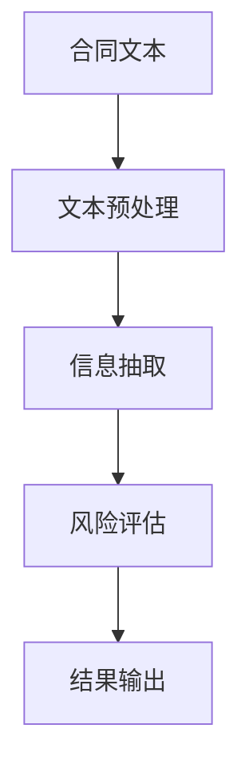
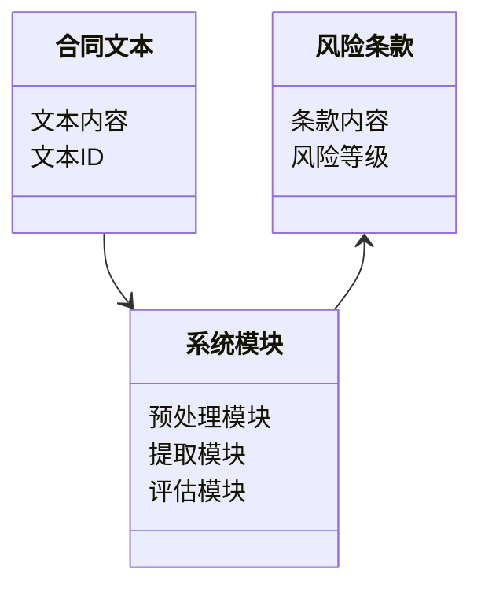

                 


# 《构建基于NLP的金融合同风险条款自动化提取与评估系统》

> 关键词：NLP, 金融合同, 风险条款, 自动化提取, 评估系统

> 摘要：本文详细探讨了如何利用自然语言处理技术构建一个高效的金融合同风险条款自动化提取与评估系统。通过分析系统的背景、核心概念、NLP技术在金融合同处理中的应用、系统架构与功能设计，以及具体的项目实现，本文为金融行业的合同风险管理提供了新的思路和解决方案。

---

# 第一部分: 背景与核心概念

# 第1章: 金融合同风险条款提取与评估的背景与需求

## 1.1 金融合同的重要性

### 1.1.1 金融合同的基本概念

金融合同是金融交易中用于定义双方权利义务关系的法律文件，包括贷款合同、债券协议、保险合同等。这些合同通常包含复杂的条款，如还款条件、违约责任、利率调整等。

### 1.1.2 金融合同在金融业务中的作用

金融合同是金融交易的核心，直接关系到交易的合法性和风险控制。准确理解和提取合同中的关键条款是保障金融交易安全、规避法律风险的重要基础。

### 1.1.3 合同条款的风险与挑战

金融合同中的风险条款通常涉及复杂的法律术语和特殊条件，如“不可抗力”、“提前还款”等。这些条款的提取和理解需要高度的准确性和专业性，传统的人工审查方式效率低、成本高且容易出错。

---

## 1.2 传统合同处理方式的局限性

### 1.2.1 人工审查的低效性

人工审查合同需要大量时间，尤其是面对海量合同和复杂的条款时，效率难以满足业务需求。

### 1.2.2 易错性与主观性问题

由于法律术语的复杂性和条款的多样性，人工审查容易出现疏漏或误判，导致法律风险。

### 1.2.3 信息孤岛与数据碎片化

不同部门和系统之间的合同数据分散，缺乏统一的管理平台，导致信息无法有效共享和利用。

---

## 1.3 基于NLP的自动化解决方案

### 1.3.1 NLP技术的快速发展

近年来，自然语言处理技术（NLP）在深度学习的推动下取得了显著进展，尤其是在文本分类、实体识别、句法分析等任务上表现优异。

### 1.3.2 NLP在金融领域的应用潜力

NLP技术可以应用于金融合同的自动化处理，如合同分类、关键信息提取、风险评估等，为金融机构提供高效、准确的工具。

### 1.3.3 自动化提取与评估的核心价值

通过自动化提取和评估合同中的风险条款，金融机构可以显著提高合同处理效率，降低人为错误，同时为风险管理和决策提供数据支持。

---

## 1.4 本章小结

本章从金融合同的重要性、传统处理方式的局限性以及NLP技术的应用潜力三个方面，阐述了构建基于NLP的金融合同风险条款自动化提取与评估系统的重要性和必要性。

---

# 第2章: 问题背景与目标定义

## 2.1 问题背景分析

### 2.1.1 合同风险条款的定义

合同风险条款是指那些可能引发法律纠纷或财务损失的关键条款，如违约责任、提前还款条件、利率调整等。

### 2.1.2 风险条款的分类与特征

风险条款可以分为违约条款、担保条款、管辖条款等类别。这些条款通常具有法律术语复杂、条款内容多样、逻辑关系复杂等特点。

### 2.1.3 风险条款提取的难点

提取风险条款的难点在于：1) 需要理解复杂的法律术语；2) 需要识别条款之间的逻辑关系；3) 需要处理文本中的噪声和歧义。

---

## 2.2 问题目标与边界

### 2.2.1 系统目标的明确

本系统的目标是通过NLP技术，自动化提取和评估金融合同中的风险条款，帮助金融机构快速识别和管理风险。

### 2.2.2 系统边界与功能范围

系统的功能范围包括合同文本的输入、风险条款的提取、风险评估以及结果输出。系统不涉及合同的生成或修改，也不直接参与法律决策，而是提供辅助支持。

### 2.2.3 与相关系统的区别与联系

与传统的法律管理系统相比，本系统专注于风险条款的自动化处理，与合同管理系统、风险控制系统等系统有数据交互和功能协同。

---

## 2.3 核心概念与组成要素

### 2.3.1 系统核心概念的结构化分析

系统的核心概念包括：合同文本、风险条款、系统模块。合同文本是输入，风险条款是输出，系统模块是处理单元。

### 2.3.2 核心要素的特征对比

| 特征 | 合同文本 | 风险条款 |
|------|-----------|-----------|
| 表达方式 | 文本形式 | 文本片段 |
| 内容 | 包含所有合同条款 | 高风险条款 |
| 处理目标 | 提取和分类 | 识别和评估 |

### 2.3.3 ER实体关系图的构建

通过ER图（实体关系图），我们可以清晰地展示系统中各实体之间的关系。

```mermaid
erd
 entity 合同文本 {
    id 合同ID
    text 合同内容
}
 entity 风险条款 {
    id 条款ID
    条款内容
    风险等级
}
 contract 合同文本 ONE-TO-MANY risk_terms 风险条款
```

---

## 2.4 本章小结

本章通过分析问题背景，明确了系统的目标和边界，构建了系统的核心概念，并通过ER图展示了各实体之间的关系。

---

# 第3章: NLP技术与金融合同处理的结合

## 3.1 NLP技术的核心原理

### 3.1.1 分词技术

分词是NLP的基础任务，将连续的文本分割成有意义的词语或短语。在金融合同处理中，分词技术可以帮助识别关键术语。

### 3.1.2 实体识别

实体识别（NER）用于识别文本中的命名实体，如“甲方”、“乙方”等。这在合同处理中非常重要，因为合同中的主体通常是公司或个人。

### 3.1.3 句法分析

句法分析用于分析句子的语法结构，识别主谓宾关系。这有助于理解合同条款的逻辑关系。

---

## 3.2 NLP在合同处理中的应用场景

### 3.2.1 文本分类

文本分类可以用于将合同分为不同的类别，如贷款合同、保险合同等。

### 3.2.2 关键信息提取

关键信息提取用于从合同文本中提取特定信息，如贷款金额、还款期限等。

### 3.2.3 风险评估

通过分析合同中的风险条款，系统可以评估合同的整体风险等级，并生成风险报告。

---

## 3.3 NLP技术的挑战与优化方向

### 3.3.1 数据质量与标注问题

高质量的标注数据是训练NLP模型的前提。金融合同文本通常复杂且专业，标注成本高。

### 3.3.2 模型泛化能力的提升

金融合同文本具有高度的专业性和领域特定性，模型需要在特定领域内进行优化，以提高泛化能力。

### 3.3.3 多语言与多领域适应性

随着全球化的发展，系统需要支持多种语言和多个金融领域的处理。

---

## 3.4 本章小结

本章介绍了NLP技术的核心原理及其在金融合同处理中的应用场景，并分析了当前技术面临的挑战和优化方向。

---

# 第4章: 系统架构与功能设计

## 4.1 系统整体架构

### 4.1.1 模块划分与功能分配

系统主要模块包括：文本预处理模块、信息抽取模块、风险评估模块和结果输出模块。

### 4.1.2 系统流程图（Mermaid）



---

## 4.2 领域模型设计

### 4.2.1 领域模型类图（Mermaid）



---

## 4.3 系统接口与交互设计

### 4.3.1 系统接口设计

系统提供RESTful API接口，支持合同文本的上传、处理和结果查询。

### 4.3.2 系统交互流程（Mermaid）

```mermaid
sequenceDiagram
用户 ->> 系统模块: 提交合同文本
系统模块 ->> 文本预处理模块: 进行文本清洗
文本预处理模块 ->> 信息抽取模块
信息抽取模块 ->> 风险评估模块
风险评估模块 ->> 用户: 返回风险评估结果
```

---

## 4.4 本章小结

本章详细设计了系统的整体架构和功能模块，并通过类图和流程图展示了系统的结构和交互方式。

---

# 第5章: 项目实战与实现

## 5.1 环境安装与配置

### 5.1.1 Python环境的安装

安装Python 3.8及以上版本，并配置虚拟环境。

### 5.1.2 依赖库的安装

安装必要的NLP库，如spaCy、transformers、nltk等。

---

## 5.2 系统核心实现

### 5.2.1 文本预处理代码

```python
import spacy

nlp = spacy.load("zh_core_web_sm")

def preprocess(text):
    doc = nlp(text)
    return " ".join([token.text for token in doc])
```

### 5.2.2 信息抽取代码

```python
from transformers import pipeline

classifier = pipeline("text-classification", model="snlp-org/roberta-base-finetuned-financial")
```

### 5.2.3 风险评估代码

```python
def risk_assessment(risk_factors):
    score = sum(risk_factors.values()) / len(risk_factors)
    return score
```

---

## 5.3 实际案例分析

### 5.3.1 案例背景

以一份贷款合同为例，提取违约责任条款并评估风险等级。

### 5.3.2 数据处理与分析

```python
contract_text = "贷款人应按期支付贷款，若逾期支付，借款人有权终止合同。"
processed_text = preprocess(contract_text)
```

### 5.3.3 结果输出

违约责任条款的风险等级为高，系统生成风险报告并提供改进建议。

---

## 5.4 本章小结

本章通过实际案例展示了系统的实现过程，从环境配置到代码实现，再到结果输出，详细说明了系统的实战应用。

---

# 第6章: 系统优化与未来展望

## 6.1 系统优化方向

### 6.1.1 模型优化

通过引入更先进的NLP模型（如BERT）和优化训练数据，提高系统的准确率和召回率。

### 6.1.2 系统性能优化

优化文本处理流程，减少响应时间，提升用户体验。

### 6.1.3 功能扩展

增加合同生成、条款对比等功能，进一步完善系统功能。

---

## 6.2 未来展望

随着NLP技术的不断进步，金融合同处理将更加智能化和自动化。未来的系统将支持多语言、多领域处理，并与更多金融业务系统集成。

---

# 第7章: 总结与最佳实践

## 7.1 总结

本章总结了全文的主要内容，重申了构建基于NLP的金融合同风险条款自动化提取与评估系统的重要性和实现路径。

## 7.2 最佳实践 tips

### 7.2.1 数据标注与模型训练

确保数据的高质量标注，选择合适的模型和训练策略。

### 7.2.2 系统集成与部署

系统的集成和部署需要考虑性能优化和安全性。

### 7.2.3 持续优化

定期更新模型和优化系统，以应对不断变化的金融环境和业务需求。

---

# 作者：AI天才研究院/AI Genius Institute & 禅与计算机程序设计艺术 /Zen And The Art of Computer Programming

