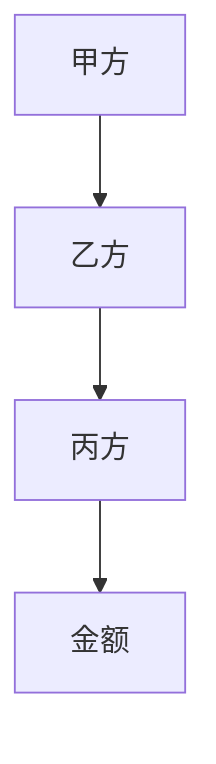
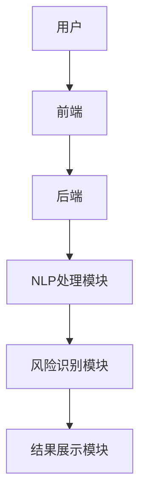
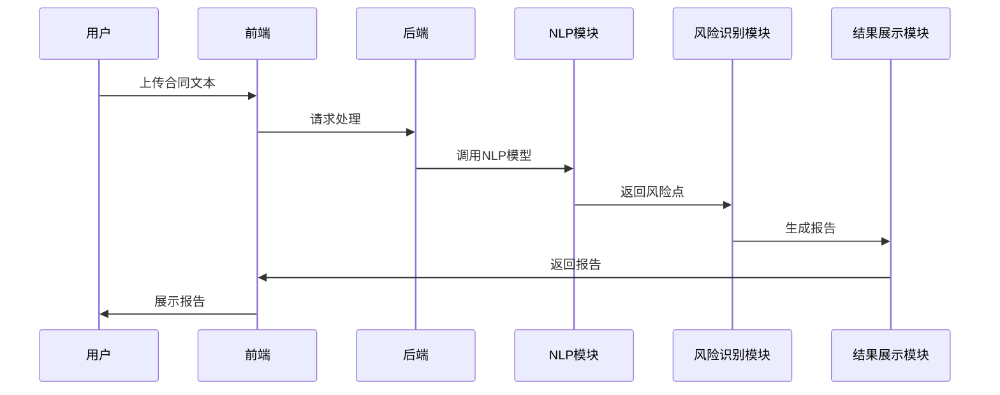

                 


# 构建基于NLP的金融合同风险识别系统

## 关键词：NLP，金融合同，风险识别，机器学习，文本挖掘

## 摘要：本文详细介绍了如何利用自然语言处理技术构建一个金融合同风险识别系统。通过分析金融合同文本中的风险点，结合NLP技术，提出了一种基于文本挖掘和机器学习的解决方案，实现对金融合同风险的智能化识别与评估。

---

# 第1章: 金融合同风险识别系统概述

## 1.1 问题背景与目标

### 1.1.1 金融合同风险识别的重要性
金融合同是金融交易的核心文件，涉及金额巨大且法律关系复杂。传统的人工审查方式效率低、成本高，且容易出错。通过NLP技术自动识别合同中的风险点，可以显著提高审查效率和准确性。

### 1.1.2 当前行业痛点与挑战
- **合同文本复杂性**：金融合同通常包含大量法律术语和复杂的结构。
- **风险点多**：合同中可能存在隐藏的法律风险，如违约条款、担保责任等。
- **人工审查效率低**：传统审查方式需要大量时间，且容易遗漏风险点。

### 1.1.3 系统建设的目标与价值
- **目标**：构建一个基于NLP的系统，自动识别合同中的风险点，并生成风险报告。
- **价值**：提高合同审查效率，降低法律风险，节省时间和成本。

## 1.2 问题描述与解决思路

### 1.2.1 金融合同的主要风险类型
- **违约风险**：合同中是否存在不利于债务人的条款。
- **担保风险**：担保责任是否明确。
- **管辖风险**：合同中对管辖法院或仲裁机构的约定是否合理。

### 1.2.2 基于NLP的风险识别方法
- **文本分类**：将合同分为高风险和低风险两类。
- **序列标注**：识别合同中的风险关键词和短语。
- **语义理解**：理解合同条款的含义，评估其风险。

### 1.2.3 系统实现的核心问题
- **文本预处理**：如何处理复杂的金融合同文本。
- **模型选择**：选择合适的NLP模型进行风险识别。
- **结果评估**：如何评估模型的准确性和效果。

## 1.3 系统边界与外延

### 1.3.1 系统功能边界
- **输入**：金融合同文本。
- **输出**：风险报告，包括风险点、风险等级和建议。

### 1.3.2 与相关系统的交互
- **文档管理系统**：与合同管理系统集成，实现自动化处理。
- **用户界面**：提供友好的用户界面，方便用户操作。

### 1.3.3 系统的可扩展性与灵活性
- **支持多种合同类型**：系统可以扩展到处理不同类型的金融合同。
- **动态更新模型**：可以根据新的合同文本动态更新模型。

## 1.4 核心概念与组成要素

### 1.4.1 NLP技术的核心概念
- **分词**：将文本分割成词语或短语。
- **词向量**：将词语表示为向量，便于计算机处理。
- **文本分类**：将文本分为不同类别。

### 1.4.2 金融合同风险识别的关键要素
- **风险关键词**：如“违约”、“担保”等。
- **风险条款**：如“不可抗力条款”、“管辖条款”等。
- **上下文关系**：理解条款之间的关系。

### 1.4.3 系统架构的核心组成
- **文本预处理模块**：对合同文本进行清洗和分词。
- **模型训练模块**：训练NLP模型识别风险点。
- **结果展示模块**：生成风险报告并展示。

---

# 第2章: NLP技术与金融合同分析

## 2.1 NLP技术的核心原理

### 2.1.1 分词技术
分词是NLP的基础，将文本分割成词语或短语。例如，中文分词可以使用jieba库。

### 2.1.2 词向量表示
将词语表示为向量，常用的方法有Word2Vec和GloVe。例如，Word2Vec通过上下文预测单词，生成词向量。

### 2.1.3 文本分类与序列标注
- **文本分类**：将合同分为高风险和低风险。
- **序列标注**：识别合同中的风险关键词。

## 2.2 金融合同文本的特征分析

### 2.2.1 合同文本的结构特征
- **标题**：如“合同条款与条件”。
- **正文**：详细条款。
- **签名部分**：合同签署人信息。

### 2.2.2 风险关键词的识别
- **违约风险**：如“违约金”、“赔偿责任”。
- **担保风险**：如“保证人”、“担保责任”。
- **管辖风险**：如“管辖法院”、“仲裁机构”。

### 2.2.3 语义理解的挑战
- **术语理解**：如“不可抗力”在法律上的具体含义。
- **上下文理解**：条款之间的相互关系。

## 2.3 实体关系与风险识别

### 2.3.1 实体关系分析
- **实体识别**：识别合同中的实体，如公司名称、金额。
- **关系抽取**：分析实体之间的关系，如“甲方向乙方支付”。

### 2.3.2 风险点的关联性分析
- **违约风险与担保责任**：如果合同中存在担保责任，违约风险可能降低。
- **管辖风险与仲裁条款**：明确的仲裁条款可能影响管辖权。

### 2.3.3 实体关系图的构建
使用ER图展示合同中的实体关系，例如：



---

# 第3章: 金融合同风险识别的核心算法原理

## 3.1 算法原理概述

### 3.1.1 基于NLP的风险分类模型
- **文本分类模型**：如朴素贝叶斯、支持向量机（SVM）、随机森林和深度学习模型（如LSTM）。
- **模型选择**：根据数据量和复杂性选择合适的模型。

### 3.1.2 基于序列标注的风险点识别
- **序列标注模型**：如CRF（条件随机场）和LSTM。
- **目标**：识别合同中的风险关键词和短语。

### 3.1.3 基于语义理解的风险评估
- **语义理解模型**：如BERT、GPT。
- **目标**：理解合同条款的含义，评估其风险。

## 3.2 算法流程与实现

### 3.2.1 文本预处理流程
1. **分词**：将合同文本分割成词语。
2. **去停用词**：去掉无意义的词汇，如“的”、“了”。
3. **向量化**：将词语转换为向量。
4. **数据清洗**：处理格式错误或重复内容。

### 3.2.2 模型训练与优化
1. **数据标注**：标注合同文本中的风险点。
2. **模型训练**：使用训练数据训练分类模型。
3. **参数调优**：优化模型参数，提高准确率。

### 3.2.3 结果评估与调优
1. **评估指标**：准确率、召回率、F1分数。
2. **模型调优**：使用交叉验证和网格搜索优化模型。

## 3.3 算法实现的数学模型

### 3.3.1 分类模型的数学公式
- **朴素贝叶斯分类**：
$$ P(y|x) = \frac{P(x|y)P(y)}{P(x)} $$
其中，$P(y|x)$是后验概率，$P(x|y)$是似然概率，$P(y)$是先验概率。

### 3.3.2 词向量的训练公式
- **Word2Vec训练**：
$$ \text{损失函数} = -\sum_{i=1}^{n} \log P(word_i|context) $$

---

# 第4章: 系统分析与架构设计

## 4.1 问题场景与需求分析

### 4.1.1 系统目标用户分析
- **用户类型**：金融机构的法务人员、合同审查人员。
- **用户需求**：快速识别合同中的风险点，生成风险报告。

### 4.1.2 功能需求分析
- **文本上传**：支持多种格式的合同文本上传。
- **风险识别**：自动识别合同中的风险点。
- **结果展示**：生成风险报告，提供修改建议。

### 4.1.3 性能需求与约束
- **处理速度**：单份合同处理时间不超过5秒。
- **可扩展性**：支持大量合同的处理。

## 4.2 系统功能设计

### 4.2.1 文本上传与预处理
- **功能描述**：用户上传合同文本，系统进行分词和去停用词处理。
- **技术实现**：使用Python的jieba库进行分词。

### 4.2.2 风险识别与分类
- **功能描述**：基于NLP模型识别合同中的风险点，并分类。
- **技术实现**：使用机器学习模型进行分类。

### 4.2.3 结果展示与报告生成
- **功能描述**：生成风险报告，包括风险点和修改建议。
- **技术实现**：使用模板生成报告。

## 4.3 系统架构设计

### 4.3.1 分层架构设计
- **前端层**：用户界面，接收用户输入和展示结果。
- **后端层**：处理业务逻辑，调用NLP模型。
- **数据层**：存储合同文本和风险报告。

### 4.3.2 模块化设计
- **文本预处理模块**：处理合同文本。
- **模型调用模块**：调用NLP模型进行风险识别。
- **结果展示模块**：生成并展示风险报告。

### 4.3.3 可扩展性设计
- **支持多种合同类型**：通过配置扩展系统。
- **动态更新模型**：根据新数据更新模型。

---

# 第5章: 系统架构与接口设计

## 5.1 系统架构设计图


## 5.2 系统接口设计

### 5.2.1 API接口定义
- **输入接口**：`/api/upload`，接收合同文本。
- **输出接口**：`/api/report`，返回风险报告。

### 5.2.2 接口调用流程
1. 用户上传合同文本。
2. 系统调用NLP模型进行风险识别。
3. 系统生成风险报告并返回给用户。

### 5.2.3 接口安全设计
- **认证**：使用JWT进行用户认证。
- **授权**：限制访问权限。

## 5.3 系统交互流程图


---

# 第6章: 系统实现与项目实战

## 6.1 环境安装

### 6.1.1 安装Python
```bash
python --version
pip install --upgrade pip
```

### 6.1.2 安装NLP库
```bash
pip install jieba
pip install scikit-learn
pip install transformers
```

## 6.2 系统核心实现

### 6.2.1 文本预处理代码
```python
import jieba

def preprocess(text):
    words = jieba.lcut(text)
    return ' '.join(words)
```

### 6.2.2 模型训练代码
```python
from sklearn.feature_extraction.text import TfidfVectorizer
from sklearn.naive_bayes import MultinomialNB

# 假设X是文本，y是标签
vectorizer = TfidfVectorizer()
X = vectorizer.fit_transform(X)
model = MultinomialNB()
model.fit(X, y)
```

### 6.2.3 风险识别代码
```python
import torch
from transformers import BertTokenizer, BertModel

tokenizer = BertTokenizer.from_pretrained('bert-base-uncased')
model = BertModel.from_pretrained('bert-base-uncased')

def get_embeddings(text):
    inputs = tokenizer.encode_plus(text, return_tensors='pt', padding=True, truncation=True)
    with torch.no_grad():
        outputs = model(**inputs)
    return outputs.last_hidden_state.squeeze()

# 示例文本
text = "违约金"
embeddings = get_embeddings(text)
print(embeddings)
```

## 6.3 实际案例分析

### 6.3.1 案例背景
某金融机构需要审查一份贷款合同，合同中包含多个风险点。

### 6.3.2 系统处理流程
1. 用户上传合同文本。
2. 系统进行文本预处理。
3. 模型识别风险点，如违约金、担保责任。
4. 系统生成风险报告，建议修改条款。

## 6.4 项目小结
通过实际案例，验证了系统的有效性和实用性。系统能够准确识别合同中的风险点，并提供合理的建议。

---

# 第7章: 最佳实践与注意事项

## 7.1 最佳实践
- **数据质量**：确保训练数据的多样性和代表性。
- **模型调优**：使用交叉验证和网格搜索优化模型。
- **用户体验**：设计友好的用户界面，提升用户体验。

## 7.2 小结
本文详细介绍了如何利用NLP技术构建金融合同风险识别系统，包括系统设计、算法实现和项目实战。

## 7.3 注意事项
- **数据隐私**：确保合同文本的安全性和隐私性。
- **模型更新**：定期更新模型，适应新的合同条款。
- **技术支持**：提供技术支持，解决用户问题。

## 7.4 拓展阅读
- **相关书籍**：《自然语言处理实战：基于Python的深度学习方法》。
- **技术博客**：[https://towardsdatascience.com/nlp-for-financial-contract-risk-assessment](https://towardsdatascience.com/nlp-for-financial-contract-risk-assessment)

---

# 作者：AI天才研究院/AI Genius Institute & 禅与计算机程序设计艺术 /Zen And The Art of Computer Programming

---

以上是《构建基于NLP的金融合同风险识别系统》的技术博客文章，涵盖从背景到系统实现的全过程，详细介绍了NLP技术在金融合同风险识别中的应用。

