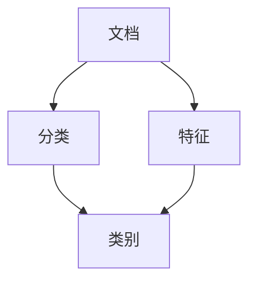
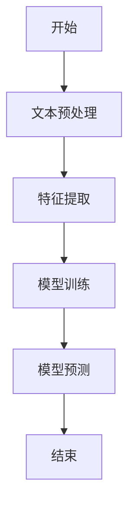
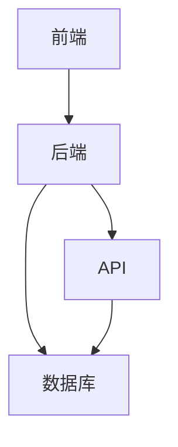

                 


# 构建基于NLP的金融文档自动分类系统

## 关键词
自然语言处理, 文本分类, 金融文档, 机器学习, 金融分类模型

## 摘要
本文详细探讨了基于自然语言处理（NLP）的金融文档自动分类系统的构建过程。从问题背景到解决方案，从核心概念到算法原理，从系统设计到项目实战，全面解析了如何利用NLP技术实现金融文档的高效分类。文章通过详细的技术分析和实际案例，展示了如何利用TF-IDF、支持向量机（SVM）等技术构建高效的分类模型，并通过系统架构设计确保模型的高效运行和扩展性。

---

## 第1章: 问题背景与描述

### 1.1 问题背景
在金融领域，文档分类是一个重要的任务。金融文档包括财务报告、市场分析、新闻文章等，这些文档通常具有高度的专业性和复杂性。传统的分类方法依赖于人工阅读和分类，效率低且容易出错。随着自然语言处理（NLP）技术的快速发展，利用NLP技术实现金融文档的自动分类成为可能。

### 1.2 问题描述
金融文档分类的核心问题在于如何从大量的非结构化文本中提取有用的信息，并将其自动分类到预定义的类别中。这些类别可能包括行业分类、财务状况、市场情绪等。文档分类的挑战在于文本数据的多样性和复杂性，以及如何准确提取文本特征并选择合适的分类算法。

### 1.3 问题解决
NLP技术可以通过以下方式解决金融文档分类问题：
1. **文本预处理**：去除停用词、分词、去除标点符号等。
2. **特征提取**：使用TF-IDF、词袋模型或词嵌入（如Word2Vec）提取文本特征。
3. **分类算法**：选择合适的分类算法（如朴素贝叶斯、支持向量机、随机森林等）进行训练和分类。

---

## 第2章: 核心概念与联系

### 2.1 NLP与金融分类的结合
NLP技术在金融分类中的应用主要体现在以下几个方面：
1. **文本表示**：通过NLP技术将文本转化为数值表示，以便计算机处理。
2. **特征提取**：提取文本中的关键词、句法结构等特征，用于分类。
3. **情感分析**：分析文本中的情感倾向，用于市场情绪分析。

### 2.2 核心概念属性特征对比
以下表格对比了不同的文本表示方法及其优缺点：

| 方法       | 优点                           | 缺点                           |
|------------|--------------------------------|--------------------------------|
| TF-IDF     | 计算简单，适合文本分类         | 无法捕捉语义信息               |
| 词袋模型    | 保留词序信息                   | 高维 sparse                   |
| Word2Vec    | 低维 dense，捕捉语义信息       | 训练需要大量数据               |

### 2.3 ER实体关系图架构
以下是一个简单的ER实体关系图：



---

## 第3章: 算法原理与实现

### 3.1 算法原理
文本分类的基本流程包括：
1. 文本预处理：去除停用词、分词等。
2. 特征提取：使用TF-IDF提取关键词。
3. 模型训练：使用支持向量机（SVM）进行分类。

### 3.2 算法实现
以下是一个基于TF-IDF和SVM的分类实现示例：

```python
from sklearn.feature_extraction.text import TfidfVectorizer
from sklearn.svm import SVC

# 文本预处理
texts = ["This is a sample text.", "Another sample text."]

# 特征提取
vectorizer = TfidfVectorizer()
X = vectorizer.fit_transform(texts)

# 模型训练
model = SVC()
model.fit(X, [0, 1])

# 预测
print(model.predict(vectorizer.transform(["New text."])))
```

### 3.3 算法流程图
以下是一个算法流程图：



---

## 第4章: 系统分析与架构设计

### 4.1 系统功能设计
系统功能包括：
1. 文本预处理模块
2. 特征提取模块
3. 分类模型训练模块
4. 分类结果展示模块

### 4.2 系统架构设计
以下是一个系统架构图：



---

## 第5章: 项目实战

### 5.1 环境安装
使用Anaconda安装环境，并安装以下库：
```bash
pip install numpy scikit-learn
```

### 5.2 核心代码实现
以下是一个完整的分类代码示例：

```python
from sklearn.feature_extraction.text import TfidfVectorizer
from sklearn.svm import SVC
from sklearn.metrics import accuracy_score

# 文本数据
texts = ["This is a positive text.", "This is a negative text."]
labels = [1, 0]

# 特征提取
vectorizer = TfidfVectorizer()
X = vectorizer.fit_transform(texts)

# 模型训练
model = SVC()
model.fit(X, labels)

# 测试
test_texts = ["This is a positive text."]
test_X = vectorizer.transform(test_texts)
print("预测结果：", model.predict(test_X))
print("准确率：", accuracy_score([1], model.predict(test_X)))
```

### 5.3 案例分析
以财务报告为例，分析如何提取关键词并分类。

---

## 第6章: 最佳实践

### 6.1 小结
本文详细介绍了基于NLP的金融文档分类系统的构建过程，从理论到实践，全面解析了NLP技术在金融领域的应用。

### 6.2 注意事项
1. 数据预处理是关键，需要去除噪声。
2. 特征提取方法的选择影响分类性能。
3. 模型调优可以提高分类准确率。

### 6.3 拓展阅读
推荐阅读《自然语言处理实战：构建智能客服系统》和《机器学习实战》。

---

## 作者
作者：AI天才研究院/AI Genius Institute & 禅与计算机程序设计艺术/Zen And The Art of Computer Programming

