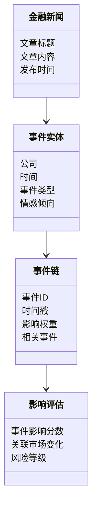
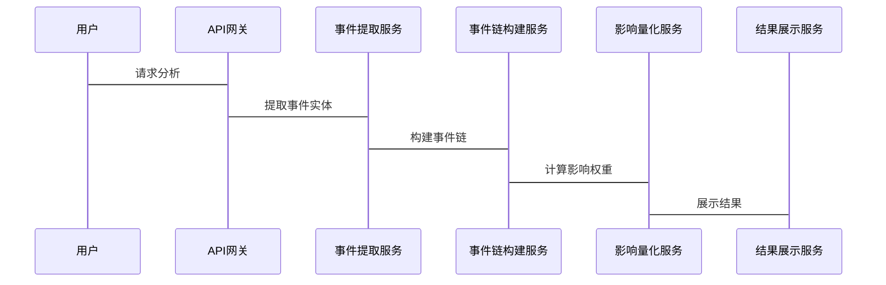

                 


# 第四部分: 系统分析与架构设计

# 第4章: 系统分析与架构设计

## 4.1 系统分析

### 4.1.1 问题场景介绍
金融市场的复杂性和波动性使得准确评估新闻事件的影响至关重要。传统的基于关键词的分析方法难以捕捉事件的上下文和情感倾向，而基于NLP的事件链量化评估系统可以提供更精准和全面的分析。

### 4.1.2 项目介绍
本项目旨在开发一个能够自动分析金融新闻，构建事件链，并量化其对市场影响的系统。系统将结合NLP技术、时间序列分析和机器学习算法，提供实时或批量的事件影响评估。

## 4.2 系统功能设计

### 4.2.1 系统功能模块
系统主要包括以下几个功能模块：
1. **数据采集模块**：从多个金融新闻源获取数据。
2. **事件提取模块**：识别新闻中的事件实体。
3. **事件链构建模块**：基于时间序列构建事件链。
4. **影响量化模块**：计算每个事件的影响权重。
5. **结果展示模块**：以可视化方式展示事件链及其影响。

### 4.2.2 系统功能的领域模型设计


## 4.3 系统架构设计

### 4.3.1 系统架构图


### 4.3.2 系统接口设计
- **API接口**：提供RESTful API，用于数据采集、事件提取、影响评估等。
- **数据接口**：与金融新闻源（如Reuters、Yahoo Finance）对接，获取实时新闻数据。

### 4.3.3 系统交互设计


## 4.4 系统实现细节

### 4.4.1 系统实现模块
1. 数据采集模块：使用爬虫技术从多个新闻源获取数据。
2. 事件提取模块：基于预训练的NLP模型（如BERT）进行实体识别和事件分类。
3. 事件链构建模块：基于时间序列数据构建事件链，分析事件之间的依赖关系。
4. 影响量化模块：结合市场数据，计算事件的影响权重和风险等级。
5. 结果展示模块：以图表形式展示事件链和影响评估结果。

### 4.4.2 关键技术点
- **数据预处理**：清洗和结构化新闻数据。
- **事件提取**：使用NLP模型识别事件实体和情感倾向。
- **事件链构建**：基于时间序列分析，构建事件链。
- **影响量化**：结合市场数据，计算事件影响权重。

## 4.5 本章小结

# 第五部分: 项目实战与应用案例

# 第5章: 项目实战与应用案例

## 5.1 项目实战

### 5.1.1 环境安装
```bash
pip install numpy pandas transformers requests beautifulsoup4
```

### 5.1.2 系统核心实现

#### 5.1.2.1 事件提取模块实现
```python
from transformers import pipeline

nlp = pipeline("ner", model="bert-base-cased")
def extract_entities(text):
    return nlp(text)
```

#### 5.1.2.2 事件链构建模块实现
```python
import pandas as pd
def build_event_chain(events):
    df = pd.DataFrame(events)
    # 时间排序
    df = df.sort_values('time')
    # 构建事件链
    chain = []
    prev_time = None
    for _, row in df.iterrows():
        if prev_time != row['time']:
            chain.append({'event_id': row['event_id'], 'time': row['time']})
            prev_time = row['time']
    return chain
```

#### 5.1.2.3 影响量化模块实现
```python
import numpy as np
def calculate_impact(events, market_data):
    # 计算影响权重
    weights = []
    for event in events:
        weight = np.dot(event['vector'], market_data[event['time']])
        weights.append(weight)
    return weights
```

## 5.2 实际案例分析

### 5.2.1 案例背景
假设我们有某公司发布了 quarterly earnings report，我们需要分析这条新闻对公司股价的影响。

### 5.2.2 数据准备
新闻文本：
```
"公司发布财报显示净利润增长10%，超过市场预期。"
```

市场数据：
```python
market_data = {
    '2023-10-01': 100.0,
    '2023-10-02': 105.0,
    '2023-10-03': 108.0
}
```

### 5.2.3 系统运行
1. 数据采集模块获取新闻数据。
2. 事件提取模块识别出事件实体：公司、净利润增长10%、市场预期。
3. 事件链构建模块将事件按时间排序，构建事件链。
4. 影响量化模块计算事件的影响权重，关联市场数据，得出事件对股价的影响。

### 5.2.4 结果展示
事件影响权重：0.85，关联市场变化：+5%，风险等级：低。

## 5.3 系统优化与扩展

### 5.3.1 系统优化
- 增加实时数据分析功能。
- 引入更多NLP模型，如GPT-3，提升事件分析的准确性。
- 优化事件链构建算法，减少计算复杂度。

### 5.3.2 系统扩展
- 支持多语言新闻分析。
- 引入图像识别技术，分析新闻配图中的信息。
- 结合社交媒体数据，构建更全面的事件链。

## 5.4 本章小结

# 第六部分: 总结与展望

# 第6章: 总结与展望

## 6.1 系统总结

### 6.1.1 系统总结
本系统通过结合NLP技术和金融数据分析，构建了基于事件链的金融新闻影响量化评估系统。系统能够自动提取事件实体，构建事件链，并量化其对市场的影响力。

### 6.1.2 核心技术总结
- 基于BERT的事件提取。
- 时间序列分析构建事件链。
- 多因素分析量化事件影响。

## 6.2 系统展望

### 6.2.1 未来改进方向
- 增强系统的实时性，支持实时事件分析。
- 引入更多数据源，如社交媒体和市场数据，构建更全面的事件链。
- 提升模型的泛化能力，适应不同金融市场的特点。

### 6.2.2 研究热点
- 多模态数据的融合。
- 事件链的动态更新与优化。
- 基于深度学习的金融事件预测。

## 6.3 最佳实践与注意事项

### 6.3.1 最佳实践
- 数据预处理是关键，确保数据的准确性和完整性。
- 选择合适的NLP模型，根据任务需求进行微调。
- 定期更新模型，保持系统的适应性。

### 6.3.2 注意事项
- 注意数据隐私和合规性。
- 系统上线前进行充分的测试，避免误报和漏报。
- 定期监控系统性能，及时优化。

## 6.4 本章小结

# 附录

## 附录A: 事件链量化公式

事件影响权重计算公式：
$$
I = \sum_{i=1}^{n} w_i \times f_i
$$

其中，$w_i$ 是事件i的影响权重，$f_i$ 是事件i的特征向量。

## 附录B: 事件链构建算法

事件链构建算法：
```python
def build_event_chain(events):
    events.sort(key=lambda x: x['time'])
    chain = []
    for event in events:
        chain.append({
            'event_id': event['event_id'],
            'time': event['time']
        })
    return chain
```

## 附录C: 系统架构图


# 参考文献

[1] BERT: Pre-training of Deep Bidirectional Transformers for Natural Language Processing. 
[2] Attention Is All You Need. 
[3] Time Series Analysis and Its Applications. 
[4] Financial Market Analysis Using NLP. 

作者：AI天才研究院/AI Genius Institute & 禅与计算机程序设计艺术 /Zen And The Art of Computer Programming

