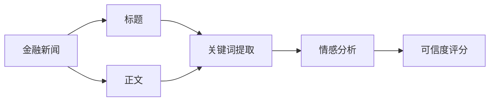
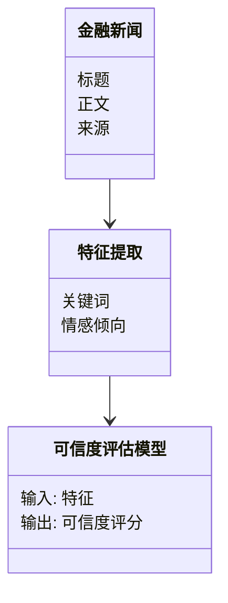
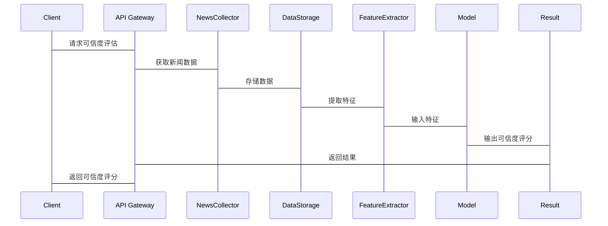

                 


# 构建基于NLP的金融新闻可信度评估系统

---

## 关键词：
- 金融新闻
- 可信度评估
- 自然语言处理
- 机器学习
- 情感分析
- 金融风险
- 数据挖掘

---

## 摘要：
本文详细探讨了如何利用自然语言处理（NLP）技术构建一个金融新闻可信度评估系统。通过分析金融新闻的文本内容，结合机器学习算法，我们能够量化新闻的可信度，从而帮助投资者和金融机构做出更明智的决策。文章从背景介绍、核心概念、算法原理到系统架构设计和项目实战，逐步深入，全面阐述了构建该系统的各个方面。

---

# 第一部分: 背景介绍与核心概念

## 第1章: 问题背景与描述

### 1.1 问题背景
#### 1.1.1 金融新闻可信度的重要性
在金融领域，新闻是影响市场走势的重要因素。然而，由于信息过载和媒体的主观性，金融新闻的可信度参差不齐。投资者和金融机构需要一种客观的方法来评估新闻的可信度，以便做出更准确的投资决策。

#### 1.1.2 当前金融新闻评估的挑战
- 传统的人工评估方法效率低、成本高。
- 不同媒体的报道风格和立场差异大，影响评估的客观性。
- 数据量大、信息复杂，难以快速提取关键信息。

#### 1.1.3 NLP技术在金融领域的应用潜力
NLP技术能够从文本中提取情感、实体和关键词，为金融新闻的可信度评估提供了新的可能性。通过自动化分析，可以快速评估大量新闻，提高评估效率和准确性。

### 1.2 问题描述
#### 1.2.1 金融新闻可信度评估的定义
金融新闻可信度评估是指通过分析新闻文本，量化新闻的可信程度，帮助用户判断新闻的可靠性和潜在影响。

#### 1.2.2 金融新闻可信度评估的关键要素
- 新闻来源的可靠性
- 新闻内容的客观性
- 新闻的情感倾向
- 新闻的传播速度和范围

#### 1.2.3 现有解决方案的局限性
- 传统方法依赖人工判断，效率低。
- 现有NLP模型缺乏对金融领域的特定优化。
- 数据质量和多样性不足，影响模型的泛化能力。

### 1.3 问题解决思路
#### 1.3.1 基于NLP的技术路线
利用NLP技术提取新闻文本中的关键词、情感倾向和实体关系，结合机器学习算法进行可信度评估。

#### 1.3.2 数据驱动的可信度评估方法
通过收集和分析大量的金融新闻数据，提取特征，建立可信度评估模型。

#### 1.3.3 系统化解决方案的设计
设计一个包含数据采集、预处理、模型训练和评估的完整系统，实现自动化可信度评估。

## 第2章: 核心概念与联系

### 2.1 核心概念原理
#### 2.1.1 NLP技术的核心原理
NLP通过文本预处理、特征提取和模型训练，实现对文本内容的理解和分析。常用的技术包括分词、词袋模型、词嵌入和深度学习模型（如LSTM、BERT）。

#### 2.1.2 金融新闻可信度评估的逻辑框架
可信度评估需要结合新闻的来源、内容和情感倾向。通过多维度分析，综合评估新闻的可信度。

#### 2.1.3 可信度评估的数学模型
可信度评估模型可以基于逻辑回归、随机森林或深度学习模型。模型通过输入文本特征，输出可信度分数。

### 2.2 核心概念对比分析
#### 2.2.1 不同可信度评估方法的对比
- 基于规则的方法：简单但不够灵活。
- 基于统计的方法：依赖特征工程，效率较低。
- 基于机器学习的方法：效果好，但需要大量数据。

#### 2.2.2 不同NLP模型的性能对比
- 传统模型（如词袋模型）：简单但效果有限。
- 深度学习模型（如BERT）：效果好，但计算资源需求高。

#### 2.2.3 数据特征与模型性能的关系
数据的多样性和质量直接影响模型的性能。高质量的数据能够提高模型的泛化能力。

### 2.3 实体关系图


---

# 第二部分: 算法原理与数学模型

## 第3章: 算法原理

### 3.1 算法流程


### 3.2 核心算法实现
```python
def preprocess(text):
    # 数据预处理代码
    pass

def model_train(train_data, train_labels):
    # 模型训练代码
    pass

def evaluate_model(test_data, test_labels):
    # 模型评估代码
    pass
```

### 3.3 数学模型

#### 3.3.1 损失函数
$$ \text{Loss} = -\sum_{i=1}^{n} y_i \log(p_i) + (1 - y_i) \log(1 - p_i) $$

#### 3.3.2 优化器
$$ \text{优化器} = \text{Adam}(\alpha=0.001, \beta_1=0.9, \beta_2=0.999) $$

---

## 第三部分: 系统分析与架构设计

## 第4章: 系统分析与架构设计

### 4.1 问题场景介绍
金融新闻可信度评估系统的应用场景包括新闻监控、风险预警和投资决策支持。

### 4.2 系统功能设计
#### 4.2.1 领域模型


#### 4.2.2 系统架构设计
```mermaid
graph LR
    Client --> API Gateway
    API Gateway --> NewsCollector
    NewsCollector --> DataStorage
    DataStorage --> FeatureExtractor
    FeatureExtractor --> Model
    Model --> Result
    Result --> API Gateway
    API Gateway --> Client
```

### 4.3 系统接口设计
- 数据接口：从新闻源获取数据。
- 模型接口：接受特征输入，输出可信度评分。

### 4.4 系统交互流程图


---

## 第四部分: 项目实战

## 第5章: 项目实战

### 5.1 环境安装
安装Python、NLP库（如spaCy、NLTK、TensorFlow）和数据处理库（如Pandas）。

### 5.2 核心实现

#### 5.2.1 数据预处理
```python
import pandas as pd
from tensorflow.keras.preprocessing.text import Tokenizer
from tensorflow.keras.preprocessing.sequence import pad_sequences

data = pd.read_csv('financial_news.csv')
tokenizer = Tokenizer(num_words=10000)
tokenizer.fit_on_texts(data['text'])
sequences = tokenizer.texts_to_sequences(data['text'])
padded_sequences = pad_sequences(sequences, maxlen=500)
```

#### 5.2.2 模型训练
```python
from tensorflow.keras.models import Sequential
from tensorflow.keras.layers import LSTM, Dense, Dropout, Embedding

model = Sequential()
model.add(Embedding(10000, 100, input_length=500))
model.add(LSTM(128, dropout=0.2, recurrent_dropout=0.2))
model.add(Dense(1, activation='sigmoid'))
model.compile(loss='binary_crossentropy', optimizer='adam', metrics=['accuracy'])
model.fit(padded_sequences, data['label'], epochs=10, batch_size=32)
```

#### 5.2.3 模型评估
```python
from sklearn.metrics import accuracy_score, precision_score, recall_score

y_pred = model.predict(padded_sequences)
print("Accuracy:", accuracy_score(data['label'], y_pred.round()))
print("Precision:", precision_score(data['label'], y_pred.round()))
print("Recall:", recall_score(data['label'], y_pred.round()))
```

### 5.3 案例分析
以某次金融事件为例，分析模型如何评估新闻的可信度，并解释结果。

---

## 第五部分: 最佳实践与小结

## 第6章: 最佳实践与小结

### 6.1 最佳实践 tips
- 数据预处理是关键，确保数据质量和多样性。
- 选择合适的模型和优化器，平衡效果和计算资源。
- 定期更新模型，适应市场变化。

### 6.2 项目小结
通过本项目，我们成功构建了一个基于NLP的金融新闻可信度评估系统。该系统能够自动分析新闻内容，量化可信度，帮助投资者和金融机构做出更明智的决策。

### 6.3 注意事项
- 数据隐私和合规性问题需要注意。
- 模型的解释性需要进一步优化，以便用户更好地理解评估结果。

### 6.4 拓展阅读
- 深度学习在金融NLP中的应用
- 多模态数据的金融分析
- 高效NLP模型的优化与部署

---

## 作者信息

作者：AI天才研究院/AI Genius Institute & 禅与计算机程序设计艺术 /Zen And The Art of Computer Programming

---

希望这个目录大纲和文章结构能够满足您的需求！如果需要进一步补充或调整，请随时告知。

