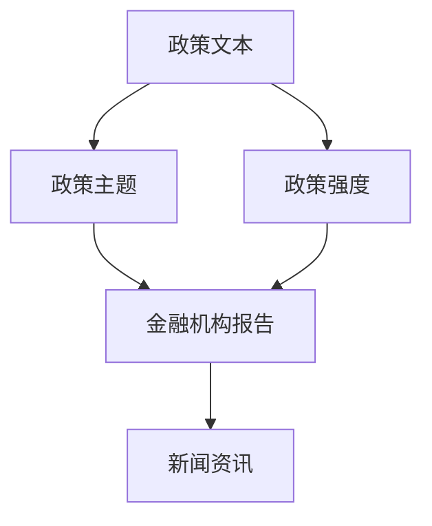
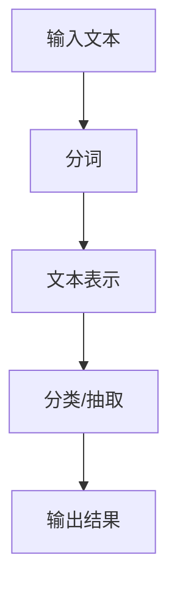
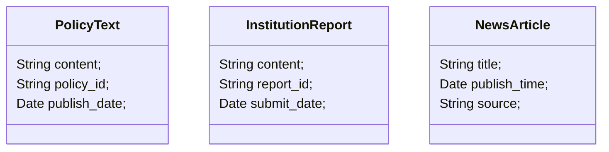
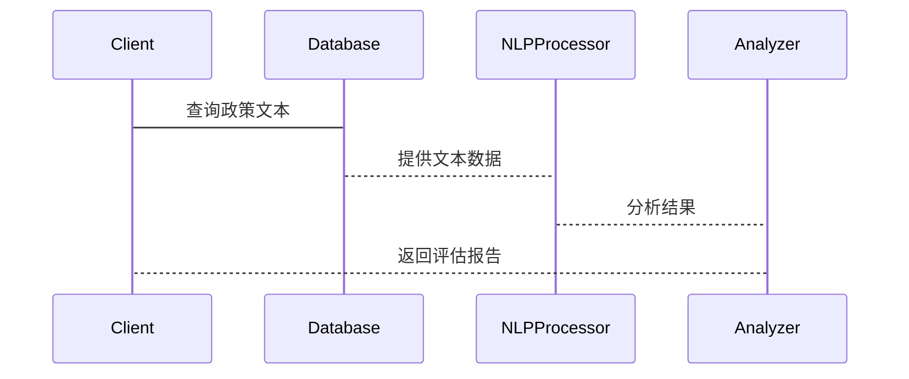

                 


# 《构建基于NLP的金融监管政策执行效果动态评估系统》

---

## 关键词：NLP、金融监管、政策执行、动态评估、文本挖掘、自然语言处理、金融系统

---

## 摘要：  
本文旨在探讨如何利用自然语言处理（NLP）技术构建一个动态评估金融监管政策执行效果的系统。通过分析政策文本、金融机构报告及相关新闻资讯，结合先进的NLP算法和深度学习模型，实现对政策执行效果的自动化评估。文章从问题背景、核心概念、算法原理、系统架构到项目实现，全面展开讨论，旨在为金融监管领域提供一种高效、智能的解决方案。

---

## 正文

---

### 第一部分：背景介绍

#### 第1章：问题背景与描述

##### 1.1 问题背景
随着金融市场的快速发展，监管政策的制定和执行变得越来越复杂。金融机构的多样性和金融产品的创新性使得监管机构难以实时跟踪和评估政策的执行效果。传统的监管评估方法依赖人工分析，效率低下且容易出错。

##### 1.2 问题描述
- **政策执行效果评估的挑战**：现有方法依赖大量人工阅读和分析，耗时且成本高昂。
- **政策文本的复杂性**：政策文本涉及多个领域，内容复杂，难以快速解析。
- **监管信息的分散性**：政策执行相关的数据分散在不同来源，整合困难。

##### 1.3 问题解决与目标
构建一个基于NLP的金融监管政策执行效果动态评估系统，利用文本挖掘和深度学习技术，自动化分析政策文本及相关信息，实时评估政策执行效果。

##### 1.4 边界与外延
- **系统边界**：仅关注政策执行效果的评估，不涉及政策制定过程。
- **系统外延**：可扩展至其他领域的政策评估，如环保政策、教育政策等。
- **区别与联系**：与传统评估方法相比，本系统更具自动化和高效性。

##### 1.5 核心要素与概念结构
- **核心要素**：政策文本、金融机构报告、新闻资讯、NLP算法、评估指标。
- **概念结构**：通过概念图展示各要素之间的关系。

---

### 第二部分：核心概念与联系

#### 第2章：基于NLP的金融监管政策分析

##### 2.1 NLP技术的核心原理
- **文本表示**：使用词袋模型、词嵌入（如Word2Vec）等方法将文本转换为向量表示。
- **文本分类**：基于预训练模型（如BERT）对政策文本进行分类，提取关键信息。
- **信息抽取**：利用NER（命名实体识别）抽取政策中的实体信息。

##### 2.2 金融监管政策的文本特征
- **政策类型**：如货币政策、监管规则等。
- **政策主题**：如风险管理、合规要求等。
- **政策强度**：如政策的严格程度。

##### 2.3 概念属性对比表
| 概念 | 属性 |
|------|------|
| 政策文本 | 文本内容、政策编号、发布日期 |
| 金融机构报告 | 报告内容、报告编号、提交日期 |
| 新闻资讯 | 新闻标题、发布时间、来源 |

##### 2.4 实体关系图


---

### 第三部分：算法原理讲解

#### 第3章：基于深度学习的NLP算法

##### 3.1 预训练语言模型（如BERT）
- **模型结构**：基于Transformer的双向编码器表示（BERT）。
- **训练目标**：通过 masked language modeling 和 next sentence prediction 任务预训练。
- **应用**：用于文本分类、信息抽取等任务。

##### 3.2 算法流程


##### 3.3 Python代码示例
```python
import tensorflow as tf
from transformers import BertTokenizer, BertModel

tokenizer = BertTokenizer.from_pretrained('bert-base-uncased')
model = BertModel.from_pretrained('bert-base-uncased')

def process_text(text):
    inputs = tokenizer(text, return_tensors='np')
    outputs = model(**inputs)
    return outputs.last_hidden_state
```

##### 3.4 数学模型
- **词嵌入**：$v_i = \text{lookup}(W[i])$，其中$W$是词表。
- **注意力机制**：$\alpha_{ij} = \frac{\exp(e_i^j)}{\sum_{k} \exp(e_i^k)}}$，其中$e_i^j$是查询与键的匹配度。

---

### 第四部分：系统分析与架构设计

#### 第4章：系统架构设计

##### 4.1 领域模型


##### 4.2 系统架构
```mermaid
rectangle Database {
    PolicyTexts
    InstitutionReports
    NewsArticles
}
rectangle NLPProcessor {
    Tokenizer
    Model
}
rectangle Analyzer {
    Classifier
    Extractor
}
Database --> NLPProcessor
NLPProcessor --> Analyzer
```

##### 4.3 接口设计
- **输入接口**：接收政策文本、机构报告和新闻资讯。
- **输出接口**：提供政策执行效果评估报告。

##### 4.4 交互流程


---

### 第五部分：项目实战

#### 第5章：系统实现

##### 5.1 环境安装
```bash
pip install tensorflow transformers numpy pandas
```

##### 5.2 核心代码实现
```python
import pandas as pd
from transformers import pipeline

# 初始化NLP pipeline
classifier = pipeline("text-classification", model="bert-base-uncased")

def evaluate_policy(text):
    result = classifier(text)
    return result['label']
```

##### 5.3 案例分析
- **输入文本**：政策文本片段。
- **处理步骤**：分词、表示、分类。
- **输出结果**：政策执行效果的分类标签。

##### 5.4 总结
通过实际案例分析，验证系统的有效性和准确性，展示NLP技术在金融监管中的实际应用。

---

### 第六部分：总结与展望

#### 第6章：总结与展望

##### 6.1 最佳实践
- **数据质量**：确保输入数据的准确性和完整性。
- **模型优化**：定期更新模型，提升分类精度。

##### 6.2 小结
本文构建了一个基于NLP的金融监管政策执行效果动态评估系统，展示了如何利用先进技术解决实际问题。

##### 6.3 注意事项
- 数据隐私保护。
- 系统的可扩展性。

##### 6.4 拓展阅读
推荐相关领域的书籍和论文，供读者深入研究。

---

## 作者：AI天才研究院 & 禅与计算机程序设计艺术

