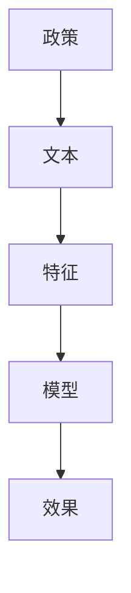
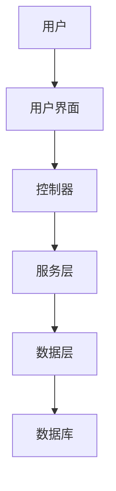
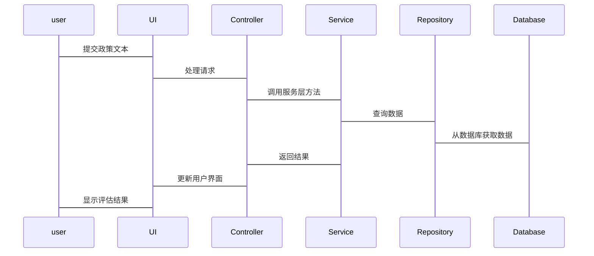

                 


# 《构建基于NLP的金融监管政策执行效果评估系统》

> 关键词：NLP，金融监管，政策执行效果，自然语言处理，金融数据分析

> 摘要：本文详细介绍了如何利用自然语言处理（NLP）技术构建一个金融监管政策执行效果评估系统。通过分析金融政策文本，结合NLP算法，系统能够自动提取关键信息，评估政策执行效果，并为监管机构提供数据支持。文章从背景介绍、核心概念、算法原理、系统架构到项目实战，全面阐述了系统的设计与实现过程。

---

## 第一部分：背景介绍

### 第1章：背景介绍

#### 1.1 问题背景

随着金融市场的快速发展，监管政策的制定和执行变得日益复杂。金融监管机构需要及时评估政策执行效果，以确保市场稳定和合规性。然而，传统的政策执行效果评估方法通常依赖人工分析，效率低下且容易出错。如何利用技术手段提高评估效率和准确性，成为监管机构面临的重要挑战。

#### 1.2 问题描述

金融监管政策的执行效果评估涉及多个环节，包括政策文本分析、数据采集、特征提取和效果评估。传统的评估方法依赖人工阅读大量政策文件和市场报告，耗时且容易遗漏关键信息。此外，不同政策的执行效果难以量化比较，监管机构难以及时调整策略。

#### 1.3 问题解决

自然语言处理（NLP）技术在文本分析领域的应用为解决上述问题提供了新的思路。通过NLP技术，可以自动化地从政策文本中提取关键信息，分析市场反馈，评估政策效果，并生成评估报告。这种方法不仅提高了评估效率，还能够处理海量数据，发现潜在规律。

#### 1.4 核心概念与组成

- **政策文本分析**：通过NLP技术对政策文本进行分词、实体识别和情感分析，提取关键信息。
- **数据采集与预处理**：收集政策执行相关的市场数据，进行清洗和标注，为模型提供输入。
- **特征提取与建模**：利用NLP算法提取文本特征，构建评估模型，预测政策执行效果。
- **效果评估与反馈**：通过模型输出评估结果，分析政策效果，为监管机构提供决策支持。

---

## 第二部分：核心概念与联系

### 第2章：核心概念与联系

#### 2.1 NLP技术的核心原理

自然语言处理（NLP）是计算机科学与语言学的交叉领域，旨在让计算机能够理解和处理人类语言。NLP的核心任务包括文本分词、词性标注、命名实体识别、句法分析、语义理解等。这些技术可以帮助系统从文本中提取有用的信息。

#### 2.2 金融监管政策执行效果评估的流程

1. **数据采集**：收集相关政策文件、市场报告、新闻资讯等数据。
2. **文本预处理**：对文本进行分词、去停用词、词干提取等处理。
3. **特征提取**：利用TF-IDF、Word2Vec等方法提取文本特征。
4. **模型训练**：构建机器学习模型，训练政策执行效果评估模型。
5. **效果评估**：输入新的政策文本，模型预测执行效果，并生成评估报告。

#### 2.3 NLP与金融监管的结合

- **政策文本分析**：通过NLP技术对政策文本进行语义分析，识别关键条款和潜在风险。
- **监管数据处理**：利用NLP对市场数据进行情感分析，评估政策执行后的市场反应。
- **政策效果评估**：结合文本特征和市场数据，量化评估政策执行效果。

#### 2.4 核心概念对比表

| 比较维度       | 基于规则的方法             | 基于统计的方法             | 基于深度学习的方法         |
|----------------|--------------------------|--------------------------|--------------------------|
| 精度           | 低                       | 中等                      | 高                       |
| 计算复杂度     | 低                       | 中等                      | 高                       |
| 适应性         | 差                       | 好                       | 优秀                     |

#### 2.5 ER实体关系图



---

## 第三部分：算法原理与数学模型

### 第3章：算法原理与数学模型

#### 3.1 基于NLP的文本处理算法

- **分词算法**：使用jieba等工具对中文文本进行分词。
- **词向量表示**：利用Word2Vec生成词向量，表示词语的语义信息。
- **文本相似度计算**：通过余弦相似度或BM25算法计算文本之间的相似性。

#### 3.2 常见的NLP模型

- **TF-IDF模型**：通过统计词频和逆文档频率，提取文本中的关键词。
- **Word2Vec模型**：通过词嵌入技术，生成词向量表示。
- **BERT模型**：基于Transformer的预训练模型，用于文本理解和生成。

#### 3.3 数学模型与公式

1. **TF-IDF计算公式**
   - TF（Term Frequency）：词语在文本中的出现频率。
   - IDF（Inverse Document Frequency）：词语在文档集中的逆频率，用于衡量词语的重要性。
   - $$TF-IDF = TF \times IDF$$

2. **Word2Vec模型**：通过skip-gram或CBOW结构，训练词向量。
   - 输入：词语序列。
   - 输出：词语的向量表示。

3. **余弦相似度**
   - 用于计算两个文本的相似性。
   - $$\cos\theta = \frac{\vec{A} \cdot \vec{B}}{|\vec{A}| \times |\vec{B}|}$$

---

## 第四部分：系统分析与架构设计

### 第4章：系统分析与架构设计

#### 4.1 问题场景介绍

金融监管政策执行效果评估系统需要处理大量政策文本和市场数据，要求系统具备高效的文本处理能力和准确的评估能力。

#### 4.2 系统功能设计

- **文本分析模块**：负责政策文本的分词、实体识别和语义分析。
- **数据处理模块**：对市场数据进行清洗、转换和标注。
- **模型训练模块**：构建和训练NLP模型，评估政策执行效果。
- **结果展示模块**：生成评估报告，提供可视化展示。

#### 4.3 系统架构设计



#### 4.4 系统接口设计

- **输入接口**：接收政策文本和市场数据。
- **输出接口**：返回政策执行效果评估结果和报告。

#### 4.5 系统交互序列图



---

## 第五部分：项目实战

### 第5章：项目实战

#### 5.1 环境安装

- 安装Python和必要的库（如jieba、spaCy、sklearn等）。
- 安装深度学习框架（如TensorFlow、PyTorch）。

#### 5.2 核心实现代码

```python
from sklearn.feature_extraction.text import TfidfVectorizer
from sklearn.model_selection import train_test_split
from sklearn.linear_model import LogisticRegression
from sklearn.metrics import accuracy_score

# 数据预处理
def preprocess(text):
    # 分词
    words = jieba.lcut(text)
    # 去停用词
    filtered_words = [word for word in words if word not in stop_words]
    return ' '.join(filtered_words)

# 特征提取
vectorizer = TfidfVectorizer(max_features=1000)
X = vectorizer.fit_transform(preprocessed_texts)

# 模型训练
X_train, X_test, y_train, y_test = train_test_split(X, labels, test_size=0.2)
model = LogisticRegression()
model.fit(X_train, y_train)

# 模型评估
y_pred = model.predict(X_test)
print(accuracy_score(y_test, y_pred))
```

#### 5.3 代码解读

- **preprocess函数**：对文本进行分词和去停用词处理。
- **TfidfVectorizer**：提取文本的TF-IDF特征。
- **LogisticRegression**：训练逻辑回归模型，用于分类。
- **accuracy_score**：评估模型的准确率。

#### 5.4 案例分析

通过实际案例分析，验证系统的评估效果。例如，分析某项货币政策对市场的影响，系统能够自动提取政策文本的关键点，评估执行效果，并生成报告。

---

## 第六部分：总结与展望

### 第6章：总结与展望

#### 6.1 最佳实践

- **数据质量**：确保数据的完整性和准确性。
- **模型选择**：根据具体需求选择合适的NLP模型。
- **系统优化**：通过优化算法和架构提升系统性能。

#### 6.2 小结

本文详细介绍了如何利用NLP技术构建金融监管政策执行效果评估系统。通过背景介绍、核心概念、算法原理、系统架构和项目实战的讲解，展示了系统的实现过程和应用价值。

#### 6.3 注意事项

- 系统的性能依赖于数据质量和模型选择。
- 在实际应用中，需要考虑数据隐私和合规性问题。

#### 6.4 拓展阅读

建议读者进一步学习NLP领域的最新技术，如大语言模型（LLM）在金融监管中的应用，探索更高效的政策评估方法。

---

## 作者：AI天才研究院/AI Genius Institute & 禅与计算机程序设计艺术 /Zen And The Art of Computer Programming

---

以上是《构建基于NLP的金融监管政策执行效果评估系统》的技术博客文章的完整内容。

